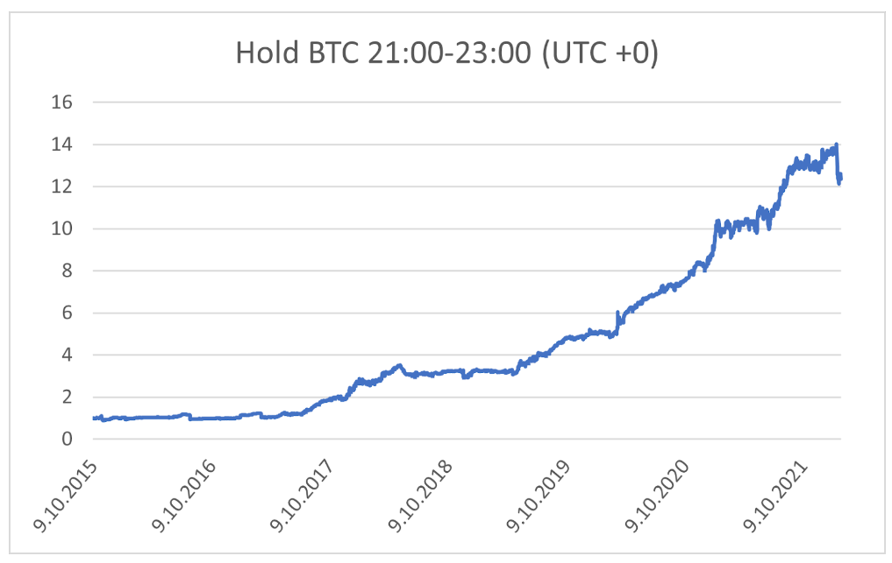

## Table of Contents

## What is Bitcoin and why is it important to understand its seasonality?

Bitcoin is a type of digital money that you can use to buy things online. It's different from regular money because it's not controlled by any government or bank. Instead, it uses something called blockchain technology, which is like a big, secure list of all the transactions that have ever happened with Bitcoin. This makes it very hard for anyone to cheat or steal.

Understanding Bitcoin's seasonality is important because it can help you know when Bitcoin might go up or down in value. Just like how some fruits are cheaper in certain seasons, Bitcoin also has times when it's more popular and its price goes up. If you know about these patterns, you can make better choices about when to buy or sell Bitcoin. This can help you save money or make more money if you're investing in it.

## How does the concept of seasonality apply to Bitcoin?

Seasonality in Bitcoin refers to the idea that there are certain times of the year when Bitcoin's price tends to go up or down more than usual. For example, some people think that Bitcoin often does better in the months of April and November. This might happen because more people are interested in buying Bitcoin during these times, maybe because of holidays or because they have more money to spend.

Knowing about Bitcoin's seasonality can help people make smarter choices about when to buy or sell it. If someone knows that Bitcoin usually goes up in April, they might decide to buy some in March and then sell it in April to make a profit. But it's important to remember that these patterns are not always the same every year, and other things can affect Bitcoin's price too. So, while seasonality can be a helpful guide, it's not a sure thing.

## What are the main factors that influence Bitcoin's seasonal trends?

One big reason for Bitcoin's seasonal trends is how people feel about it. Sometimes, people get really excited about Bitcoin, especially when they hear good news or see its price going up. This often happens around certain times of the year, like when people are getting their holiday bonuses or tax refunds. When more people want to buy Bitcoin, its price can go up. On the other hand, if people start to worry or hear bad news, they might sell their Bitcoin, which can make the price go down.

Another [factor](/wiki/factor-investing) is what's happening in the world. For example, if there's a big event like a new law about cryptocurrencies or a big company starts accepting Bitcoin, it can change how people see Bitcoin and make them want to buy or sell it. Also, the time of year can affect how much money people have to spend on Bitcoin. During holiday seasons, people might have extra money and be more willing to try new things like Bitcoin. All these things together can make Bitcoin's price go up or down at different times of the year.

## Can you explain the typical seasonal patterns observed in Bitcoin's price throughout the year?

Bitcoin's price often follows certain patterns throughout the year. One common pattern is that Bitcoin tends to do well in the spring, especially around April. People think this happens because more people get interested in Bitcoin after the winter, and they might have extra money from tax refunds to spend on it. Another time when Bitcoin often goes up is in the fall, around November. This could be because people are getting ready for the holidays and might have some extra cash from bonuses or just wanting to try new things.

On the other hand, there are times when Bitcoin's price might go down. For example, some people notice that Bitcoin can dip in the summer months, like July and August. This might be because people are on vacation and not paying as much attention to their investments. Also, the end of the year, around December, can be a bit unpredictable. Sometimes Bitcoin goes up because of holiday spending, but other times it might go down if people are worried about the new year and what might happen with their money. These patterns are not the same every year, but they can give a general idea of what might happen with Bitcoin's price.

## How do macroeconomic events affect the seasonality of Bitcoin?

Macroeconomic events can really shake up the usual seasonal patterns of Bitcoin. Things like big changes in the economy, like when interest rates go up or down, or when there's a lot of inflation, can make people feel different about Bitcoin. For example, if the economy is doing badly and people are worried about their money, they might start looking at Bitcoin as a safe place to keep their savings. This could make Bitcoin's price go up, even if it's not the usual time of year for that to happen.

Also, big news about laws or rules for cryptocurrencies can change how people see Bitcoin. If a country says it's going to make new rules about Bitcoin, people might get scared and sell their Bitcoin, making the price go down. Or, if a big company says it's going to start using Bitcoin, that could make more people want to buy it, pushing the price up. These big events can mess with the normal ups and downs of Bitcoin's price throughout the year, making it hard to predict what will happen just based on the season.

## What role do holidays and specific calendar dates play in Bitcoin's price movements?

Holidays and specific calendar dates can really affect Bitcoin's price. For example, around big holidays like Christmas or New Year's, people might have extra money from bonuses or gifts. This can make them more likely to spend on things like Bitcoin, which could push its price up. Also, times like tax season in April can be important because people might get tax refunds and decide to invest some of that money in Bitcoin, making its price go up then too.

But holidays can also make Bitcoin's price go down. During long holiday weekends, like in July or August, people might be on vacation and not paying attention to their investments. This can mean less buying and selling of Bitcoin, which might make its price drop a bit. Also, certain dates like the end of the fiscal year or big financial deadlines can make people more cautious about their money, which could lead them to sell Bitcoin and make its price go down.

## How has Bitcoin's seasonality evolved since its inception?

Since Bitcoin started in 2009, its seasonality has changed a lot. In the early days, Bitcoin didn't have clear seasonal patterns because not many people knew about it. As more people learned about Bitcoin and started using it, certain times of the year began to show patterns. For example, people noticed that Bitcoin often went up in price around April and November. This was because more people were interested in buying Bitcoin during these times, maybe because of holidays or because they had extra money.

Over time, these seasonal patterns became more noticeable, but they also got more complicated. Big events in the world, like changes in the economy or new laws about cryptocurrencies, started to affect Bitcoin's price more than the seasons. For example, if there was a big economic crisis, people might buy more Bitcoin, making its price go up even if it wasn't the usual time for that. So, while the basic seasonal patterns are still there, they are now mixed with other big factors that can change how Bitcoin's price moves throughout the year.

## What are some common strategies traders use to capitalize on Bitcoin's seasonal trends?

Traders often use a strategy called "buy low, sell high" to make money from Bitcoin's seasonal trends. They look at past data to see when Bitcoin usually goes up or down in price. For example, if they see that Bitcoin often goes up in April, they might buy some in March when the price is lower and then sell it in April when the price is higher. This way, they can make a profit from knowing when the price is likely to change.

Another common strategy is called "dollar-cost averaging." This means that instead of buying all their Bitcoin at once, traders spread out their buying over time. They might buy a little bit of Bitcoin every month, no matter what the price is. This can help them avoid buying all their Bitcoin at a high price and missing out on the seasonal ups and downs. By buying regularly, they can take advantage of the times when Bitcoin's price goes up during certain seasons.

Some traders also use "technical analysis" to try to predict Bitcoin's price movements. They look at charts and patterns to see if there are any signs that the price might go up or down soon. For example, if they see a pattern that often happens before Bitcoin's price goes up in November, they might buy some Bitcoin then. This can help them make better decisions about when to buy and sell based on the seasonal trends they see in the data.

## How reliable are seasonal patterns in predicting Bitcoin's future price movements?

Seasonal patterns can give you a general idea of when Bitcoin's price might go up or down, but they are not always reliable for predicting the future. Bitcoin's price can be affected by many things, like big news or changes in the economy, which can mess up the usual seasonal trends. So, while knowing about these patterns can be helpful, it's not a sure way to know exactly what will happen with Bitcoin's price.

It's also important to remember that Bitcoin is still a new thing, and its price can change a lot. What happened in the past might not happen again in the same way. Traders who use seasonal patterns to make decisions should also look at other information and be ready for surprises. Even though seasonal trends can be a useful guide, they should be used carefully and not be the only thing you rely on when trying to predict Bitcoin's future price movements.

## What advanced statistical methods can be used to analyze Bitcoin's seasonality?

To understand Bitcoin's seasonality better, people can use something called time series analysis. This is a way to look at data over time and see if there are patterns. One method in time series analysis is called ARIMA, which stands for AutoRegressive Integrated Moving Average. ARIMA can help find out if Bitcoin's price goes up or down at certain times of the year. Another method is called seasonal decomposition, which breaks down the data into different parts like trends, seasonal patterns, and random changes. This can help see if the ups and downs in Bitcoin's price are because of the season or something else.

Another advanced way to analyze Bitcoin's seasonality is by using [machine learning](/wiki/machine-learning). Machine learning can look at a lot of data and find patterns that might be hard for people to see. For example, a method called recurrent neural networks (RNNs) can be used to predict future prices based on past data. RNNs are good at understanding sequences, so they can learn how Bitcoin's price changes over time. Also, something called Fourier analysis can be used to see if there are any repeating patterns in Bitcoin's price that happen at certain times of the year. These advanced methods can give a deeper understanding of Bitcoin's seasonal trends, but they still need to be used carefully because Bitcoin's price can be affected by many things.

## How do global regulatory changes impact the seasonal behavior of Bitcoin?

Global regulatory changes can really shake up how Bitcoin behaves during different seasons. When a country makes new rules about cryptocurrencies, it can make people feel different about Bitcoin. For example, if a big country says it's going to make it harder to use Bitcoin, people might get scared and sell their Bitcoin. This can make the price go down, even if it's usually a time of year when Bitcoin goes up. On the other hand, if a country makes rules that make it easier to use Bitcoin, people might get excited and buy more, pushing the price up no matter what season it is.

These changes in rules can mess up the usual seasonal patterns of Bitcoin. Normally, people might expect Bitcoin to go up in April or November, but if there's big news about new laws around those times, it can change everything. Traders who watch Bitcoin's seasonal trends need to keep an eye on what's happening with laws around the world. Even though seasonal patterns can be a helpful guide, they can be thrown off by big regulatory changes, making it harder to predict what will happen with Bitcoin's price.

## What are the current research findings on the long-term seasonality of Bitcoin and its implications for investors?

Current research on Bitcoin's long-term seasonality shows that while there are some patterns, they can change a lot over time. Studies have found that Bitcoin often goes up in price around April and November. This might be because people get tax refunds in April or holiday bonuses in November, and they use some of that money to buy Bitcoin. But these patterns are not the same every year. Big events like changes in the economy or new laws about cryptocurrencies can make Bitcoin's price go up or down, no matter what time of year it is. So, while knowing about these seasonal trends can be helpful, they are not a sure way to predict what will happen with Bitcoin's price in the future.

For investors, understanding Bitcoin's long-term seasonality can help them make better choices about when to buy or sell. If they know that Bitcoin often goes up in April, they might decide to buy some in March and sell it in April to make a profit. But investors need to be careful because other things can affect Bitcoin's price too. They should not just rely on seasonal patterns but also look at what's happening in the world and with the economy. By using seasonal trends as one part of their plan, investors can try to make smarter decisions and maybe make more money, but they should always be ready for surprises.

## How can one implement a Seasonal Algorithmic Strategy?

A fundamental approach to exploiting Bitcoin's seasonal patterns involves developing an [algorithmic trading](/wiki/algorithmic-trading) strategy. A straightforward yet effective method is to buy Bitcoin at 21:00 UTC and sell it at 23:00 UTC. This strategy leverages the observable pattern in Bitcoin's price behavior during these evening hours. An essential component of this strategy is [backtesting](/wiki/backtesting), which involves evaluating the algorithm's performance across historical data to assess its viability and potential profitability.

Backtesting during high [volatility](/wiki/volatility-trading-strategies) periods offers insights into the risk-adjusted returns that this strategy can achieve. The Sharpe Ratio, a common metric for assessing risk-adjusted returns, can be used to evaluate the strategy's performance. The formula for the Sharpe Ratio is:

$$
\text{Sharpe Ratio} = \frac{\bar{R} - R_f}{\sigma_R}
$$

where $\bar{R}$ is the expected portfolio return, $R_f$ is the risk-free rate, and $\sigma_R$ is the standard deviation of the portfolio's excess return. A higher Sharpe Ratio indicates better risk-adjusted returns, affirming the strategy's effectiveness when Bitcoin exhibits increased volatility.

Integrating trend analysis and volatility metrics enhances the robustness of this seasonality strategy. Trend analysis involves identifying the general direction of Bitcoin’s price movement over a specific period, which can be achieved through technical indicators such as moving averages. For instance, a moving average crossover strategy can help identify potential buy or sell signals. In Python, a simple implementation might look like:

```python
def moving_average(prices, window):
    return prices.rolling(window=window).mean()

def crossover_strategy(data):
    data['Short_MA'] = moving_average(data['Close'], 20)
    data['Long_MA'] = moving_average(data['Close'], 50)

    data['Signal'] = 0
    data['Signal'][20:] = np.where(data['Short_MA'][20:] > data['Long_MA'][20:], 1, 0)
    data['Position'] = data['Signal'].diff()

    return data
```

Volatility metrics such as the Average True Range (ATR) can help assess the potential price movement magnitude, aiding in position sizing and risk management. By combining these analytical tools with seasonal patterns, traders refine their strategies to capture potentially profitable opportunities from Bitcoin's cyclic behavior while managing exposure to risk.

The adaptability of this strategy to continuously changing market conditions underscores its practicality. However, traders must remain vigilant, always seeking to optimize and adjust their methods according to real-time market data and emerging trends in the [cryptocurrency](/wiki/cryptocurrency) landscape.

## References & Further Reading

[1]: Baur, D. G., Dimpfl, T., & Kuck, K. (2018). ["Bitcoin, gold and the US dollar – A replication and extension"](https://papers.ssrn.com/sol3/papers.cfm?abstract_id=3024377). Finance Research Letters, 25, 103-110.

[2]: Moosa, I. A. (2020). ["The Rise of Bitcoin: How It All Began and Where It's Heading"](https://www.forbes.com/advisor/investing/cryptocurrency/why-is-bitcoin-going-up/). Palgrave Macmillan.

[3]: Shah, D., & Zhang, K. (2014). ["Bayesian regression and Bitcoin"](https://devavrat.mit.edu/wp-content/uploads/2017/11/Bayesian-regression-and-Bitcoin.pdf). International Conference on Communication Systems and Networks (COMSNETS), pp. 1-5.

[4]: Nakamoto, S. (2008). ["Bitcoin: A Peer-to-Peer Electronic Cash System"](https://nakamotoinstitute.org/library/bitcoin/). Bitcoin.org.

[5]: Burniske, C., & Tatar, J. (2018). ["Cryptoassets: The Innovative Investor's Guide to Bitcoin and Beyond"](https://www.amazon.com/Cryptoassets-Innovative-Investors-Bitcoin-Beyond/dp/1260026671). McGraw-Hill Education.