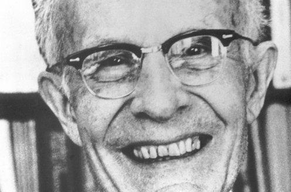

Theodore W. Schultz was a groundbreaking economist whose profound insights into agricultural development and human capital theory have significantly influenced modern economic studies. Born in a rural setting, Schultz's early experiences shaped his understanding of the economic challenges faced by agricultural communities, laying the foundation for his future contributions. His pioneering work fundamentally redefined how economists think about the economic value of education and health, crucial components of what he termed "human capital."

This article examines Schultz's influential contributions to economics, with a focus on his theories concerning agricultural development, human capital, and their implications for existing economic models. Schultz's work challenged the conventional economic wisdom of his time, emphasizing the importance of human capital as a driver of economic development. Through his research, Schultz argued for the necessity of investing in education and health to enhance productivity, particularly in developing regions. His ideas fostered a paradigm shift in economic policy, advocating for a more holistic approach that integrates these crucial investments.



Additionally, Schultz's emphasis on agricultural innovation and the economic empowerment of rural populations added a critical dimension to economic studies, urging policymakers to address the unique needs of agricultural economies. His insights also bear relevance to modern economic practices such as algorithmic trading, where the integration of human capital considerations can inform the design and execution of financial models. By applying Schultz's principles, economists and technologists can develop more inclusive and sustainable economic strategies.

This introduction sets the stage for exploring Schultz's theories and their enduring impact on both agricultural economics and the evolution of algorithmic trading, reflecting his role as a catalyst for progress in economic theory and practice.

## Table of Contents

## The Early Life of Theodore W. Schultz and His Economic Journey

Theodore W. Schultz was born on April 30, 1902, on a farm near Arlington, South Dakota, a setting that profoundly shaped his interest and subsequent contributions to agricultural economics. Growing up in an agriculturally focused environment, Schultz developed a keen understanding of the challenges and intricacies of farm life, which later fueled his academic and professional pursuits.

Schultz commenced his formal education at South Dakota State College (now South Dakota State University), where he immersed himself in the study of agriculture. His academic journey was marked by a strong inclination toward understanding the economic aspects of agriculture, leading to a degree that would lay the foundation for his future work in the field.

After completing his degree, Schultz embarked on an academic career at Iowa State University. His tenure at Iowa State was significant, not only for the development of his early research interests but also for the opportunities it presented to engage with the agricultural economic issues of the time. However, Schultz's career path took a decisive turn due to an academic controversy regarding the economic impacts of oleomargarine—a butter substitute—on the dairy industry. This controversy underscored the complexities inherent in issues of agricultural policy and market dynamics.

In 1943, prompted by the oleomargarine controversy and seeking a more conducive environment for his burgeoning economic theories, Schultz joined the University of Chicago. There, he became a pivotal figure in economics, expanding his focus beyond purely agricultural topics to address broader economic theories related to development and human capital. His move to Chicago marked the beginning of a period of intense intellectual activity and influence, eventually [earning](/wiki/earning-announcement) him recognition as one of the leading economists of his time.

## Contributions to Agricultural Economics

Theodore W. Schultz's contributions to agricultural economics are profound, centering on the critical role of agricultural development in underdeveloped nations. His research critiqued the inclination of governmental policies to favor urban sectors at the expense of rural agricultural interests. Schultz highlighted the inefficiencies and injustices in such models, advocating for a paradigmatic shift toward policies that empower agricultural innovation and entrepreneurship in rural communities.

Schultz posited that enhancing productivity in agriculture was essential for the economic development of poorer countries, where the majority of populations were engaged in farming. He argued that investing in agricultural research and education could lead to significant increases in productivity. Such investments could generate new farming techniques, improve crop yields, and increase the overall economic returns from agricultural endeavors. Schultz's perspective was that government policies should support these areas, enabling farmers to adopt new technologies and practices that would drive growth and development.

Moreover, his insights extended globally, influencing the crafting of economic development strategies across various developing nations. Policymakers were encouraged to recalibrate their strategies to include rural development as an integral component of their economic agendas rather than an afterthought. Schultz's work highlighted the need for institutional support, improved access to financial resources, and incentives for innovation in rural areas. This approach aimed at reducing the urban-rural disparity by recognizing and harnessing the potential of rural economies.

By foregrounding the importance of agriculture in economic development, Schultz's academic and policy-oriented endeavors have cemented a legacy that continues to inform how nations approach agricultural policies and economic development planning today. His work underscores the need for a balanced economic policy framework that champions equitable growth, crucial for lifting populations out of poverty and enhancing overall national prosperity.

## Human Capital Theory and Its Implications

Theodore W. Schultz is widely recognized for his formulation of the human capital theory, a concept that underscores the pivotal role of education and healthcare investments in stimulating economic development. Unlike traditional economic models which often emphasized physical capital and infrastructure, Schultz posited that the skills, knowledge, and health of individuals are equally crucial components of economic growth.

Schultz's observations during the post-World War II era provided a significant foundation for his human capital theory. He noted the swift economic recovery of nations like Japan and Germany, attributing their resurgence not solely to infrastructural reconstruction but to the well-educated and healthy workforces they possessed. These countries' investments in human capital, through extensive education systems and healthcare provisions, facilitated their rapidly evolving economic structures and productivity improvements. For instance, enrollment rates in educational institutions surged, equipping individuals with the skills required to adapt to and propel technological advancements and industrial growth.

The implications of Schultz's human capital theory extended beyond mere observation of historical events; it fundamentally influenced global economic policies. International organizations, such as the World Bank and the United Nations, increasingly prioritize human capital development as a cornerstone of their strategies to foster sustainable economic growth and reduce poverty. This focus is evidenced by initiatives such as the Human Capital Project by the World Bank, which encourages countries to invest in health, education, and the skills of their populations to improve economic outcomes.

At the core of human capital theory lies the idea that investments in people generate substantial returns, not only for individuals but also for economies at large. Educational attainment, represented mathematically as a variable affecting productivity, can be conceptualized as follows:

$$
P_i = f(E_i, H_i, K_i, T)
$$

where $P_i$ is the productivity of individual $i$, $E_i$ represents their level of education, $H_i$ denotes health status, $K_i$ is the physical capital available, and $T$ symbolizes technology. Schultz argued that enhancing $E_i$ and $H_i$ would yield substantial growth in $P_i$, ultimately leading to broader economic development.

In conclusion, Schultz's human capital theory provided a transformative lens through which economists and policymakers now view economic development. By shifting attention towards the intrinsic value embedded in human capabilities and well-being, Schultz forged a path for economic strategies that prioritize human-centric investments, laying a groundwork for enduring progress and resilience in complex global economies.

## Schultz's Influence on Economic Theories and Practices

Theodore W. Schultz significantly influenced economic theories and practices by challenging the traditional economic models that overlooked the dynamics of low-income economies. His work provided a more nuanced understanding of these economies, emphasizing the role of human capital as a crucial [factor](/wiki/factor-investing). Schultz argued that traditional models often failed to consider the potential of human capital investment in driving economic growth, particularly in societies with inadequate infrastructure and limited industrial capabilities.

Recognizing the transformative power of human capital, Schultz encouraged its integration into economic policies and development planning. His human capital theory posited that investments in education and health are as essential as physical capital investments, like machinery and infrastructure, for fostering economic growth. This perspective has since been adopted by policymakers and international development organizations, influencing strategies to uplift low-income economies through targeted programs aimed at improving educational and health outcomes.

Schultz's emphasis on the value of human capital laid a foundation for more analytical approaches in economics, which have become critical in modern financial practices, including [algorithmic trading](/wiki/algorithmic-trading). As this practice relies heavily on statistical models and [artificial intelligence](/wiki/ai-artificial-intelligence) (AI) algorithms for decision-making, Schultz's insights highlight the importance of incorporating human-centered considerations. For instance, understanding the educational background and cognitive skills of individuals involved in these processes can lead to better-designed algorithms and more accurate models.

Incorporating Schultz's ideas into algorithmic trading involves recognizing that even the most advanced AI models benefit from human input and oversight. This could involve data scientists collaborating with economists to integrate human capital metrics into predictive models or leveraging behavioral insights to enhance trading strategies' adaptability and accuracy.

For practical implementation, consider a Python model simulating market conditions and human capital variables' impact on trading outcomes:

```python
import numpy as np
import pandas as pd

# Simulate market data and human capital indices
np.random.seed(42)
market_data = np.random.normal(100, 10, 100)
human_capital_index = np.random.normal(1, 0.05, 100)

# Simple model incorporating human capital into trading decision
# Higher human capital index increases the expected return
returns = market_data * (1 + human_capital_index)

# Analysis output
trading_strategy = pd.DataFrame({'Market Data': market_data, 'Human Capital Index': human_capital_index, 'Expected Returns': returns})

print(trading_strategy.describe())
```

In this example, the model accounts for fluctuations in a human capital index, illustrating Schultz’s argument that human capital investment indirectly enhances economic performance, even in algorithmic contexts. As trading and economic strategies continue to evolve, Schultz's pioneering ideas on integrating human factors will remain profoundly influential.

## The Intersection of Agriculture, Economics, and Modern Trading

Theodore W. Schultz’s pioneering work in economics has become particularly pertinent in today's era of rapid technological advancement, especially within the fields of agriculture and finance. At the core of Schultz's philosophy was the belief that human knowledge and innovation are paramount drivers of economic progress. This belief is increasingly reflected in recent advances in agrotechnology and algorithmic trading.

Modern agrotechnology embodies Schultz’s emphasis on agricultural innovation and improvement. Techniques such as precision agriculture, which utilizes GPS and IoT devices to optimize field-level management regarding crop farming, resonate with Schultz's advocacy for scientific and technological development in rural sectors. These technological innovations aim to enhance productivity and efficiency, thereby supporting Schultz's argument for the upliftment of agricultural economies through science and technology.

In finance, algorithmic trading has emerged as a revolutionary force, significantly transforming markets through the use of statistical models and artificial intelligence (AI). Algorithmic trading involves the use of computer programs to execute trades based on pre-defined criteria, often leveraging complex algorithms to identify profitable opportunities in real-time. This reliance on data analysis reflects Schultz's view that informed decision-making and investment in knowledge are essential for economic development.

Algorithmic trading, although highly mathematical and machine-driven, stands to gain from integrating Schultz’s human-centered economic policies. Schultz argued for recognizing and investing in human capital as a crucial component of economic growth. In trading, this could translate into enhancing the role of human expertise alongside automated systems. For instance, human insights into economic trends, regulatory changes, and geopolitical risks can complement algorithmic models, providing a more holistic approach to trading strategies. Moreover, an investment in education and skill development for those working in finance could improve the effectiveness and ethical implementation of algorithmic trading systems.

Python, one of the preferred languages for financial modeling, can be employed to develop such integrated systems. For example, using Python's Pandas library, financial analysts can manage large datasets, while [machine learning](/wiki/machine-learning) libraries like Scikit-learn can train models to predict market behavior. Here is a simple Python snippet to illustrate how a decision tree model can be integrated into trading strategies:

```python
import pandas as pd
from sklearn.model_selection import train_test_split
from sklearn.tree import DecisionTreeClassifier

# Sample data for trading prediction
data = pd.read_csv('financial_data.csv')

# Define features and target
features = data[['feature1', 'feature2', 'feature3']]
target = data['buy_signal']

# Split data into train and test sets
X_train, X_test, y_train, y_test = train_test_split(features, target, test_size=0.2, random_state=42)

# Train a decision tree model
model = DecisionTreeClassifier()
model.fit(X_train, y_train)

# Predict buy signals
predictions = model.predict(X_test)
```

By incorporating humans’ critical roles alongside technological tools, the economic systems can reflect Schultz’s balanced approach, leveraging both human wisdom and technological proficiency for sustainable advancements in agriculture and finance. Schultz's work underscores the importance of viewing economic systems as dynamic and inclusive of human capacities, a principle that remains essential in maximizing the potential of modern trading and agricultural practices.

## Conclusion

Theodore W. Schultz's seminal contributions to economics continue to resonate within contemporary economic frameworks. His groundbreaking work on human capital theory remains a cornerstone in discussions about economic growth and development. By highlighting the importance of investing in education and health, Schultz underscored how these elements play a critical role in fostering economic advancement. This perspective not only challenged previous economic paradigms but also led to significant policy shifts toward enhancing human capital, especially in developing regions.

Schultz's insights into rural development have been equally transformative. By advocating for agricultural innovation and recognizing the economic potential within rural areas, he shaped policies that bridge the gap between urban and rural economies. His emphasis on entrepreneurship and innovation in agriculture serves as a blueprint for current strategies aimed at economic diversification and resilience.

In today's technological landscape, Schultz’s principles offer valuable lessons. The increasing reliance on technology in both agriculture and financial markets, such as algorithmic trading, can benefit from his human-centered approach. As we navigate the complexities of modern economies, incorporating human capital considerations into technological and economic models enhances their effectiveness and inclusivity.

Through his work, Schultz provides a foundational understanding that recognizes the crucial role of human knowledge and capacity in achieving sustainable economic success. His ideas advocate for an integrated approach, where the development of human potential complements technological and economic advancements.

## References & Further Reading

[1]: Schultz, T. W. (1961). "Investment in Human Capital." The American Economic Review, 51(1), 1-17. [JSTOR](https://www.jstor.org/stable/i331528)

[2]: Gang, I. N., & Stuart, R. C. (1999). ["World Development Report 1998/1999: Knowledge for Development."](https://documents.worldbank.org/en/publication/documents-reports/documentdetail/729771468328524815/world-development-report-1998-1999-knowledge-for-development) The World Bank.

[3]: ["Transforming Traditional Agriculture"](https://www.semanticscholar.org/paper/Transforming-Traditional-Agriculture-Schultz/a1c77dde15fd5eb5d0830ae548b4049991f8a8aa) by Theodore W. Schultz

[4]: Becker, G. S. (1993). ["Human Capital: A Theoretical and Empirical Analysis, with Special Reference to Education"](https://www.academia.edu/35396287/HUMAN_CAPITAL_A_Theoretical_and_Empirical_Analysis_with_Special_Reference_to_Education_THIRD_EDITION). University of Chicago Press.

[5]: Hayami, Y., & Ruttan, V. W. (1985). ["Agricultural Development: An International Perspective"](https://archive.org/details/agriculturaldeve0000haya_j2d5). Johns Hopkins University Press.