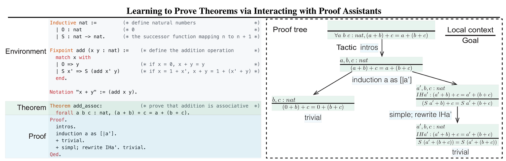

## Table of Contents

## What is a theorem proving model in the context of machine learning?

A theorem proving model in machine learning is a type of artificial intelligence system designed to automatically prove mathematical theorems. These models use a combination of logical reasoning and algorithms to search for proofs of given statements. Unlike traditional machine learning models that predict outcomes based on data, theorem proving models focus on proving the truth or falsehood of mathematical statements using formal logic. This process involves breaking down complex theorems into simpler sub-problems and using various strategies to find a valid proof.

In practical terms, theorem proving models can be applied in areas such as automated reasoning, where they help in verifying the correctness of software and hardware systems. For example, a theorem proving model might be used to prove that a piece of code will always behave as expected under certain conditions. These models are particularly useful in fields like computer science and mathematics, where rigorous proof is essential. While traditional theorem proving relies heavily on human insight and creativity, machine learning approaches aim to automate this process, making it faster and potentially more thorough.

## How do theorem proving models differ from traditional proof assistants?

Theorem proving models and traditional proof assistants both aim to help prove mathematical theorems, but they work in different ways. Traditional proof assistants, like Coq or Isabelle, rely a lot on human input. People use these systems to write down steps of a proof, and the assistant checks if each step is correct. This means that a lot of the creativity and problem-solving still comes from the person using the proof assistant. They guide the system through the proof, making sure each part is logically sound.

On the other hand, theorem proving models, especially those using machine learning, try to automate more of the process. These models learn from examples of proofs and try to find new proofs on their own. They use algorithms to search through possible proof paths and can sometimes find proofs that a human might not think of. This can be faster and might cover more ground, but it also means that the models might not always be as reliable as a human-guided proof assistant. They can make mistakes or take longer to find a proof, but they are getting better as the technology improves.

Both types of systems have their place. Traditional proof assistants are very good for detailed, step-by-step proofs where human oversight is important. Theorem proving models are useful for exploring new proofs and automating parts of the process, which can be helpful in large or complex problems. As machine learning advances, we might see more integration between these two approaches, making theorem proving even more powerful and efficient.

## What is the role of machine learning in theorem proving?

Machine learning plays a big role in making theorem proving easier and faster. Instead of humans having to think of every step in a proof, machine learning models can learn from lots of examples of proofs. They use this knowledge to find new proofs on their own. This is helpful because it can save time and sometimes find proofs that humans might miss. For example, a machine learning model might look at many different ways to prove a theorem and pick the best one.

These models use special algorithms to search for proofs. They can be trained to recognize patterns in proofs and use those patterns to guide their search. This means they can sometimes find a proof faster than a human could. However, machine learning models aren't perfect yet. They can make mistakes or take a long time to find a proof. But as the technology gets better, machine learning is becoming a powerful tool in theorem proving, helping to solve big and complex math problems.

## Can you explain the basic components of a theorem proving model?

A theorem proving model has a few main parts that work together to find proofs. The first part is the search algorithm, which looks for different ways to prove a theorem. This algorithm tries out many paths and decides which ones to keep exploring based on how likely they are to lead to a proof. The second part is the knowledge base, which stores information about past proofs and mathematical facts. The model uses this information to guide its search and make better guesses about where to look next.

The third part is the machine learning component, which helps the model learn from examples. It looks at lots of proofs and figures out patterns that can help find new proofs faster. This part makes the model smarter over time, so it can solve harder problems. All these parts work together to make the model good at finding proofs, but they need to be carefully balanced to work well.

## What are some common applications of theorem proving models?

Theorem proving models are used a lot in computer science to check if software and hardware are working correctly. They help make sure that a program will do what it's supposed to do, no matter what. For example, they can prove that a piece of code will always stop running after a certain time or that it will always give the right answer. This is really important for things like airplane control systems or medical devices, where mistakes can be dangerous.

These models are also used in math to help prove new theorems. They can take a lot of the hard work out of finding a proof, which lets mathematicians focus on the big ideas. Sometimes, they can even find proofs that are too complex for humans to think of on their own. This can lead to new discoveries and a better understanding of math.

In the field of artificial intelligence, theorem proving models help make AI systems smarter. They can be used to teach AI how to reason and solve problems in a logical way. This is useful for things like planning and decision-making, where the AI needs to think through different options and choose the best one. By using theorem proving models, AI can become better at understanding and working with complex ideas.

## How does NeuroTactic approach theorem proving?

NeuroTactic is a machine learning model that helps with theorem proving by using a special way to search for proofs. It uses something called reinforcement learning, which means it learns by trying different things and getting better over time. NeuroTactic looks at a lot of examples of proofs and tries to figure out the best way to find new proofs. It does this by breaking down the problem into smaller parts and trying different paths to see which ones work best. This method helps NeuroTactic find proofs faster and sometimes find proofs that are hard for humans to think of.

One cool thing about NeuroTactic is that it can learn from its mistakes. If it tries a path that doesn't lead to a proof, it remembers that and tries something different next time. This makes it smarter and better at finding proofs as it goes along. NeuroTactic is used in math and computer science to help solve big problems and make sure software works right. By using NeuroTactic, researchers can find new proofs and make sure their work is correct, which is really important in these fields.

## What datasets are typically used to train theorem proving models?

Theorem proving models are trained on datasets that contain lots of mathematical proofs. These datasets usually come from big libraries of math problems and their solutions. One popular dataset is the Mizar Mathematical Library, which has thousands of proofs written in a special language called Mizar. Another dataset is the Coq library, which has proofs written in the Coq language. These datasets help the models learn how to find proofs by showing them many examples of what a proof looks like.

Another important dataset is the HAMMER (Hol(y)Hammer) dataset, which is used for automated theorem proving in the HOL Light system. This dataset includes proofs and tactics that help the model learn how to search for proofs more effectively. Researchers also use datasets from math competitions, like the IMO (International Mathematical Olympiad) problems, to train models on challenging and diverse math problems. By using these datasets, theorem proving models can get better at finding proofs and solving complex math problems.

## What are the main challenges faced when developing theorem proving models?

One of the main challenges in developing theorem proving models is the complexity of mathematical proofs. Proofs can be very long and involve many steps, which makes it hard for a model to find the right path. Sometimes, a proof might need a lot of creativity or insight that is tough for a machine to come up with. Also, the model needs to be very accurate because even a small mistake can make the whole proof wrong. This means the model has to be trained on a lot of good examples and still might not always get it right.

Another challenge is the need for large and diverse datasets. To learn how to prove theorems, the model needs to see many different kinds of proofs. But creating these datasets is a lot of work because it involves collecting and organizing proofs from many sources. The data also needs to be in a format that the model can understand, which can be tricky. Without enough good data, the model might not learn well and could struggle to find new proofs.

## How can the performance of theorem proving models be evaluated?

To evaluate the performance of theorem proving models, researchers look at how often the model can find a correct proof for a given theorem. They use a big set of math problems and see how many of these problems the model can solve. This is called the success rate. They also measure how long it takes for the model to find a proof, which is important because sometimes a proof can be very hard to find. Another way to evaluate the model is by checking how many steps it takes to find a proof. Fewer steps can mean the model is more efficient.

Another important thing to look at is how well the model can handle different kinds of problems. Some theorems might be easy, while others are very hard. A good model should be able to solve a wide range of problems. Researchers also compare the model's proofs to human-made proofs to see if the model's way of solving the problem is similar to how a person would do it. This can show if the model is learning to think like a mathematician. By looking at all these things, researchers can tell if a theorem proving model is working well and where it might need to improve.

## What advancements have been made in theorem proving models in recent years?

In recent years, theorem proving models have made big steps forward, thanks to machine learning. One cool thing is that models like DeepMath and TacticToe use neural networks to learn from lots of examples of proofs. They can find new proofs faster and sometimes even come up with proofs that are hard for people to think of. Another big advancement is the use of reinforcement learning in models like NeuroTactic. This means the model learns by trying different paths to a proof and getting better over time. It helps the model solve harder problems and be more reliable.

Researchers have also worked on making theorem proving models work better with traditional proof assistants. For example, the model can suggest steps to the proof assistant, and the assistant can check if those steps are right. This teamwork makes the whole process of proving theorems faster and more accurate. Also, new datasets like the Mizar Mathematical Library and the Coq library have helped a lot. These datasets give the models more examples to learn from, which makes them smarter and better at finding proofs.

## How do theorem proving models integrate with existing proof assistants like Coq or Isabelle?

Theorem proving models work together with proof assistants like Coq or Isabelle by suggesting steps in a proof that the proof assistant can then check. The model uses machine learning to look at lots of examples of proofs and figure out the best way to find new ones. When it finds a possible step, it tells the proof assistant, which checks if that step is correct. This teamwork helps make the process of proving theorems faster and more accurate. The model does the hard work of searching for a proof, while the proof assistant makes sure each step is right.

In practice, this integration can look like the model suggesting a tactic or a lemma that could help move the proof forward. For example, if the model thinks that using a certain mathematical rule, like $$ \forall x (P(x) \rightarrow Q(x)) \rightarrow (\forall x P(x) \rightarrow \forall x Q(x)) $$, will help, it will suggest this to the proof assistant. The proof assistant then checks if this rule can be applied correctly in the current proof. By combining the creativity and speed of the model with the precision of the proof assistant, researchers can solve more complex problems and make sure their proofs are correct.

## What future developments are expected in the field of theorem proving models?

In the future, theorem proving models are expected to become even smarter and faster at finding proofs. Researchers are working on making these models better at understanding and using human-like reasoning. This means the models will be able to solve more complex math problems and find proofs that are hard for people to think of. They might use new kinds of machine learning, like deep learning, to learn from even more examples of proofs. This could help them find proofs faster and be more accurate. Also, they might be able to work better with proof assistants like Coq or Isabelle, making the whole process of proving theorems smoother and more reliable.

Another big change might be in how these models learn. Right now, they need a lot of examples to learn from, but in the future, they might be able to learn from fewer examples or even learn on their own. This would make it easier to train them and use them for new kinds of problems. Researchers are also looking at ways to make these models explain their proofs better, so people can understand how the model found the proof. This could help mathematicians trust the models more and use them to solve really hard problems. By working together, theorem proving models and human mathematicians could discover new math and make sure software and hardware are safe and correct.