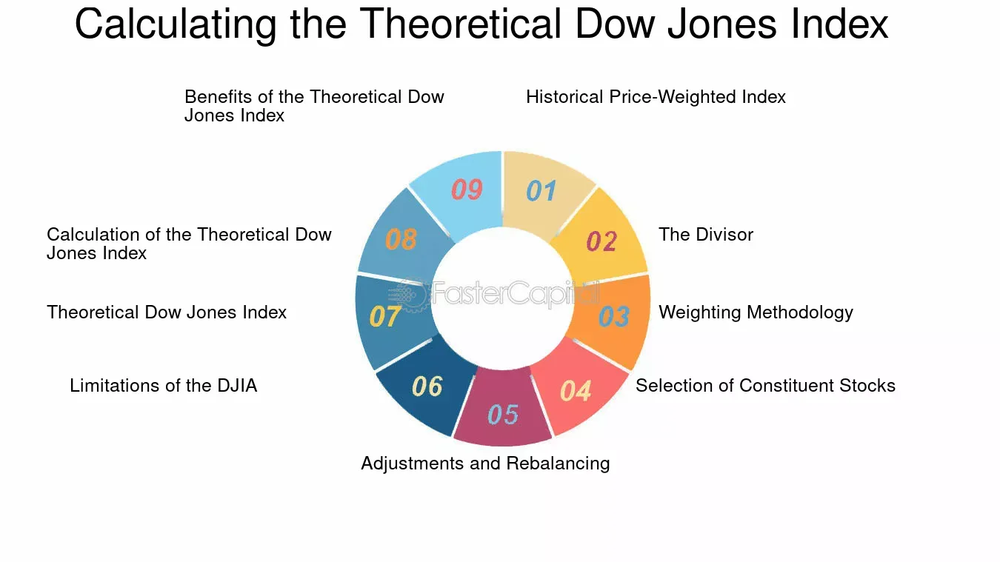

## Table of Contents

## What is the Dow Jones Industrial Average (DJIA)?

The Dow Jones Industrial Average, often just called the Dow, is a stock market index that shows how 30 big companies in the U.S. are doing. These companies are from different industries like technology, healthcare, and finance. The Dow is one of the oldest and most well-known stock indexes. It was created by Charles Dow in 1896. People use it to get a quick idea of how the overall stock market is performing.

The way the Dow is calculated is a bit different from other indexes. It uses a price-weighted method, which means that companies with higher stock prices have a bigger impact on the index's value. If a company's stock price goes up or down a lot, it can move the whole Dow. Even though it only tracks 30 companies, the Dow is still seen as a good way to see how the U.S. economy is doing. It's often mentioned in the news and used by investors to make decisions.

## How is the DJIA calculated?

The Dow Jones Industrial Average, or DJIA, is calculated using a special method called price-weighting. This means that the price of each stock in the index affects how much it influences the total value of the Dow. If a company's stock price is high, it will have a bigger impact on the Dow than a company with a lower stock price, even if the higher-priced company is smaller overall. The Dow includes 30 big companies from different industries, and their stock prices are added up and then divided by a special number called the "Dow Divisor."

The Dow Divisor is used to keep the index stable even when things like stock splits or dividend payments happen. It started as the number of companies in the index, but it changes over time to make sure the Dow reflects true changes in the market. When a company's stock price changes, the total value of the Dow changes too. But because of the Dow Divisor, the actual number you see for the Dow might not change as much as you'd expect just from looking at stock prices. This way, the Dow gives a smooth picture of how the market is doing overall.

## What is the difference between the DJIA and the Theoretical Dow Jones Index?

The Dow Jones Industrial Average (DJIA) is a real stock market index that tracks the performance of 30 big companies in the U.S. It uses a special way of calculating called price-weighting, where the stock price of each company affects how much it influences the total value of the Dow. The DJIA is updated every day and is used by people to understand how the stock market is doing.

The Theoretical Dow Jones Index, on the other hand, is not a real index but a concept used for understanding or experimenting with different ways to calculate an index. It could be based on different rules or methods, like using different companies or a different way of weighting the stocks. This theoretical index helps people think about how changes in the calculation method might affect the index's value and what that could mean for understanding the market.

## Why is the Theoretical Dow Jones Index important for financial analysis?

The Theoretical Dow Jones Index is important for financial analysis because it helps people understand how different ways of calculating an index can change what it shows about the market. By playing around with different rules or methods, like using different companies or different ways to weigh the stocks, analysts can see how these changes might affect the index's value. This can help them figure out if the real Dow Jones Industrial Average is giving a good picture of the market or if there might be a better way to do it.

Using a Theoretical Dow Jones Index also lets analysts test new ideas without messing up the real index. They can try out different scenarios to see how the market might react to things like new companies joining the index or changes in how the stocks are weighed. This kind of testing can lead to better ways of understanding the market and making smarter investment choices.

## How does the Theoretical Dow Jones Index account for stock splits and dividends?

The Theoretical Dow Jones Index, like the real Dow Jones Industrial Average, needs to account for stock splits and dividends to keep the index accurate. When a company in the index does a stock split, it means they are dividing their shares into more, smaller pieces. This makes the stock price go down, but it doesn't change the overall value of the company. To make sure the index stays correct, the Theoretical Dow Jones Index would adjust the divisor, just like the real Dow does. This keeps the index from going down just because of a stock split.

Dividends are payments that companies give to their shareholders, and they can also affect the index. When a company pays a dividend, its stock price usually drops by the amount of the dividend on the day it's paid. To handle this, the Theoretical Dow Jones Index would adjust the divisor again. This way, the index doesn't drop just because of the dividend payment. By making these adjustments, the Theoretical Dow Jones Index can give a true picture of the market, even when stock splits and dividends happen.

## What are the components of the Theoretical Dow Jones Index?

The Theoretical Dow Jones Index is made up of a group of companies, just like the real Dow Jones Industrial Average. But instead of the 30 big companies that are actually in the Dow, the Theoretical Index can include any number of companies. These could be different companies from different industries, or even the same companies as in the real Dow but with different rules about how their stock prices affect the index. The main thing is that the Theoretical Index is a way to try out new ideas and see how they might work.

When it comes to how the Theoretical Dow Jones Index is put together, it can use different ways to weigh the companies' stock prices. The real Dow uses a price-weighted method, where a company's stock price decides how much it affects the index. But the Theoretical Index might use other methods, like giving more weight to bigger companies or using equal weight for all companies. This lets people see how these different ways of calculating the index might show the market differently. By changing the companies and the way they're weighed, the Theoretical Index helps us learn more about how to best understand the stock market.

## How does the Theoretical Dow Jones Index adjust for changes in the market?

The Theoretical Dow Jones Index adjusts for changes in the market by changing the way it calculates its value. If the market changes, like if a company does a stock split or pays a dividend, the index needs to make sure these changes don't mess up the numbers. It does this by adjusting something called the "divisor." When a stock splits, the price of the stock goes down, but the company's value stays the same. So, the index changes the divisor to keep the index's value correct. The same goes for dividends. When a company pays a dividend, its stock price usually drops by the amount of the dividend. The index adjusts the divisor again to make sure the index doesn't go down just because of the dividend.

Another way the Theoretical Dow Jones Index can adjust to market changes is by changing which companies are in the index or how their stock prices are weighed. If new companies become important or old ones become less important, the index might add or remove companies to better show what's happening in the market. Also, if a different way of weighing the stocks seems like it might give a better picture of the market, the index can try that out. This could mean giving more weight to bigger companies or using equal weight for all companies. By trying out different ways to calculate the index, the Theoretical Dow Jones Index helps people learn more about how to understand the stock market better.

## What historical data is used to construct the Theoretical Dow Jones Index?

The Theoretical Dow Jones Index uses historical stock price data from the companies that could be part of the index. This data helps to see how the index would have performed if it had been calculated using different rules or included different companies. For example, if someone wants to test how the index would look if it used equal weighting instead of price weighting, they would use past stock prices to figure out how the index would have changed over time with this new method.

By looking at historical data, people can compare the Theoretical Dow Jones Index to the real Dow Jones Industrial Average. This comparison can show if the new way of calculating the index would have given a better picture of the market in the past. It helps analysts understand if changes to the index, like adding or removing companies or using a different weighting method, could make the index more useful for understanding the stock market today.

## How can the Theoretical Dow Jones Index be used to predict market trends?

The Theoretical Dow Jones Index can help predict market trends by letting people try out different ways to calculate the index and see how these changes might show the market differently. By using past stock price data, analysts can see how the index would have moved if it had used different rules, like equal weighting instead of price weighting, or if it had included different companies. This helps them understand if these changes could have given a better picture of the market in the past. By looking at how the Theoretical Index would have reacted to past market events, analysts can guess how it might react to future events, helping them predict what might happen next in the market.

Using the Theoretical Dow Jones Index for prediction also involves comparing it to the real Dow Jones Industrial Average. If the Theoretical Index shows a different trend than the real index, it might mean that the market is moving in a way that the real index isn't showing well. This can give early warnings about changes in the market that might not be clear yet. By testing different scenarios with the Theoretical Index, analysts can spot patterns and trends that could help them make better guesses about where the market is headed. This way, the Theoretical Index acts like a tool for looking into the future of the market.

## What are the limitations of the Theoretical Dow Jones Index?

The Theoretical Dow Jones Index has some problems that make it hard to use perfectly. It's not a real index, so it can't be used to make money directly. It's just for trying out ideas and seeing what might happen. Also, the index depends a lot on the rules and companies chosen. If these are not picked well, the index might not show the market correctly. And because it uses past data, it might not always predict the future right, because the market can change in ways we don't expect.

Another issue is that the Theoretical Dow Jones Index can be hard to understand. It uses math and ideas that not everyone knows about. This means that only people who know a lot about the stock market can use it well. Also, it might miss out on important things happening in the market, like new laws or big world events, because it's based on numbers and not on what's happening in the real world. So, while it's a good tool for learning and trying out new ideas, it has limits and can't tell us everything about the market.

## How does the Theoretical Dow Jones Index compare to other market indices?

The Theoretical Dow Jones Index is different from other market indices because it's not real. It's just a way to try out new ideas about how to measure the stock market. Other indices, like the S&P 500 or the Nasdaq, are real and used by people to make money. They have set rules about which companies are in them and how their stock prices affect the index. The Theoretical Dow Jones Index can change its rules and companies to see how different ways of calculating an index might work.

Even though the Theoretical Dow Jones Index isn't real, it can still help us learn about the market. It can show us how different ways of calculating an index might give us different pictures of the market. For example, the S&P 500 uses a different way to weigh companies than the real Dow Jones Industrial Average. By trying out different methods with the Theoretical Index, we can see if these other ways might be better at showing what's happening in the market. But because it's not real, it can't be used directly to make money like the other indices.

## What advanced statistical methods are used in the analysis of the Theoretical Dow Jones Index?

Advanced statistical methods used in the analysis of the Theoretical Dow Jones Index help people understand how different ways of calculating the index might show the market. One common method is regression analysis, which looks at how the index changes when certain things happen, like stock splits or dividends. This helps analysts see patterns and predict how the index might move in the future. Another method is time series analysis, which looks at how the index has changed over time. This can help people see if the index is going up or down and if there are any repeating patterns that could be useful for predicting what might happen next.

Another important method is Monte Carlo simulation, which lets analysts try out different scenarios to see how the index might react. By running these simulations many times, they can get a better idea of what might happen in the future. Lastly, machine learning techniques are sometimes used to find patterns in the data that might be hard to see otherwise. These methods can help analysts make better guesses about where the market is headed by looking at lots of data and finding connections that might not be obvious at first.

## What is the Theoretical Dow Jones Index and how can it be understood?

The Theoretical Dow Jones Index deviates from the traditional approach by utilizing the average of the daily high and low prices for its calculation, as opposed to the end-of-day closing prices typically considered. This methodology presents a more dynamic representation of market movement and volatility by capturing the range in which stock prices fluctuate during the trading day. Specifically, the theoretical index value $TDI$ is calculated as:

$$

TDI = \frac{(High + Low)}{2} 
$$

This formula offers a timely snapshot of the market dynamics, potentially providing richer insights into intra-day price movements. It is rooted in the principle that incorporating both extremes of the trading session—an approach that accounts for the variability in stock prices—allows for broader analytical contexts. 

By assuming simultaneous high and low points for stocks, the index exposes potential [volatility](/wiki/volatility-trading-strategies) and reflects broader market sentiment beyond what closing prices can convey. While the assumption that stocks can reach high and low levels simultaneously is a simplification, this technique can still provide valuable insights into market trends and potential price fluctuations experienced throughout the day. 

In contrast to Dow Theory, which focuses on predicting trends by analyzing average advances across index components, the Theoretical Dow Jones Index offers a different lens through which to assess market health. Dow Theory tends to emphasize historical trends and is applied to discern bullish or bearish periods by tracking patterns in market averages.

From a financial analysis standpoint, using the average of daily highs and lows furnishes a full picture of market behavior, capturing intra-day volatility and the breadth of trading sessions. This enhances the ability to appraise index movements and stock fluctuations not visible in conventional end-of-day summaries, potentially leading to more robust interpretations of market activity. This method uncovers subtleties in the market that might otherwise be overlooked, providing vital data for analysts and strategists seeking to exploit intra-day fluctuations to optimize trading strategies.

## How do Traditional and Theoretical Dow Jones Indices compare?

The traditional Dow Jones Industrial Average (DJIA) is a time-honored stock market index that aggregates the performance of 30 prominent publicly traded companies in the United States by using their stock closing prices. This index is price-weighted, meaning that stocks with higher prices have a more significant influence on the index's movement. The formula to calculate the traditional DJIA at any time is:

$$
\text{DJIA} = \frac{\sum \text{Price of each stock}}{\text{Dow Divisor}}
$$

The Dow Divisor is a standardized constant adjusted to ensure continuity in the index, especially during stock splits or structural changes of the constituent companies.

In contrast, theoretical Dow Jones indices utilize a distinct method of calculation, offering intricate insights into market trends by considering the daily trading ranges rather than end-of-day closing prices. These indices calculate an average of daily high and low prices, aiming to capture intra-day volatility and market health more comprehensively. The relevant calculation might appear as:

$$
\text{Theoretical DJIA} = \frac{\sum (\text{High Price} + \text{Low Price})/2}{\text{Dow Divisor}}
$$

This calculation provides greater visibility into the dynamics experienced throughout the trading day, thus offering investors a perspective on intra-day market sentiment and fluctuations.

Analysts employ both the traditional and theoretical indices to obtain an extensive understanding of market conditions. The traditional index remains highly reliable for historical comparisons and simpler market analyses, given its long-standing usage and established methodology. Its consistent tracking of closing prices provides a clear, albeit narrow, view of daily market performance.

Theoretical indices, meanwhile, are employed to enhance the assessment of stock performance through the lens of trading ranges and the robustness of market health. By considering intra-day price variations, these indices highlight the market's underlying current more effectively. This leads to a richer analysis of sentiment changes and volatility patterns, making them invaluable for strategic decisions that depend on daily market behavior.

The differences in computation methodology grant each index a unique application in market analysis. The traditional index is less complex and more straightforward, supporting quick analysis and historically rooted investment strategies. On the other hand, theoretical indices, while technically demanding, furnish analysts with superior data granularity. They're particularly useful where a nuanced understanding of intra-day conditions is pertinent for decisions such as portfolio optimization and risk management. 

Hence, adopting both frameworks allows for a more comprehensive analysis of the stock market's intricacies, catering to varying analytical needs based on investor strategy and market conditions.

## References & Further Reading

[1]: Bergstra, J., Bardenet, R., Bengio, Y., & Kégl, B. (2011). ["Algorithms for Hyper-Parameter Optimization."](https://dl.acm.org/doi/10.5555/2986459.2986743) Advances in Neural Information Processing Systems 24.

[2]: ["Advances in Financial Machine Learning"](https://www.amazon.com/Advances-Financial-Machine-Learning-Marcos/dp/1119482089) by Marcos Lopez de Prado

[3]: ["Evidence-Based Technical Analysis: Applying the Scientific Method and Statistical Inference to Trading Signals"](https://www.amazon.com/Evidence-Based-Technical-Analysis-Scientific-Statistical/dp/0470008741) by David Aronson

[4]: ["Machine Learning for Algorithmic Trading"](https://github.com/stefan-jansen/machine-learning-for-trading) by Stefan Jansen

[5]: ["Quantitative Trading: How to Build Your Own Algorithmic Trading Business"](https://www.amazon.com/Quantitative-Trading-Build-Algorithmic-Business/dp/1119800064) by Ernest P. Chan