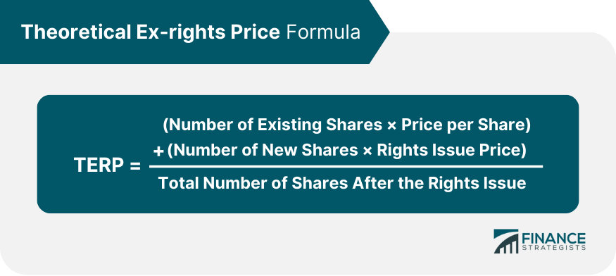

In today's rapidly evolving financial markets, investors and traders are constantly seeking ways to optimize their strategies and make informed decisions. As they navigate the complexities of corporate finance, one concept that emerges as particularly significant is the Theoretical Ex-Rights Price (TERP). TERP plays a pivotal role in understanding the impact of rights issues—financial events where existing shareholders are given the opportunity to purchase additional shares at a reduced price.

Understanding TERP is crucial for both traditional and algorithmic trading environments. It serves as a tool for projecting the market price of a stock following the exercise of rights, allowing for more informed and strategic investment decisions. Calculating TERP involves accounting for diluted shares and adjusted market capitalization, providing a theoretical estimate of a stock’s value post-rights issue.



This article will explore in depth what TERP is, how it is calculated, and its significance for investors, with particular attention to its role in evaluating rights issues. By understanding TERP, investors can refine their strategies to better assess the potential impacts of rights offerings on stock prices, enhancing their ability to protect and grow their investments.

## Table of Contents

## Understanding the Theoretical Ex-Rights Price (TERP)

The Theoretical Ex-Rights Price (TERP) represents the projected market value of a company's stock following the announcement of a rights issue. A rights issue is a corporate action that allows current shareholders to purchase additional shares at a discounted rate, generally leading to an increase in the number of shares in circulation. This influx of new shares effectively dilutes the value of existing shares.

The determination of TERP provides investors with an estimate of the stock price after the rights have been exercised. This projection is crucial for investors and analysts, as it allows them to assess the potential impact of the rights issue on the stock's market value. The calculation of TERP adjusts for the dilution effect caused by the issuance of new shares, thus granting investors insight into the adjusted stock value post-dilution.

Understanding the concept of TERP aids investors in evaluating how the rights issue will alter the value of their existing holdings. Accurately assessing the TERP helps them make informed decisions about whether to participate in the rights issue and how to manage their investment portfolio in light of the dilution. This metric is essential for forecasting the post-issue stock value and ensuring that investment strategies are aligned with the anticipated changes in stock market performance.

## Calculation of TERP

The calculation of the Theoretical Ex-Rights Price (TERP) is essential in understanding the potential shift in stock value following a rights issue. Rights issues involve offering existing shareholders the opportunity to purchase additional shares at a reduced price. This typically results in dilution of the current stock value, and TERP serves as a valuable estimate of the new share price post-issue.

The formula to determine TERP is:

$$
\text{TERP} = \frac{(\text{Number of Existing Shares} \times \text{Market Price}) + (\text{Number of New Shares} \times \text{Subscription Price})}{\text{Total Number of Shares After Issue}}
$$

Each element of this formula is critical:

1. **Number of Existing Shares**: This represents the shares that are currently outstanding before the rights issue.

2. **Market Price**: The current trading price of the stock, which reflects its value before the new shares are offered.

3. **Number of New Shares**: The additional shares that are being offered to existing shareholders as part of the rights issue.

4. **Subscription Price**: The price at which the new shares are offered to shareholders, generally set below the market price to encourage participation.

5. **Total Number of Shares After Issue**: This is the sum of existing and new shares and is used to average out the total value across all shares.

By plugging these values into the formula, investors can anticipate the adjusted stock price. This calculated TERP assists investors in making informed decisions by highlighting how the share price might adjust following the full exercise of the rights issue. This process accounts for the weighted average of existing shares at the market price and new shares at the discounted subscription price, thus enabling a comprehensive view of the potential stock value.

## Significance of TERP in Rights Issues

The Theoretical Ex-Rights Price (TERP) serves as a critical metric for both investors and corporations in the context of rights issues, where companies issue additional shares to existing shareholders. TERP calculates the projected price of a stock post-rights issue, incorporating factors such as the number of existing and new shares and their respective prices. This projection is essential for understanding the dilution effect on the stock value and helping stakeholders make informed decisions. 

For corporations, TERP is pivotal in formulating strategies around the pricing of new shares, ensuring these prices are set at levels that are attractive to shareholders while achieving the company's [capital raising](/wiki/hedge-fund-capital-raising) goals. Companies must consider how the rights offering and the subsequent changes in stock value will be perceived by investors. A well-calibrated rights issue that uses TERP effectively can strengthen investor relations, signaling management competence and transparency.

Investors rely on TERP as a baseline to evaluate whether to participate in a rights offering. By comparing TERP with the current market price, investors can assess the attractiveness of the opportunity. If the TERP indicates a favorable price relative to existing market conditions, it might suggest a beneficial purchase opportunity in the rights issue. Conversely, if TERP shows a potentially lower return on investment, investors might choose to sell their rights or avoid subscribing to additional shares.

Understanding and utilizing TERP effectively allows investors to participate strategically in new stock offerings, taking advantage of possible discrepancies between expected and actual market conditions. This can facilitate improved decision-making, potentially leading to better investment outcomes. Consequently, TERP is more than just a calculation; it is a fundamental component of strategic planning in rights issues, influencing decisions on both corporate and individual investor levels.

## Algorithmic Trading and TERP

Algorithmic trading has transformed the landscape of financial markets by using advanced computational models to execute trades with speed and precision. One critical [factor](/wiki/factor-investing) these algorithms incorporate is the Theoretical Ex-Rights Price (TERP), which plays a vital role in optimizing trading strategies, particularly when rights issues are involved.

Incorporating TERP into algorithmic models enables traders to predict price movements more accurately after rights issues. Since a rights issue affects a company's share price by introducing additional shares at a discounted rate, the stock's value becomes diluted. TERP provides a theoretical price adjustment that helps traders assess the stock's future value, taking into account the dilution effect. By factoring TERP into their calculations, algorithms can refine their forecasts about market reactions, offering insights into potential price movements.

Moreover, TERP becomes instrumental in identifying [arbitrage](/wiki/arbitrage) opportunities. Arbitrage involves exploiting price discrepancies of the same asset in different markets or forms. Algorithms that effectively integrate TERP can identify these discrepancies post-rights issue, potentially leading to profitable trades. For example, if the current market price deviates significantly from the TERP-adjusted price, algorithmic systems might execute trades to capitalize on expected price corrections as the market adjusts to new information.

For these predictive models to be effective, algorithmic strategies must consider both real-time data and financial models like TERP. Real-time data ensures that the algorithms have the most recent price and trading [volume](/wiki/volume-trading-strategy) information, which is crucial for making timely and informed trading decisions. Combining this real-time data with TERP allows algorithms to dynamically adjust their strategies and execution methods in response to evolving market conditions.

A Python snippet to calculate TERP could be structured as follows:

```python
def calculate_terp(existing_shares, market_price, new_shares, subscription_price):
    total_existing_value = existing_shares * market_price
    total_new_value = new_shares * subscription_price
    total_shares = existing_shares + new_shares
    terp = (total_existing_value + total_new_value) / total_shares
    return terp

# Example usage:
existing_shares = 1000000
market_price = 50
new_shares = 200000
subscription_price = 45

terp_value = calculate_terp(existing_shares, market_price, new_shares, subscription_price)
print(f"Theoretical Ex-Rights Price (TERP): {terp_value}")
```

By implementing such calculations, algorithmic traders can better forecast and react to market changes, leveraging TERP alongside other financial models. Understanding and utilizing TERP within algorithmic frameworks ultimately enhances trading efficacy, providing traders with a more nuanced approach to navigating rights issues.

## Practical Implications for Investors

In the context of rights issues, the Theoretical Ex-Rights Price (TERP) serves as a crucial tool for investors evaluating the strategic merit of participating in such financial events. By comparing TERP with the prevailing stock prices, investors can infer likely market dynamics following the issuance of new shares. This comparison aids in anticipating the stock's post-rights issue behavior, offering insights into whether the market perceives the rights offering as beneficial or dilutive to the stock's value.

To make informed decisions, investors should consider the formula for TERP: 

$$
\text{TERP} = \frac{(\text{Number of Existing Shares} \times \text{Market Price}) + (\text{Number of New Shares} \times \text{Subscription Price})}{\text{Total Number of Shares After Issue}}
$$

In practice, if the current market price of a stock is significantly above the TERP, it might indicate that the rights issue is perceived positively, potentially offering an arbitrage opportunity for short-term traders. Conversely, if the market price falls below the TERP, it could signal a negative market sentiment towards the new issue, possibly leading to undervalued stock prices post-issue.

Astute investors often exploit discrepancies between TERP and market prices to realize short-term profits during the rights trading phase. They may buy shares at a lower market price and sell at a higher TERP, or vice versa, depending on market conditions. This speculative approach requires not only a deep understanding of market sentiment but also a keen eye for timing and execution, facilitated by sophisticated trading strategies and tools.

Ultimately, judicious use of TERP in decision-making empowers investors to better navigate the complexities of rights issues, optimizing their portfolios in line with their financial objectives.

## Real-World Examples

### Real-World Examples

The Theoretical Ex-Rights Price (TERP) becomes particularly tangible when analyzing real-world cases of rights issues by companies such as AT&T and EasyJet. These instances provide a detailed look at how TERP plays a role in investor decisions and informs corporate financial strategies. 

#### AT&T's Rights Issue

AT&T, one of the world's leading telecommunications companies, offers a pertinent example of how TERP is utilized in practice. When AT&T announced its rights issue, the company intended to raise capital while allowing existing shareholders to purchase additional stock at a discounted price. The application of TERP in this scenario allowed investors to anticipate the post-rights share price, aiding in their decision-making processes.

The calculation of TERP was essential for both AT&T and its investors. By using the formula:

$$
\text{TERP} = \frac{(\text{Number of Existing Shares} \times \text{Market Price}) + (\text{Number of New Shares} \times \text{Subscription Price})}{\text{Total Number of Shares After Issue}}
$$

investors could determine whether participating in the rights issue was advantageous. If the TERP indicated a favorable price compared to the anticipated market value post-issue, investors might be more inclined to exercise their rights.

#### EasyJet's Rights Issue

In a similar vein, EasyJet, a prominent European airline, faced financial challenges and sought to stabilize its capital structure through a rights issue. The announcement included offering existing shareholders the opportunity to purchase new shares at a discount. Here, TERP served as a critical evaluative tool for investors assessing the impact of this financial maneuver.

The strategic use of TERP allowed investors to gauge the viability and attractiveness of the new shares. By estimating the stock's price post-issue, investors could decide whether participating aligned with their investment goals. For EasyJet, understanding TERP helped guide the pricing of the rights issue, ensuring it was appealing yet advantageous for the company.

#### Insights from AT&T and EasyJet

From these examples, it's evident that TERP plays a pivotal role in rights issues. Both AT&T and EasyJet used TERP as a framework to communicate potential share dilution and value to investors, facilitating informed decisions. TERP not only serves shareholders looking to capitalize on new opportunities but also acts as a barometer for companies in structuring equitable and effective rights offerings.

These cases underscore the importance of TERP in providing investors and corporations with a reliable measure to navigate complex financial landscapes, particularly during rights issues. By accurately assessing the theoretical ex-rights price, stakeholders can optimize their strategies and achieve desired financial outcomes.

## Conclusion

Theoretical Ex-Rights Price (TERP) is an essential concept for managing investments during rights issues, providing investors with a clearer understanding of post-issue stock valuations. By grasping this concept, investors are equipped to make informed, calculated decisions that can significantly impact their investment strategies, especially within [algorithmic trading](/wiki/algorithmic-trading) environments. TERP serves as a critical tool by offering an estimated stock price after the issuance, helping investors anticipate market reactions.

In algorithmic trading, accurately integrating TERP into trading algorithms enhances the precision of models that predict price movements post-rights issue. This not only aids in maintaining the stability of investment portfolios but also opens up new avenues for leveraging price discrepancies. Investors who understand TERP can protect their investments from potential dilution effects while also identifying opportunities for gains during the rights trading period.

The application of TERP extends beyond mere protection, as it also facilitates strategic engagement with new stock offerings. Savvy investors can use TERP to assess the fairness and attractiveness of rights offerings, thereby optimizing their participation strategies to achieve potentially favorable outcomes. As financial markets continue to evolve, mastering TERP will remain indispensable for both managing existing investments and uncovering new market opportunities.

## References & Further Reading

[1]: Eaton, J.C. (1999). ["Corporate Finance and Investment Decisions: Developing a Practice Approach"](https://people.duke.edu/~charvey/Teaching/CDROM_BA456_2003/Other_Harvey_Papers/W45_The_theory_and_July_29_1999.pdf). Financial Management.

[2]: Meyers, J. (2004). ["The Rights Offering Dilemma: A Search for Answers"](https://onlinelibrary.wiley.com/doi/full/10.1111/j.1467-9833.2004.00235.x). Journal of Applied Corporate Finance.

[3]: Ross, S.A., Westerfield, R.W., & Jaffe, J. (2008). ["Corporate Finance"](https://www.amazon.com/Corporate-Finance-Stephen-Ross/dp/1260772381). McGraw-Hill Education.

[4]: ["Investment Valuation: Tools and Techniques for Determining the Value of Any Asset"](https://archive.org/details/investmentvaluat0000damo_n6k9) by Aswath Damodaran

[5]: Choudhry, M. (2004). ["The Bond and Money Markets: Strategy, Trading, Analysis"](https://www.sciencedirect.com/book/9780750646772/the-bond-and-money-markets). Butterworth-Heinemann.