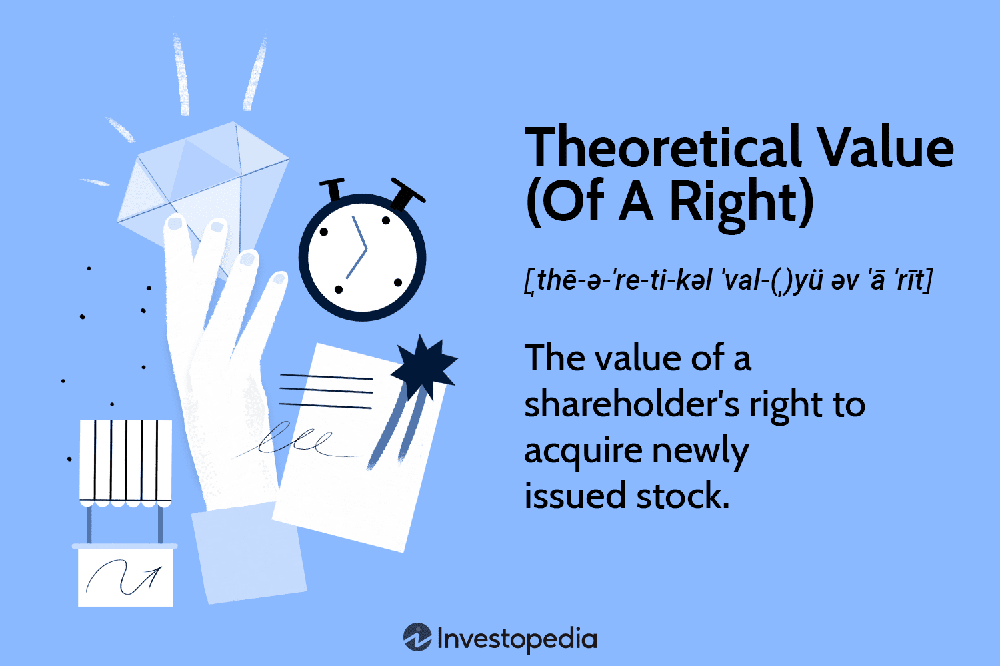

In finance, understanding complex concepts and tools is crucial for making informed investment decisions. One such concept is the theoretical value valuation formula, which plays a critical role in financial rights and algorithmic trading. The theoretical value is a calculated estimate of an asset's worth based on specific qualitative and quantitative criteria. It allows investors to grasp the intrinsic value of financial rights and assess whether participating in investment opportunities, such as rights offerings, aligns with their strategic objectives.

This article examines theoretical value and valuation formulas and their applications in financial rights and algorithmic trading. The objective is to provide investors and traders with a comprehensive understanding of these concepts to enhance their trading strategies. Accurately determining theoretical value ensures that traders do not overpay for rights while securing desired returns. This breakdown of core principles enables individuals to incorporate theoretical value into their investment analysis and trading strategies.



We will explore the fundamental principles, calculation methods, and real-world applications of theoretical value and its importance in the financial markets. The theoretical value calculation often involves variables such as stock price, rights subscription price, and the number of rights needed to acquire one share. This means understanding how market dynamics and corporate activities influence theoretical value calculations becomes essential for sound investment decision-making.

Whether you are an investor, a trader, or a financial analyst, this guide will equip you with the knowledge needed to navigate these critical financial aspects efficiently. As financial markets and methodologies evolve, staying informed about key concepts like theoretical value will provide a competitive edge in optimizing investment and trading outcomes, ensuring financial success amidst the complexities of modern markets.

## Table of Contents

## Understanding Theoretical Value

The theoretical value of a financial right is an important concept, especially when dealing with rights offerings. These offerings present a unique opportunity for existing shareholders to purchase additional shares of a company at a predefined price, often at a discount compared to the current market price. This strategy is employed by companies to raise capital efficiently.

Calculating the theoretical value provides investors with a measure of insight into the potential benefits of participating in the rights offering. The calculation of this value is instrumental as it aids investors in evaluating whether the cost of purchasing additional rights, combined with the potential benefits, aligns with their broader financial objectives.

For instance, the theoretical value of a right is determined using the following formula:

$$
\text{Theoretical Value of a Right (TVR)} = \frac{\text{Current Stock Price} - \text{Rights Subscription Price per Share}}{\text{Number of Rights Required to Buy One Share} + 1}
$$

Here, the current stock price represents the market price of the company's shares before any adjustment for the rights offering, while the rights subscription price is the predetermined price at which shareholders can purchase additional shares. The denominator accounts for the additional share plus the number of rights needed for the purchase.

By performing this calculation, investors can estimate whether the cost and effort associated with acquiring additional shares at the subscription price, weighted against the dilution and potential upside from the purchase, make the venture worthwhile.

Understanding these theoretical valuations is essential for investors aiming to optimize their positions. It equips them with critical data to scrutinize the benefits of the rights offered, considering factors such as current market conditions and their individual investment strategies. With this knowledge, investors are better positioned to make informed decisions that support their financial goals, optimizing their strategic involvement in rights offerings effectively.

## Valuation Formula for Financial Rights

The valuation formula for financial rights is a critical tool utilized by investors to evaluate their participation in rights offerings. This formula is designed to provide a quantitative measure of a right's worth, which helps investors make informed decisions. The formula can be expressed as:

$$
\text{Theoretical Value of a Right} = \frac{\text{Stock Price} - \text{Rights Subscription Price per Share}}{\text{Number of Rights Required to Buy One Share} + 1}
$$

This calculation offers insights during the cum rights period, where shares are traded with the rights attached. By applying this formula, investors can gauge the theoretical value to understand whether participating in a rights offering could potentially be profitable.

Several factors can influence the theoretical value of rights:

1. **Market Fluctuations**: The stock market's dynamic nature can impact the value of the underlying shares. Sudden changes in stock prices due to market conditions will alter the theoretical value of rights, requiring monitored market trends for updated assessments.

2. **Company Performance**: The financial health and performance of the issuing company play a significant role. Positive earnings reports and strong market performance usually bolsters stock prices, increasing the overall potential value of acquiring additional shares via rights.

3. **Interest Rates**: Prevailing interest rates affect investor sentiment and the cost of capital. High interest rates may deter investment in rights and equities as investors seek safer, interest-bearing assets, while low rates might encourage more investment in equities.

Applying these principles enables investors to quantify the value proposition of participating in a rights offering. Using tools like Python, investors can automate this valuation process, enhancing their ability to react swiftly to market changes. Here is an example of how this can be calculated using Python:

```python
def calculate_theoretical_value(stock_price, subscription_price, num_rights):
    return (stock_price - subscription_price) / (num_rights + 1)

# Example usage:
stock_price = 50.0
subscription_price = 45.0
number_of_rights = 4

theoretical_value = calculate_theoretical_value(stock_price, subscription_price, number_of_rights)
print(f"Theoretical Value of a Right: ${theoretical_value:.2f}")
```

This formula, complemented by thorough market analysis and strategic insights, can significantly aid investors in optimizing their investment strategies in rights offerings.

## Algorithmic Trading and Theoretical Value

Algorithmic trading, an integral component of modern financial markets, utilizes computer algorithms to automate trading strategies based on predefined conditions. These algorithms have gained prominence due to their ability to process large volumes of data and execute trades at high speeds and volumes, making them particularly beneficial when theoretical valuations are taken into account.

The theoretical value of financial rights, such as those in rights offerings, serves as a critical input in [algorithmic trading](/wiki/algorithmic-trading) systems. By calculating the theoretical value, traders can assess whether the securities are under- or overvalued compared to the current market price. This valuation aids in identifying [arbitrage](/wiki/arbitrage) opportunities and refining trading strategies to capture market inefficiencies. 

For instance, an algorithmic trading system might be programmed to monitor discrepancies between the theoretical value and market price. If the market price deviates significantly from the theoretical valuation, the algorithm may trigger a buy or sell order to exploit this mispricing. This approach relies on high-frequency trading techniques, enabling orders to be executed within milliseconds.

Algorithmic trading strategies can incorporate Python-based scripts to automate the trading decisions based on theoretical value calculations. A simple example in Python to calculate the theoretical value of rights might look like this:

```python
def calculate_theoretical_value(stock_price, subscription_price, rights_required):
    return (stock_price - subscription_price) / (rights_required + 1)

# Example usage
stock_price = 50  # current market price of stock
subscription_price = 45  # price at which rights can be exercised
rights_required = 2  # number of rights needed to buy one share

theoretical_value = calculate_theoretical_value(stock_price, subscription_price, rights_required)
print(f"Theoretical Value of Rights: ${theoretical_value:.2f}")
```

Understanding and integrating theoretical values into algorithmic trading strategies offer the dual benefits of enhanced trading efficiency and profitability. Accurate theoretical valuations guide algorithms in making informed decisions about rights offerings and other financial instruments. These algorithms are also adept at capturing rapid market changes, using theoretical valuations to adjust strategies dynamically.

By leveraging the power of theoretical values, algorithmic trading systems can potentially improve their performance in predicting market movements and identifying opportunities that human traders might otherwise miss. Consequently, traders who effectively incorporate theoretical valuations into their algorithmic models are better positioned to achieve superior financial outcomes in a competitive trading environment.

## Real-World Applications and Case Studies

In trading environments and corporate finance, the application of theoretical value is crucial for informed decision-making and strategic planning. A notable example involves a company issuing rights at a discounted price to existing shareholders. By utilizing the theoretical valuation formula, stakeholders can evaluate the impact on shareholder value and identify optimal trading strategies. This process enables investors to comprehend whether participating in such offerings will enhance their portfolio's financial health.

Consider a hypothetical case where a corporation announces a rights offering, allowing shareholders to purchase additional shares at $15 each when the market price is $20. Using the theoretical valuation formula:   

$$
\text{Theoretical Value of a Right (TVR)} = \frac{\text{Stock Price} - \text{Rights Subscription Price per Share}}{\text{Number of Rights Required to Buy One Share} + 1}
$$

Suppose one right is required to purchase a new share. The TVR in this scenario would be:

$$
TVR = \frac{20 - 15}{1 + 1} = \frac{5}{2} = 2.5
$$

This calculation suggests that each right holds a theoretical value of $2.5. Investors equipped with this insight can better assess the attractiveness of the rights offering.

The implications on investment decisions are significant. If the company's shares are perceived as undervalued, market participants may choose to buy additional shares to capitalize on potential price increases. Conversely, if the theoretical value reveals a minimal benefit, investors might opt to sell their rights on the open market, mitigating potential portfolio dilution.

Market reactions can vary based on the perceived value of these rights. Typically, an announcement of a rights issue might initially lead to a dip in market price due to anticipated dilution of shares. However, if the issue is strategic, such as funding an expansion likely to boost future profits, the end reaction can shift positively.

Moreover, understanding theoretical value is integral in analyzing share dilution. When new shares are issued at a discount, current shareholding percentages diminish, potentially affecting voting power and earnings per share (EPS). By precisely calculating and anticipating these changes, companies and investors can formulate advanced financial plans that minimize adverse effects.

Case studies of corporations that have navigated rights offerings successfully demonstrate the strategic importance of theoretical valuations. Successful examples often involve comprehensive assessments that balance immediate capital influx with long-term shareholder value enhancement.

In conclusion, real-world applications illustrate that mastering theoretical value calculation is indispensable for effective trading and corporate finance strategies. It empowers stakeholders to make data-driven decisions, optimize investment outcomes, and maintain competitiveness in dynamic financial markets.

## Challenges and Considerations

Investors who engage with the theoretical value valuation formula often face several challenges that can impact their ability to accurately assess financial rights. One primary challenge is market [volatility](/wiki/volatility-trading-strategies), which can drastically alter stock prices and, consequently, the theoretical value of rights. In a volatile market, prices can fluctuate significantly within short periods, making it difficult to rely solely on a static formula. For instance, changes in stock price directly affect the valuation, creating a moving target in rapidly changing markets.

Another key consideration is the dynamic nature of subscription ratios. As companies decide on the terms of their rights offerings, the number of rights required to purchase a single share may vary, adding complexity to the valuation process. This variability necessitates constant revision and adaptation of strategies to align with current subscription terms. Additionally, investors must remain vigilant of how broader economic and industry-specific factors might impact company performance, ultimately influencing the validity of theoretical valuations.

The foundational calculation of theoretical value, while useful, may be constrained by various other influencing factors. Interest rates, economic indicators, and investor sentiment can all contribute to the effective value derived from the theoretical valuation formula. Furthermore, technical and [fundamental analysis](/wiki/fundamental-analysis) of the underlying asset can provide additional insights that enhance the accuracy of valuation estimates.

It is crucial to understand the broader market context when applying theoretical value insights into investment and trading strategies. This understanding can be supported by leveraging data analytics technologies and [machine learning](/wiki/machine-learning) algorithms to process large datasets, identifying patterns, and refining valuation models accordingly. Python libraries such as NumPy and pandas can effectively handle such computational tasks, with machine learning frameworks like scikit-learn and TensorFlow offering additional avenues for analysis.

```python
import numpy as np
import pandas as pd

# Example: Calculating theoretical value with dynamic inputs
def calculate_theoretical_value(stock_price, subscription_price, num_rights):
    return (stock_price - subscription_price) / (num_rights + 1)

# Assume data collection from market sources
market_data = pd.DataFrame({'Stock Price': [120, 115, 130], 
                            'Subscription Price': [100, 105, 110], 
                            'Num Rights': [4, 3, 5]})

market_data['Theoretical Value'] = market_data.apply(lambda row: calculate_theoretical_value(row['Stock Price'], row['Subscription Price'], row['Num Rights']), axis=1)
print(market_data)
```

Ongoing education and adaptation to market changes are essential for maintaining an edge. As technological advancements further integrate into financial markets, investors and traders must remain informed about the latest tools and methodologies. Staying proactive in refining and updating their understanding and applications of theoretical valuations will be crucial for achieving sustained financial success in algorithmic trading and rights offerings.

## Conclusion and Future Implications

The theoretical value valuation formula serves as a pivotal instrument for both investors and algorithmic traders aiming to optimize their financial outcomes. By gaining a thorough comprehension of this concept, investors can improve their engagement in rights offerings and fine-tune their trading strategies. This is accomplished by leveraging the formula to assess the potential profitability of participating in stock rights issues. The formula's ability to provide clarity on the intrinsic worth of financial rights helps investors make informed decisions, thereby maximizing their returns.

As financial markets continue to evolve, the significance of theoretical value is poised to increase, notably with the rapid advancements in technology and data analytics. The proliferation of computational power and sophisticated algorithms allows for the real-time calculation and application of theoretical value in both retail and institutional trading strategies. This advancement not only streamlines the decision-making process but also empowers traders with enhanced precision in predicting market movements.

To maintain a competitive edge, it is essential for market participants to remain informed and proactive in their application of theoretical valuations. This involves not only understanding the underlying formula but also integrating it into broader financial analyses and trading algorithms. Moreover, continuous education and adaptation to market changes will be imperative as new financial instruments and trading methodologies emerge.

In conclusion, the mastery of theoretical value is not merely an academic exercise but a practical necessity for those seeking sustained success in modern financial markets. As the landscape of finance is reshaped by technological progress, the application of theoretical value will undoubtedly play a crucial role in defining the future of investment strategies and algorithmic trading.

## References & Further Reading

[1]: Bergstra, J., Bardenet, R., Bengio, Y., & Kégl, B. (2011). ["Algorithms for Hyper-Parameter Optimization."](https://dl.acm.org/doi/10.5555/2986459.2986743) Advances in Neural Information Processing Systems 24.

[2]: ["Advances in Financial Machine Learning"](https://www.amazon.com/Advances-Financial-Machine-Learning-Marcos/dp/1119482089) by Marcos Lopez de Prado

[3]: ["Evidence-Based Technical Analysis: Applying the Scientific Method and Statistical Inference to Trading Signals"](https://www.amazon.com/Evidence-Based-Technical-Analysis-Scientific-Statistical/dp/0470008741) by David Aronson

[4]: ["Machine Learning for Algorithmic Trading"](https://github.com/stefan-jansen/machine-learning-for-trading) by Stefan Jansen

[5]: ["Quantitative Trading: How to Build Your Own Algorithmic Trading Business"](https://www.amazon.com/Quantitative-Trading-Build-Algorithmic-Business/dp/1119800064) by Ernest P. Chan