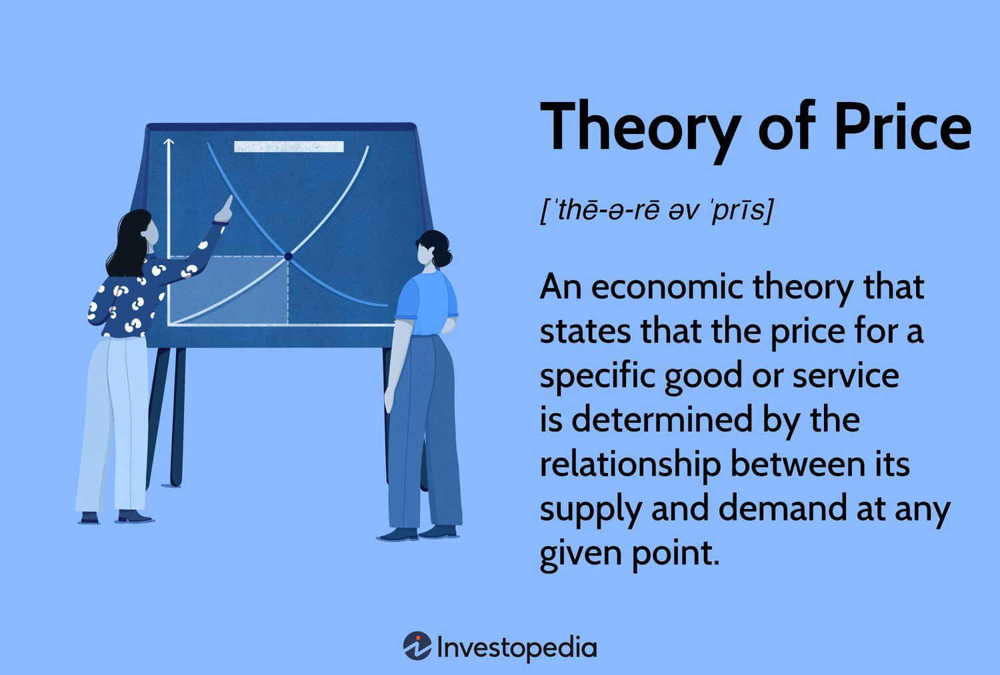

## Table of Contents

## What is the basic concept of price in economics?

In economics, price is the amount of money that people pay to buy goods or services. It's like a tag that tells you how much something costs. When you go to a store, you see prices on everything from apples to shoes. These prices help people decide what they can afford and what they want to buy. Businesses set prices based on how much it costs them to make the product and how much they think people will pay.

Prices also play a big role in the economy. They help balance what people want to buy and what businesses are willing to sell. If a lot of people want to buy something, the price might go up because it's in high demand. On the other hand, if not many people want to buy something, the price might go down to encourage more sales. This back-and-forth between buyers and sellers helps keep the economy moving and helps decide how resources are used.

## How does the law of supply and demand affect prices?

The law of supply and demand is like a seesaw that helps set prices. When lots of people want to buy something, but there isn't much of it available, the price goes up. This happens because everyone is trying to get their hands on the same thing, and sellers can charge more because people are willing to pay extra. Think of it like trying to buy a popular toy during the holidays; if the store only has a few left, the price might be higher than usual.

On the other hand, if there's a lot of something available but not many people want to buy it, the price goes down. Sellers lower the price to try and sell more of the item. It's like when stores have big sales to clear out old stock; they reduce the price so that people will be more likely to buy it. This balance between how much people want something and how much of it there is helps decide what prices should be.

## What are the different types of market structures and how do they influence pricing?

There are four main types of market structures: perfect competition, monopolistic competition, oligopoly, and monopoly. Each type affects how prices are set in different ways. In perfect competition, there are many small sellers selling the same thing, like farmers selling wheat. Because there are so many sellers, no one can set a high price because buyers can just go to someone else. This means prices are usually low and close to the cost of making the product. In monopolistic competition, like restaurants, there are many sellers but each one offers something a little different. They can set their prices a bit higher because they have unique products, but they still have to keep an eye on what others are charging.

In an oligopoly, a few big companies control the market, like in the car industry. These companies often watch each other closely and might set similar prices. If one company lowers its prices, others might do the same to keep up. This can lead to price wars, where prices go down a lot. But sometimes, these companies might agree to keep prices high, which is called collusion. A monopoly is when one company controls the whole market, like a local utility company. Because there's no competition, the company can set prices higher, and people have to pay them because they have no other choice. Each market structure shapes how prices are decided, from low and competitive to high and controlled.

## Can you explain the concept of equilibrium price?

Equilibrium price is like the perfect balance point in the market where what people want to buy matches what sellers want to sell. It's the price where everyone is happy: buyers are willing to pay it, and sellers are willing to sell at that price. When the market reaches this point, there's no pressure for the price to go up or down because the supply and demand are equal. Imagine a seesaw that's perfectly level; that's what the equilibrium price is like.

If the price is higher than the equilibrium price, there will be more of the product available than people want to buy. This is called a surplus. Sellers will have to lower their prices to get rid of the extra stuff, and the price will move back toward the equilibrium. On the other hand, if the price is lower than the equilibrium price, there won't be enough of the product to meet everyone's demand. This is called a shortage. Sellers can then raise their prices because people are willing to pay more to get the product, and the price will move back toward the equilibrium. The equilibrium price keeps the market balanced and helps decide how much things should cost.

## What is price elasticity of demand and how does it impact pricing strategies?

Price elasticity of demand is a fancy way to say how much people change what they buy when the price changes. If the price goes up a little and people stop buying a lot, that's called elastic demand. It's like when the price of a certain brand of cereal goes up, and people switch to a cheaper one. But if the price goes up and people keep buying the same amount, that's called inelastic demand. This happens with things like medicine; even if the price goes up, people still need it and will pay more.

Understanding price elasticity helps businesses decide how to set their prices. If a product has elastic demand, a business might be careful about raising prices because they could lose a lot of customers. They might even lower prices to sell more. On the other hand, if a product has inelastic demand, a business might raise prices because they know people will keep buying it anyway. This can help them make more money. So, knowing whether demand is elastic or inelastic is really important for figuring out the best pricing strategy.

## How do costs of production influence the pricing of goods and services?

The costs of making something play a big role in deciding its price. When a business makes a product, they have to think about all the money they spend, like paying workers, buying materials, and using machines. These costs are called the cost of production. If it costs a lot to make something, the business will usually set a higher price to make sure they don't lose money. For example, if it's expensive to make a fancy watch, the price of the watch will be high so the company can cover those costs and still make a profit.

But it's not just about covering costs. Businesses also look at what people are willing to pay and what their competitors are charging. If the cost of production goes up, like if the price of materials goes up, the business might have to raise the price of their product. But they have to be careful because if the new price is too high, people might not buy it. So, the cost of production is like a starting point for setting prices, but businesses also have to think about the market and their customers to make sure their prices make sense.

## What role do government policies play in determining prices?

Government policies can really affect how much things cost. One way they do this is by putting taxes on products. When the government adds a tax, like a sales tax or an excise tax, it makes the price go up because businesses have to pay that tax and usually pass it on to customers. For example, if there's a new tax on soda, the price of soda will go up. Governments might also set rules about how much businesses can charge for certain things, like rent or electricity. These rules, called price controls, can keep prices from getting too high, but they can also make it hard for businesses to make money.

Another way government policies influence prices is through subsidies. A subsidy is when the government gives money to businesses to help them make or sell something. This can lower the price for customers because the business doesn't have to charge as much to cover their costs. For example, if the government gives money to farmers, the price of food might go down. Governments can also affect prices by changing laws about how businesses can compete. If they make it easier for new companies to start, more competition can lead to lower prices. But if they let one company control everything, like in a monopoly, prices might go up because there's no one else to compete with.

## How do externalities affect market prices?

Externalities are things that happen because of making or using a product, but they affect people who aren't buying or selling it. They can make prices go up or down in ways that the market doesn't see. For example, if a factory makes a lot of pollution, it's bad for the air and the people nearby. The cost of this pollution isn't included in the price of the factory's products, so the price might be lower than it should be. This is called a negative externality. If the government makes the factory pay for the pollution, like with a tax, the price of the product will go up to cover that cost.

On the other hand, there are also positive externalities. These are good things that happen to other people because of making or using a product. For example, if someone gets a vaccine, it not only helps them but also helps stop the spread of disease to others. The price of the vaccine might not show how much it helps the whole community. If the government gives money to help more people get vaccines, it can lower the price and make it easier for everyone to get them. So, externalities can change how much things cost by adding costs or benefits that the market doesn't see at first.

## What is price discrimination and under what conditions can it be practiced?

Price discrimination is when a business charges different prices to different people for the same thing. It's like if a store sells a toy for one price to one person and a different price to another person. Businesses do this to make more money. They might charge more to people who are willing to pay more and less to people who might not buy it if the price is too high. This can help the business sell more and make more money overall.

To practice price discrimination, a business needs to meet a few conditions. First, they need to be able to tell different groups of customers apart. For example, they might know that students or seniors can pay less, so they offer them a lower price. Second, the business needs to be able to stop people from buying at the lower price and then selling it to others at a higher price. This is called resale prevention. If people could buy something cheap and then sell it to others for more money, the price discrimination wouldn't work. So, businesses have to make sure this doesn't happen.

## How do firms use pricing to signal quality or to create competitive barriers?

Firms often use high prices to signal that their product is of high quality. When people see something that costs a lot, they might think it's better than cheaper options. For example, a fancy restaurant might charge a lot for a meal to show that it uses the best ingredients and offers a special experience. By setting a high price, the firm tells customers that their product is worth the extra money. This can attract people who want the best and are willing to pay for it. But it can also keep some people away who think the price is too high, even if the product really is good.

Firms can also use pricing to create barriers that make it harder for other companies to compete. If a firm sets its prices really low, it might be trying to scare away new competitors. By selling at a low price, the firm can make it tough for new businesses to make money because they can't match those low prices without losing money themselves. This is called predatory pricing. On the other hand, if a firm sets its prices high and keeps them there, it might be trying to keep its image as a leader in the market. This can make it hard for new companies to come in because they have to charge high prices too, and people might not trust them as much as the established firm.

## What are the theories behind dynamic pricing and how are they applied in modern markets?

Dynamic pricing is when businesses change their prices based on what's happening right now. It's like how ride-sharing apps like Uber might charge more during busy times, or how airlines change ticket prices depending on how many seats are left and how close it is to the flight date. The main idea behind dynamic pricing is to make more money by charging more when people really want something and less when they don't. Businesses use computers and special math to figure out the best prices all the time. They look at things like how many people want to buy, what time it is, and even the weather to decide on the price.

In modern markets, dynamic pricing is used a lot because it helps businesses make the most money they can. For example, online stores like Amazon change their prices all the time based on what other stores are charging and how many people are looking at the product. This helps them stay competitive and sell more. Another place you see dynamic pricing is in hotels, where the price of a room can change based on how many people are booking and how close it is to the date you want to stay. By using dynamic pricing, businesses can react quickly to what's happening in the market and make sure they're always charging the best price.

## How do behavioral economics principles influence pricing and consumer perception of value?

Behavioral economics looks at how people really make choices, not just how they should make them. It says that people don't always think about prices in a clear way. Sometimes, people buy things because they feel good about them or because they see a sale and think it's a good deal, even if it's not the cheapest option. Businesses use this to their advantage by setting prices in ways that make people feel like they're getting a good deal. For example, they might show a "regular price" next to a "sale price" to make the sale price look really good, even if the regular price was never really charged. This makes people think they're saving money, so they're more likely to buy.

Another way behavioral economics affects pricing is through something called the anchoring effect. This is when people see a price and use it as a starting point to judge other prices. If a store shows a really high price first, then a lower price seems like a bargain, even if it's still pretty high. Businesses can use this to make their products look cheaper than they really are. They might also use something called loss aversion, where people hate losing something more than they like gaining something. So, if a business offers a "limited time" deal, people might buy it quickly because they're afraid of missing out. By understanding how people think and feel about prices, businesses can set prices that make their products seem more valuable and get more people to buy them.

## What is Understanding Price Theory?

Price theory is fundamentally anchored in the interactions between supply and demand, which are pivotal in determining market prices. In essence, price theory examines how the forces of supply and demand interact to set the market equilibrium, a state where the quantity supplied equals the quantity demanded, leading to a stabilization of prices. This equilibrium price is critical as it represents a point where market efficiency is achieved, assuming other conditions remain constant.

The concept of elasticity is central to price theory. Price elasticity of demand, for example, measures how the quantity demanded of a good responds to a change in its price. If a small change in price leads to a significant change in demand, the product is said to be elastic. Conversely, if the demand changes little with a substantial price change, it is inelastic. The formula for calculating the price elasticity of demand is:

$$

E_d = \frac{\%\ \text{change in quantity demanded}}{\%\ \text{change in price}} 
$$

This metric helps businesses and economists predict changes in consumer behavior in response to price shifts, thereby informing pricing strategies and decisions.

Market competition significantly influences price formation. In perfect competition, numerous buyers and sellers exist, each unable to influence prices, resulting in market-determined pricing. However, in monopolistic scenarios, a single seller dominates, allowing them to set higher prices due to lack of competition. Similarly, in an oligopoly, a few large firms exert considerable influence, potentially leading to collusion or price-setting behaviors that deviate from competitive equilibria.

Additionally, government policies, such as taxes, subsidies, and price controls, can alter prices may lead prices to deviate from their natural equilibrium. For example, a government might impose a price ceiling to make essential goods affordable, which can lead to shortages if the ceiling is below the equilibrium price.

In real-world market structures, such as monopolies and oligopolies, price theory is pivotal in developing pricing strategies. In a monopoly, since the firm is the sole producer, it can influence price based on its output levels. The monopolist maximizes profit where marginal cost equals marginal revenue, allowing control over both supply and prices. Meanwhile, in oligopolies, firms might engage in tacit or explicit collusion to influence prices, balancing between competition and collusion to optimize profits.

Understanding these dynamics is crucial for both practitioners and theorists, as it provides the foundational insights necessary to predict market behaviors and develop strategic economic interventions.

## What is the relationship between Economic Theory and Price Theory?

Economic theory is a fundamental framework that seeks to explain the functioning of economies by analyzing the behavior of individuals, institutions, and markets. At its core, economic theory is divided into microeconomics and macroeconomics. Price theory is an integral component of microeconomic theory, focusing on how prices are determined within individual markets through the interaction of supply and demand forces.

Price theory examines the mechanisms by which market equilibrium prices are established when the quantity supplied equals the quantity demanded. This equilibrium price is denoted mathematically as $P^*$, where:

$$
Q_s(P^*) = Q_d(P^*)
$$

Here, $Q_s$ is the quantity supplied, and $Q_d$ is the quantity demanded as a function of price $P$. The price elasticity of demand and supply influences how sensitive the quantity demanded or supplied is to changes in price, affecting the equilibrium outcome.

In addition to microeconomic factors, macroeconomic conditions significantly influence price theory. Inflation, a macroeconomic phenomenon characterized by the general increase in price levels, alters the purchasing power of money and can impact demand and supply decisions. Fiscal policies, including government spending and taxation, can shift supply and demand curves, thus affecting equilibrium prices. Monetary interventions by central banks, such as [interest rate](/wiki/interest-rate-trading-strategies) adjustments, have similar impacts by influencing the cost of borrowing and spending behaviors in the economy.

By understanding the relationship between economic theory and price theory, businesses and policymakers can make informed decisions that take into account both micro-level price determinants and macro-level economic conditions. This knowledge allows for the formulation of strategies that optimize economic outcomes, such as effective pricing strategies, resource allocation, and regulatory interventions designed to stabilize markets or stimulate economic growth.

## References & Further Reading

[1]: Friedman, M. (1976). ["Price Theory."](https://en.wikipedia.org/wiki/Price_Theory_(Milton_Friedman)) University of Chicago Press.

[2]: Marshall, A. (1920). ["Principles of Economics."](https://oll.libertyfund.org/titles/marshall-principles-of-economics-8th-ed) Macmillan and Co., Ltd.

[3]: Varian, H. R. (2014). ["Intermediate Microeconomics: A Modern Approach."](https://archive.org/details/intermediatemicr0000vari_z9edo2) W.W. Norton & Company.

[4]: Hull, J. C. (2017). ["Options, Futures, and Other Derivatives."](https://www.semanticscholar.org/paper/Options%2C-Futures%2C-and-Other-Derivatives-Hull/89bdee500c8623864fc9eb7a471546aa713acc44) Pearson.

[5]: López de Prado, M. (2018). ["Advances in Financial Machine Learning."](https://www.amazon.com/Advances-Financial-Machine-Learning-Marcos/dp/1119482089) Wiley.

[6]: Chan, E. (2009). ["Quantitative Trading: How to Build Your Own Algorithmic Trading Business."](https://github.com/ftvision/quant_trading_echan_book) Wiley.

[7]: Aronson, D. R. (2006). ["Evidence-Based Technical Analysis: Applying the Scientific Method and Statistical Inference to Trading Signals."](https://www.amazon.com/Evidence-Based-Technical-Analysis-Scientific-Statistical/dp/0470008741) Wiley.

[8]: Jansen, S. (2020). ["Machine Learning for Algorithmic Trading."](https://github.com/stefan-jansen/machine-learning-for-trading) Packt Publishing.