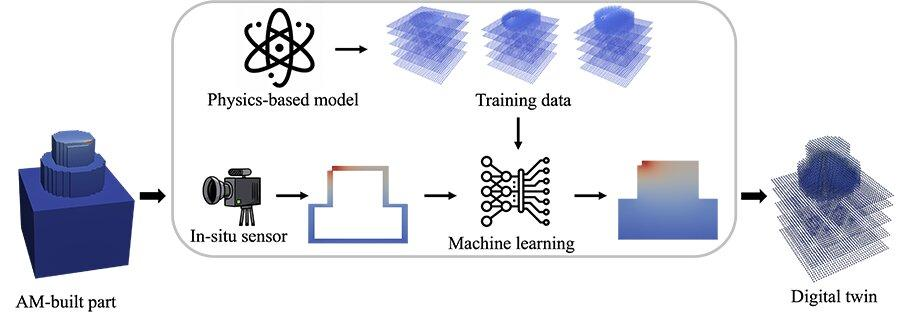

## Table of Contents

## What is thermal imaging and how does it differ from regular imaging?

Thermal imaging is a way to see heat. It uses special cameras that can detect the heat coming from objects, people, or animals. These cameras turn the heat into pictures where different colors show how hot or cold something is. This is really useful for things like finding people in the dark, checking if a house is losing heat, or seeing if a machine is overheating.

Regular imaging, on the other hand, uses light to make pictures. When you take a photo with a normal camera, it captures the light that bounces off objects. This light can come from the sun, a lamp, or a flash on the camera. The pictures you get show how things look in colors or black and white, but they don't show the heat of the objects. So, while regular imaging is great for seeing what things look like, thermal imaging is better for seeing how hot they are.

## Why are thermal image processing models important in machine learning?

Thermal image processing models are important in machine learning because they help computers understand and analyze heat patterns. When a computer can process thermal images, it can do things like spot people or animals in complete darkness, check if buildings are losing heat, or find out if machines are getting too hot. This is super helpful in places where you can't use regular cameras, like at night or in smoky areas. By using machine learning, these models can get better over time, making them more accurate and useful for different jobs.

Another reason these models are important is because they can be used in many different fields. For example, in medicine, doctors can use thermal imaging to see if a part of the body is inflamed or has a fever. In farming, farmers can check the health of their crops by looking at the heat they give off. And in security, thermal cameras can help find intruders or lost people. Machine learning helps these models learn from lots of thermal images, so they can tell the difference between normal and unusual heat patterns, making them really valuable tools.

## What are the basic components of a thermal image?

A thermal image is made up of different parts that help show heat. The main part of a thermal image is the temperature data. This data is shown as different colors or shades. Each color or shade stands for a certain range of temperatures. For example, blue might show cold areas, while red shows hot areas. This makes it easy to see where things are hot or cold.

Another important part of a thermal image is the resolution. Resolution tells us how detailed the image is. A high resolution means the image has more pixels, so you can see smaller differences in temperature. A low resolution means the image has fewer pixels, so the picture might be blurrier. The resolution depends on the camera used to take the thermal image. 

The last part is the scale or legend that comes with the thermal image. This scale helps you understand what the colors mean. It shows which colors stand for which temperatures. Without this scale, it would be hard to know if a certain color means something is very hot or just a little warm. Together, these parts make thermal images useful for seeing and understanding heat.

## How do thermal image processing models work?

Thermal image processing models in [machine learning](/wiki/machine-learning) work by taking the heat data from thermal images and turning it into something a computer can understand. When a thermal camera takes a picture, it captures the heat coming from objects and turns it into different colors or shades. The model looks at these colors and figures out what they mean. It does this by using math to find patterns in the heat data. For example, it might learn that a certain pattern of colors often means a person is in the picture, or that another pattern means a machine is overheating.

Once the model has learned to recognize these patterns, it can look at new thermal images and tell what's in them. This is done through a process called training, where the model is shown lots of thermal images with labels that say what's in them. The model uses these examples to get better at recognizing heat patterns. Over time, as it sees more images, it gets more accurate. This makes thermal image processing models very useful for jobs like finding people at night, checking if a building is losing heat, or seeing if a machine is working too hard and getting too hot.

## What is DeepIR and how does it contribute to thermal image processing?

DeepIR is a special kind of machine learning model that's really good at understanding thermal images. It uses something called [deep learning](/wiki/deep-learning), which is a way for computers to learn from lots of data and get better over time. DeepIR is made to work with the heat data from thermal images, helping it spot things like people, animals, or even problems in machines by looking at the heat patterns. It's trained on lots of thermal images, so it can tell the difference between normal and unusual heat patterns.

DeepIR makes thermal image processing easier and more accurate. By using deep learning, DeepIR can find small details in heat patterns that might be hard for people to see. This is really helpful in places where you need to find things quickly, like in search and rescue missions at night, or when checking if a building is losing heat. DeepIR's ability to learn from lots of thermal images means it can keep getting better at its job, making it a powerful tool for understanding and using thermal images.

## What are the common applications of thermal image processing models?

Thermal image processing models are used in many different areas to help see things that regular cameras can't. In security, these models help find people or animals in the dark or through smoke. They are really helpful for search and rescue teams who need to find lost people at night. In farming, thermal imaging can check the health of crops by looking at the heat they give off. This helps farmers know if their plants are getting too hot or too cold. In buildings, thermal image processing can find spots where heat is escaping, helping people save money on heating.

Another big use of thermal image processing is in medicine. Doctors use thermal cameras to see if parts of the body are too hot, which can show inflammation or fever. This can help them find health problems early. In industry, these models help check if machines are working too hard and getting too hot. This can stop machines from breaking down and save money on repairs. Overall, thermal image processing models make it easier to see and understand heat, which is useful in many different jobs.

## What challenges are faced when processing thermal images compared to visible light images?

Processing thermal images can be trickier than processing visible light images because thermal images show heat instead of light. With visible light images, we can easily see colors and details because they are based on how light reflects off objects. But with thermal images, the colors show how hot or cold something is, which can be harder to understand. Also, thermal cameras often have lower resolution than regular cameras, so the images might be blurrier. This means that thermal image processing models need to work harder to find small details and patterns in the heat data.

Another challenge is that thermal images can be affected by the environment. For example, the air temperature can change how heat shows up in the image. This can make it hard for the model to tell the difference between the heat coming from an object and the heat in the air around it. Also, thermal images can be affected by things like sunlight or other heat sources, which can make the heat patterns harder to read. Because of these challenges, thermal image processing models need to be trained on lots of different thermal images to learn how to handle these changes and still give accurate results.

## How can data augmentation techniques be applied specifically to thermal images?

Data augmentation is a way to make a model better by giving it more data to learn from. For thermal images, we can use different tricks to change the images a bit so the model can learn more from them. One way is to rotate or flip the images. This helps the model learn to recognize heat patterns no matter which way the image is turned. Another trick is to add noise to the images, which means making them a little blurry or adding small dots. This helps the model learn to work with images that aren't perfect, like ones taken in bad weather or from far away.

We can also change the brightness or contrast of the thermal images. This means making the colors a bit darker or lighter, or making the difference between hot and cold areas stronger or weaker. This helps the model learn to see heat patterns even if the images look a bit different. Another way is to zoom in or out of the images, which teaches the model to recognize heat patterns at different sizes. By using these [data augmentation](/wiki/data-augmentation) techniques, we can make the model smarter and better at understanding thermal images, even when they are not perfect.

## What are the key performance metrics used to evaluate thermal image processing models?

The main way to check how good a thermal image processing model is by looking at its accuracy. This means seeing how often the model gets things right when it looks at thermal images. For example, if the model is supposed to find people in the dark, accuracy tells us how many times it correctly spots a person. Another important measure is the model's precision and recall. Precision is about how many of the things the model says are true actually are true. Recall is about how many of the true things the model finds. A good model has high precision and high recall, which means it finds most of the true things and doesn't make many mistakes.

Another key metric is the F1 score, which is a way to combine precision and recall into one number. The F1 score is good because it gives us a single measure that shows how well the model balances finding true things and not making mistakes. The formula for the F1 score is $$F1 = 2 \times \frac{\text{precision} \times \text{recall}}{\text{precision} + \text{recall}}$$. Besides these, we also look at the model's speed, or how fast it can process thermal images. A fast model can be very useful in places like security where quick decisions are needed. Lastly, we check the model's robustness, which means how well it works with different kinds of thermal images, like ones taken in different weather or from different distances.

## How do advanced neural network architectures improve thermal image processing?

Advanced [neural network](/wiki/neural-network) architectures, like deep learning models, make thermal image processing much better. They can learn to find small details in heat patterns that might be hard for people to see. These models use layers of math to understand the heat data in thermal images. Each layer looks at different parts of the image, and together they help the model see the whole picture. For example, a model might use something called convolutional neural networks (CNNs), which are really good at finding patterns in images. By using these advanced architectures, the model can tell the difference between normal and unusual heat patterns more accurately.

These advanced models also get better over time as they see more thermal images. This is called training, and it helps the model learn from its mistakes. For example, if the model sees lots of thermal images of people, it can learn to spot people in new images even if they are in different places or the images are taken in different weather. This makes the model more useful for jobs like search and rescue at night or checking if a building is losing heat. The more data the model sees, the better it gets at understanding thermal images, making it a powerful tool for seeing heat patterns.

## What are the latest research trends in thermal image processing using machine learning?

The latest research in thermal image processing using machine learning focuses a lot on making models better at understanding heat patterns. One big trend is using deep learning models, like convolutional neural networks (CNNs), to find small details in thermal images that might be hard to see. These models are getting better at spotting things like people or animals in the dark, or finding problems in machines by looking at the heat they give off. Researchers are also working on making these models faster and more accurate, so they can be used in real-time situations like security or search and rescue missions. They use a lot of data to train these models, and they use tricks like data augmentation to make the models learn from different kinds of thermal images.

Another trend is combining thermal images with other kinds of images, like regular light images or even radar images. By putting these different images together, the models can understand more about what they are seeing. For example, a model might use both a thermal image and a regular image to spot a person more accurately. Researchers are also looking at ways to make thermal image processing models work better in different environments, like in bad weather or through smoke. They are using new techniques like transfer learning, where a model learns from one kind of image and then uses that knowledge to understand thermal images better. This helps the models get good results even when the images are not perfect.

## How can one implement a thermal image processing model using DeepIR?

To implement a thermal image processing model using DeepIR, you first need to gather a lot of thermal images to train the model. These images should have labels that tell the model what's in them, like people, animals, or machines. You can use data augmentation techniques to make the model better by changing the images a bit. For example, you can rotate, flip, or add noise to the images. This helps the model learn to recognize heat patterns in different situations. Once you have your data ready, you can start training the DeepIR model. This involves feeding the images into the model and letting it learn from them. The model uses deep learning to find patterns in the heat data, getting better over time as it sees more images.

After the model is trained, you can use it to process new thermal images. When a new thermal image comes in, the DeepIR model looks at the heat patterns and figures out what's in the image. For example, if the model is trained to find people, it will look for the heat patterns that it learned mean a person is there. The model's performance can be checked using metrics like accuracy, precision, recall, and the F1 score. The formula for the F1 score is $$F1 = 2 \times \frac{\text{precision} \times \text{recall}}{\text{precision} + \text{recall}}$$. This helps you see how well the model is doing at finding true things and not making mistakes. By using DeepIR, you can make thermal image processing easier and more accurate, which is really helpful in many different jobs.

## References & Further Reading

[1]: Buddharaju, K., & Pavlidis, I. T. (2010). ["Physiology-based face recognition in the thermal infrared spectrum."](https://ieeexplore.ieee.org/document/4107566) IEEE Transactions on Pattern Analysis and Machine Intelligence, 32(4), 651-662.

[2]: Sun, G., & Ruan, X. (2011). ["Motion detection in thermal video."](https://engineering.purdue.edu/NANOENERGY/publications.htm) Image and Vision Computing, 29(9), 631-642.

[3]: Čeh, M., & Perš, J. (2011). ["Development of methods for animal tracking and movement analysis from static camera-acquired images."](https://peerj.com/articles/479/) Journal of Visual Communication and Image Representation, 22(1), 44-60.

[4]: Ciuti, G., Bartoli, A., & Menciassi, A. (2017). ["Functional tissue imaging by infrared thermography as a support to minimally invasive medicine."](https://pmc.ncbi.nlm.nih.gov/articles/PMC7571214/) Medicinal Image Computing and Computer-Assisted Intervention, 12, 176-183.

[5]: Anderson, R. R., & Parrish, J. A. (1983). ["The optics of human skin."](https://pubmed.ncbi.nlm.nih.gov/7252245/) Journal of Investigative Dermatology, 77(1), 13-19.