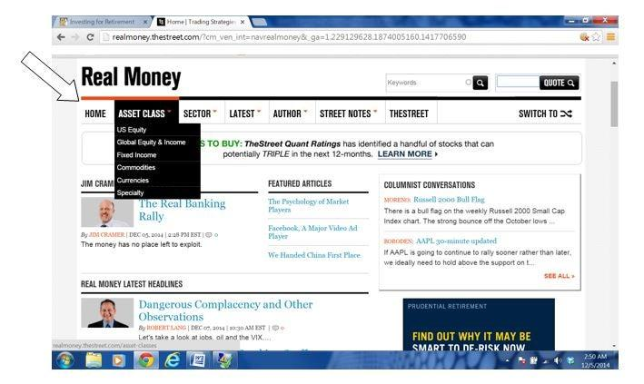

The evolution of trading has witnessed a profound transformation with the advent of algorithmic trading. This technological advancement has reshaped the landscape of financial markets, where trades are executed by sophisticated algorithms at speeds unmatchable by human traders. Algorithmic trading, which utilizes computer programs to execute trading strategies based on quantitative models, has introduced a level of precision and efficiency that is critical in today’s fast-paced market environment.

In this intricate financial ecosystem, platforms like TheStreet.com have emerged as indispensable resources for traders and investors keen on exploring algorithmic trading. As the complexity of financial markets intensifies, the demand for accurate, real-time information and expert insights has surged. TheStreet.com provides such information, helping traders navigate the complexities of algorithmic strategies and market dynamics.

The growing significance of algorithmic trading in contemporary financial markets cannot be understated. It accounts for a substantial proportion of trading volumes across major exchanges and has democratized access to robust trading strategies, making them accessible not only to institutional investors but also to retail traders. Given this landscape, the main purpose of this article is to examine the role of TheStreet.com in the realm of algorithmic trading, providing insights into how this platform can be leveraged to achieve improved trading outcomes.

Through exploring the relationship between TheStreet.com and algorithmic trading, traders and investors can gain a comprehensive understanding of how to harness the tools and insights available to optimize their trading strategies in this ever-evolving domain.

## Table of Contents

## Understanding Algorithmic Trading

Algorithmic trading refers to the use of computer algorithms to execute trades in financial markets. These algorithms, deriving from mathematical models, are designed to make trading decisions at speeds and frequencies beyond human capability. The basic mechanism involves pre-defined criteria set by the trader, such as timing, price, or quantity, and the algorithm executes trades when these criteria are met, often without human intervention.

The history of [algorithmic trading](/wiki/algorithmic-trading) dates back to the late 20th century with the introduction of electronic trading systems. Initially, it was predominantly used by large financial institutions due to the high cost of technology. In the 1990s, stock exchanges began adopting fully electronic platforms, paving the way for high-frequency trading ([HFT](/wiki/high-frequency-trading-strategies)), one of the most recognized forms of algorithmic trading. HFT exploits minute discrepancies in price across different exchanges, requiring formidable computational power and low-latency communication networks.

There are several advantages to using algorithmic trading. Firstly, algorithms substantially increase the speed of trade execution, making it possible to capitalize on fleeting trading opportunities. Secondly, they reduce human error and emotional bias, leading to more consistent and objective trading outcomes. Furthermore, algorithmic trading allows the simultaneous management of multiple market positions, diversifying risk and increasing efficiency.

Common strategies employed in algorithmic trading include high-frequency trading and [trend following](/wiki/trend-following). High-frequency trading focuses on executing a large number of orders at extremely fast speeds, leveraging the smallest price differences. Trend following, on the other hand, involves algorithms that identify and capitalize on market trends by analyzing historical price movements and technical indicators.

In recent years, algorithmic trading has become increasingly accessible to retail investors. Advances in technology have led to the proliferation of trading software and platforms that are affordable and user-friendly. Many brokerage firms now offer algorithmic trading tools and resources, enabling individual traders to implement automated strategies in a manner similar to large institutional investors.

This increased accessibility has democratized algo trading, allowing retail investors to partake in sophisticated trading strategies that were once the exclusive domain of professionals. This trend is augmented by the growing availability of educational resources and community-driven platforms that help traders of all skill levels enhance their understanding and application of algorithmic trading techniques.

## TheStreet.com's Role in Finance

TheStreet.com, established in 1996 by CNBC's Jim Cramer and Marty Peretz, has developed into a leading financial news and analysis company, providing essential insights and information for investors and traders. Recognized for its deep coverage of financial markets, TheStreet.com serves as a pivotal resource offering timely news, analysis, and market data that help individuals and institutions make informed investment decisions. 

The platform offers a wide array of resources and tools designed to cater to the diverse needs of traders and investors. A major component of TheStreet.com is its in-depth articles and reports that cover stocks, mutual funds, ETFs, options, and cryptocurrencies. These resources are complemented by a suite of analytical tools and data visualization techniques that give users a comprehensive understanding of market trends and investment opportunities. Additionally, TheStreet.com provides a stock screener, which lets investors filter stocks based on various criteria, making it easier to identify potential investment opportunities.

TheStreet.com is designed to serve both retail and institutional investors. For retail investors, it offers a wealth of educational content, including how-to guides, investment primers, and expert commentary, enabling them to build a robust investment strategy. Institutional investors, on the other hand, can benefit from more advanced tools and in-depth market analysis that TheStreet.com provides, which help in making strategic decisions across large portfolios. This extensive coverage ensures that a wide range of investor needs are met, regardless of their level of expertise or investment size.

One of the key strengths of TheStreet.com is its market analysis and expert commentary. The platform employs seasoned financial analysts and writers who produce insightful content that deciphers complex market movements and economic indicators. This expert analysis is crucial in helping investors understand the implications of policy decisions, corporate earnings, and geopolitical events on their portfolios. By offering a combination of real-time news updates and comprehensive analysis, TheStreet.com acts as a crucial partner for traders aiming to make informed decisions and capitalize on market opportunities. This insightful commentary not only simplifies the complexity of the financial markets but also provides the necessary context for making strategic trading decisions.

In summary, TheStreet.com has established itself as a trusted resource in the financial world. Its comprehensive suite of tools, detailed market analysis, and expert commentary provide invaluable support to both retail and institutional investors, aiding them in navigating the complexities of modern financial markets and enhancing their trading outcomes.

## How TheStreet.com Supports Algorithmic Traders

TheStreet.com stands out as a valuable resource for algorithmic traders, offering various tools, reviews, and educational content that cater to both novice and experienced traders. One of the primary resources available on TheStreet.com is comprehensive software reviews. These reviews provide traders with in-depth analyses of various algorithmic trading platforms and tools, which are crucial for selecting the right software to match their trading strategies. By assessing factors such as interface usability, feature sets, and integration capabilities, these reviews help traders make informed decisions about their trading setups.

Aside from software reviews, TheStreet.com offers numerous case studies and success stories of traders who have successfully integrated algorithmic trading strategies using insights gained from the platform. These real-world examples not only inspire confidence in algorithmic trading newcomers but also offer seasoned traders new strategies and methodologies to consider. The case studies highlight the practical application of algorithmic trading concepts, showcasing the effectiveness of different platforms and strategies in varied market conditions.

Educational content is another cornerstone of TheStreet.com's offerings for algorithmic traders. The platform provides an array of tutorials and articles that break down complex algorithmic trading concepts into digestible information. These educational materials cater to all skill levels, offering foundational knowledge for beginners while also delivering advanced insights for more experienced traders. Topics covered can range from basic algorithm design and implementation to advanced trend analysis and market prediction techniques. By consistently updating their content, TheStreet.com ensures that traders have access to the latest developments in algorithmic trading.

Through these resources, TheStreet.com not only supports the growth and learning of algorithmic traders but also helps them navigate the challenges associated with algorithmic trading. By crafting a well-rounded educational and analytical ecosystem, TheStreet.com solidifies its position as a critical ally for traders looking to leverage algorithmic strategies effectively.

## Insights and Analysis from TheStreet.com

TheStreet.com is renowned for providing high-quality market insights delivered by a team of seasoned financial experts. These insights are indispensable for traders, particularly those engaged in algorithmic trading, where split-second decisions can significantly impact profitability. The platform's real-time news and updates serve as a crucial resource for algorithmic traders. By integrating timely information, algorithms can react promptly to events such as economic announcements or corporate earnings reports, thus optimizing trading strategies and execution.

TheStreet.com’s analysis is a powerful tool for traders aiming to identify new trading opportunities. The financial experts on the platform offer in-depth commentary and analysis, highlighting trends and market movements that might go unnoticed in the vast sea of data available to traders. This analysis aids traders in adjusting their algorithms to capitalize on emerging market conditions, ensuring strategies remain relevant and profitable.

Moreover, exclusive reports and expert commentary distinguish TheStreet.com in the competitive landscape of financial analysis. These reports frequently offer unique perspectives that go beyond standard market updates, providing critical insights that can enhance a trader's competitive edge. The platform's ability to distill complex financial information into actionable insights is a key reason why traders rely on TheStreet.com for nuanced financial analysis.

Overall, TheStreet.com serves as a pivotal platform for algorithmic traders, offering the real-time information and expert analysis necessary to make informed trading decisions and seize new market opportunities.

## Challenges and Considerations in Algo Trading

Algorithmic trading, despite its numerous advantages, presents several challenges that traders must navigate. One primary concern is technological issues, which can arise from system bugs, software glitches, or hardware malfunctions. Such problems can result in incorrect trades or delayed executions, potentially causing significant financial losses. Additionally, market [volatility](/wiki/volatility-trading-strategies) poses another challenge, as rapid price movements can lead to a breakdown in an algorithm's predictive capabilities. This is particularly relevant during economic announcements or geopolitical events, where unexpected market behavior can induce slippage or excessive trading costs.

Understanding the limitations of algorithms is crucial for successful trading. Algorithms are typically based on historical data and statistical models. However, they may not always accommodate unforeseen circumstances or black swan events that lie outside the normal distribution of market behavior. Consequently, [backtesting](/wiki/backtesting) becomes an essential practice for traders. By simulating an algorithm's performance on historical data, traders can evaluate its viability and adjust parameters to optimize outcomes. Yet, backtesting cannot guarantee success, as market conditions are inherently dynamic.

The fast-paced nature of algorithmic trading necessitates continuous learning and adaptation. Traders must remain vigilant and proactive in updating their models and strategies to align with evolving market conditions. This is where platforms like TheStreet.com provide significant value. By offering comprehensive financial news, expert commentary, and educational content, TheStreet.com equips traders with the necessary information to anticipate and adapt to market changes. It helps them stay abreast of technological advancements and algorithmic trading trends, thereby mitigating some of the risks associated with the volatility and unpredictability of financial markets. 

Thus, the integration of continuous education with access to reliable resources is pivotal in navigating the complexities of algorithmic trading, ensuring traders remain informed and prepared to tackle potential pitfalls head-on.

## Conclusion

TheStreet.com has established itself as an invaluable resource in the framework of algorithmic trading. This article has explored the intertwined nature of algorithmic methods and the insights provided by TheStreet.com, highlighting the significant benefits for traders and investors. TheStreet.com offers comprehensive market analysis, expert commentary, and cutting-edge tools, supporting the decision-making processes inherent in algorithmic trading. By leveraging TheStreet.com's resources, traders can keep abreast of real-time market changes and capitalize on emerging trading opportunities, thereby enhancing their trading performance.

The continuous evolution of algorithmic strategies demands that traders maintain an up-to-date understanding of market dynamics and platform advancements. TheStreet.com aids this process by offering educational content and tutorials tailored to both novice and experienced traders. This ensures that users are not only informed about current trends but also empowered to adapt swiftly in response to market developments.

In conclusion, utilizing TheStreet.com as a foundational resource for algorithmic trading allows investors to gain an edge in the competitive world of finance. The ongoing evolution in algorithmic trading underscores the necessity of staying informed, and TheStreet.com stands as a trusted ally, equipping traders with the tools and insights they need to thrive.

## References & Further Reading

[1]: Bergstra, J., Bardenet, R., Bengio, Y., & Kégl, B. (2011). ["Algorithms for Hyper-Parameter Optimization."](https://papers.nips.cc/paper/4443-algorithms-for-hyper-parameter-optimization) Advances in Neural Information Processing Systems 24.

[2]: ["Advances in Financial Machine Learning"](https://www.amazon.com/Advances-Financial-Machine-Learning-Marcos/dp/1119482089) by Marcos Lopez de Prado

[3]: ["Evidence-Based Technical Analysis: Applying the Scientific Method and Statistical Inference to Trading Signals"](https://www.amazon.com/Evidence-Based-Technical-Analysis-Scientific-Statistical/dp/0470008741) by David Aronson

[4]: ["Machine Learning for Algorithmic Trading"](https://github.com/stefan-jansen/machine-learning-for-trading) by Stefan Jansen

[5]: ["Quantitative Trading: How to Build Your Own Algorithmic Trading Business"](https://books.google.com/books/about/Quantitative_Trading.html?id=j70yEAAAQBAJ) by Ernest P. Chan