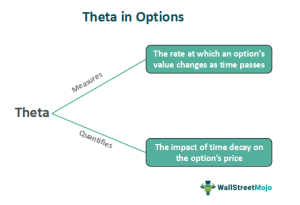

In the complex world of finance, derivatives and options trading play pivotal roles in shaping investment strategies. Financial derivatives, such as options, are critical tools that investors and institutions use to manage risk, speculate on future price movements, or enhance portfolio yields. This article explores the intricate relationship between financial derivatives, options trading, and algorithmic trading, with a particular focus on Theta.

Theta, a fundamental Greek in the options market, quantifies the sensitivity of option prices to the passage of time—commonly referred to as time decay. This temporal sensitivity is especially crucial in options trading since the value of an option diminishes as its expiration date approaches. Understanding Theta is essential for traders because it provides insight into how the time component affects an option’s value, separate from changes in the underlying asset's price.



Algorithmic trading strategies frequently incorporate Theta to optimize trading performance and manage risks. These strategies rely on advanced computational models to analyze complex financial data and execute trades at speeds and frequencies beyond human capability. By integrating Theta into algorithmic models, traders can better anticipate the impact of time decay, adjust their positions dynamically, and enhance their portfolio's performance.

Grasping these concepts is crucial for traders seeking to leverage algorithmic tools for financial success. Equipped with a thorough understanding of financial derivatives and the role of Theta in options trading, traders can make more informed decisions and potentially achieve better returns in a highly competitive market.

## Table of Contents

## Understanding Financial Derivatives and Options

Financial derivatives are sophisticated financial instruments whose value is contingent upon the value of underlying assets such as stocks, bonds, commodities, currencies, interest rates, or market indices. These contracts enable market participants to hedge risks, speculate on future price movements, or access specific asset classes or markets without directly owning the underlying asset.

Among the various types of financial derivatives, options are notable for their unique characteristics. An option grants the buyer the right, but not the obligation, to buy or sell an underlying asset at a predetermined price, known as the strike price, on or before a specified expiration date. There are two primary types of options: call options, which provide the right to purchase the asset, and put options, which confer the right to sell. This conditional privilege creates a flexibility that is valuable in diverse trading scenarios, allowing traders to take advantage of market movements and mitigate potential losses.

Options trading is inherently complex, influenced by a multitude of factors that affect option pricing. Key amongst these factors are market [volatility](/wiki/volatility-trading-strategies) and the passage of time, often referred to as time decay. Volatility influences the premium paid for an option; higher volatility levels typically lead to higher premiums due to the increased probability of favorable movements in the underlying asset's price. Conversely, time decay, or Theta, reflects the reduction in the option's value as the expiration date nears, due to the decreasing time available for the underlying asset to move in a favorable direction.

The Greeks are a set of metrics that facilitate a deeper understanding and management of the variables affecting options pricing. These include Delta, which measures the sensitivity of an option's price to changes in the price of the underlying asset; Gamma, which indicates the rate of change of Delta; Vega, which quantifies sensitivity to volatility changes; and Theta, which represents time decay. For instance, the mathematical representation of Delta is expressed as:

$$
\Delta = \frac{\partial V}{\partial S}
$$

where $V$ is the option's price and $S$ is the underlying asset's price.

These metrics allow traders to assess risks associated with individual options and portfolios, devising strategies that align with their investment objectives and market outlook. As a result, understanding the intricacies of financial derivatives and options, along with the implications of the Greeks, is essential for effective options trading and risk management.

## Theta: The Time Decay Factor

Theta is a significant Greek parameter in options trading that quantifies the sensitivity of an option's price to the passage of time. It is often referred to as the "time decay" [factor](/wiki/factor-investing) because it represents the rate at which the option's value decreases as it approaches its expiration date. Mathematically, Theta is defined as:

$$
\Theta = \frac{\partial V}{\partial t}
$$

where $V$ is the option's price and $t$ is time. A negative Theta indicates a loss in the option's value over time, a characteristic feature of long option positions such as long calls and puts.

As options approach expiration, the effect of Theta often intensifies, particularly for at-the-money (ATM) options. This characteristic is due to the increased certainty surrounding the option's payoff—the time decay accelerates as there is less time for market movements to alter the intrinsic value. For option buyers, this poses a challenge as any delay in favorable market movements adversely impacts the option's intrinsic value. Conversely, option sellers can benefit from this time decay, as eroding value implies they can retain more of the premium originally received.

Understanding Theta's impact is vital for formulating effective options strategies. Traders crafting options portfolios need to consider the erosion of time value to mitigate potential losses and capitalize on time decay dynamics. In practice, options with high Theta will typically show significant value loss with each passing day, which makes them less appealing for holding long-term without a decisive market movement. For sellers, this can be an opportunity to earn income through strategies such as writing covered calls or selling naked puts, thereby leveraging the natural decay of options' time value to their advantage.

## Algorithmic Trading and the Role of Theta

Algorithmic trading is the use of computer algorithms to automate trading strategies, improving decision-making and precision in executing trades. One key component in algorithmic strategies is the integration of the Greeks, particularly Theta, which refers to the sensitivity of an option's price to the passage of time. As options approach their expiration, their value decreases, and Theta quantifies this rate of decline, known as time decay. This integration allows for real-time strategy adjustments based on current market conditions.

Theta plays a significant role in managing the timing of trades and optimizing a portfolio’s time decay profile within algorithmic strategies. By incorporating Theta into algorithms, traders can execute trades with enhanced precision, aligning their actions according to the market’s temporal dynamics. The algorithms can model the effects of time decay, allowing traders to better anticipate changes in the value of options as they near expiration.

Using algorithms, traders can simulate the impacts of time decay, adjusting positions to minimize risks and maximize potential returns. For example, an algorithm can automatically assess an option's Theta and decide whether to hold or liquidate the position, taking into account the remaining time to expiration and the expected rate of time decay. This enhances risk management, as traders can reduce exposure to the adverse effects of time decay.

Furthermore, algorithms equipped with data analytics and [machine learning](/wiki/machine-learning) capabilities can continuously refine trading strategies to adapt to changing market conditions. By leveraging Theta, algorithms can optimize the timing of trades and manage portfolio exposure more effectively. This continuous improvement can yield better returns as the system becomes more proficient at anticipating the market's time-dependent behavior.

Incorporating Theta into [algorithmic trading](/wiki/algorithmic-trading) not only improves the precision and timing of trades but also enhances overall risk management by systematically analyzing and adjusting for time decay, thereby supporting traders in optimizing their performance in the options market.

## Risk Management with Theta in Algo Trading

Theta is a crucial component in risk management within algorithmic trading, especially when structuring options portfolios to effectively utilize time decay. In options trading, Theta quantifies how the price of an option decreases as it approaches its expiration, assuming all other factors remain constant. This attribute can be leveraged by automated trading systems to maintain an optimal risk profile and improve portfolio performance.

Algorithmic solutions play a significant role in managing Theta risk by automating the execution of buy and sell orders to sustain a predefined risk exposure. By programmatically adjusting portfolio positions, algorithms respond to fluctuations in Theta, ensuring that the potential negative impacts of time decay are mitigated while enhancing positive outcomes. For instance, an algorithm might be set up to increase the number of short positions as Theta increases, thereby benefiting from the accelerated decay of option premiums closer to expiration. This automated adjustment ensures that traders can consistently exploit the time value erosion without manual intervention.

Furthermore, the strategic utilization of Theta's value erosion is particularly advantageous when selling options, as it allows traders to capitalize on the premium decay over time. Selling options, especially when they are close to being at-the-money, provides an opportunity to generate returns from Theta decay. Automated trading systems can execute these strategies effectively by continuously evaluating market conditions and making informed decisions that align with the trader's objectives.

To illustrate how Theta can be managed algorithmically, consider a Python pseudo-code for dynamic portfolio adjustment:

```python
class ThetaRiskManager:
    def __init__(self, options_portfolio):
        self.portfolio = options_portfolio

    def assess_theta(self):
        total_theta = sum(option.theta_value() for option in self.portfolio)
        return total_theta

    def adjust_positions(self):
        current_theta = self.assess_theta()
        if current_theta > desired_theta_threshold:
            # Increase short positions to take advantage of time decay
            self.execute_sell_orders()
        elif current_theta < desired_theta_threshold:
            # Reduce short positions to decrease exposure to time decay
            self.execute_buy_orders()

    def execute_sell_orders(self):
        # Implement logic to sell options
        pass

    def execute_buy_orders(self):
        # Implement logic to buy options
        pass
```

In this pseudo-code, the `ThetaRiskManager` class assesses the current Theta in the portfolio and adjusts positions based on a desired Theta threshold. Such strategies, facilitated by algorithmic trading systems, effectively harness Theta to align with market dynamics, thereby promoting consistent performance.

Automated systems are adept at continuously evaluating the market environment, ensuring that strategies are adjusted in real-time to capitalize on favorable opportunities and mitigate risks associated with Theta decay. By doing so, traders can maintain sustained performance, optimizing returns while managing the inherent risks of options trading.

## Performance Optimization through Algorithmic Trading

Incorporating Theta into algorithmic trading strategies enhances traders' ability to optimize performance and manage the inherent complexities of options trading. This involves programming algorithms to adjust for time decay, a central aspect of options pricing that directly impacts returns. By aligning trades with market conditions, traders can effectively harness Theta to improve financial outcomes.

Leveraging Theta allows traders to achieve higher precision in timing trades and managing portfolio exposure to time decay. Algorithms can be designed to monitor Theta values continuously, adjusting trading positions in response to changes in market dynamics. This proactive management helps mitigate risks associated with time decay and enhances the potential for profitable trades.

A practical application involves using data analytics and machine learning to continually refine algorithmic strategies. These technologies enable traders to analyze vast amounts of data, identifying patterns and trends that can predict market behaviors. For instance, machine learning models can simulate various scenarios of time decay, providing insights that inform decision-making processes. Here is a simplified example of how Python could be used to simulate time decay impacts using Theta:

```python
import numpy as np

# Define options pricing function incorporating Theta
def option_price_with_theta(S, K, T, r, theta):
    # Assume Black-Scholes model inputs without volatility for simplicity
    discounted_strike = K * np.exp(-r * T)
    intrinsic_value = max(0, S - discounted_strike)
    return intrinsic_value * np.exp(-theta * T)

# Parameters
spot_price = 100  # Current price of the underlying asset
strike_price = 100 # Option strike price
time_to_expiration = np.linspace(1, 0, 100)  # Simulating over time
risk_free_rate = 0.05
theta_value = 0.1

# Calculate option prices over time
option_prices = [option_price_with_theta(spot_price, strike_price, t, risk_free_rate, theta_value) for t in time_to_expiration]

# Output results
print(option_prices)
```

This Python snippet calculates an option's price over time, illustrating the impact of Theta on value decay. By integrating such computational techniques within trading algorithms, traders can optimize their strategies for maximum yield. The iterative process of refinement is enhanced by adaptive algorithms that evolve based on new data inputs, thereby improving precision and timing of trades.

Harnessing these tools enables traders to transform Theta from a challenge into an advantage, facilitating more informed and strategic investment decisions. The continuous improvement loop facilitated by machine learning ensures that algorithms remain aligned with shifting market conditions, which is essential for sustaining high performance in dynamic financial environments.

## Conclusion

The integration of Theta into algorithmic trading offers significant advantages within the options market. Theta, measuring the sensitivity of option prices to time decay, serves as a crucial metric for traders aiming to optimize their strategies. A comprehensive understanding of Theta, coupled with other Greeks, empowers traders to manage risks more effectively and enhance portfolio performance. Algorithmic trading, leveraging computer algorithms, provides a sophisticated approach to addressing the complexities associated with time decay in options pricing.

By incorporating Theta in their algorithms, traders can execute trades with higher precision, adjusting positions dynamically in response to time decay impacts. This integration allows for the continuous assessment and adjustment of trading strategies, aligned with prevailing market conditions to optimize returns. Furthermore, by utilizing these advanced algorithmic tools and strategies, traders can capitalize on their enhanced capability to make informed investment decisions, ultimately improving trading performance and achieving better financial outcomes.

## References & Further Reading

Hull, J. C. (2018). *Options, Futures, and Other Derivatives*. This comprehensive text is widely regarded as a cornerstone for understanding derivatives markets, providing extensive coverage on the mechanics of trading, valuation, and the strategic use of derivatives like options. Hull meticulously explains topics such as the pricing of derivatives, risk management, and market strategies, making it an essential resource for both students and practitioners in finance.

Natenberg, S. (1994). *Option Volatility and Pricing: Advanced Trading Strategies and Techniques*. Natenberg's work offers an in-depth examination of the critical role of volatility in options pricing, shedding light on complex strategies that traders employ. This book serves as an invaluable tool for understanding volatility, its measurement, and its impact on the pricing and hedging of options. It is particularly useful for those seeking advanced strategies for volatility trading.

Wilmott, P. (2006). *Paul Wilmott on Quantitative Finance*. Wilmott's book provides a detailed exploration of quantitative finance, covering topics such as derivatives, financial modeling, and risk management. Known for its user-friendly approach, this resource offers insights into the mathematical models that underpin financial theory and practice, making sophisticated concepts accessible to readers with varying levels of mathematical proficiency.

Armstrong, M. A., & Carter, D. A. (2020). *Algorithmic and High-Frequency Trading*. This resource addresses the growing importance of algorithmic and high-frequency trading in modern financial markets. Armstrong and Carter explore the development and implementation of trading algorithms, emphasizing their role in market efficiency and [liquidity](/wiki/liquidity-risk-premium). The book also discusses regulatory challenges and the technological advancements driving these trading strategies.

These references provide a comprehensive overview of derivatives, options trading, and the use of Greeks in trading strategies, offering valuable insights for both novice and seasoned traders. Whether focusing on the foundational elements of derivative markets or the cutting-edge techniques of algorithmic trading, these texts serve as essential guides for understanding the complexities and opportunities within the financial trading landscape.