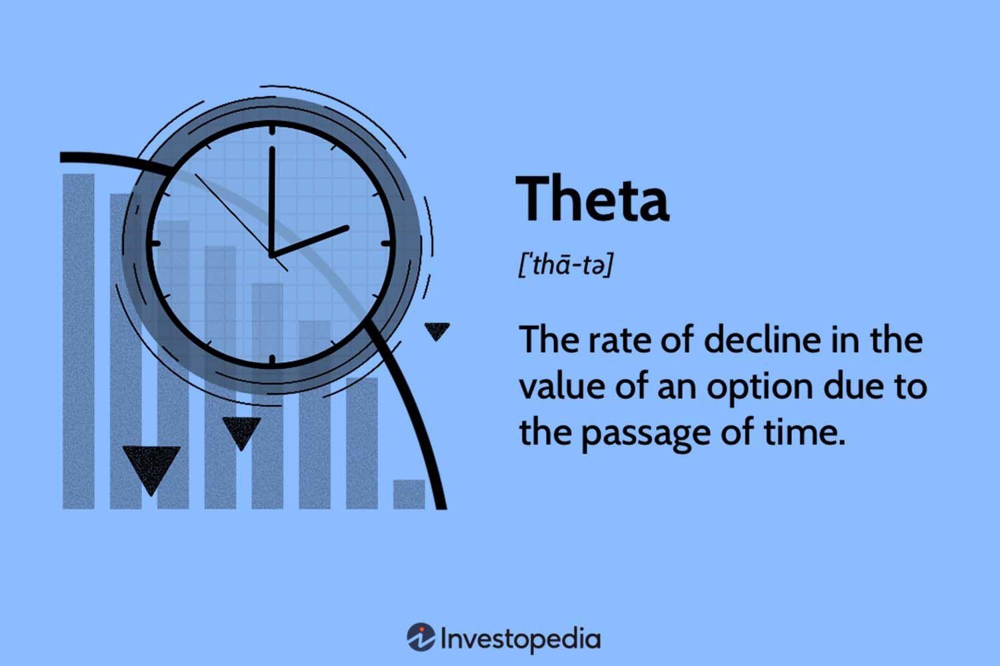

## Table of Contents

## What is theta in the context of options trading?

In options trading, theta is a measure of how much an option's price is expected to decrease as time passes. It is one of the "Greeks," which are used to understand different factors that affect the price of an option. Theta is often referred to as the "time decay" of an option because it represents the rate at which the option loses value as it gets closer to its expiration date.

For example, if an option has a theta of -0.05, it means that the option's price is expected to drop by 5 cents each day, assuming all other factors remain constant. This is important for traders to consider because options are wasting assets, meaning they lose value over time if the stock price doesn't move in the desired direction. Traders who buy options need to be aware of theta because it can erode the value of their positions, while those who sell options can benefit from the time decay as they collect the premium.

## How does theta affect the price of an option?

Theta affects the price of an option by showing how much the option's value goes down each day as time passes. Imagine you have an option that costs $1 today. If the theta is -0.05, that means the option will lose 5 cents of its value every day, so tomorrow it might be worth only 95 cents if nothing else changes. This is called time decay, and it happens because options have an expiration date. The closer the option gets to expiring, the less time there is for the stock to move in a way that makes the option profitable, so the option becomes less valuable.

For people who buy options, theta is something to watch out for because it can eat away at the value of their investment. If the stock doesn't move in the right direction quickly enough, the option could lose value just from the passage of time. On the other hand, people who sell options can benefit from theta. When they sell an option, they get the premium upfront, and as time goes by, the option they sold loses value due to theta, which works in their favor. So, understanding theta helps traders make better decisions about when to buy or sell options.

## What is the relationship between theta and time to expiration?

Theta and time to expiration are closely related because theta measures how much an option's value decreases as time passes. The closer an option gets to its expiration date, the faster its value drops. This is because there's less time left for the stock to move in a way that makes the option profitable. So, theta gets bigger as the expiration date gets closer. If you have an option that expires in a month, its theta might be small because there's still a lot of time left. But if that same option is about to expire in a week, its theta will be much larger because time is running out.

This relationship is important for anyone trading options to understand. If you buy an option, you need to be aware that its value will go down every day because of theta, especially as the expiration date approaches. This means you need the stock to move in your favor quickly. On the other hand, if you sell an option, you can benefit from theta because the option you sold will lose value over time, which is good for you. So, knowing how theta changes with time to expiration helps traders make smarter choices about when to buy or sell options.

## How can theta be used to assess the risk of an options position?

Theta can help you understand the risk of an options position by showing how much the option's value will go down each day as time passes. If you have an option with a high theta, it means the option will lose value quickly. This is risky if you are buying the option because you need the stock to move in your favor fast before the option loses too much value. On the other hand, if you are selling the option, a high theta is good for you because the option you sold will lose value over time, which means you can keep more of the premium you received.

Understanding theta also helps you see how the risk changes as the option gets closer to expiring. When an option has a lot of time left before it expires, its theta is usually small, so the risk of losing value due to time passing is lower. But as the expiration date gets closer, theta gets bigger, and the risk of the option losing value quickly goes up. This means you need to keep an eye on theta and adjust your strategy as the expiration date approaches to manage the risk of your options position effectively.

## What are the differences in theta values between in-the-money, at-the-money, and out-of-the-money options?

Theta values are different for in-the-money, at-the-money, and out-of-the-money options. At-the-money options usually have the highest theta because they are the most sensitive to time decay. This means if you have an option that is right at the current stock price, its value will drop the fastest as time goes by. In-the-money options, which are options where exercising them would be profitable right now, have a lower theta than at-the-money options. They still lose value over time, but not as quickly because they already have some intrinsic value.

Out-of-the-money options, which are options where exercising them would not be profitable right now, have the lowest theta. These options are mostly made up of time value, and since they don't have any intrinsic value, their theta is smaller. As time goes by, out-of-the-money options lose value more slowly than in-the-money or at-the-money options. Understanding these differences helps traders know how fast their options might lose value and plan their strategies accordingly.

## How does theta interact with other Greeks like delta and gamma?

Theta works together with other Greeks like delta and gamma to help you understand how an option's price changes. Delta tells you how much the option's price will change if the stock price moves. If you have a call option with a delta of 0.5, it means the option's price will go up by 50 cents for every dollar the stock price goes up. Theta, on the other hand, tells you how much the option's price will go down each day as time passes. So, while delta focuses on the stock price movement, theta focuses on time decay.

Gamma is another Greek that shows how delta changes when the stock price moves. If you have a high gamma, it means your option's delta will change a lot if the stock price moves even a little. This can make your option more sensitive to the stock price. Theta and gamma can work together because as time goes by (theta), the gamma of an option can change, making the option more or less sensitive to stock price movements. Understanding how theta, delta, and gamma interact helps you see the full picture of how an option's price might change over time and with stock price movements.

## Can theta be positive, and under what circumstances?

Theta is usually a negative number because options lose value as time goes by. This is called time decay. But theta can be positive in some special cases. For example, if you have a deep in-the-money option that is very close to expiring, theta might be positive. This happens because the option's value can actually go up a little bit as it gets closer to expiring, especially if there's a chance it will be exercised.

Positive theta is not common and it's more of an exception. It usually happens with options that are far in-the-money and close to expiration. Traders need to understand these special cases because they can affect how they manage their options positions. Knowing when theta might be positive helps traders make better decisions and manage their risks more effectively.

## What strategies can traders use to take advantage of theta decay?

Traders can use the strategy of selling options to take advantage of theta decay. When you sell an option, you get money upfront called a premium. As time goes by, the option you sold loses value because of theta. This works in your favor because you want the option to be worth less when it expires. Selling options like covered calls or cash-secured puts are popular ways to do this. With a covered call, you own the stock and sell a call option on it. With a cash-secured put, you have enough money to buy the stock if the put option is exercised. Both strategies let you earn money from the premium while theta decay helps the option lose value over time.

Another strategy is to use calendar spreads, where you sell a short-term option and buy a longer-term option on the same stock at the same strike price. The short-term option you sell will lose value faster because of theta, while the longer-term option you buy will lose value more slowly. This difference can make you money if the stock price stays the same or doesn't move too much. Traders need to watch the stock price and be ready to adjust their positions because changes in the stock price can affect how well this strategy works.

## How does implied volatility impact theta?

Implied volatility is how much the market thinks a stock will move in the future. It affects theta because when implied volatility is high, options are more expensive. This means they have more time value, and theta, which is the rate of time decay, will be higher too. If you have an option with high implied volatility, it will lose value faster as time goes by because it started with a higher price. So, if you're selling options, high implied volatility can be good because you get a bigger premium, and theta helps the option lose value quickly.

On the other hand, when implied volatility is low, options are cheaper because they have less time value. This means theta will be lower too. If you have an option with low implied volatility, it will lose value more slowly as time goes by. This is important for traders to know because it affects how they manage their options positions. If you're buying options, you might prefer low implied volatility because the option will lose value more slowly, giving you more time for the stock to move in your favor.

## What are the best practices for managing theta in a portfolio?

Managing theta in a portfolio means keeping an eye on how time affects your options. If you have options that lose value quickly because of theta, you need to think about what to do. One good way is to sell options instead of buying them. When you sell options, you get money upfront, and as time goes by, the options you sold lose value. This can help you make money from the time decay. Another way is to use strategies like covered calls or cash-secured puts, where you sell options on stocks you already own or have money set aside to buy. These strategies can help you take advantage of theta decay.

It's also important to keep checking your options as they get closer to expiring. The closer an option gets to its expiration date, the faster its value drops because of theta. You might need to close out or roll over your options to manage this risk. Rolling over means you close your current option and open a new one with a later expiration date. This can help you keep your position going without losing too much value to time decay. Always think about how much time is left on your options and adjust your strategy to make the most of theta.

## How can theta be calculated, and what are the common formulas used?

Theta can be calculated using different formulas, but a common one is the Black-Scholes model. This model helps figure out how much an option's price will change as time goes by. The formula for theta in the Black-Scholes model looks at things like the stock price, the option's strike price, the time left until the option expires, the risk-free [interest rate](/wiki/interest-rate-trading-strategies), and the option's implied volatility. For a call option, the theta formula is: Theta = -[S * N'(d1) * sigma] / [2 * sqrt(T-t)] - r * X * exp(-r * (T-t)) * N(d2). For a put option, it's a bit different: Theta = -[S * N'(d1) * sigma] / [2 * sqrt(T-t)] + r * X * exp(-r * (T-t)) * N(-d2). In these formulas, S is the stock price, X is the strike price, T-t is the time to expiration, r is the risk-free rate, sigma is the volatility, N(d1) and N(d2) are parts of the normal distribution, and N'(d1) is the derivative of the normal distribution.

These formulas might look hard, but they help traders understand how much an option's value will go down each day. The Black-Scholes model is just one way to calculate theta. Other models like the Binomial model can also be used. The Binomial model breaks down the option's life into smaller time steps and calculates the option's value at each step. This can give a different theta value, but it's still about figuring out how much the option loses value as time passes. Traders use these calculations to make smart choices about buying or selling options and managing their portfolios.

## What advanced techniques can be used to model theta for exotic options?

For exotic options, which are more complex than regular options, traders use advanced techniques to model theta. One popular method is the Monte Carlo simulation. This technique uses random numbers to simulate different ways the stock price could move over time. By running many simulations, traders can see how the option's value changes and figure out its theta. This is helpful for exotic options because they often have features that make them harder to price with simple formulas like the Black-Scholes model.

Another technique is the finite difference method. This method breaks down the option's life into small time steps and calculates the option's value at each step. It's like using a grid to see how the option's price changes over time and with different stock prices. This can give a good picture of theta for exotic options because it looks at how the option's value changes in small pieces. Both these methods help traders understand how time affects the value of exotic options and make better decisions about buying or selling them.

## What is the understanding of Financial Derivatives and Options?

Financial derivatives are sophisticated financial instruments whose value is contingent upon the value of underlying assets such as stocks, bonds, commodities, currencies, interest rates, or market indices. These contracts enable market participants to hedge risks, speculate on future price movements, or access specific asset classes or markets without directly owning the underlying asset.

Among the various types of financial derivatives, options are notable for their unique characteristics. An option grants the buyer the right, but not the obligation, to buy or sell an underlying asset at a predetermined price, known as the strike price, on or before a specified expiration date. There are two primary types of options: call options, which provide the right to purchase the asset, and put options, which confer the right to sell. This conditional privilege creates a flexibility that is valuable in diverse trading scenarios, allowing traders to take advantage of market movements and mitigate potential losses.

Options trading is inherently complex, influenced by a multitude of factors that affect option pricing. Key amongst these factors are market [volatility](/wiki/volatility-trading-strategies) and the passage of time, often referred to as time decay. Volatility influences the premium paid for an option; higher volatility levels typically lead to higher premiums due to the increased probability of favorable movements in the underlying asset's price. Conversely, time decay, or Theta, reflects the reduction in the option's value as the expiration date nears, due to the decreasing time available for the underlying asset to move in a favorable direction.

The Greeks are a set of metrics that facilitate a deeper understanding and management of the variables affecting options pricing. These include Delta, which measures the sensitivity of an option's price to changes in the price of the underlying asset; Gamma, which indicates the rate of change of Delta; Vega, which quantifies sensitivity to volatility changes; and Theta, which represents time decay. For instance, the mathematical representation of Delta is expressed as:

$$
\Delta = \frac{\partial V}{\partial S}
$$

where $V$ is the option's price and $S$ is the underlying asset's price.

These metrics allow traders to assess risks associated with individual options and portfolios, devising strategies that align with their investment objectives and market outlook. As a result, understanding the intricacies of financial derivatives and options, along with the implications of the Greeks, is essential for effective options trading and risk management.

## What is Theta: The Time Decay Factor?

Theta is a significant Greek parameter in options trading that quantifies the sensitivity of an option's price to the passage of time. It is often referred to as the "time decay" [factor](/wiki/factor-investing) because it represents the rate at which the option's value decreases as it approaches its expiration date. Mathematically, Theta is defined as:

$$
\Theta = \frac{\partial V}{\partial t}
$$

where $V$ is the option's price and $t$ is time. A negative Theta indicates a loss in the option's value over time, a characteristic feature of long option positions such as long calls and puts.

As options approach expiration, the effect of Theta often intensifies, particularly for at-the-money (ATM) options. This characteristic is due to the increased certainty surrounding the option's payoff—the time decay accelerates as there is less time for market movements to alter the intrinsic value. For option buyers, this poses a challenge as any delay in favorable market movements adversely impacts the option's intrinsic value. Conversely, option sellers can benefit from this time decay, as eroding value implies they can retain more of the premium originally received.

Understanding Theta's impact is vital for formulating effective options strategies. Traders crafting options portfolios need to consider the erosion of time value to mitigate potential losses and capitalize on time decay dynamics. In practice, options with high Theta will typically show significant value loss with each passing day, which makes them less appealing for holding long-term without a decisive market movement. For sellers, this can be an opportunity to earn income through strategies such as writing covered calls or selling naked puts, thereby leveraging the natural decay of options' time value to their advantage.

## References & Further Reading

Hull, J. C. (2018). *Options, Futures, and Other Derivatives*. This comprehensive text is widely regarded as a cornerstone for understanding derivatives markets, providing extensive coverage on the mechanics of trading, valuation, and the strategic use of derivatives like options. Hull meticulously explains topics such as the pricing of derivatives, risk management, and market strategies, making it an essential resource for both students and practitioners in finance.

Natenberg, S. (1994). *Option Volatility and Pricing: Advanced Trading Strategies and Techniques*. Natenberg's work offers an in-depth examination of the critical role of volatility in options pricing, shedding light on complex strategies that traders employ. This book serves as an invaluable tool for understanding volatility, its measurement, and its impact on the pricing and hedging of options. It is particularly useful for those seeking advanced strategies for volatility trading.

Wilmott, P. (2006). *Paul Wilmott on Quantitative Finance*. Wilmott's book provides a detailed exploration of quantitative finance, covering topics such as derivatives, financial modeling, and risk management. Known for its user-friendly approach, this resource offers insights into the mathematical models that underpin financial theory and practice, making sophisticated concepts accessible to readers with varying levels of mathematical proficiency.

Armstrong, M. A., & Carter, D. A. (2020). *Algorithmic and High-Frequency Trading*. This resource addresses the growing importance of algorithmic and high-frequency trading in modern financial markets. Armstrong and Carter explore the development and implementation of trading algorithms, emphasizing their role in market efficiency and [liquidity](/wiki/liquidity-risk-premium). The book also discusses regulatory challenges and the technological advancements driving these trading strategies.

These references provide a comprehensive overview of derivatives, options trading, and the use of Greeks in trading strategies, offering valuable insights for both novice and seasoned traders. Whether focusing on the foundational elements of derivative markets or the cutting-edge techniques of [algorithmic trading](/wiki/algorithmic-trading), these texts serve as essential guides for understanding the complexities and opportunities within the financial trading landscape.

