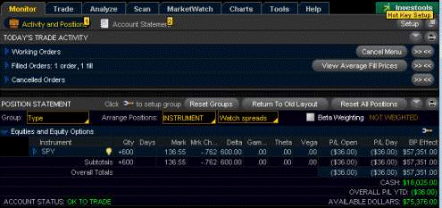

The thinkorswim platform is a powerful and comprehensive trading tool that has carved out a significant niche in algorithmic trading. Initially developed by traders for traders, thinkorswim offers robust features that cater to both novice and experienced investors. Its relevance in algorithmic trading stems from its ability to integrate advanced trading algorithms seamlessly, offering users the ability to automate complex trading strategies and improve execution speed and accuracy.

Algorithmic trading itself has undergone a significant transformation over the years, evolving from a novel strategy utilized by a few tech-savvy investors to a fundamental component of modern financial markets. The integration of technology in finance, often referred to as fintech, has enabled the proliferation of algorithmic trading practices. Algorithms are now responsible for a substantial volume of trades executed daily, significantly enhancing market efficiency and liquidity while also presenting new challenges and considerations.



This article aims to provide readers with a comprehensive understanding of the thinkorswim platform and its contribution to the field of algorithmic trading. We will explore the platform's features, its appeal for algorithmic trading enthusiasts, and the pivotal role of thinkScript—thinkorswim's proprietary scripting language—in customizing trading strategies. Additionally, the article will examine popular algorithmic strategies that traders employ on the thinkorswim platform, including how they can be coded and backtested. We will also assess the advantages of using thinkorswim for algorithmic trading and address essential considerations such as potential risks and regulatory requirements. Finally, readers will be guided on setting up a basic algorithmic strategy on thinkorswim, emphasizing the importance of backtesting and continuous learning.

## Table of Contents

## Understanding Thinkorswim as a Trading Platform

Thinkorswim is a comprehensive trading platform known for its versatility and robust feature set, attracting a diverse user base ranging from beginner traders to seasoned professionals. Launched by TD Ameritrade, the platform has established itself as a leader in the trading software space, particularly for its capacity to accommodate various financial instruments, including stocks, options, futures, and [forex](/wiki/forex-system).

### Overview of Thinkorswim and Its Features

Thinkorswim offers a wide range of features designed to enhance the trading experience. These include advanced charting tools, technical analysis indicators, and customizable screeners, enabling traders to identify and act on potential opportunities effectively. The platform’s intuitive interface and educational resources support traders in developing their skills and understanding of market dynamics. Additionally, Thinkorswim provides access to a comprehensive suite of research tools, enabling users to make informed decisions based on real-time market data.

A standout feature of Thinkorswim is its paper trading capabilities, which allow traders to test their strategies in a risk-free environment. The platform also supports a variety of order types, catering to different trading styles and risk tolerances. These features combine to make Thinkorswim a popular choice for traders seeking a sophisticated yet accessible trading platform.

### Why Thinkorswim is Favored for Algorithmic Trading

Thinkorswim's appeal for [algorithmic trading](/wiki/algorithmic-trading) lies in its flexibility and the powerful scripting language, thinkScript. The platform enables users to automate trading strategies, which can lead to increased efficiency and enhanced execution speeds. The customizable nature of Thinkorswim allows traders to tailor their trading environment to suit their specific needs, enhancing the potential for profitable outcomes.

Algorithmic trading, characterized by the use of computer systems to execute trades based on predefined criteria, benefits from the platform’s robust data analysis tools. Traders can leverage historical data to backtest their strategies, ensuring that they are viable before deploying them in real-world scenarios. This ability to backtest and refine algorithms is crucial for success in the fast-paced and competitive trading landscape.

### Role of thinkScript in Customizing Trading Strategies

ThinkScript, the scripting language integrated into Thinkorswim, plays a vital role in customizing trading strategies. It allows users to write scripts that define specific trading conditions and automate complex calculations. ThinkScript is particularly appreciated for its accessibility; while it is powerful enough to accommodate sophisticated algorithms, it is designed to be user-friendly, even for those without a programming background.

Through thinkScript, traders can create custom technical indicators, set alerts for specific market conditions, and develop tailored strategies that can be automatically executed. This level of customization empowers users to capitalize on unique market insights and implement strategies that might otherwise be challenging to execute manually. 

An example of a simple moving average crossover strategy in thinkScript is:

```plaintext
def shortSMA = Average(close, 10);
def longSMA = Average(close, 50);
plot buySignal = shortSMA crosses above longSMA;
plot sellSignal = shortSMA crosses below longSMA;
```

In this script, a buy signal is generated when the short-term moving average crosses above the long-term moving average, and a sell signal when it crosses below. This flexibility in creating indicators and strategies is a significant reason why Thinkorswim is favored by traders who wish to customize their trading activities.

In conclusion, Thinkorswim's comprehensive feature set and the powerful thinkScript language make it an ideal platform for traders looking to engage in algorithmic trading. Its ability to support customizations and automation facilitates a competitive edge, essential in the modern trading environment.

## Leveraging Thinkorswim for Algorithmic Trading

Algorithmic trading refers to the utilization of computer algorithms to execute trading orders based on pre-defined criteria. This method of trading has gained immense popularity due to its ability to process large volumes of data and execute trades at speeds and frequencies that are impossible for human traders. The benefits of algorithmic trading include increased efficiency, removal of emotional biases, reduced transaction costs, and the potential for higher returns through the identification of patterns inaccessible to manual trading.

Thinkorswim, developed by TD Ameritrade, is a highly acclaimed trading platform that supports algorithmic trading through its innovative scripting language called thinkScript. This feature provides traders with the ability to customize trading strategies to an advanced degree, catering specifically to individual needs and market perceptions. ThinkScript allows the creation of scripts that automate complex trading patterns and adapt to changing market conditions in real-time.

### Support for Algorithmic Trading through ThinkScript

Thinkorswim's thinkScript caters to both novice and advanced traders by providing a user-friendly interface to develop and backtest trading strategies. By writing custom scripts, traders can design algorithms to automatically place trades based on signals generated by technical indicators, price movements, or any other market data that thinkorswim captures.

Here is an example of a simple moving average crossover strategy using thinkScript:

```plaintext
input fastLength = 12;
input slowLength = 26;
def fastMA = Average(close, fastLength);
def slowMA = Average(close, slowLength);
def crossover = Crosses(fastMA, slowMA, CrossingDirection.ABOVE);
plot buySignal = crossover;
```
This script uses two moving averages: a fast-moving average of 12 periods and a slower one of 26 periods. A buy signal occurs when the fast-moving average crosses above the slow-moving average, suggesting potential upward price movement.

### Examples of Algorithmic Strategies

Several algorithmic strategies can be effectively implemented on thinkorswim using thinkScript:

1. **Moving Average Crossovers**: This strategy involves tracking two moving averages and executing a trade when they cross each other. As illustrated in the script above, when the shorter-term moving average crosses above the longer-term one, it indicates a buy signal, and vice versa.

2. **Mean Reversion**: In mean reversion strategies, the trader assumes that prices will revert to their historical mean. Traders use statistical analysis to identify assets that are priced above or below their expected value and place trades accordingly.

3. **Trend Following**: This strategy aims to capitalize on market trends by entering trades in the direction of the current trend based on market data. Indicators such as the Average Directional Index (ADX) are commonly used to assess the strength of a trend.

Through thinkorswim's advanced capabilities, traders can design complex algorithms that not only automate trading but also adaptively modify strategies based on historical data and predictive analytics. This flexibility, combined with a comprehensive suite of analytical tools, positions thinkorswim as an exceptional platform for executing sophisticated algorithmic trading strategies.

## Popular Thinkorswim Strategies for Algo Trading

Thinkorswim, a renowned trading platform, is celebrated for its versatility and extensive toolset for implementing algorithmic trading strategies. Among the myriad strategies adopted by traders, three remain particularly prominent: Moving Average Crossovers, Mean Reversion, and Trend Following. These strategies can be tailored and rigorously tested on thinkorswim using thinkScript, the platform's proprietary scripting language.

### Moving Average Crossovers

This strategy involves using two moving averages—a short-term and a long-term moving average. The crossover method generates buy or sell signals when the short-term average crosses above or below the long-term average. Such a strategy helps traders capture trends early and decide [exit](/wiki/exit-strategy) points effectively.

**thinkScript Implementation**:
To code a moving average crossover strategy in thinkScript, traders define the two moving averages and set conditional statements for when the short-term moving average crosses the long-term moving average.

```thinkScript
input shortLength = 10; 
input longLength = 30;
def shortMA = Average(close, shortLength);
def longMA = Average(close, longLength);
def crossover = shortMA crosses above longMA;
def crossunder = shortMA crosses below longMA;

AddOrder(crossover, price=close, tradeSize=100);
AddOrder(crossunder, price=close, tradeSize=-100);
```

By [backtesting](/wiki/backtesting) this strategy on historical data, traders can evaluate its effectiveness and optimize parameters for improved performance.

### Mean Reversion

Mean reversion is predicated on the idea that asset prices will gravitate back to their historical averages. When prices deviate significantly from their mean, they are expected to move back toward the average, offering the opportunity for profit.

**thinkScript Implementation**:
In thinkorswim, this strategy can be implemented using indicators such as Bollinger Bands or the Relative Strength Index (RSI). The script monitors when the price moves outside predefined boundaries and generates trades accordingly.

```thinkScript
input length = 20;
input numDev = 2.0;

def upperBand = BollingerBandsUpper("length" = length, "numDev" = numDev);
def lowerBand = BollingerBandsLower("length" = length, "numDev" = numDev);

def buySignal = close < lowerBand;
def sellSignal = close > upperBand;

AddOrder(buySignal, price=close, tradeSize=100);
AddOrder(sellSignal, price=close, tradeSize=-100);
```

This code example instructs the system to buy when prices dip below the lower band and sell when they rise above the upper band.

### Trend Following

This strategy thrives on the premise that securities exhibiting strong trends are likely to continue in that direction. Moving averages or [momentum](/wiki/momentum) indicators typically identify these trends.

**thinkScript Implementation**:
Traders can apply moving averages or price channel breakouts to capitalize on ongoing trends. A simple method employs moving averages to ensure entry only when a significant trend is confirmed.

```thinkScript
input length = 50;
def MA = Average(close, length);
def upTrend = close > MA;
def downTrend = close < MA;

AddOrder(upTrend, price=close, tradeSize=100, tickColor = Color.GREEN);
AddOrder(downTrend, price=close, tradeSize=-100, tickColor = Color.RED);
```

The script above manages trades based on the current trend direction, signaling entries and exits according to the moving average indicator.

### Backtesting Strategies

Thinkorswim's extensive backtesting capability allows traders to test these scripts against historical market data. By analyzing past performance, traders can refine their strategies to optimize future trading activities. This not only validates strategy viability but also helps in adjusting parameters, minimizing risks, and enhancing profitability.

In conclusion, thinkorswim empowers traders to explore and execute popular algo trading strategies effectively. By leveraging thinkScript, traders can implement, test, and refine their approaches, ensuring they are well-prepared to navigate dynamic markets.

## Advantages of Using Thinkorswim in Algorithmic Trading

The thinkorswim trading platform boasts several advantages that make it particularly appealing for algorithmic trading. Its accessibility features cater to traders of all levels, providing a comprehensive interface that merges robust functionalities with user-friendly navigation. This ensures both novice and experienced traders can effectively utilize the platform's capabilities to execute complex trading strategies.

A significant advantage of thinkorswim is its robust data analysis tools, which empower traders to perform detailed market analyses. These tools include advanced charting options, technical indicators, and customizable studies, all of which are essential for making informed decisions based on quantitative data. Furthermore, thinkorswim provides free access to real-time market data, a critical feature for algorithmic trading where timely data is necessary to exploit market inefficiencies quickly. Real-time data enables traders to implement high-frequency trading strategies and ensures that their algorithms are making decisions based on the most current market conditions.

Another notable feature of thinkorswim is its paper trading capability, known as "paperMoney." This feature allows traders to test their strategies in a simulated environment that mimics real market conditions without risking actual capital. Paper trading is particularly beneficial for debugging and refining algorithmic strategies, enabling traders to backtest their ideas and optimize them based on historical data and real-time scenarios. By practicing in a risk-free environment, traders can fine-tune their algorithms, assess the potential success of their strategies, and gain confidence before transitioning to live trading.

Overall, thinkorswim's suite of features supports the development, testing, and execution of algorithmic trading strategies, providing a solid foundation for traders looking to leverage automation in their trading practices. With its accessibility, comprehensive data analysis tools, and the invaluable option of paper trading, thinkorswim stands out as a versatile platform suited to the dynamic nature of modern trading.

## Considerations and Challenges in Algo Trading

Algorithmic trading, while offering significant advantages such as efficiency and speed, also presents various challenges and risks that traders must navigate. Recognizing and mitigating these risks, as well as understanding the regulatory landscape and ethical considerations, is crucial for successful engagement in algorithmic trading.

### Potential Risks and Mitigation Strategies

Algorithmic trading inherently involves several risks due to its reliance on automated systems and the dynamic nature of financial markets. Some key risks include:

1. **Market Risk**: This occurs due to unfavorable market movements impacting algorithm-driven trades. Mitigating market risk involves diversifying trading strategies and employing stop-loss mechanisms to limit potential losses.

2. **Model Risk**: Algorithms are based on models that may not always accurately predict market behavior. Regularly backtesting and updating models using historical and real-time data is essential to ensure their reliability. Quantitative techniques and statistical analysis help refine algorithms to align with market conditions.

3. **Technical Risk**: Technical failures such as software bugs, connectivity issues, or system lags can disrupt trading. Ensuring robust IT infrastructure, thorough testing of trading algorithms, and having redundant systems in place are vital for mitigating technical risks.

4. **Liquidity Risk**: This arises when an algorithm executes trades that significantly impact the market price, especially in less liquid markets. Reducing order sizes and implementing algorithms that assess market depth before executing trades can address liquidity concerns.

### Continuous Learning and Adaptation

The fast-paced nature of financial markets demands continuous learning and adaptation from traders and their algorithms. This involves staying informed about the latest market trends, technological advancements, and academic research in quantitative finance. Machine learning techniques can be incorporated to adapt algorithms dynamically, making them more responsive to changing market conditions.

For example, algorithms can incorporate a [reinforcement learning](/wiki/reinforcement-learning) framework, which allows continuous improvement through feedback from trading outcomes. This involves algorithms learning optimal trading strategies by interacting with the market environment, thus enhancing decision-making and operational efficiency.

```python
import numpy as np

# Example reinforcement learning pseudo-code for continuous adaptation
class TradingAgent:

    def __init__(self, environment):
        self.environment = environment
        self.policy = np.random.rand(self.environment.action_space)

    def update_policy(self, state, reward):
        # Update the policy based on state and received reward
        self.policy[state] += 0.1 * (reward - self.policy[state])

    def select_action(self, state):
        # Select action based on current policy
        return np.argmax(self.policy[state])

# Example of how a trading agent could learn adaptively
env = TradingEnvironment(state_space=10, action_space=5)
agent = TradingAgent(env)
```

### Regulatory Considerations and Ethical Concerns

Regulatory compliance is a paramount consideration in algorithmic trading. Trading entities must adhere to regulations set forth by financial authorities, such as the Securities and Exchange Commission (SEC) in the United States or the Financial Conduct Authority (FCA) in the United Kingdom. These regulations encompass market transparency, fair trading practices, and risk management protocols.

Ethical concerns also arise from algorithmic trading, such as the potential for market manipulation or the development of algorithms that behave unpredictably under stress conditions, posing systemic risks. Implementing ethical guidelines and ensuring transparency in algorithmic operations are necessary to mitigate these concerns. Traders should prioritize algorithms that promote market stability and fairness while avoiding strategies that exploit market inefficiencies at the expense of other participants.

By understanding and addressing these considerations and challenges, traders can enhance the effectiveness and ethical alignment of their algorithmic trading strategies. Continuous adaptation, informed by regulatory and ethical standards, enables traders to capitalize on the benefits of algorithmic trading while minimizing potential adverse impacts.

## Getting Started: Setting Up a Strategy on Thinkorswim

To set up a basic algorithmic strategy on thinkorswim, follow this step-by-step guide:

1. **Access the Thinkorswim Platform**: Begin by logging into the thinkorswim platform. Once logged in, navigate to the 'Charts' tab where you can access various tools and features necessary for developing algorithmic strategies.

2. **Explore thinkScript**: Under the 'Charts' tab, click on 'Studies' and select 'Edit Studies'. You will see an option to 'Create' or 'Modify' scripts using thinkScript, a proprietary scripting language tailored for thinkorswim.

3. **Basic Strategy Setup**: To start with a simple strategy, such as Moving Average Crossover, input the following thinkScript code:

   ```thinkscript
   input shortTermPeriod = 9;
   input longTermPeriod = 21;

   def shortTermMA = Average(close, shortTermPeriod);
   def longTermMA = Average(close, longTermPeriod);

   plot buySignal = shortTermMA crosses above longTermMA;
   plot sellSignal = shortTermMA crosses below longTermMA;
   ```

   This script defines short-term and long-term moving averages and generates buy and sell signals based on their crossovers.

4. **Script Customization**: Customize parameters like `shortTermPeriod` and `longTermPeriod` to suit your trading style or adapt the logic to incorporate other indicators if needed.

5. **Backtesting Strategies**: The thinkorswim platform provides a 'Thinkback' tool that allows traders to simulate their strategies over historical data. Utilizing this feature is crucial for assessing the potential effectiveness of your algorithm before real-time execution. To engage this tool, navigate to the 'Analyze' tab, select 'Thinkback', and set your desired historical date range to review how your strategy would have performed.

6. **Evaluate Performance**: Analyze the results from backtesting. Look at key metrics such as total returns, win/loss ratio, and drawdowns. This evaluation helps identify any necessary adjustments to improve strategy performance.

7. **Strategy Optimization**: Based on the results, refine the thinkScript code to optimize your strategy. This might involve adjusting input parameters, adding additional conditions, or integrating more complex indicators.

8. **Paper Trading**: Before deploying your strategy with real capital, use thinkorswim's paper trading feature. This simulation replicates real-time market conditions, allowing you to verify your algorithm's behavior in live scenarios without financial risk.

By following these steps, you can effectively set up, refine, and test algorithmic strategies on thinkorswim. This process not only helps minimize risk but also enhances the potential success of your trading endeavors through informed iteration and adaptation.

## Conclusion

The thinkorswim platform stands out in algorithmic trading for its robust tools, flexibility, and accessibility. By providing a seamless experience for both novice and experienced traders, thinkorswim empowers users to craft and refine trading strategies that leverage the power of automation. Its intuitive interface, combined with the advanced scripting capabilities of thinkScript, allows traders to design custom indicators and automate trading strategies, thereby enhancing decision-making and efficiency in the competitive financial markets.

One of the most significant benefits of using thinkorswim is the ability to test and iterate strategies through paper trading. This feature ensures that traders can evaluate their algorithms under real market conditions without financial risk, facilitating a deeper understanding of strategy performance and reliability. Moreover, real-time data access offered by the platform enables users to make informed decisions and adapt strategies promptly to changing market dynamics, crucial for maintaining a competitive edge.

Traders are encouraged to continually explore and experiment with various strategies on thinkorswim. By utilizing the platform’s comprehensive tools and the vibrant community of traders sharing insights and scripts, individuals can refine their approach and discover new opportunities for profit. The landscape of algorithmic trading is constantly evolving, and staying abreast of market trends and technological advancements is imperative.

Finally, continuous learning is key in algorithmic trading. The financial markets are ever-changing, and so are the strategies that work within them. Traders must remain committed to expanding their knowledge and skill set, whether through learning new coding techniques, understanding intricate market indicators, or studying emerging financial technologies. With thinkorswim and a dedication to ongoing education, traders can enhance their proficiency and drive success in algorithmic trading.

## References & Further Reading

[1]: Bergstra, J., Bardenet, R., Bengio, Y., & Kégl, B. (2011). ["Algorithms for Hyper-Parameter Optimization."](https://papers.nips.cc/paper/4443-algorithms-for-hyper-parameter-optimization) Advances in Neural Information Processing Systems 24.

[2]: ["Advances in Financial Machine Learning"](https://www.amazon.com/Advances-Financial-Machine-Learning-Marcos/dp/1119482089) by Marcos Lopez de Prado

[3]: ["Evidence-Based Technical Analysis: Applying the Scientific Method and Statistical Inference to Trading Signals"](https://www.amazon.com/Evidence-Based-Technical-Analysis-Scientific-Statistical/dp/0470008741) by David Aronson

[4]: ["Machine Learning for Algorithmic Trading"](https://github.com/stefan-jansen/machine-learning-for-trading) by Stefan Jansen

[5]: ["Quantitative Trading: How to Build Your Own Algorithmic Trading Business"](https://books.google.com/books/about/Quantitative_Trading.html?id=j70yEAAAQBAJ) by Ernest P. Chan