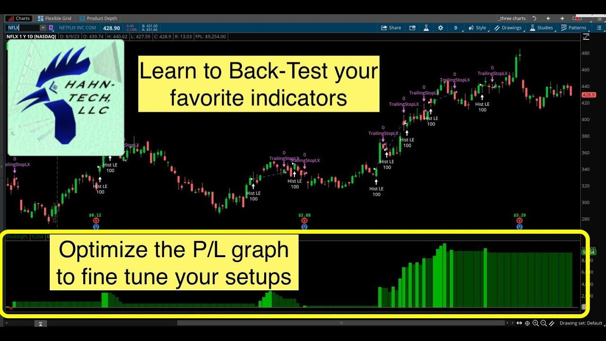

## Table of Contents

## What is ThinkOrSwim and why is it used for trading?

ThinkOrSwim is a trading platform created by TD Ameritrade. It's a tool that people use to buy and sell stocks, options, futures, and forex. The platform is known for its powerful features and detailed charts that help traders make smart decisions. It's available on desktop computers and as a mobile app, so you can use it wherever you are.

People use ThinkOrSwim for trading because it has many useful tools. It offers real-time data, which means you can see what's happening in the market right now. It also has advanced charting tools that let you look at past data and predict future trends. Plus, it has a paper trading feature, which lets you practice trading without using real money. This is great for beginners who want to learn how to trade without risking their savings.

## How do beginners set up a basic trading strategy in ThinkOrSwim?

To set up a basic trading strategy in ThinkOrSwim, beginners should start by opening the platform and going to the "Trade" tab. Here, they can choose the type of asset they want to trade, like stocks or options. Next, they should look at the charts to see how the price of the asset has moved in the past. ThinkOrSwim has tools that let you draw lines on the chart to spot trends. For example, if the price is going up over time, that's an uptrend, and if it's going down, that's a downtrend. Beginners can use these trends to decide when to buy or sell.

Once they understand the trends, beginners can set up simple rules for their strategy. A common rule is to buy when the price hits a certain low point and sell when it reaches a high point. They can use the "Alerts" feature in ThinkOrSwim to get notified when the price reaches these points. It's also a good idea to use the paper trading feature to practice this strategy without using real money. This way, beginners can see how their strategy works and make changes before they start trading with real money.

## What are the key features of ThinkOrSwim that enhance trading strategies?

ThinkOrSwim has many features that help traders make better decisions. One key feature is the advanced charting tools. These tools let you see how the price of a stock or other asset has moved in the past. You can draw lines on the chart to spot trends and patterns. This helps you decide when to buy or sell. Another important feature is real-time data. This means you can see what's happening in the market right now, which is crucial for making quick decisions.

Another useful feature is the paper trading option. This lets you practice trading without using real money. It's a great way for beginners to test their strategies and see how they work before they start trading for real. ThinkOrSwim also has an alerts feature. You can set alerts to notify you when the price of an asset reaches a certain point. This helps you stay on top of your trades without having to watch the market all the time.

## How can intermediate users utilize technical indicators in ThinkOrSwim?

Intermediate users can use technical indicators in ThinkOrSwim to make their trading strategies better. These indicators are tools that help you see patterns in the market. For example, you can use the Moving Average to see the average price of a stock over time. If the price is above the moving average, it might be a good time to buy. If it's below, it might be a good time to sell. Another useful indicator is the Relative Strength Index (RSI). This tells you if a stock is overbought or oversold. If the RSI is over 70, the stock might be overbought, and if it's under 30, it might be oversold. You can add these indicators to your charts in ThinkOrSwim by clicking on the "Studies" button and choosing the ones you want.

You can also use more advanced indicators like Bollinger Bands. These bands show the high and low points of a stock's price over time. When the price touches the upper band, it might be time to sell, and when it touches the lower band, it might be time to buy. ThinkOrSwim lets you customize these indicators to fit your strategy. For example, you can change the time period for the Moving Average or adjust the settings for the RSI. By using these technical indicators, intermediate users can make more informed decisions and improve their trading strategies.

## What are some common trading strategies that can be implemented using ThinkOrSwim?

One common trading strategy that can be implemented using ThinkOrSwim is the Moving Average Crossover strategy. This strategy uses two moving averages, one short-term and one long-term. When the short-term moving average crosses above the long-term moving average, it's a signal to buy. When the short-term moving average crosses below the long-term moving average, it's a signal to sell. ThinkOrSwim makes it easy to set up these moving averages on your charts and even set alerts for when the crossovers happen. This helps traders act quickly when the market changes.

Another strategy is the Bollinger Band strategy. Bollinger Bands are lines that show the high and low points of a stock's price over time. When the price touches the upper band, it might be a good time to sell because the stock could be overbought. When the price touches the lower band, it might be a good time to buy because the stock could be oversold. ThinkOrSwim lets you add Bollinger Bands to your charts easily. You can also set up alerts to notify you when the price touches these bands, making it simpler to follow this strategy.

A third strategy is the Relative Strength Index (RSI) strategy. The RSI measures how fast a stock's price is changing. If the RSI is over 70, the stock might be overbought, and it could be a good time to sell. If the RSI is under 30, the stock might be oversold, and it could be a good time to buy. ThinkOrSwim allows you to add the RSI to your charts and set alerts for when it reaches these levels. This helps traders make decisions based on whether a stock is overbought or oversold.

## How does one backtest trading strategies in ThinkOrSwim?

To backtest trading strategies in ThinkOrSwim, you first need to use the platform's paper trading feature. This lets you practice trading without using real money. You can set up your strategy using the charts and indicators in ThinkOrSwim. For example, you might decide to buy a stock when its price crosses above a certain moving average and sell when it crosses below. Once you have your strategy set up, you can use the "OnDemand" feature to go back in time and see how your strategy would have worked in the past. This helps you see if your strategy would have made money or lost money.

After setting up your strategy and using OnDemand to backtest it, you can look at the results. ThinkOrSwim will show you how much money you would have made or lost if you had followed your strategy in the past. This helps you see if your strategy is good or if you need to make changes. You can keep testing different time periods and adjusting your strategy until you find one that works well. Backtesting is a great way to practice and improve your trading without risking real money.

## What advanced chart analysis tools does ThinkOrSwim offer?

ThinkOrSwim has many advanced chart analysis tools that help traders make better decisions. One tool is the ability to draw lines on charts to spot trends and patterns. You can draw trendlines to see if the price is going up or down over time. You can also use Fibonacci retracement to find levels where the price might change direction. These tools help you see where the price might go next, which is important for deciding when to buy or sell.

Another useful tool is the ability to add many different indicators to your charts. ThinkOrSwim lets you use indicators like Moving Averages, Bollinger Bands, and the Relative Strength Index (RSI). These indicators help you see if a stock is overbought or oversold, and they can show you when the price might change direction. You can also customize these indicators to fit your trading strategy. For example, you can change the time period for a Moving Average or adjust the settings for the RSI.

ThinkOrSwim also offers the "ThinkScript" feature, which lets you create your own custom indicators and studies. This is great for advanced traders who want to use their own unique tools. With ThinkScript, you can write code to make the platform do exactly what you want. This helps you analyze the market in a way that fits your strategy perfectly.

## How can users automate their trading strategies in ThinkOrSwim?

Users can automate their trading strategies in ThinkOrSwim using the platform's "ThinkScript" feature. ThinkScript is a coding language that lets you write scripts to make the platform do what you want. For example, you can write a script that tells ThinkOrSwim to buy a stock when its price crosses above a certain moving average and sell when it crosses below. This way, you don't have to watch the market all the time. The platform will do the trading for you based on the rules you set in your script.

To start automating your strategy, you need to learn some basic ThinkScript commands. You can find tutorials and examples in the ThinkOrSwim learning center. Once you have your script ready, you can add it to your charts or use it in the paper trading feature to test it out. This helps you see if your automated strategy works well before you use real money. Automating your trading can save you time and help you stick to your strategy without letting emotions get in the way.

## What are the best practices for managing risk in ThinkOrSwim?

Managing risk in ThinkOrSwim is important to protect your money. One good way to do this is by setting stop-loss orders. A stop-loss order tells the platform to sell a stock if its price falls to a certain level. This helps you limit how much money you can lose on a trade. Another way to manage risk is by not putting all your money into one stock. Instead, spread your money across different stocks or assets. This is called diversification, and it can help reduce your risk because if one stock goes down, the others might go up.

Another important practice is to use the paper trading feature in ThinkOrSwim. This lets you practice your trading strategy without using real money. By doing this, you can see how your strategy works and make changes before you start trading with real money. It's also a good idea to keep learning about the market and your trading strategy. ThinkOrSwim has a lot of educational resources that can help you understand how to manage risk better. By using these tools and following these practices, you can make smarter trading decisions and protect your money.

## How can expert users customize and optimize trading algorithms in ThinkOrSwim?

Expert users can customize and optimize trading algorithms in ThinkOrSwim using the platform's ThinkScript feature. ThinkScript is a coding language that lets you write scripts to automate your trading strategies. For example, you can create a script that tells ThinkOrSwim to buy a stock when its price crosses above a certain moving average and sell when it crosses below. This allows you to set up complex rules that fit your trading style perfectly. You can also use ThinkScript to create custom indicators and studies, which can help you analyze the market in a way that's unique to your strategy. By writing and tweaking these scripts, expert users can fine-tune their algorithms to improve performance and reduce risk.

To optimize these algorithms, expert users should use the paper trading feature in ThinkOrSwim. This lets you test your scripts without using real money, so you can see how they work in different market conditions. You can go back in time using the OnDemand feature to backtest your algorithms and see how they would have performed in the past. By analyzing these results, you can make changes to your scripts to make them better. It's also important to keep learning and staying updated with market trends and new trading techniques. ThinkOrSwim offers many educational resources that can help you improve your algorithms and stay ahead in the market.

## What are the latest updates and features in ThinkOrSwim that impact trading strategies?

ThinkOrSwim has added some new features that can help traders make better decisions. One of the latest updates is the improved mobile app. Now, you can use more of the platform's tools on your phone or tablet. This means you can check your trades and make changes even when you're not at your computer. Another new feature is the enhanced charting capabilities. ThinkOrSwim now lets you add more custom indicators and studies to your charts. This can help you see patterns and trends more clearly, which is important for deciding when to buy or sell.

Another update that impacts trading strategies is the new risk management tools. ThinkOrSwim now has better ways to set stop-loss orders and other risk controls. This helps you protect your money by limiting how much you can lose on a trade. The platform also has new educational resources that can help you learn more about trading and how to use these new features. By using these updates, traders can make smarter decisions and improve their strategies.

## How can ThinkOrSwim be integrated with other trading platforms or tools for enhanced strategy development?

ThinkOrSwim can be integrated with other trading platforms and tools to help traders develop better strategies. One way to do this is by using the platform's API, which lets you connect ThinkOrSwim to other software. For example, you can use the API to send data from ThinkOrSwim to a program like Excel or Python. This lets you analyze the data in different ways and create custom tools that fit your trading style. By combining ThinkOrSwim with other platforms, you can get more information and make smarter decisions.

Another way to enhance strategy development is by using third-party add-ons and plugins that work with ThinkOrSwim. These add-ons can add new features to the platform, like advanced charting tools or risk management options. For example, you might use a plugin that helps you backtest your strategies more easily. By integrating these tools with ThinkOrSwim, you can get a more complete view of the market and improve your trading strategies.

## References & Further Reading

[1]: Bergstra, J., Bardenet, R., Bengio, Y., & Kégl, B. (2011). ["Algorithms for Hyper-Parameter Optimization."](https://papers.nips.cc/paper/4443-algorithms-for-hyper-parameter-optimization) Advances in Neural Information Processing Systems 24.

[2]: ["Advances in Financial Machine Learning"](https://www.amazon.com/Advances-Financial-Machine-Learning-Marcos/dp/1119482089) by Marcos Lopez de Prado

[3]: ["Evidence-Based Technical Analysis: Applying the Scientific Method and Statistical Inference to Trading Signals"](https://www.amazon.com/Evidence-Based-Technical-Analysis-Scientific-Statistical/dp/0470008741) by David Aronson

[4]: ["Machine Learning for Algorithmic Trading"](https://github.com/stefan-jansen/machine-learning-for-trading) by Stefan Jansen

[5]: ["Quantitative Trading: How to Build Your Own Algorithmic Trading Business"](https://books.google.com/books/about/Quantitative_Trading.html?id=j70yEAAAQBAJ) by Ernest P. Chan