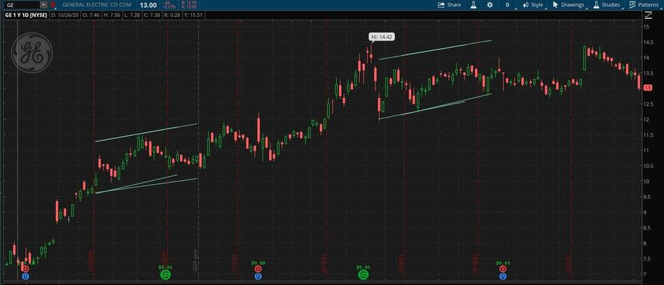

## Table of Contents

## What is ThinkScript and what is it used for?

ThinkScript is a programming language created by Thinkorswim, which is a trading platform owned by TD Ameritrade. It's used to create custom indicators, studies, and strategies for analyzing financial markets. Traders use ThinkScript to write their own code, which helps them make better decisions when buying or selling stocks, options, futures, and forex.

With ThinkScript, you can customize charts and add new features that aren't available in the standard Thinkorswim platform. For example, you can create a custom moving average or a unique trading strategy based on specific conditions. This flexibility allows traders to tailor their analysis to their own trading style and preferences, making it easier to spot opportunities in the market.

## How do you get started with ThinkScript in ThinkorSwim?

To get started with ThinkScript in ThinkorSwim, first open the platform and go to the Charts tab. Click on the "Studies" button at the top of the chart, then select "Edit Studies" from the dropdown menu. In the new window that opens, click on the "New" button to create a new study. This will open the ThinkScript Editor, where you can start writing your own code.

In the ThinkScript Editor, you'll see a blank space where you can type your code. You can start by writing simple scripts to get familiar with the language. For example, you can create a basic moving average by typing `def ma = Average(close, 10);` and then clicking the "Apply" button to see it on your chart. As you get more comfortable, you can explore more complex scripts and customize them to fit your trading needs. Remember, you can always find help and examples in the ThinkorSwim Learning Center or online forums.

## What are the basic syntax rules of ThinkScript?

ThinkScript uses a simple syntax that is easy to learn. Each line of code usually ends with a semicolon (;). You can use keywords like 'def' to define variables, 'input' to set user inputs, and 'plot' to display data on a chart. For example, to define a variable, you might write 'def myVariable = close;' which assigns the closing price to 'myVariable'. To plot this on a chart, you would use 'plot MyPlot = myVariable;'. ThinkScript is case-sensitive, so 'Close' and 'close' are different.

You can also use common operators like '+', '-', '*', and '/' for basic math. For more complex conditions, you can use 'if' statements. For example, 'if close > open then plot MyPlot = close;' will plot the closing price only if it's higher than the opening price. Functions like 'Average' or 'HighestAll' can be used to perform calculations on data. Comments in ThinkScript start with a '#' symbol and are used to explain your code, like '# This is a comment'.

Overall, ThinkScript is designed to be user-friendly for traders who may not have a programming background. By following these basic rules and experimenting with different scripts, you can create custom indicators and strategies to enhance your trading analysis.

## How do you create and use variables in ThinkScript?

In ThinkScript, you create variables using the 'def' keyword. For example, if you want to store the closing price of a stock, you can write 'def closePrice = close;'. This line of code creates a variable named 'closePrice' and assigns it the value of the closing price. You can name your variables anything you want, but it's helpful to use names that make sense and are easy to remember. Also, ThinkScript is case-sensitive, so 'closePrice' and 'ClosePrice' would be different variables.

After creating a variable, you can use it in your code. For instance, if you want to plot the 'closePrice' on a chart, you can write 'plot MyPlot = closePrice;'. This will show the closing price on your chart. You can also do math with your variables. For example, if you have another variable 'openPrice' defined as 'def openPrice = open;', you can calculate the difference between the opening and closing prices with 'def priceDifference = closePrice - openPrice;'. This way, you can use variables to make your scripts more flexible and easier to understand.

## What are the common functions and methods available in ThinkScript?

ThinkScript has many useful functions and methods that help you analyze the market. Some common ones include 'Average', which calculates the average value of a data series over a certain number of periods. For example, 'Average(close, 10)' gives you the average closing price over the last 10 periods. Another useful function is 'HighestAll', which finds the highest value in a data series. If you want to know the highest closing price ever, you can use 'HighestAll(close)'. There are also functions like 'LowestAll' for finding the lowest value, and 'Sum' for adding up values over a period of time.

In addition to these, ThinkScript has methods like 'crosses' and 'crosses above' or 'crosses below', which help you detect when one data series crosses another. For instance, 'close crosses above Average(close, 10)' tells you when the closing price goes above its 10-period average. You can also use 'if' statements to create conditions. For example, 'if close > open then plot MyPlot = close;' will plot the closing price only if it's higher than the opening price. These functions and methods make it easy to create custom indicators and strategies to fit your trading needs.

## How do you build and apply custom indicators using ThinkScript?

To build a custom indicator using ThinkScript, first open the ThinkorSwim platform and go to the Charts tab. Click on the "Studies" button at the top of the chart, then select "Edit Studies" from the dropdown menu. In the new window that opens, click on the "New" button to create a new study. This will open the ThinkScript Editor where you can start writing your code. You can define variables with 'def', use functions like 'Average' or 'HighestAll', and plot data on the chart with 'plot'. For example, to create a simple moving average indicator, you might write 'def ma = Average(close, 10);' and 'plot MyMA = ma;'. This will plot a 10-period moving average of the closing price on your chart.

After writing your code, click the "Apply" button to see your custom indicator on the chart. You can then adjust it by adding user inputs with the 'input' keyword, which allows you to change the settings of your indicator. For instance, you can add 'input length = 10;' to let users change the number of periods for the moving average. Once you're happy with your indicator, you can save it and use it in your trading analysis. By creating and applying custom indicators, you can tailor your charts to fit your trading style and make more informed decisions.

## What are the best practices for debugging ThinkScript code?

When debugging ThinkScript code, it's helpful to start by breaking your code into smaller parts. This way, you can test each part to see if it's working correctly. If something isn't right, you can find the problem more easily. You can also use the 'print' function to show values in the ThinkorSwim console. For example, if you write 'print close;' in your code, you'll see the current closing price in the console. This can help you understand what's happening in your script and fix any issues.

Another good practice is to use comments in your code. By adding '#' before a line of text, you can explain what each part of your code does. This makes it easier for you to understand your code later and helps others if you share it. If you run into an error, read the error message carefully. It often tells you exactly what's wrong and where the problem is. By following these simple steps, you can debug your ThinkScript code more effectively and create better indicators and strategies.

## How can you optimize ThinkScript code for better performance?

To optimize ThinkScript code for better performance, it's important to keep your code simple and efficient. One way to do this is by using fewer calculations. For example, if you need to use the same calculation in different parts of your code, you can do it once and save the result in a variable. This way, you don't have to repeat the calculation, which can make your code run faster. Also, try to use built-in functions like 'Average' or 'Sum' instead of writing your own loops, because these functions are already optimized for speed.

Another tip is to limit the amount of data your code looks at. If you only need to analyze the last 50 periods, don't use all the data available. You can set a specific number of periods in your calculations to make your code run quicker. Also, avoid using too many 'if' statements or complex conditions, as they can slow down your code. By keeping your code simple and focused, you can make it run faster and work better on your charts.

## How do you integrate ThinkScript with other programming languages or tools?

Integrating ThinkScript with other programming languages or tools can be a bit tricky because ThinkScript is specific to the ThinkorSwim platform. However, one way to do it is by using the data and signals generated by ThinkScript in another language. For example, you can write a ThinkScript that generates buy and sell signals based on your trading strategy. Then, you can export this data from ThinkorSwim and use it in another programming language like Python or R to create more complex analyses or automated trading systems.

Another way to integrate ThinkScript with other tools is by using APIs. Some platforms offer APIs that allow you to pull data from ThinkorSwim into other software. For instance, you might use an API to get real-time stock prices or historical data from ThinkorSwim and then use this data in a different program to make trading decisions. This way, you can combine the strengths of ThinkScript with the flexibility of other programming languages and tools to improve your trading strategy.

## What advanced techniques can be used to create complex trading strategies in ThinkScript?

To create complex trading strategies in ThinkScript, you can use a combination of different indicators and conditions. For example, you might combine a moving average with a [momentum](/wiki/momentum) indicator to create a strategy that buys when the price is above the moving average and the momentum is positive. You can also use 'if' statements to set up multiple conditions that need to be met before a trade is triggered. For instance, you might only want to buy if the price is above the moving average, the momentum is positive, and the [volume](/wiki/volume-trading-strategy) is higher than average. By layering these conditions, you can create a strategy that is more selective and potentially more profitable.

Another advanced technique is to use loops and arrays to analyze data over time. ThinkScript allows you to use 'for' loops to go through historical data and calculate things like the highest or lowest price over a certain period. You can also use arrays to store and manipulate data, which can help you create more sophisticated indicators. For example, you might use an array to keep track of the last 20 days of closing prices and then calculate the average of those prices to create a custom moving average. By using these advanced techniques, you can build complex trading strategies that take into account multiple factors and historical data, helping you make better trading decisions.

## How do you use ThinkScript to automate trading and manage risk?

ThinkScript can help you automate trading by creating custom strategies that buy or sell based on specific conditions. For example, you can write a script that tells ThinkorSwim to buy a stock when its price goes above a certain moving average and the volume is high. This way, you don't have to watch the market all the time. The script will do the work for you, making trades automatically when the conditions are met. This can save you time and help you take advantage of opportunities in the market even when you're not looking.

To manage risk with ThinkScript, you can set up rules that limit how much you can lose on a trade. For instance, you can use a 'stop loss' order in your script, which will sell a stock if its price drops too much. This helps protect your money by getting you out of a bad trade before it gets worse. You can also use ThinkScript to set 'take profit' levels, which will sell a stock when it reaches a certain price, locking in your gains. By using these tools, you can create a trading strategy that not only makes trades automatically but also helps manage your risk and protect your investments.

## What are some expert-level tips and tricks for mastering ThinkScript?

To master ThinkScript, it's really important to practice a lot and try different things. Start by copying and changing existing scripts to see how they work. This can help you learn new ways to use ThinkScript. Also, use the ThinkorSwim community forums and the Learning Center to find tips and tricks from other traders. They can show you cool ways to use ThinkScript that you might not have thought of. Don't be afraid to make mistakes—every error you fix helps you understand ThinkScript better.

Another tip is to keep your code simple and clean. Use comments to explain what your code does, which makes it easier to understand later. Try to use built-in functions like 'Average' or 'Sum' instead of writing your own loops, because these functions are faster and easier to read. Also, think about how you can use ThinkScript to automate your trading and manage risk. By setting up rules for buying and selling, and using stop losses and take profits, you can create a strategy that works for you even when you're not watching the market.

## References & Further Reading

[1]: ["thinkScript Learning Center"](https://toslc.thinkorswim.com/center/charting/thinkscript.html) - Thinkorswim's official documentation and learning resource for thinkScript.

[2]: ["Quantitative Trading: How to Build Your Own Algorithmic Trading Business"](https://books.google.com/books/about/Quantitative_Trading.html?id=j70yEAAAQBAJ) by Ernest P. Chan - A guide to developing algorithmic trading strategies and understanding quantitative trading.

[3]: ["Algorithmic Trading: Winning Strategies and Their Rationale"](https://www.wiley.com/en-us/Algorithmic+Trading%3A+Winning+Strategies+and+Their+Rationale-p-9781118460146) by Ernie Chan - A practical guide to understanding the essential elements of algorithmic trading.

[4]: ["Advances in Financial Machine Learning"](https://www.wiley.com/en-us/Advances+in+Financial+Machine+Learning-p-9781119482086) by Marcos Lopez de Prado - This book provides tools and techniques for the application of machine learning in financial markets.

[5]: ["Evidence-Based Technical Analysis: Applying the Scientific Method and Statistical Inference to Trading Signals"](https://www.amazon.com/Evidence-Based-Technical-Analysis-Scientific-Statistical/dp/0470008741) by David Aronson - A comprehensive guide that employs the scientific method in technical analysis trading.