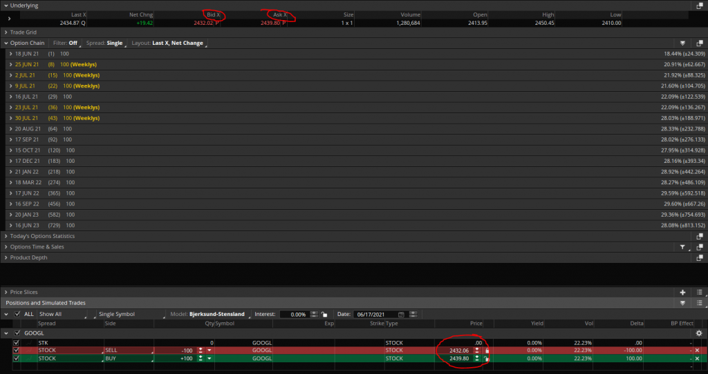

Algorithmic trading refers to the use of computer algorithms to execute trading orders in financial markets. These algorithms enable traders to make precise and swift decisions without human intervention, utilizing pre-defined criteria and mathematical models. This approach has gained significant importance in the financial markets due to its ability to process vast amounts of data at high speed, reduce costs, and enhance the accuracy of trading decisions.

Thinkorswim, a trading platform provided by TD Ameritrade, is recognized as a leading choice among traders for its robust features and user-friendly interface. It offers a vast array of tools for comprehensive market analysis, advanced charting, and customizable trading strategies, making it a preferred platform for both novice and experienced traders.



At the core of Thinkorswim's customization capabilities is thinkScript, a powerful scripting language that enables traders to create custom studies, strategies, and alerts tailored to their specific trading needs. With thinkScript, users can develop personalized indicators and strategies, execute automated trading tasks, and receive real-time alerts based on specific market conditions.

The primary goal of this article is to offer a comprehensive tutorial on using thinkScript for algorithmic trading. By understanding and applying thinkScript, traders gain the ability to enhance their trading strategies and improve decision-making processes. The skills acquired through mastering thinkScript can lead to more informed and timely trading decisions, potentially increasing profitability and reducing risk.

## Table of Contents

## Understanding thinkScript

thinkScript is a proprietary scripting language specifically designed for the Thinkorswim trading platform by TD Ameritrade. It serves as a tool for both novice and expert traders to create custom chart studies, strategies, and alerts, enhancing their trading experience by tailoring it to individual trading needs. One of the language's key strengths lies in its flexibility and power, allowing traders to develop personalized indicators and strategies to analyze market data and execute trades logically and efficiently.

The architecture of thinkScript is structured to be accessible for those familiar with programming, yet robust enough for complex analysis. The basic syntax resembles that of commonly known scripting languages such as JavaScript or Python, making it relatively easy for beginners to learn. However, its real strength is in its domain-specific functions and constructs designed for financial data manipulation and technical analysis.

thinkScript scripts can be broadly categorized into three types: studies, strategies, and alerts.

1. **Studies**: These are visual indicators plotted on charts to help traders identify patterns, trends, or potential turning points in market data. For instance, a simple moving average can be coded using thinkScript to smooth out price data and reveal the underlying trend. 

   Example of a simple moving average in thinkScript:
   ```plain
   input length = 20;
   plot SMA = Average(close, length);
   ```

2. **Strategies**: These scripts allow traders to automate their trading decisions based on predefined criteria. A trading strategy can include conditions for entering and exiting trades, potentially increasing the trader's efficiency by removing emotional or impulsive trading.

   Example of a basic crossover strategy:
   ```plain
   input shortLength = 10;
   input longLength = 30;

   def shortMA = Average(close, shortLength);
   def longMA = Average(close, longLength);

   plot BuySignal = shortMA crosses above longMA;
   plot SellSignal = shortMA crosses below longMA;
   ```

3. **Alerts**: These scripts are designed to notify traders when certain conditions are met. Alerts can be customized to trigger based on their strategies or specific market events, allowing traders to stay informed without constantly monitoring the markets.

   Example of an alert for a moving average crossover:
   ```plain
   input shortLength = 10;
   input longLength = 30;

   def shortMA = Average(close, shortLength);
   def longMA = Average(close, longLength);

   alert(shortMA crosses above longMA, "Buy Signal Triggered", Alert.BAR, Sound.Bell);
   ```

thinkScript allows for the seamless integration of these scripts into the Thinkorswim platform, taking full advantage of its real-time data processing capabilities. This empowers traders to craft a highly individualized trading environment, supporting better decision-making through advanced technical analysis and strategic automation.

In conclusion, the versatility of thinkScript makes it a highly valuable tool for traders aiming to optimize their trading strategies in a more effective and personalized manner. Users can enhance their analytical prowess and automate their trading processes by leveraging thinkScript to its full potential.

## Setting Up thinkScript for Algorithmic Trading

To begin using thinkScript for [algorithmic trading](/wiki/algorithmic-trading), gaining access to the Thinkorswim platform is a necessary first step. Provided by TD Ameritrade, Thinkorswim is a feature-rich trading platform designed for both novice and experienced traders alike. Users can download the platform directly from the TD Ameritrade website by creating an account and following the instructions provided.

Once Thinkorswim is installed, users can access the thinkScript editor, which serves as a hub for creating and managing custom scripts. To open the editor, select the “Charts” tab on the top menu, then click on “Studies” located in the upper right corner of the interface. From the dropdown menu, choose “Edit Studies” and subsequently, click the “Create” button to start a new thinkScript project.

Key components of the Thinkorswim interface are tailored to support thinkScript operations. The platform integrates a charting window that enables script visualization, a script editor for coding, and a console for error diagnostics. The charting window is essential for applying scripts to market data, allowing traders to observe real-time or historical changes based on their scripts. The editor supports syntax highlighting and auto-completions, facilitating the scripting process and minimizing coding errors.

To execute and test scripts, users enter the code in the editor and utilize the “Apply” and “OK” buttons for deployment. Scripts are immediately reflected in the charting window, where their impact on price trends or indicators can be evaluated. Testing scripts with different market conditions can help in identifying potential improvements or errors. The Thinkorswim PaperMoney feature further allows users to test their scripts in a simulated environment without financial risk.

Troubleshooting is a crucial aspect of thinkScript setup. Common problems encountered may include syntax errors or logical mistakes that prevent scripts from running as expected. Error messages in the console often indicate the specific line and nature of the scripting error, thus guiding corrective actions. Additionally, utilizing built-in examples and templates provided by Thinkorswim can be an invaluable resource for beginners. Regularly saving script progress and keeping backups can prevent data loss and facilitate the iterative development process.

In summary, setting up thinkScript within Thinkorswim involves accessing the platform, navigating essential components for script development, effectively running and testing scripts, and troubleshooting issues that may arise. With these foundational skills, traders are better equipped to harness the potential of thinkScript in enhancing their trading strategies.

## Building Custom Indicators

Custom indicators are pivotal tools in technical analysis, allowing traders to analyze financial data based on their specific trading strategies and preferences. Unlike standard indicators, custom indicators are tailored to meet individual analytical needs, providing unique insights and potentially uncovering profitable trading opportunities that generic indicators might miss.

### Step-by-step Guide on Creating a Custom Indicator Using thinkScript

Creating custom indicators in thinkScript involves several essential steps. Below is a detailed guide to help you build your own indicator within the Thinkorswim platform:

1. **Access the thinkScript Editor**: 
   - Open Thinkorswim and navigate to the Charts tab.
   - Select ‘Studies’ and then ‘Edit Studies’ to access the thinkScript editor.

2. **Define Your Indicator Logic**:
   - Decide what financial measure you want to analyze or visualize, such as a moving average or a new composite index.
   - Clear understanding of your goal will guide the script logic.

3. **Start with the Basic Script Structure**:
   ```thinkscript
   def indicatorName = YourIndicatorCalculation;
   plot plotName = indicatorName;
   ```
   - Replace `YourIndicatorCalculation` with the specific logic for your indicator.
   - `plotName` is the label for your plotted result on the chart.

4. **Incorporate Existing thinkScript Functions**:
   - Utilize built-in functions like `Average`, `ExpAverage`, etc., to calculate values.
   - Example for a simple moving average (SMA):
     ```thinkscript
     def sma = Average(close, 20);
     plot SMA_Line = sma;
     ```

5. **Enhance with Conditional Logic**:
   - Add if-else conditions to enhance functionality, e.g., change plot style based on specific conditions.
   ```thinkscript
   plot SMA_Line = if close > sma then sma else Double.NaN;
   SMA_Line.SetDefaultColor(Color.GREEN);
   ```

### Examples of Popular Indicators and Modifications

Commonly used indicators can often be adapted into custom forms:

- **Moving Averages**:
  - Modify period lengths or combine different types to get a weighted view.
  - Example: Weighted Moving Average (WMA) that provides more emphasis on recent data can be custom-coded for specific periods.

- **Relative Strength Index (RSI)**:
  - Customize the length or add alerts when a specific threshold is crossed.

### Testing and Validating Custom Indicators

Testing is crucial to ensure accuracy and effectiveness:

- Use historical data to validate; apply the indicator on varied timelines to gauge performance under different market conditions.
- Compare the custom indicator’s signals against actual price movements and other standard indicators.
- Backtesting software, integrated within Thinkorswim, can be exceptionally useful for this.

### Tips on Optimizing Custom Indicators

- **Code Efficiency**:
  - Simplify the logic by removing unnecessary calculations. Each indicator line should have a clear purpose.
  - Use `rec` variables for recursive calculations that build over time, enhancing efficiency.

- **Visual Clarity**:
  - Customize colors and styles for clarity. This helps in quickly identifying trends and changes on the chart.
  ```thinkscript
  SMA_Line.SetStyle(Curve.SHORT_DASH);
  SMA_Line.SetLineWeight(2);
  ```

- **Continuous Improvement**:
  - Regularly revisit and refine indicators, taking into account new market data and changes in trading strategies.
  - Engage with online communities and forums to learn about new techniques and indicators being developed by other traders.

In summary, mastering the creation of custom indicators in thinkScript provides an opportunity not just to tailor your technical analysis tools to specific needs but also to potentially improve the accuracy and profitability of your trading decisions.

## Developing Trading Strategies with thinkScript

Algorithmic trading strategies involve using computer programs to execute trading orders based on predefined criteria and instructions. These strategies are beneficial because they enable traders to execute orders at speeds and frequencies that a human trader cannot achieve. Additionally, they help in minimizing emotions in trading, implementing time-sensitive trading strategies, and reducing transaction costs by sharply executed trades.

To create a trading strategy using thinkScript within Thinkorswim, follow these steps:

1. **Define Your Trading Strategy**: Start by outlining the logic and conditions that will form your trading strategy. For example, you might want to buy a stock when the moving average of its price crosses above another moving average.

2. **Access the thinkScript Editor**: Log into the Thinkorswim platform, navigate to the 'Charts' tab, and open the 'Studies' menu. Select 'Edit Studies', and then click 'Create' to open the thinkScript editor.

3. **Write the thinkScript Code**: Use the thinkScript editor to write your strategy code. Here's a basic example of a moving average crossover strategy:

   ```thinkscript
   # Define a 50-day and a 200-day moving average
   def shortTermMA = Average(close, 50);
   def longTermMA = Average(close, 200);

   # Identify the crossover
   def buySignal = shortTermMA crosses above longTermMA;

   # Plot the signals
   plot Buy = buySignal;
   Buy.setPaintingStrategy(PaintingStrategy.BOOLEAN_ARROW_UP);
   Buy.setDefaultColor(GetColor(1));
   ```

4. **Test the Strategy**: After coding, it's crucial to backtest the strategy to evaluate its performance. In Thinkorswim, this can be done using the 'Strategies' tab within the thinkScript editor. Specify historical data parameters to simulate real trading conditions.

5. **Analyze Performance**: Review the backtest results by examining metrics such as total return, volatility, drawdowns, and Sharpe ratio. These metrics will help assess the effectiveness and risk of the strategy.

6. **Iterate and Refine**: Based on backtest results, refine the strategy by adjusting parameters or logic. You might want to introduce new conditions or constraints, such as volume filters or risk management rules, to improve performance.

   Example of advanced strategy modification:
   ```thinkscript
   # Add a volume condition to the moving average crossover strategy
   def highVolume = volume > Average(volume, 50);
   def buySignalWithVolume = buySignal and highVolume;

   plot BuyWithVolume = buySignalWithVolume;
   BuyWithVolume.setPaintingStrategy(PaintingStrategy.BOOLEAN_ARROW_UP);
   BuyWithVolume.setDefaultColor(GetColor(2));
   ```

Iterating on strategies includes frequently testing and fine-tuning to reflect changing market conditions or insights. Continuous learning and adaptation help in maintaining the relevance and effectiveness of algorithmic trading strategies over time. By leveraging thinkScript, traders can harness customizable tools to enhance their trading decision-making capabilities.

## Automating Alerts and Conditions

thinkScript alerts are an essential component of the Thinkorswim platform that facilitate the automation of trading decisions by enabling traders to respond promptly to specific market conditions without the need for constant monitoring. Alerts in thinkScript are triggered based on user-defined conditions, allowing traders to streamline operations and optimize decision-making processes.

To write and implement alert conditions within thinkScript, users need to define criteria upon which the alert will be triggered. This involves using logical expressions that evaluate real-time data against predefined parameters. For example, a simple alert can be set up when a stock crosses above its 50-day moving average. The following thinkScript code snippet demonstrates such an alert condition:

```plaintext
def movingAvg = Average(close, 50);
def priceCrossing = close crosses above movingAvg;
Alert(priceCrossing, "Price crossed above 50-day moving average", Alert.BAR, Sound.Ring);
```

In this example, the `Average` function calculates the 50-day moving average of the stock's closing price. The `crosses above` operator checks whether the recent closing price has crossed above this moving average. When this condition is satisfied, the `Alert` function notifies the user with a specified message and sound.

Typical alerts used in trading setups range from simple moving average crossovers to more complex conditions involving multiple indicators. For example, an alert may be configured to trigger when both the relative strength index (RSI) and the moving average convergence divergence (MACD) histogram suggest a buy signal:

```plaintext
def rsiValue = RSI(length = 14);
def macdHist = MACDHistogram();
def buySignal = rsiValue < 30 and macdHist > 0;
Alert(buySignal, "Buy signal detected based on RSI and MACD", Alert.BAR, Sound.Bell);
```

Integrating alerts with trading strategies is vital for real-time execution. Alerts can be coupled with automated execution mechanisms to fully harness the benefits of algorithmic trading. This integration might involve setting up conditional orders that are activated once an alert triggers. It ensures that trades are executed in alignment with the predefined strategy without manual intervention, allowing traders to capitalize on market opportunities swiftly and efficiently.

Common problems encountered when automating alerts include incorrect alert conditions and unnecessarily frequent triggers. To address these, traders should ensure that the logical conditions in their scripts accurately reflect their trading strategy. Testing alerts in a simulated trading environment can identify and rectify issues related to false positives or redundant triggers.

Additionally, some alerts may not trigger as expected due to time frame mismatches or data discrepancies. Ensuring that all components of the trading setup are synchronized and using real-time data can mitigate these problems. Furthermore, documenting alert conditions and utilizing Thinkorswim's [backtesting](/wiki/backtesting) features can equip traders with valuable insights into refining their scripts for improved performance.

Adopting these strategies can significantly enhance the effectiveness of thinkScript alerts, supporting more informed and efficient trading decisions through automation.

## Best Practices for thinkScript in Algo Trading

When writing thinkScript for algorithmic trading on the Thinkorswim platform, achieving a high standard of code craftsmanship is crucial for both functionality and maintainability. One of the foremost principles is the creation of clean, readable code. This encompasses using meaningful variable names, consistent indentation, and modular design where possible. Readable code is easier to debug, understand, and maintain—not only for the original author but also for others who might work on the script later.

Documentation and comments are integral to maintaining code clarity and usability over time. Effective documentation can include a file header that describes the script's purpose, as well as comments throughout the code to explain complex logic or calculations. These notes act as a guide, providing future users or developers with the context and rationale behind certain coding choices and helping prevent errors arising from misunderstandings.

Continuous testing and iterative development are recommended practices to ensure script performance and reliability. Traders should regularly test their scripts on historical data through backtesting to verify that their strategies perform as expected across different market conditions. Iteration allows for the refinement of scripts to optimize for speed, accuracy, and resource management. This process may involve adjusting parameters, enhancing logic, or incorporating new insights.

Taking advantage of online resources and community forums can further enhance one's understanding and troubleshooting capabilities. Platforms like the Thinkorswim community forums, Stack Exchange, and various online courses offer valuable insights and solutions from experienced traders and programmers. Engaging with these communities not only aids in solving specific problems but also provides an opportunity to keep up with the latest trends and techniques in algorithmic trading.

Finally, it is crucial to address the ethical considerations and risks associated with automated trading. Algorithmic trading can execute high-frequency trades with minimal human intervention, potentially impacting market dynamics. Traders must ensure their algorithms adhere to legal standards and ethical guidelines designed to prevent market manipulation, such as spoofing or front-running. Additionally, risks including technical failures, unexpected market movements, and overfitting in backtesting must be managed to prevent financial loss and protect market integrity.

By adhering to these best practices, traders can create robust, efficient, and ethical trading algorithms that enhance their trading strategies on the Thinkorswim platform.

## Conclusion

thinkScript, as covered in this article, serves as a powerful tool within the Thinkorswim platform by TD Ameritrade, enabling traders to develop custom trading strategies, indicators, and alerts. Its intrinsic value lies in providing users with the ability to create tailored solutions that can adapt to varying market conditions, thereby enhancing strategic flexibility and decision-making processes.

Key learnings highlight that thinkScript's scripting language is approachable for traders familiar with basic programming concepts. Its comparison to other languages shows a relatively straightforward syntax, making it accessible to beginners. The platform's capability to allow the creation of studies, strategies, and alerts underscores thinkScript’s utility in customizing trading setups. By understanding the interplay between these elements, traders can build more nuanced and responsive trading systems.

Experimentation with thinkScript is encouraged as practice enhances proficiency and understanding of its features. As traders create and iterate on different scripts, they unlock new levels of insight and efficiency. Testing and refining scripts based on performance outcomes form a critical step in developing robust trading strategies.

The transformative potential of thinkScript extends beyond beginner scripts; it opens doors to more sophisticated analysis and automation. Users are encouraged to explore advanced features within Thinkorswim, such as advanced function capabilities for complex strategies or condition scripting for dynamic alerts.

To support ongoing learning, traders should engage with online resources such as community forums, tutorials, and educational content provided by TD Ameritrade. These platforms offer valuable insights, troubleshooting advice, and the latest updates on thinkScript functionalities, fostering a collaborative environment for sharing knowledge and innovations.

By embracing thinkScript and the dynamic tools offered by Thinkorswim, traders position themselves at the forefront of algorithmic trading innovation, leveraging bespoke solutions to elevate their trading strategies and outcomes.

## References & Further Reading

[1]: ["thinkScript Learning Center"](https://toslc.thinkorswim.com/center/charting/thinkscript.html) - Thinkorswim's official documentation and learning resource for thinkScript.

[2]: ["Quantitative Trading: How to Build Your Own Algorithmic Trading Business"](https://books.google.com/books/about/Quantitative_Trading.html?id=j70yEAAAQBAJ) by Ernest P. Chan - A guide to developing algorithmic trading strategies and understanding quantitative trading.

[3]: ["Algorithmic Trading: Winning Strategies and Their Rationale"](https://www.wiley.com/en-us/Algorithmic+Trading%3A+Winning+Strategies+and+Their+Rationale-p-9781118460146) by Ernie Chan - A practical guide to understanding the essential elements of algorithmic trading.

[4]: ["Advances in Financial Machine Learning"](https://www.wiley.com/en-us/Advances+in+Financial+Machine+Learning-p-9781119482086) by Marcos Lopez de Prado - This book provides tools and techniques for the application of machine learning in financial markets.

[5]: ["Evidence-Based Technical Analysis: Applying the Scientific Method and Statistical Inference to Trading Signals"](https://www.amazon.com/Evidence-Based-Technical-Analysis-Scientific-Statistical/dp/0470008741) by David Aronson - A comprehensive guide that employs the scientific method in technical analysis trading.