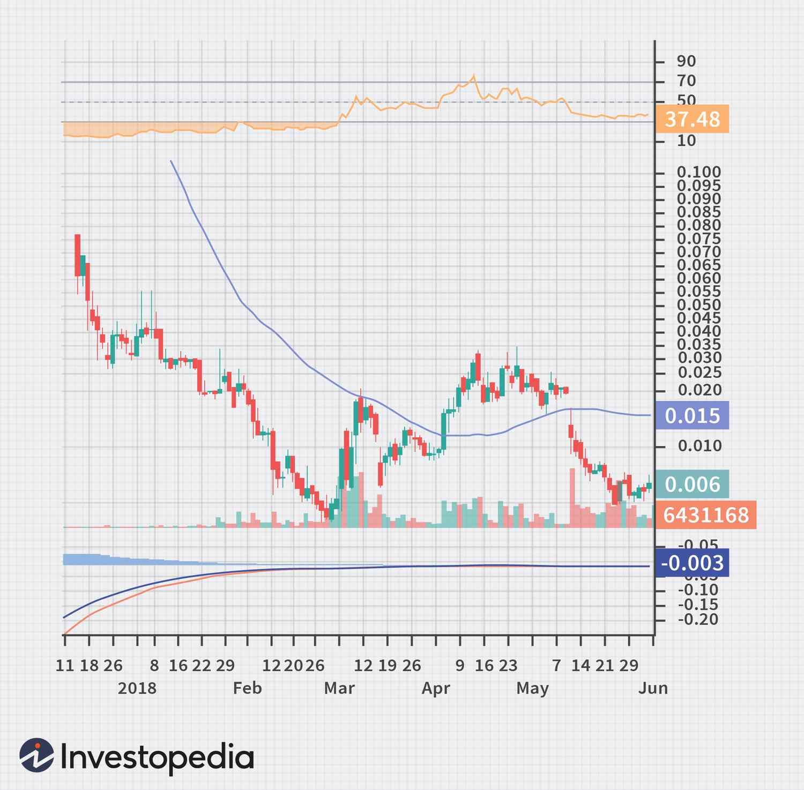

Thinly traded securities are financial instruments that experience low trade volumes and wide bid-ask spreads. These characteristics result from limited participation in the market, leading to reduced liquidity. As a consequence, investors may find it challenging to execute large transactions without significantly affecting the asset's price. Thinly traded securities are commonly found in over-the-counter (OTC) markets, where securities are not listed on formal exchanges and trading occurs directly between parties. Due to their nature, these securities pose higher liquidity risks and are often subject to greater price volatility. This can make them less attractive to risk-averse investors but potentially rewarding for those willing to navigate the uncertainty.

Algorithmic trading, on the other hand, has revolutionized modern financial markets. It involves the use of computers to execute trading orders based on pre-determined criteria at speeds and volumes impossible for human traders. Driven by technological advancements, algorithmic trading offers efficiencies in terms of speed, cost, and precision. Algorithms can process vast amounts of data and react to market conditions in fractions of a second, providing an edge in markets where timing is crucial.

The interaction between thinly traded markets and algorithmic trading creates both opportunities and risks. Algorithmic strategies can exacerbate volatility in thinly traded securities, as the speed and volume of trading can lead to rapid price swings. Moreover, the lack of liquidity in these markets makes them susceptible to potential exploitation through market manipulation. Algorithms might inadvertently impact the market due to the lack of human oversight, where quick automated decisions override careful analysis.

This introduction sets the stage to explore the complexities, benefits, and risks associated with algorithmic trading in thinly traded markets, emphasizing the necessity for strategic awareness and regulation to ensure market stability and fairness.

## Table of Contents

## Understanding Thinly Traded Securities

Thinly traded securities are financial instruments characterized by low trading volumes, leading to limited market activity. This lack of liquidity often results in wide bid-ask spreads, which is the difference between the highest price a buyer is willing to pay for an asset and the lowest price a seller is willing to accept. These conditions can make it challenging for investors to execute trades without affecting the stock price significantly, consequently influencing the overall transaction cost.

A security can be classified as thinly traded when its average daily volume is considerably lower than that of more liquid securities such as large-cap stocks or frequently traded index funds. This low volume means fewer transactions occur over a period, resulting in less price transparency and increased difficulty in determining an asset's fair market value. As a result, market dynamics such as supply and demand have a more pronounced impact on the price of thinly traded securities.

Thin trading is commonly found in over-the-counter (OTC) markets, small-cap stocks, and various niche instruments such as certain municipal bonds and restricted stocks. OTC markets, unlike formal exchanges, do not have a centralized trading venue, which often leads to scant trading activity. In these environments, the lack of regular buying and selling can create an opaque market, further complicating the valuation process for these securities.

Liquidity risk is a significant concern when dealing with thinly traded securities. Due to their infrequent trading, it can be difficult for investors to buy or sell large quantities of these securities promptly and at a fair price. This risk is exacerbated during market downturns or other periods of financial stress, where the reduced number of buyers can lead to significant price depreciation as sellers struggle to offload positions.

Volatility is another critical issue linked with thinly traded markets. The price of thinly traded securities can be highly volatile, as even small orders can heavily influence market prices due to the lower number of transactions. This [volatility](/wiki/volatility-trading-strategies) may deter risk-averse investors and contribute to increased speculative trading, where market participants may seek to capitalize on rapid price movements despite the underlying investment risks.

In conclusion, the nature of thinly traded securities—marked by low [volume](/wiki/volume-trading-strategy) and wide bid-ask spreads—presents unique challenges and risks, primarily associated with [liquidity](/wiki/liquidity-risk-premium) and volatility. These factors necessitate careful consideration and strategic planning from investors to mitigate potential adverse effects in such market environments.

## Algorithmic Trading: An Overview

Algorithmic trading represents a significant evolution in the way financial markets operate, characterized by the use of complex algorithms and rapid execution speeds. At its core, [algorithmic trading](/wiki/algorithmic-trading) pertains to the deployment of computer programs to execute trading strategies based on predetermined criteria. These criteria can include a diverse range of variables, such as timing, price, and volume, which are used to make decisions about buying or selling financial securities.

The reliance on robust technological frameworks is central to algorithmic trading. At the hardware level, high-frequency trading ([HFT](/wiki/high-frequency-trading-strategies)) infrastructure often employs cutting-edge technology, including colocated servers and dedicated communication lines, allowing for millisecond or even microsecond latency in order execution. On the software side, algorithms are designed using advanced programming techniques and data analytics tools. For example, Python, with its rich ecosystem of libraries like NumPy, Pandas, and Scikit-learn, facilitates the development and [backtesting](/wiki/backtesting) of trading strategies, while [machine learning](/wiki/machine-learning) algorithms are increasingly integrated into trading models to identify patterns and predict market movements.

One of the primary advantages of algorithmic trading is its ability to process large volumes of data far more quickly than a human trader. This capability leads to faster decision-making and enhanced market efficiency, as algorithms can react to market shifts in real time, uncovering [arbitrage](/wiki/arbitrage) opportunities that may be imperceptible to human observers. Additionally, algorithmic trading reduces the risk of human errors that can occur due to fatigue or emotional biases. Automated execution of trades ensures consistency, enabling traders to follow their strategies without deviation.

Furthermore, algorithmic trading contributes to increased liquidity in financial markets, as it often involves a [high frequency](/wiki/high-frequency-trading) of trades that help narrow bid-ask spreads, thereby facilitating smoother transactions. This increased market liquidity can be particularly beneficial in volatile environments, where traditional trading methods may struggle.

In summary, algorithmic trading enhances the functionality and efficiency of financial markets through the strategic application of technology. Its reliance on sophisticated algorithms and speedy executions underscores its crucial role in modern finance, offering considerable benefits such as operational efficiency, reduced costs, and improved accuracy in trading activities. As these systems evolve, they continue to redefine the boundaries of financial trading, introducing a dynamic interplay between technology and market behavior.

## Risks in Thinly Traded Markets Using Algorithmic Trading

Algorithmic trading, while enhancing efficiency and speed, introduces specific risks when applied to thinly traded markets. One key risk is market manipulation. Algorithms can be programmed to engage in practices like spoofing—placing large orders intending to cancel them before execution to create false price movement and deceive other market participants. This threat is amplified in thin markets due to their lower liquidity, where even modest trades can disproportionately influence prices.

Increased volatility represents another significant risk. In thinly traded markets, the presence of algorithmic trading exacerbates price fluctuations. Algorithms execute trades based on set conditions that might not account for the market's illiquidity, thus altering supply-demand dynamics swiftly. Unlike more robust markets, where large orders might barely nudge prices, similar volumes in thinly traded sectors can lead to unanticipated sharp price swings, destabilizing the market.

Concerns about human oversight and decision-making in algorithmic trading also arise prominently in thinly traded markets. The reliance on predefined algorithms can reduce the opportunity for human judgment. While the algorithms autonomously execute trades, the lack of human intuition and adaptability can prove detrimental. Particularly in thin markets, where unexpected market conditions are more frequent, the absence of human intervention can lead to suboptimal trading decisions. It is essential to incorporate mechanisms for human oversight to assess and intervene in irregular situations that algorithms might misinterpret.

In conclusion, algorithmic trading poses substantial risks in thinly traded markets, primarily linked to market manipulation, heightened volatility, and insufficient human oversight. Stakeholders should remain vigilant about these risks, integrating safeguards and adaptive strategies to ensure market stability and fairness.

## Impact on Investors and Market Dynamics

Algorithmic trading within thinly traded markets significantly affects both retail and institutional investors. Due to the nature of thinly traded securities, which are characterized by low trading volumes and wide bid-ask spreads, the introduction of algorithmic strategies can lead to pronounced market dynamics impacting investor outcomes.

### Impact on Retail and Institutional Investors

Algorithmic trading can present a mixed bag for investors. Retail investors may find themselves at a disadvantage due to the speed and sophistication of algorithmic strategies. High-frequency trading algorithms can exploit inefficiencies in thinly traded markets more rapidly than individual investors, potentially leading to unfavorable execution prices for retail trades. However, institutional investors, equipped with advanced trading technologies, can leverage algorithmic trading to their advantage by efficiently executing large trade orders without significantly impacting the market price. This can be crucial in thinly traded markets where liquidity is sparse.

### Market Liquidity and Price Discovery

The introduction of algorithmic trading to thinly traded markets can alter liquidity and price discovery, though not always positively. On one hand, algorithms can enhance liquidity by adding more buy and sell orders, potentially narrowing the bid-ask spread. Improved liquidity can facilitate better price discovery by reflecting new information about a security’s value more efficiently.

On the other hand, in thinly traded markets, the same algorithms might contribute to artificial liquidity, where the presence of numerous small, rapid trades do not necessarily lead to a stable market condition. This pseudo-liquidity can obscure true price discovery and exacerbate volatility, causing sudden and dramatic price swings that might not align with fundamental values.

### Implications for Market Regulations and Oversight

The dynamics induced by algorithmic trading in thinly traded markets have implications for market regulations and oversight. Regulators are challenged to design frameworks that ensure fair trading environments, particularly as algorithms can be programmed to engage in potentially manipulative practices such as spoofing or layering. These practices can destabilize already fragile markets, compelling regulators to implement stricter monitoring and enhanced surveillance technologies.

Moreover, existing regulations may require updating to cope with the fast-evolving landscape of algorithmic trading. Regulatory bodies might need to establish new guidelines that mandate algorithm transparency, including the disclosure of specific algorithms used in trade execution and their impact on market conditions.

Overall, while algorithmic trading has the potential to improve market efficiency and liquidity, its role in thinly traded markets necessitates careful scrutiny and thoughtful regulation to mitigate negative outcomes for both retail and institutional investors. The aim should be to ensure that advances in trading technologies lead to beneficial rather than detrimental market developments.

## Strategies to Mitigate Risks

To effectively manage risks in thinly traded markets, investors must employ a range of strategies that address the unique challenges these environments present. One of the primary tools available to investors is the use of limit orders. Unlike market orders, which are executed at the best available price, limit orders allow investors to specify the maximum or minimum price at which they are willing to buy or sell a security. This approach provides a protective measure against the wide bid-ask spreads and potential price slippage typical in thinly traded markets. By setting a limit order, investors can execute trades at more favorable prices and avoid the adverse effects of sudden market swings.

Due diligence and comprehensive research are equally crucial for trading in thinly traded markets. Investors should thoroughly evaluate the financial health, historical performance, and growth prospects of securities. This involves analyzing financial statements, keeping abreast of industry trends, and understanding any market events that might affect security pricing. Reliable sources of information and financial models can aid in assessing the potential risks and returns. For example, an investor might employ a discounted cash flow (DCF) model to estimate the intrinsic value of a security and compare it to the current market price. Informed decisions are paramount in these markets, where information asymmetry can lead to significant financial missteps.

Diversification plays a vital role in mitigating the impact of volatility in thinly traded markets. By spreading investments across various asset classes, sectors, and geographies, investors can reduce unsystematic risk. Diversification ensures that the negative performance of one security does not disproportionately affect an investor's portfolio. An efficient diversification strategy might involve constructing a portfolio with assets that have low or negative correlations with each other. For instance, an investor might allocate capital across different sectors like technology, healthcare, and consumer goods to achieve a balanced risk-reward profile.

In summary, employing limit orders, conducting thorough due diligence, and maintaining a diversified portfolio are essential strategies for managing risks in thinly traded markets. These approaches enable investors to navigate the inherent challenges of these markets while minimizing their exposure to potential pitfalls. By remaining vigilant and strategic, investors can better position themselves to take advantage of the opportunities these markets may offer.

## Future Perspectives on Thinly Traded Markets and Algorithmic Trading

The future of algorithmic trading in thinly traded markets is poised for significant transformation, driven by technological advancements and anticipated regulatory changes. As machine learning and [artificial intelligence](/wiki/ai-artificial-intelligence) continue to evolve, these technologies could enable algorithms to better assess market conditions, leading to enhanced trading strategies. With improved pattern recognition and predictive capabilities, algorithms may become more adept at navigating the complexities of thinly traded markets, potentially increasing trading efficiency and reducing volatility. 

Moreover, blockchain technology offers the promise of increased transparency and security in trading activities. The decentralized nature of blockchain could facilitate more robust record-keeping and traceability, qualities that are particularly advantageous in markets where information asymmetry and lack of transparency are prevalent. The adoption of smart contracts could also streamline the execution of trades by automating conditions for transactions, thereby reducing human intervention and the associated risks.

In terms of potential regulatory changes, there is an increasing focus on creating frameworks that ensure the fair and orderly functioning of markets influenced by algorithmic trading. Regulators may introduce stricter reporting requirements for trades executed by algorithms to enhance market oversight. Implementing circuit breakers or kill switches specifically tailored for thinly traded markets could mitigate the risk of runaway algorithms exacerbating market instability. 

Additionally, regulations might evolve to mandate comprehensive testing of algorithms under various market conditions to ensure they can handle the unique challenges posed by thinly traded securities. This could include stress testing algorithms in simulated environments that mimic real-world scenarios. Enhanced scrutiny and compliance standards could safeguard against potential abuses, such as market manipulation and front-running, thereby protecting the integrity of the markets.

In summary, the intersection of advanced technology and evolving regulatory frameworks is poised to redefine the landscape of algorithmic trading in thinly traded markets. These developments could foster greater market stability, improve liquidity, and protect investors by addressing the challenges inherent to these markets. As both technology and regulatory environments continue to advance, the dynamic between algorithmic trading and thinly traded securities will likely continue to evolve, necessitating ongoing vigilance and adaptation.

## Conclusion

The intersection of thinly traded markets and algorithmic trading encapsulates a complex dynamic that poses unique challenges and opportunities in the financial markets. Thinly traded securities, characterized by low trading volume and wide bid-ask spreads, present inherent liquidity risks and potential price volatility. When algorithmic trading is applied in such markets, these risks can become amplified due to the rapid execution and potential market impact of algorithms. Algorithmic trading brings advantages, such as efficiency and speed, but in thinly traded environments, it may also lead to undesirable market manipulation and heightened volatility.

Investors and market participants must navigate these complexities with heightened awareness and strategic foresight. This involves employing risk management strategies, such as using limit orders to protect against adverse price movements and conducting thorough due diligence to understand market dynamics. The role of diversification becomes crucial in mitigating the effects of volatility on investment portfolios.

As technology evolves, the landscape of algorithmic trading will continue to change, potentially altering the dynamics of thinly traded markets even further. Advancements in machine learning and artificial intelligence may improve predictive capabilities, yet they also require robust oversight to manage new risks. Regulatory frameworks will need ongoing adjustments to ensure fair and stable market conditions, emphasizing transparency and accountability in trading activities.

Given these evolving conditions, continuous research and vigilance are essential. Market participants, regulators, and technology developers must work collaboratively to ensure that the integration of algorithmic trading into thinly traded markets enhances market efficiency without compromising stability or fairness. As both technology and financial markets advance, ongoing adaptation and proactive strategies will remain crucial to navigating these complex environments effectively.

## References & Further Reading

[1]: Song, M., Xue, L., & Chen, Y. (2020). ["Algorithmic and High-Frequency Trading Strategies and Market Conditions."](https://link.springer.com/article/10.1007/s10734-024-01352-5) Journal of Empirical Finance.

[2]: Lopez de Prado, M. (2018). ["Advances in Financial Machine Learning."](https://www.amazon.com/Advances-Financial-Machine-Learning-Marcos/dp/1119482089) John Wiley & Sons.

[3]: Harris, L. (2003). ["Trading and Exchanges: Market Microstructure for Practitioners."](https://www.amazon.com/Trading-Exchanges-Market-Microstructure-Practitioners/dp/0195144708) Oxford University Press.

[4]: Hull, J. C. (2018). ["Options, Futures, and Other Derivatives."](https://www.semanticscholar.org/paper/Options%2C-Futures%2C-and-Other-Derivatives-Hull/89bdee500c8623864fc9eb7a471546aa713acc44) Pearson Education.

[5]: Beber, A., & Pagano, M. (2013). ["Short-Selling Bans Around the World: Evidence from the 2007-09 Crisis."](http://www.csef.it/IMG/pdf/beber_pagano.pdf) Review of Financial Studies.

[6]: Menkveld, A. J. (2013). ["High Frequency Trading and the New Market Makers."](https://papers.ssrn.com/sol3/papers.cfm?abstract_id=1722924) Journal of Finance.