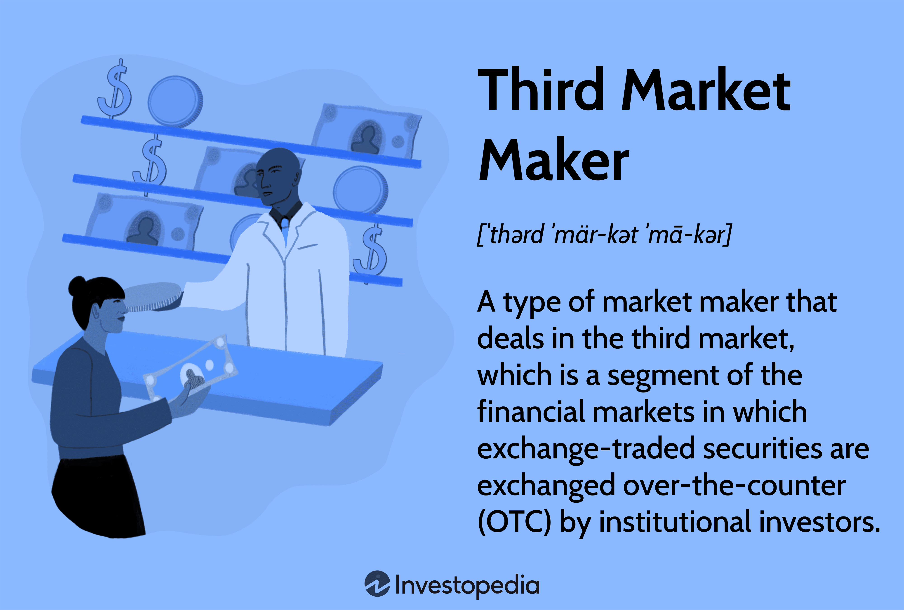

## Table of Contents

## What is the third market?

The third market is a term used in finance to describe the trading of exchange-listed securities that happens outside of the traditional stock exchanges. This means that big investors, like institutions, can buy and sell stocks directly with each other without going through a public exchange like the New York Stock Exchange.

This type of trading is often done through electronic communication networks (ECNs) or other alternative trading systems. The third market is important because it can offer better prices and faster trades for large investors, but it's not available to the average person. It's a way for big players in the market to trade more efficiently.

## How does the third market differ from the first and second markets?

The first market is where new stocks are sold for the first time. This happens when a company goes public through an initial public offering (IPO). People and institutions buy these new stocks directly from the company. The first market is all about new stocks entering the market, and it's a way for companies to raise money.

The second market is where people and institutions trade stocks that have already been sold in the first market. This happens on big stock exchanges like the New York Stock Exchange or NASDAQ. When you buy or sell stocks through a broker, you're usually using the second market. It's where most everyday trading happens.

The third market is different because it's where big investors trade stocks that are listed on public exchanges, but they do it outside of those exchanges. They use special systems like electronic communication networks (ECNs) to trade directly with each other. This can be faster and sometimes cheaper for them, but it's not something the average person can do. The third market is all about big investors finding better ways to trade.

## Who are the main participants in the third market?

The main participants in the third market are big investors like institutional investors. These are groups like pension funds, mutual funds, and insurance companies that manage a lot of money. They use the third market to trade large amounts of stocks without going through public exchanges. This helps them get better prices and faster trades.

These big investors trade with each other using special systems called electronic communication networks (ECNs). These systems let them buy and sell stocks directly, without the need for a traditional stock exchange. The third market is not open to regular people, so it's just for these big players who need to move a lot of money quickly and efficiently.

## What types of securities are typically traded in the third market?

The third market mostly deals with stocks that are already listed on public exchanges. These are the same stocks you can buy on the New York Stock Exchange or NASDAQ, but in the third market, big investors trade them outside of these exchanges. They use special systems to buy and sell these stocks directly with each other.

The main types of securities you'll find in the third market are common stocks and sometimes preferred stocks. These are the shares of big companies that everyone knows. Big investors like pension funds and mutual funds trade these stocks in large amounts because they need to move a lot of money quickly and efficiently.

## What are the advantages of trading in the third market?

Trading in the third market has some big advantages for big investors. One of the main benefits is that they can get better prices. When big investors trade large amounts of stocks, they can sometimes get a better deal by going outside of the public exchanges. This means they might pay less to buy stocks or get more money when they sell them.

Another advantage is that trading in the third market can be faster. Big investors need to move a lot of money quickly, and the third market lets them do that. They use special systems called electronic communication networks (ECNs) to trade directly with each other. This can save time and help them make trades faster than if they went through a public exchange.

## What are the potential risks associated with the third market?

Trading in the third market can be risky for big investors. One big risk is that there might not be as many buyers and sellers as there are on public exchanges. This can make it harder to find someone to trade with, especially if you want to buy or sell a lot of stocks at once. If there aren't enough people to trade with, you might not be able to make the trade you want, or you might have to wait longer than you planned.

Another risk is that the prices in the third market can be different from the prices on public exchanges. Sometimes, the prices can be better, but other times they might not be as good. This can make it hard to know if you're getting a fair deal. Big investors need to be careful and do their research to make sure they're not paying too much or selling for too little.

## How does the third market impact the overall financial market?

The third market can have a big impact on the overall financial market because it lets big investors trade large amounts of stocks quickly and sometimes at better prices. When these big investors trade outside of public exchanges, they can move a lot of money without affecting the prices on those exchanges too much. This can help keep the market stable because big trades don't cause big price swings on the public exchanges. It also means that big investors can get the stocks they need without waiting, which can help them manage their money better.

On the other hand, the third market can also make things more complicated. Since big investors can trade outside of public exchanges, it can be harder to know what's happening in the market. This can make it more difficult for regular people to understand how stocks are being bought and sold. Also, if the third market grows a lot, it might take away some of the trading that used to happen on public exchanges. This could make those exchanges less important over time, which might change how the whole market works.

## What regulatory considerations are important in the third market?

Regulators need to keep an eye on the third market to make sure it's fair and safe for everyone. They want to stop any bad behavior like insider trading or market manipulation, which can happen when big investors trade outside of public exchanges. Regulators also need to make sure that the special systems used in the third market, like electronic communication networks (ECNs), are working well and following the rules. This helps keep the market honest and protects investors.

Another important thing for regulators is to make sure that the third market doesn't hurt the public exchanges too much. If too much trading happens outside of the public exchanges, it could make those exchanges less important. Regulators need to find a balance so that the third market can help big investors trade better, but not so much that it makes the whole market less fair or less clear for everyone else. This means they need to keep watching and maybe change the rules sometimes to keep everything working well.

## How has technology influenced the development of the third market?

Technology has really changed the third market a lot. It's made it easier for big investors to trade stocks outside of public exchanges. They use special computer systems called electronic communication networks (ECNs) to buy and sell stocks directly with each other. These systems are fast and can handle big trades quickly, which is what big investors need. Because of technology, the third market has grown a lot and become more important in the world of finance.

Technology also helps make the third market more efficient. With computers and the internet, big investors can see prices and make trades in real time, no matter where they are. This means they can find the best deals and move their money faster than ever before. But technology also brings new challenges for regulators, who need to make sure these new systems are fair and safe for everyone. Overall, technology has made the third market a big part of how stocks are traded today.

## Can you explain the process of executing a trade in the third market?

When a big investor wants to trade in the third market, they use a special computer system called an electronic communication network (ECN). First, they log into the ECN and look at the prices of the stocks they want to buy or sell. They can see what other big investors are offering and decide if they want to make a trade. If they find a good price, they can send an order through the ECN to buy or sell the stock. The ECN matches their order with another big investor who wants to do the opposite trade, like selling if they want to buy.

Once the ECN finds a match, the trade happens very quickly. The big investor's order is filled, and the stocks are moved from one investor to another. All of this happens outside of the public stock exchanges, so it can be faster and sometimes cheaper. After the trade is done, the big investor gets a confirmation that the trade went through, and they can see the new stocks in their account. This whole process is made possible by technology, which helps big investors trade large amounts of stocks efficiently.

## What are some historical examples of significant third market transactions?

One big example of a third market transaction happened in the 1980s. Big investors like pension funds and mutual funds started using electronic communication networks (ECNs) to trade stocks outside of public exchanges. This was a new way for them to buy and sell large amounts of stocks quickly and sometimes at better prices. One famous ECN from this time was Instinet, which helped make the third market grow a lot.

Another example is from the early 2000s when big investors used the third market to trade stocks during times when the public exchanges were closed. For example, after the September 11 attacks, the New York Stock Exchange was closed for a few days. Big investors still needed to trade, so they used ECNs to keep buying and selling stocks. This showed how important the third market could be, especially in tough times when the regular markets were not working.

## How might future trends affect the functionality of the third market?

Future trends like better technology and new rules could change how the third market works. As computers and the internet get even faster and smarter, big investors might find new ways to trade stocks outside of public exchanges. They could use things like [artificial intelligence](/wiki/ai-artificial-intelligence) to make trades even quicker and find better prices. This could make the third market grow even more and become a bigger part of how stocks are traded. But, if the technology gets too complicated, it might be hard for regulators to keep everything fair and safe.

New rules from the government could also change the third market. If regulators think the third market is getting too big or causing problems, they might make new laws to control it more. These rules could make it harder for big investors to trade outside of public exchanges, or they might have to share more information about their trades. This could slow down the third market a bit, but it might also make it safer and more fair for everyone. In the end, the future of the third market will depend on how technology and rules change over time.

## References & Further Reading

[1]: Hasbrouck, J. (2007). ["Empirical Market Microstructure: The Institutions, Economics, and Econometrics of Securities Trading."](https://academic.oup.com/book/52241) Oxford University Press.

[2]: Hendershott, T., Jones, C. M., & Menkveld, A. J. (2011). ["Does Algorithmic Trading Improve Liquidity?"](https://onlinelibrary.wiley.com/doi/full/10.1111/j.1540-6261.2010.01624.x) The Journal of Finance, 66(1), 1-33.

[3]: O'Hara, M., & Ye, M. (2011). ["Is Market Fragmentation Harming Market Quality?"](https://www.sciencedirect.com/science/article/pii/S0304405X11000390) Journal of Financial Economics, 100(3), 459-474.

[4]: Narang, R. K. (2009). ["Inside the Black Box: A Simple Guide to Quantitative and High Frequency Trading."](https://onlinelibrary.wiley.com/doi/book/10.1002/9781118267738) Wiley.

[5]: Aldridge, I. (2013). ["High-Frequency Trading: A Practical Guide to Algorithmic Strategies and Trading Systems."](https://www.amazon.com/High-Frequency-Trading-Practical-Algorithmic-Strategies/dp/1118343506) Wiley.

[6]: Financial Industry Regulatory Authority (FINRA). ["Trade Reporting Frequently Asked Questions."](https://www.finra.org/filing-reporting/market-transparency-reporting/trade-reporting-faq)