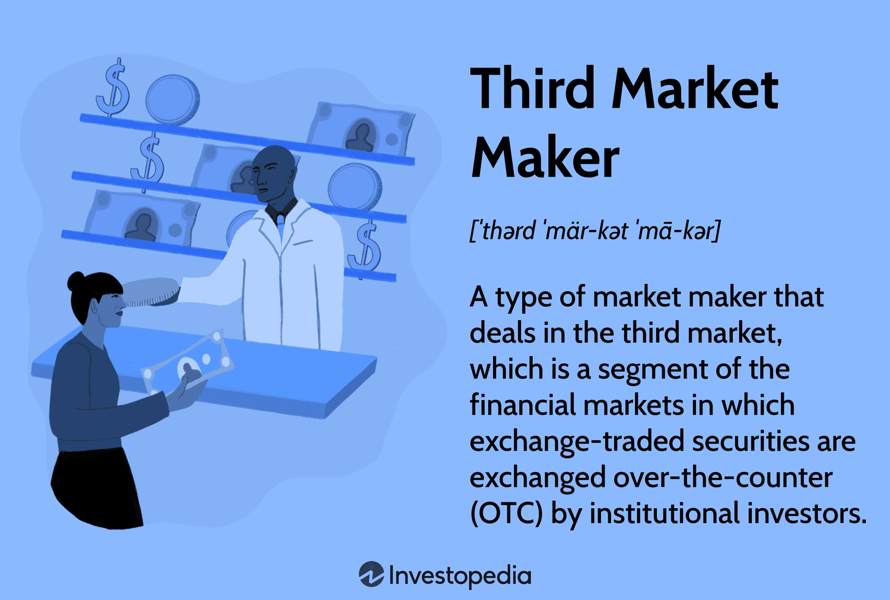

Financial markets are vital components of the global economy, serving as platforms where securities, commodities, and other financial instruments are bought and sold. These markets facilitate the allocation of resources, provide liquidity, and enable price discovery, playing a pivotal role in economic growth and financial stability. The trading mechanisms within these markets are continuously evolving, driven by technological advancements and the increasing complexity of financial instruments.

Algorithmic trading has emerged as a dominant force in the financial sector, marked by the use of computer algorithms to execute trades at speeds and volumes beyond human capability. This technological innovation has transformed trading dynamics, leading to enhanced market efficiency and automation. Algorithmic trading strategies, ranging from simple moving averages to complex machine learning models, have become integral in optimizing trading opportunities and managing risk.



Third market makers operate within the tertiary segment of the financial markets, which involves the trading of listed securities over-the-counter outside traditional exchange settings. They play a critical role in ensuring liquidity and stability by continuously quoting buy and sell prices, thereby facilitating smooth market operations. Third market makers bridge the gap between buyers and sellers, enabling more efficient trade execution.

Understanding market dynamics is essential in the contemporary trading environment as it underpins effective decision-making and strategic development. The financial landscape is characterized by rapid changes, driven by factors such as technological innovation, regulatory shifts, and evolving market participant behavior. Consequently, a comprehensive grasp of these dynamics is imperative for navigating the complexities of modern financial markets.

The purpose of this article is to explore the interplay between third market makers and algorithmic trading. By examining how these two components interact, the article aims to shed light on their collective impact on trading efficiency, liquidity, and cost reduction. This understanding is crucial for traders and market participants aiming to optimize their strategies and adapt to the ever-changing financial market landscape.

## Table of Contents

## Understanding Financial Markets and the Third Market

Financial markets are crucial components of the global economy, facilitating the exchange of financial assets among various entities. These markets serve as platforms where individuals, companies, and governments can raise or invest capital. Essentially, financial markets bring together buyers and sellers, contributing to the efficient allocation of resources and risk. They impact economic activity by determining prices, distributing capital, and providing liquidity.

Financial markets can be divided into distinct segments: primary, secondary, and third markets. Each segment serves a unique function in the exchange and distribution of financial securities:

1. **Primary Markets** – The primary market is where new securities are created and offered to the public. This market enables companies and governments to raise fresh capital through the issuance of stocks and bonds. The initial public offering (IPO) is a common example whereby a company offers its shares to the public for the first time.

2. **Secondary Markets** – In the secondary market, previously issued securities are traded among investors. Exchanges such as the New York Stock Exchange (NYSE) and NASDAQ facilitate these transactions. The secondary market provides liquidity, allowing investors to buy and sell shares freely without impacting the issuing company.

3. **Third Markets** – The third market refers to the trading of exchange-listed securities in over-the-counter (OTC) transactions. This segment allows institutional investors to trade large volumes of stock directly without the typical exchange-related fees and regulations. It offers greater flexibility and can enhance liquidity for large trades.

The third market plays a significant role in financial markets by offering benefits such as reduced transaction costs and improved [liquidity](/wiki/liquidity-risk-premium). It operates parallel to traditional exchanges, typically catering to large institutional investors seeking to execute sizable trades efficiently. The ability to trade large blocks of securities away from a public exchange helps to limit the market impact and price fluctuations that might otherwise occur due to the scale of these transactions.

Participants in the third market include institutional investors, broker-dealers, and market makers. Institutional investors, like mutual funds and pension funds, often look to the third market for executing large trades. Broker-dealers facilitate transactions by connecting buyers and sellers, while market makers provide liquidity by quoting both buy and sell prices for securities. These roles ensure the smooth transition of securities between investors and maintain the market's efficiency and stability.

## Role of Market Makers in the Third Market

Market makers play a pivotal role in the functioning of financial markets, including the third market, by providing liquidity and stability to the trading ecosystem. A market maker is a participant or a firm that quotes both a buy and a sell price in a financial instrument or commodity, hoping to make a profit on the bid-ask spread. Their presence is crucial for efficient market operation, as they ensure that there is always a counterparty for third market participants who wish to buy or sell securities.

In the third market, which involves the trading of exchange-listed securities over-the-counter (OTC), market makers facilitate transactions that may not be easily executed on formal exchanges due to size, timing, or regulation constraints. By standing ready to buy or sell securities at publicly quoted prices, market makers help in reducing the transaction time and cost, thus enhancing market efficiency for large institutional traders.

The activities of market makers in the third market include managing substantial inventories of securities, continuously quoting bid and ask prices, and executing trades quickly to maintain the market's liquidity. They perform these activities using advanced algorithmic systems to match buy and sell orders and to hedge their own positions in order to minimize risk. This is essential for maintaining liquidity, as it ensures that there is always a participant willing to buy or sell, thereby preventing large price fluctuations that could occur if a market is illiquid.

Furthermore, market makers contribute significantly to price stability. By providing liquidity, they help absorb demand and supply shocks, reducing [volatility](/wiki/volatility-trading-strategies) and providing smoother price movements. This stability is vital for investors who require predictable market conditions to engage in trading.

An example of typical third market operations involves large institutional investors seeking to execute large block trades without causing a significant impact on market prices. Market makers facilitate such trades by breaking them into smaller segments and executing them over time or using sophisticated algorithms to find best matching orders, thus minimizing market impact.

In conclusion, market makers in the third market setting are instrumental in ensuring liquidity, facilitating efficient trading, and maintaining price stability. Their ability to provide these services supports a robust trading environment, making them indispensable participants in the financial ecosystem.

## Introducing Algorithmic Trading (Algo Trading)

Algorithmic trading, often referred to as algo trading, is a method of executing orders using automated and pre-programmed trading instructions. These instructions account for variables such as timing, price, and [volume](/wiki/volume-trading-strategy), enabling traders to execute high-speed transactions. This form of trading has gained substantial traction in the financial sector over the past few decades, leading to about 70% of all transactions on financial exchanges being conducted via algorithms as of recent years.

### Growth in the Financial Sector

The growth of [algorithmic trading](/wiki/algorithmic-trading) can be attributed to several factors, including the increasing complexity of financial markets, the need for more efficient trade execution, and advancements in technology. The proliferation of high-frequency trading ([HFT](/wiki/high-frequency-trading-strategies)), a subset of algorithmic trading, has further catalyzed this growth by enabling the execution of millions of transactions per second, allowing traders to capitalize on minute price discrepancies.

### Common Strategies and Algorithms

Common algorithmic trading strategies include:

1. **Trend Following**: This strategy involves trading based on technical indicators such as moving averages and channel breakouts, without making predictions about prices.

2. **Arbitrage**: This takes advantage of price differentials between markets or instruments. It's executed at a speed and volume that would be impossible manually.

3. **Market Making**: Involves quoting both a buy and a sell price to capitalize on the spread between the two.

4. **Mean Reversion**: Based on the theory that asset prices will revert to their mean or average price over time.

5. **Statistical Arbitrage**: A market-neutral strategy that employs statistical methods and computational power to profit from pricing inefficiencies.

A simple Python snippet demonstrating a basic moving average crossover strategy, a form of [trend following](/wiki/trend-following), might look like this:

```python
import numpy as np
import pandas as pd

def moving_average_crossover(prices, short_window=40, long_window=100):
    signals = pd.DataFrame(index=prices.index)
    signals['price'] = prices
    signals['short_mavg'] = prices.rolling(window=short_window, min_periods=1).mean()
    signals['long_mavg'] = prices.rolling(window=long_window, min_periods=1).mean()

    # Create signals
    signals['signal'] = 0.0
    signals['signal'][short_window:] = np.where(signals['short_mavg'][short_window:] 
                                    > signals['long_mavg'][short_window:], 1.0, 0.0)   

    # Generate trading orders
    signals['positions'] = signals['signal'].diff()
    return signals

# Example usage:
# prices = pd.Series([your_price_data])
# signals = moving_average_crossover(prices)
```

### Benefits and Drawbacks

The primary advantage of algorithmic trading is its ability to process massive volumes of data and execute orders much faster than human traders. This not only reduces transaction costs but also minimizes the risk of human errors. Furthermore, algorithmic trading can backtest strategies using historical data to ensure their efficacy before live trading.

However, algorithmic trading is not without drawbacks. The reliance on technology means there is always a risk of system failures, which can result in significant financial losses. Moreover, algorithms can exacerbate market volatility, especially if multiple systems respond to market movements simultaneously in unexpected ways.

### Impact of Technology and Data Analytics

Technological advancements and data analytics have had a profound impact on trading strategies. The increase in computational power has allowed for more sophisticated modeling and predictive analytics, enabling traders to develop more complex algorithms and strategies. Big data analytics provide traders with insights into market trends that were previously inaccessible, driving more informed decision-making processes.

Furthermore, developments in [machine learning](/wiki/machine-learning) and [artificial intelligence](/wiki/ai-artificial-intelligence) (AI) are paving the way for the next generation of algorithmic trading strategies. These technologies are enhancing the ability to adapt and improve strategies over time, learning from new data without human intervention.

In summary, algorithmic trading represents a significant evolution in trading mechanisms and strategies, heavily influenced by technological advancements and data analytics. Its presence in financial markets continues to grow, driven by the demand for speed, efficiency, and data-driven decision-making.

## Synergy Between Third Market Makers and Algorithmic Trading

Third market makers and algorithmic trading represent pivotal constructs in modern financial markets, each serving distinct yet complementary roles that enhance overall market functionality. Third market makers specialize in providing liquidity for securities traded over the counter (OTC) rather than traditional exchanges, often facilitating large block trades for institutional investors. This makes them integral to stabilizing prices by standing ready to buy or sell securities at publicly quoted prices. Their ability to swiftly execute trades significantly impacts the efficiency of algorithmic trading strategies.

Algorithmic trading, often relying on complex quantitative models, necessitates market conditions where ample liquidity is a prerequisite to execute trades efficiently. Third market makers cater precisely to this need by supplying liquidity and reducing the bid-ask spread, thereby lowering transaction costs. These savings are particularly pronounced for algo traders who execute high-frequency strategies where even slight reductions in transaction costs can lead to substantial profitability gains over time. 

An illustrative example of synergy between these components can be seen in the interaction between market makers and high-frequency trading (HFT) firms. HFT strategies, which require rapid execution and minimal market impact, benefit from the liquidity provision and price stability offered by third market makers. By aligning with market makers, HFT firms can execute trades closer to the mid-market price, enhancing the profitability of their strategies.

Moreover, algorithmic trading strategies such as statistical [arbitrage](/wiki/arbitrage) thrive in environments enriched by the presence of third market makers. These market makers help maintain fair pricing across markets by providing arbitrage opportunities through slight mispricings, which algo traders can exploit. This symbiotic relationship ensures that mispricings are quickly corrected, contributing to the overall market efficiency.

In terms of quantifiable benefits, reduced transaction costs and enhanced execution efficiency are paramount. Transaction cost analysis (TCA) often reveals that the presence of robust market-making reduces slippage — the difference between the expected price of a trade and the actual price — further optimizing the execution of algorithmic trades. For example, the implementation shortfall, a measure of the execution quality, can be minimized through effective collaboration with market makers, ultimately enhancing net returns.

In conclusion, the partnership between third market makers and algorithmic trading forms a core component of modern market dynamics. This synergy facilitates a trading environment characterized by greater liquidity, reduced costs, and improved efficiency, ultimately driving success in high-frequency and strategy-driven trades.

## Challenges and Risks in Algorithmic Trading with Market Makers

Algorithmic trading with third market makers presents a unique set of challenges and risks that traders must navigate to ensure successful execution. One primary risk is the potential instability caused by market volatility. Volatility can disrupt the predictive models used in algorithmic trading, leading to substantial discrepancies between expected and actual trade outcomes. This volatility risk is heightened in less liquid third markets, where price fluctuations can be more pronounced due to lower trading volumes and fewer participants.

Technical glitches represent another significant risk. Automated trading systems depend on robust technology infrastructure to function correctly. Software bugs, hardware failures, or connectivity issues can lead to execution errors, such as incorrect order placements or unintended trade executions. These technical glitches can result in financial losses and damage to operational credibility.

Regulatory compliance and transparency present further challenges. Algorithmic trading is subject to regulatory scrutiny to prevent market manipulation and ensure fair trading practices. However, the opaque nature of certain algorithms can make it difficult to demonstrate compliance with regulatory requirements. Transparency in algorithmic strategies is also crucial for building trust with regulators and market participants.

To mitigate these risks, several strategies can be implemented. Robust risk management protocols are essential, including the use of stop-loss orders to limit potential losses. Additionally, conducting thorough [backtesting](/wiki/backtesting) and stress testing of trading algorithms can help identify vulnerabilities and refine strategies before deployment.

Regular audits of trading systems and maintaining a strong IT support structure can minimize the likelihood of technical failures. Furthermore, establishing comprehensive compliance frameworks and engaging with regulators can help ensure adherence to regulatory requirements and enhance transparency.

In conclusion, while algorithmic trading with market makers in the third market offers significant opportunities for efficiency and cost reduction, it is accompanied by distinct challenges and risks related to market volatility, technical issues, and regulatory compliance. Effective risk management practices and a proactive approach to regulatory engagement are crucial for optimizing trading outcomes in this dynamic environment.

## Future Outlook for Financial Markets, Market Makers, and Algo Trading

Technological advancements are poised to radically transform financial markets, market-making, and algorithmic trading. As the integration of technology deepens, several key developments are anticipated.

**Technological Advancements in Financial Markets**

The rise of artificial intelligence (AI) and machine learning (ML) is fundamentally reshaping financial analysis and trading decision-making. AI can process vast datasets to identify patterns and insights that are not immediately visible to human traders. Advanced ML algorithms enable predictive analytics, allowing traders to forecast market movements with greater accuracy.

Blockchain technology is another transformative force, promoting transparency, security, and efficiency in trade processing. By facilitating smart contracts and decentralized finance (DeFi) applications, blockchain may streamline the settlement process, reducing the risk of errors and fraud.

The increased use of real-time data analytics provides traders with immediate insights into market conditions, facilitating quicker and more informed decision-making. Access to real-time data is particularly beneficial in volatile market conditions, where timely decisions are crucial.

**Developments in Algorithmic Trading and Market Making**

Algorithmic trading is expected to grow as traders seek efficiency and speed. Future algorithms will likely leverage enhanced AI/ML capabilities for improved trade execution and strategy optimization. High-frequency trading (HFT) strategies, using sophisticated algorithms, will continue to drive market volumes and liquidity.

Market makers will increasingly rely on technology to maintain liquidity and manage risk. Automated market-making systems can dynamically adjust bid-ask spreads based on market conditions, enhancing price stability and liquidity.

**Regulatory Landscapes and Changes**

Financial markets' regulatory frameworks are poised for change as technology evolves. Regulators may impose stricter guidelines on data privacy, cybersecurity, and AI usage to ensure market integrity. As algorithmic trading becomes more prevalent, transparency mandates may require firms to disclose algorithmic strategies to prevent market manipulation.

Regulatory bodies might also focus on managing systemic risks associated with HFT, particularly concerning market volatility and flash crashes.

**Strategy Adaptation for Future Readiness**

To remain competitive, financial institutions must adapt their strategies to leverage emerging technologies. Firms are expected to invest heavily in technology infrastructure and talent capable of developing and managing complex trading algorithms.

Risk management strategies will need refinement to address new risks associated with advanced trading technologies. Employing robust testing environments and simulation models can help anticipate and mitigate the impacts of rare market events.

In conclusion, the interplay of technology and finance presents both opportunities and challenges. By embracing cutting-edge developments, market participants can enhance efficiency, reduce costs, and better navigate future financial landscapes. However, robust frameworks for risk management and regulatory compliance are crucial to ensuring the long-term stability and integrity of financial systems.

## Conclusion

The interplay between the third market, market makers, and algorithmic trading is a critical component in understanding contemporary financial markets. Third market makers facilitate the trading of listed securities over-the-counter, often enhancing liquidity and ensuring price stability, which are essential for effective market function. Algorithmic trading, meanwhile, leverages computational power and advanced algorithms to execute trades at speeds and efficiencies beyond human capabilities.

The collaboration between third market makers and algorithmic trading has proven beneficial in optimizing trade execution by reducing transaction costs and enhancing liquidity efficiencies. Market makers provide the necessary conditions—through continuous buy and sell quotations—that allow algorithms to perform optimally, particularly in the usually less liquid third market. This synergy not only promotes market robustness but also offers traders more accurate pricing and execution reliability.

In an evolving financial landscape, comprehending and adapting to market changes remains paramount. As technological innovations continue to shape trading mechanisms, participants must be adept in leveraging these advancements to stay competitive. Understanding the constraints and potentials offered by third market makers and algorithmic strategies is essential for informed decision-making and effective strategy formulation.

Optimizing trading strategies requires a nuanced appreciation of the combined capabilities and limitations presented by both market makers and algorithmic trading. By fostering comprehensive cooperation between these components, traders can better navigate the complexities of modern markets, ultimately contributing to more resilient and dynamic trading environments. Such strategic alignment is crucial for not only maximizing returns but also for sustaining long-term market equilibrium and growth.

## References & Further Reading

[1]: Bergstra, J., Bardenet, R., Bengio, Y., & Kégl, B. (2011). ["Algorithms for Hyper-Parameter Optimization."](https://papers.nips.cc/paper/4443-algorithms-for-hyper-parameter-optimization) Advances in Neural Information Processing Systems 24.

[2]: ["Advances in Financial Machine Learning"](https://www.amazon.com/Advances-Financial-Machine-Learning-Marcos/dp/1119482089) by Marcos Lopez de Prado

[3]: ["Evidence-Based Technical Analysis: Applying the Scientific Method and Statistical Inference to Trading Signals"](https://www.amazon.com/Evidence-Based-Technical-Analysis-Scientific-Statistical/dp/0470008741) by David Aronson

[4]: ["Machine Learning for Algorithmic Trading"](https://github.com/PacktPublishing/Machine-Learning-for-Algorithmic-Trading-Second-Edition) by Stefan Jansen

[5]: ["Quantitative Trading: How to Build Your Own Algorithmic Trading Business"](https://books.google.com/books/about/Quantitative_Trading.html?id=j70yEAAAQBAJ) by Ernest P. Chan