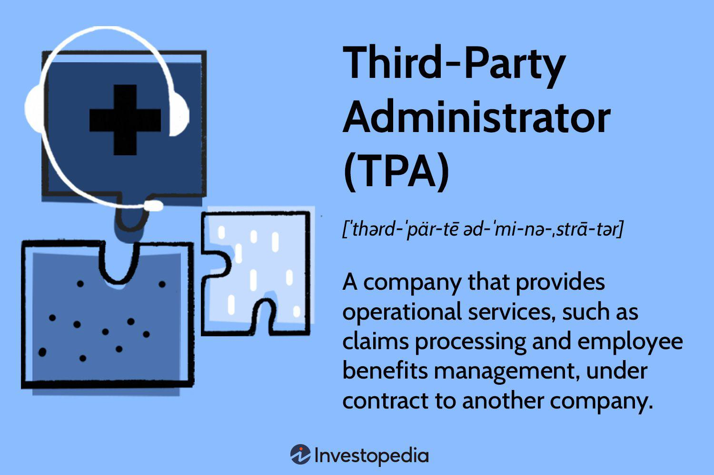

In the rapidly evolving world of finance and trading, intermediary negotiation and third-party algorithmic trading are crucial components influencing market mechanisms. These elements have transformed how transactions occur, ensuring more efficient and secure exchanges across diverse sectors, such as real estate and investments. The increasing complexity of financial markets necessitates a deeper understanding of these roles and their implications.

Intermediaries, such as brokers and agents, fulfill pivotal roles in facilitating transactions, enhancing communication, and providing expertise that is often beyond the scope of individual stakeholders. Conversely, third-party algorithmic trading harnesses advanced technology to execute trades based on predetermined criteria, reducing human error and augmenting profitability.



This article will explore the significance of intermediaries, highlight the advantages of third-party negotiation, and assess the impact of algorithmic trading on modern capital markets. The presence of third-party participants is indispensable in creating secure and efficient transactions, underscoring their value in a highly competitive environment.

Understanding these dynamics is essential for investors, traders, and financial stakeholders aiming to capitalize on market opportunities. As we investigate intermediary negotiation and third-party algorithmic trading, we aim to provide insights into their mechanisms and the advantages they present in navigating today's financial landscape.

## Table of Contents

## Understanding Third-Party Negotiation

Third-party negotiation is a structured method involving a neutral intermediary who helps conflicting parties reach a resolution. This process enhances communication and problem-solving by facilitating discussions, addressing misunderstandings, and exploring solutions that fulfill the interests of all involved parties without imposing any decisions. 

There are several roles that a third-party negotiator can assume. These include mediators, arbitrators, and conciliators. Mediators act as facilitators, assisting disputing parties in reaching their own voluntary agreement by encouraging dialogue and suggesting potential solutions. Arbitrators take on a quasi-judicial role, rendering a binding decision based on the merits of each case after hearing arguments from both sides. Conciliators are similar to mediators but may take a more active role in suggesting terms of settlement and are often used in international disputes where cultural and language differences may exist.

The benefits of engaging third-party negotiators are numerous. They contribute to a decrease in legal expenses as conflicts can be settled outside of courtrooms. The process is typically faster than legal proceedings, allowing parties to reach resolutions quickly. Additionally, maintaining relationships between disputing parties is often possible, as third-party negotiations focus on collaboration and understanding, rather than contention.

Key elements that contribute to the success of third-party negotiations are the neutrality and competence of the intermediary. Neutrality ensures that all parties perceive the process as fair and unbiased, while competence involves the intermediary's skills in communication, conflict resolution, and subject-specific knowledge. Trust in these areas is critical for parties to feel confident in the negotiation process and outcomes.

The practical application of third-party negotiation spans various sectors and circumstances. In the corporate world, third-party negotiators are employed to manage mergers, acquisitions, and employee disputes. Personal and family matters, such as divorce or custody arrangements, also frequently benefit from mediation. The versatility of third-party negotiation makes it a valuable tool in resolving disputes effectively across different environments, each with its own unique challenges and potential for resolution.

## Intermediary Trading and Its Benefits

Intermediaries are essential in facilitating trading transactions by operating as brokers or [agents](/wiki/agents) who ensure the seamless exchange of financial commodities. These entities provide a layer of security and trust, particularly vital in managing the inherent risks associated with volatile markets. By functioning as mediators between buyers and sellers, they help mitigate potential conflicts, protect sensitive information, and ensure compliance with regulatory requirements.

One of the primary advantages intermediaries offer is their expertise and infrastructure, often not available to smaller firms, enabling more efficient and reliable transactions. This capability is particularly beneficial in sectors where the complexities of market operations and regulations require specialized knowledge and systems. For instance, brokerages possess platforms for the execution of trades and offer analytics services to optimize trading strategies.

Intermediaries also contribute to managing operational risks and reducing the transaction costs for their clients. They achieve this by leveraging economies of scale, which distribute fixed costs across multiple transactions, resulting in lower per-transaction costs. Furthermore, their sophisticated risk management systems can proactively identify and mitigate potential issues before they affect trades.

In e-commerce, payment processors act as intermediaries, securely handling transactions between buyers and sellers and ensuring the protection of financial information. This process decreases the risk of fraud and increases consumer confidence in online transactions. Similarly, brokerage firms in stock trading provide platforms that offer the necessary tools for investors to manage and execute trades, thus enabling access to a broader range of market opportunities.

In summary, intermediaries play a crucial role in enhancing the security and efficiency of trading transactions. They provide indispensable services, from risk management to offering advanced technological infrastructure, which smaller entities might lack. This support ensures the smooth functioning of financial markets and contributes to maintaining their integrity and reliability.

## Algorithmic Trading and Third-Party Involvement

Algorithmic trading employs computer algorithms to automate trading decisions for executing orders across financial markets. The primary aim is to operate based on quantitative and technical analysis to execute trades that reduce market impact and capture fleeting trading opportunities. It minimizes human intervention, potentially reducing errors and biases, which enhances the efficiency and accuracy of trading operations.

Third-party services play a pivotal role in [algorithmic trading](/wiki/algorithmic-trading) by providing essential data feeds, execution algorithms, and trading platforms that support high-frequency trading ([HFT](/wiki/high-frequency-trading-strategies)) environments. These services enable traders to access comprehensive datasets and sophisticated analytical tools necessary for devising and executing trading strategies. Organizations like Bloomberg and Reuters are instrumental in delivering the critical real-time data feeds that are crucial for algorithmic trading strategies.

Integrating third-party solutions is a significant advantage in algorithmic trading. It allows traders to achieve faster execution speeds, which is vital when milliseconds can determine the success of a trade in fast-moving markets. Moreover, these integrations often result in reduced transaction costs due to optimized order execution and access to [liquidity](/wiki/liquidity-risk-premium) pools. Using application programming interfaces (APIs) and trading platforms developed by specialized third-party providers, traders can communicate with exchanges and brokerages seamlessly. 

For instance, Python, a popular programming language in finance due to its comprehensive libraries for data analysis and manipulation, is frequently used to develop and test algorithmic trading strategies. Below is a simple example of a Python code snippet using a third-party data service to retrieve and analyze stock price data:

```python
import yfinance as yf  # For more datasets, visit: https://paperswithbacktest.com/datasets
import pandas as pd

# Retrieve data for a specific stock
stock_data = yf.download('AAPL', start='2023-01-01', end='2023-10-01')

# Simple moving average calculation
stock_data['SMA_20'] = stock_data['Close'].rolling(window=20).mean()

# Output the last five rows
print(stock_data.tail())
```

Furthermore, these third-party solutions can open access to markets that would otherwise be less accessible, particularly international markets or specific market segments requiring distinct trading infrastructures. This accessibility broadens the scope and scalability of algorithmic trading for traders, allowing them to exploit a wider range of market inefficiencies and capitalize on diversified opportunities. The automation and integration of these services underscore a transformative shift towards more efficient and expansive trading ecosystems in financial markets.

## Challenges Facing Third-Party Roles

In the landscape of third-party roles, several challenges hinder seamless operation, notably the costs associated with these services. These expenses can be particularly prohibitive in situations involving high-frequency or large-[volume](/wiki/volume-trading-strategy) transactions. The cost structures often encompass fees for data feeds, transaction processing, and additional services required to ensure effective operation, leading to a significant financial burden for businesses, especially smaller entities or startups. This economic strain can impact profitability and necessitate careful budget planning and cost-benefit analysis.

Regulatory compliance poses another substantial challenge for third-party providers. Operating across various jurisdictions requires navigating a complex patchwork of legal requirements, which can vary significantly between regions. Compliance necessitates continuous monitoring of regulations such as anti-money laundering (AML) laws, know-your-customer (KYC) requirements, and trading standards. These regulatory frameworks demand substantial investment in legal expertise and data management systems to ensure adherence and avoid legal repercussions that could severely harm an organization's reputation and operational capabilities.

Dependence on third-party services introduces risks, including potential service interruptions and security breaches. This reliance can be particularly troubling when third-party systems experience outages or cyberattacks, leading to disruptions that affect trading activities. Additionally, there might be a misalignment of third-party objectives with those of the contracting organization, potentially resulting in strategic conflicts or operational inefficiencies. This dependency necessitates rigorous due diligence to assess the reliability and alignment of these external partners prior to engagement.

Stakeholders must undertake a meticulous evaluation of these challenges within their trading operations. Effective management of third-party relationships includes assessing the cost impact on the company’s finances, ensuring regulatory compliance is met across all operating jurisdictions, and implementing robust risk management strategies to mitigate the effects of service dependency. Strategic planning and continuous oversight can help mitigate these challenges, allowing organizations to leverage third-party services effectively while minimizing associated risks.

## Future Trends in Third-Party Trading

As technology continues to progress, the role of third-party services in trading and negotiation is poised for significant expansion. This growth is heavily influenced by advancements in [artificial intelligence](/wiki/ai-artificial-intelligence) (AI) and [machine learning](/wiki/machine-learning), which are increasingly being incorporated to develop smarter solutions. AI and machine learning algorithms can analyze vast datasets at remarkable speeds, identifying patterns, trends, and anomalies that enhance decision-making processes in trading activities. These technologies enable third-party providers to offer more sophisticated algorithmic trading strategies that can adapt to real-time market conditions, thereby optimizing trade execution and improving profitability.

The emergence of decentralized finance (DeFi) represents another pivotal trend that could transform the role of third-party services. DeFi platforms leverage blockchain technology to create financial systems that operate without traditional intermediaries, offering increased transparency and reducing reliance on centralized authorities. This decentralized approach allows users to engage in direct peer-to-peer transactions, which can reduce costs and increase transaction speed. As DeFi continues to gain traction, we may witness a significant shift in third-party involvement, as these platforms provide new opportunities for third-party service providers to innovate and offer enhanced products tailored to decentralized systems.

Blockchain technology itself plays a crucial role in the evolution of third-party trading services. Its inherent attributes of security, transparency, and immutability make blockchain a preferred choice for secure data management and transaction processing. The adoption of blockchain across various sectors facilitates more efficient third-party transactions by ensuring data integrity and streamlining processes. Smart contracts, which are automated and self-executing contracts with the terms directly written into lines of code, exemplify blockchain's potential. These contracts could replace traditional intermediaries, such as brokers and agents, by enforcing agreements automatically when predetermined conditions are met.

Overall, the future of third-party trading services looks promising as technology continues to advance and reshape the landscape of financial transactions. Stakeholders in the financial ecosystem must stay informed about these technological innovations to effectively leverage them, ensuring they remain competitive and efficient in an ever-evolving market environment.

## Conclusion

Intermediary negotiation and third-party algorithmic trading play essential roles in shaping the modern financial landscape. These mechanisms enhance transaction efficiency and security by acting as bridges between parties and automating trading processes. Intermediaries ensure smoother exchanges, leveraging their expertise to manage market risks and facilitate complex transactions. Concurrently, algorithmic trading, powered by third-party data feeds and execution algorithms, optimizes trade execution and minimizes human error.

Despite their benefits, challenges such as costs and dependency on third-party services remain prevalent. High fees associated with intermediary services can impact profitability, especially in high-frequency trading environments. Dependency introduces risks related to service disruptions and security breaches. To address these, stakeholders must foster strategic relationships with third-party providers, balancing cost and service quality.

In the competitive landscape of modern finance, having a comprehensive understanding of these services can provide a significant edge. Investors and traders who effectively use these tools can enhance their market operations and capitalize on new opportunities. As technology advances, continuous innovation and alignment with regulatory frameworks will be critical. The integration of AI and machine learning could further refine these services, while emerging technologies like blockchain may enhance security and efficiency. These developments suggest a transformative potential, encouraging stakeholders to stay adaptive and proactive in navigating the evolving financial ecosystem.

## References & Further Reading

[1]: Bergstra, J., Bardenet, R., Bengio, Y., & Kégl, B. (2011). ["Algorithms for Hyper-Parameter Optimization."](https://dl.acm.org/doi/10.5555/2986459.2986743) Advances in Neural Information Processing Systems 24.

[2]: ["Advances in Financial Machine Learning"](https://www.amazon.com/Advances-Financial-Machine-Learning-Marcos/dp/1119482089) by Marcos Lopez de Prado

[3]: ["Evidence-Based Technical Analysis: Applying the Scientific Method and Statistical Inference to Trading Signals"](https://www.amazon.com/Evidence-Based-Technical-Analysis-Scientific-Statistical/dp/0470008741) by David Aronson

[4]: ["Machine Learning for Algorithmic Trading"](https://github.com/stefan-jansen/machine-learning-for-trading) by Stefan Jansen

[5]: ["Quantitative Trading: How to Build Your Own Algorithmic Trading Business"](https://www.amazon.com/Quantitative-Trading-Build-Algorithmic-Business/dp/1119800064) by Ernest P. Chan