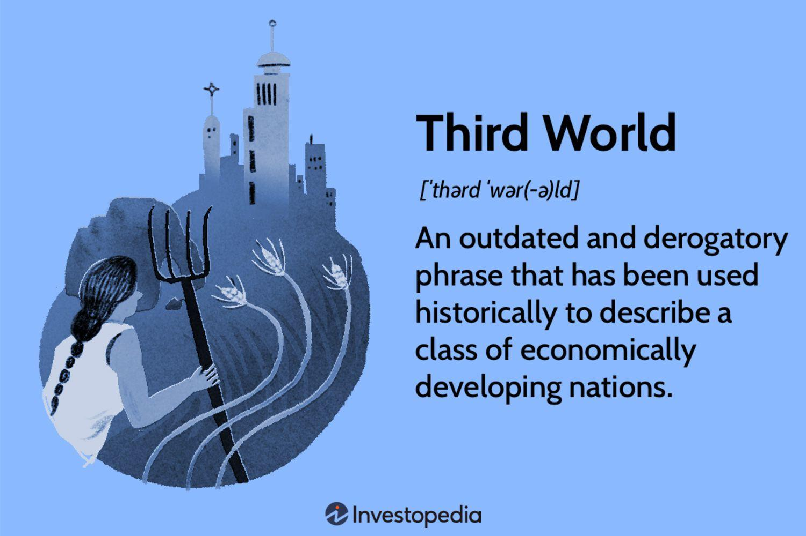

The concept of 'third world countries' has experienced considerable evolution from its origins during the geopolitical divisions of the Cold War era. Initially, the term 'third world' referred to nations not aligned with NATO or the Communist Bloc. However, as global dynamics have shifted, so has the terminology and understanding of these countries. Today, these nations are more appropriately identified as 'developing countries' or 'low- and middle-income countries' (LMICs), reflecting economic and social metrics rather than geopolitical alignments. These classifications impact global economic policies and influence trading practices by determining international aid and finance allocation.

In this article, we explore how the classification of developing nations affects global economic strategies. The evolving terminology reflects changes in global economic policies and trading, reshaping how countries qualify for aid and investment. Furthermore, the integration of algorithmic trading (algo trading) into these economies posits a significant shift in their economic landscapes. Algo trading, which leverages advanced computational techniques to execute trades at high speed and volume, could potentially bolster development by enhancing market efficiency and liquidity. This shift holds promise for these nations' economic growth, potentially leading to increased foreign investments.

Understanding the classification system of developing nations is crucial for global economic strategies and funding approaches. With the growing importance of digital economies, nations deemed 'developing' face unique challenges and opportunities. This article seeks to provide insights into these modern challenges, exploring how they can leverage technological advancements to overcome traditional barriers. The digital age presents both a hurdle and a gateway for these countries, and their classification will continue to play a significant role in their path towards economic development and integration into the global market.

## Table of Contents

## Understanding Third World Countries and Their Classification

The classification of 'third world countries' has its origins during the Cold War era, when global nations were divided into three groups based on their political and economic alignments. The term 'third world' referred to countries that were not aligned with either the capitalist First World, led by the United States and its allies, or the communist Second World, headed by the Soviet Union. These third world countries often included newly independent nations that emerged from the decolonization process happening in Africa, Asia, and Latin America.

In modern discourse, organizations such as the Organisation for Economic Co-operation and Development (OECD) and international institutions tend to use terms like 'developing nations' or 'low- and middle-income countries' (LMICs) instead. This shift in terminology reflects a move towards a more economically-centered classification system that considers a wider array of factors.

A country's classification as a developing nation or LMIC largely depends on several economic and social criteria. One primary measure is the Gross Domestic Product (GDP) per capita, which reflects the average economic output per person and provides an indicator of the standard of living within the country. Additionally, income inequality plays a critical role in classification. High levels of disparity in wealth distribution can be a characteristic feature of developing nations.

The degree of industrialization is another significant classification criterion. Higher levels of industrialization typically correlate with advanced economic development, while less industrialized countries may struggle with manual labor-based economies. Access to education and healthcare also heavily influences a country's status. Nations with poorer educational and health outcomes often face difficulties in achieving sustainable economic growth.

This classification has practical implications for a nation's global economic engagements. It impacts eligibility for international aid, debt relief, and financial assistance programs offered by organizations like the International Monetary Fund (IMF) and the World Bank. These institutions design specific programs aimed at aiding countries that are striving to improve their socio-economic conditions.

Understanding the evolving terminologies and classification criteria for third world countries is vital for developing coherent global economic policies. It ensures the right allocation of resources and support to foster development in these countries, addressing the diverse challenges they face in the global economic landscape.

## Economic and Social Dynamics in Developing Nations

Developing nations, often confronted with a variety of economic and social challenges, display a dichotomy of obstacles and opportunities that shape their developmental trajectories. Central to these challenges is inadequate infrastructure, which hampers the effective delivery of goods and services, thereby stifling economic growth. Transportation networks, energy supply, and communication systems in many of these countries require substantial improvements to facilitate smoother transactions and enhance connectivity within and outside their borders.

Access to healthcare remains limited in numerous developing nations, contributing to lower health outcomes and reduced life expectancy compared to developed countries. This scenario not only reflects disparities in health infrastructure but also indicates a broader issue of inequality in resource distribution. Effective allocation of resources could potentially mitigate the effects of various health crises, enabling these nations to improve their human capital, which is vital for sustainable growth.

Labor markets in developing countries often grapple with issues of underemployment and unstable job conditions. A significant portion of the workforce is engaged in the informal sector, lacking job security and social protection. Transitioning individuals from informal to formal employment forms a cornerstone of economic policy aimed at improving productivity and living standards.

Despite these challenges, developing nations present attractive prospects for investors due to their potential for rapid economic growth. With youthful populations and untapped markets, these countries provide fertile ground for economic expansion. However, investment in these regions also entails substantial risk, driven by factors such as political instability and currency [volatility](/wiki/volatility-trading-strategies).

International organizations, including the International Monetary Fund (IMF) and the World Bank, play pivotal roles in supporting developing nations by providing financial assistance and policy advice. These institutions aid in stabilizing economies during financial crises and catalyze development projects that stimulate growth and reduce poverty.

Understanding the economic and social dynamics of developing nations is indispensable for crafting effective global policies and directing aid to areas where it is most needed. The nuanced economic statuses of these countries demand tailored strategies that address their specific challenges while capitalizing on their unique growth opportunities. This approach ensures that global economic policies are inclusively designed, fostering an environment where developing nations can progress towards sustainable development and greater integration into the global economy.

## The Role of Algorithmic Trading in Developing Nations

Algorithmic trading, commonly known as algo trading, leverages computer systems and algorithms to execute trades at high speeds and volumes. This approach enables traders to capitalize on even the smallest price disparities across markets. In developed economies, such as the United States and the United Kingdom, [algorithmic trading](/wiki/algorithmic-trading) constitutes a significant portion of market transactions, enhancing market efficiency and [liquidity](/wiki/liquidity-risk-premium).

For developing nations, the adoption of algorithmic trading presents potential benefits in transforming financial markets. The primary advantages include enhancing market efficiency by narrowing bid-ask spreads and improving liquidity by allowing more participants to engage in trading. Furthermore, the increased transparency and reduced human error associated with algo trading can attract foreign investment, offering developing countries a pathway to better integrate into the global economy.

However, these nations face several challenges in implementing algorithmic trading on a large scale. One of the foremost is the need for robust regulatory frameworks. Effective regulations are essential to monitor and control the potential risks associated with high-frequency trading, such as market manipulation and systemic risk. Developing countries are often in the process of establishing and refining their financial regulations, which can be a time-consuming endeavor.

Technological infrastructure is another critical hurdle. Successful implementation of algorithmic trading requires advanced technology and reliable data networks, which are not always available in developing regions. Building this infrastructure necessitates substantial investment and can be hindered by economic constraints and a lack of skilled professionals in the field.

Addressing these challenges requires strategic planning and international cooperation. Initiatives to build technological capacity and training programs to develop local expertise in algorithmic trading can be instrumental. As these nations work towards establishing a conducive environment for algo trading, they stand to gain significantly in terms of market development and economic growth. By capitalizing on algorithmic trading's potential, developing countries can improve their financial markets and attract global attention, leading to increased economic opportunities.

## Challenges and Opportunities for Developing Nations

Developing nations encounter a myriad of challenges that hinder their progress towards sustainable development and economic prosperity. Political instability is a recurrent obstacle, often stemming from weak governance structures, corruption, and conflict, which can deter investment and disrupt economic activities. Economic vulnerability is another significant challenge, with these nations often relying heavily on a narrow range of exports and being susceptible to global market fluctuations. This dependency can lead to economic downturns in the face of price shocks or declining demand for key export commodities.

Moreover, the technological divide presents substantial barriers to development. Many developing countries lack access to advanced technologies and infrastructures, such as reliable internet and telecommunications networks, which are critical for modern economic activities. This divide restricts their ability to participate in the global digital economy, constrains innovation, and limits access to information and new markets.

Despite these challenges, there are significant opportunities available, particularly through the adoption of modern technologies like algorithmic trading. Algorithmic trading can enhance market efficiency by providing liquidity and reducing transaction costs, potentially attracting foreign investment. For this to occur, developing nations must address regulatory and infrastructural constraints that currently limit the implementation of such technologies.

Effective policies are essential in fostering an environment conducive to leveraging these opportunities. Developing nations can benefit from regulatory frameworks that encourage innovation and protect investors while ensuring market stability. International collaborations can further aid in overcoming technological barriers through knowledge transfer and capacity building.

International aid and adherence to sustainable development goals (SDGs) play a critical role in addressing the overarching challenges faced by these countries. Development assistance can provide the necessary financial resources and technical expertise to address infrastructure deficits and initiate economic reforms. Furthermore, the SDGs offer a comprehensive framework for improving social, environmental, and economic conditions, emphasizing poverty reduction, education, and sustainable growth.

To maximize growth potential, developing nations should align domestic policies with global economic trends and technological advancements. This alignment can lead to improved market dynamics, increased investor confidence, and overall economic resilience. International partnerships and aid can complement these efforts, ensuring that developing nations can navigate their challenges and capitalize on the opportunities that exist in the rapidly evolving global landscape.

## Conclusion

The classification of nations as 'third world' or 'developing' plays a crucial role in shaping global economic strategies and influencing international investment flows. This classification helps guide decisions on foreign aid, trade agreements, and economic policies. By understanding the economic status and needs of developing nations, global institutions can devise more targeted and effective strategies, which can lead to better allocation of resources and aid.

Algorithmic trading represents both a challenge and an opportunity for these emerging markets. High-frequency trading, driven by complex algorithms, has the potential to increase market efficiency, provide liquidity, and attract foreign investments to developing nations. However, implementing such advanced technologies comes with challenges, including establishing robust regulatory frameworks and enhancing technological infrastructures. These countries must navigate these complexities to fully harness the benefits of algorithmic trading.

Embracing such technologies can lead to substantial improvements in economic systems, provided there's adequate support. The integration of algorithmic trading needs to be accompanied by investments in technology infrastructure and a supportive regulatory environment to ensure equitable growth. Developing nations that enhance their technological capabilities stand to benefit significantly through increased market efficiency, better risk management, and more accurate pricing mechanisms.

The future for developing nations lies in integrating into the global economy, supported by fair trade practices and technological advancements. As these nations continue to grow, embracing new technologies and fostering international collaborations can pave the way for sustainable economic development. It is essential to ensure that such integration is equitable and considers the unique challenges faced by these nations. By aligning development goals with sustainable practices, developing countries can achieve robust economic growth and improve the livelihoods of their populations.

## References & Further Reading

[1]: [International Monetary Fund (IMF) - Overview](https://www.imf.org/en/About/Factsheets/IMF-at-a-Glance)

[2]: [World Bank - Countries and Economies](https://blogs.worldbank.org/en/opendata/world-bank-country-classifications-by-income-level-for-2024-2025)

[3]: Todaro, M. P., & Smith, S. C. (2015). "Economic Development." Pearson Education Limited.

[4]: Chandy, L., Seidel, B., & Newton, H. J. (2016). ["The Final Countdown: Prospects for Ending Extreme Poverty by 2030."](https://www.brookings.edu/wp-content/uploads/2016/06/The_Final_Countdown.pdf) Brookings Institution.

[5]: [Organisation for Economic Co-operation and Development (OECD) - Development](https://www.oecd.org/)

[6]: Narula, R. (2014). ["Foreign Direct Investment as a Driver of Industrial Development: Why is There so Little Evidence?"](https://www.researchgate.net/publication/287284736_Foreign_direct_investment_as_a_driver_of_industrial_development_Why_is_there_so_little_evidence) European Journal of Development Research.

[7]: Piketty, T. (2014). "Capital in the Twenty-First Century." Harvard University Press.

[8]: Leinweber, D. J. (2009). ["Nerds on Wall Street: Math, Machines and Wired Markets."](https://archive.org/details/nerdsonwallstree0000lein) Wiley Finance.

[9]: Harris, L. (2003). "Trading & Exchanges: Market Microstructure for Practitioners." Oxford University Press.