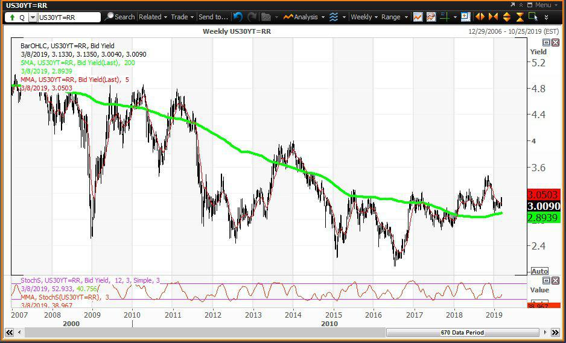

In the world of finance, U.S. Treasury bonds play a pivotal role. Among these, the 30-year U.S. Treasury bond holds a unique position, often regarded as one of the safest investments due to the U.S. government's backing. Its long maturity provides crucial insights into economic forecasts, as the bond's performance is closely tied to expectations of inflation and economic growth over the decades. As a key benchmark for long-term interest rates, this bond is used by investors to gauge future financial conditions and expectations, influencing decisions across the spectrum of financial markets.

Algorithmic trading, a significant modern innovation, has dramatically changed how investors approach long-duration bonds like the 30-year Treasury bond. Utilizing complex mathematical models and powerful computational tools, algorithmic trading enables the swift execution of trading strategies that are based on predefined criteria. This technology has transformed the efficiency of bond markets, providing increased liquidity and more effective access to trading opportunities.



This article focuses on the significance of U.S. Treasury bonds, detailing the structure and function of the 30-year bond, and examining how algorithmic trading impacts the market for these securities. It seeks to unravel the complexities inherent in bond yields, the variety of investment strategies employed by investors, and the technological advancements that are reshaping these traditional financial instruments. By understanding the interplay between the stability of U.S. Treasury bonds and the dynamism introduced by algorithmic trading, investors can better navigate the challenges and opportunities of today’s financial landscape, optimizing their portfolios for future success.

## Table of Contents

## Understanding U.S. Treasury Bonds

U.S. Treasury bonds, or Treasuries, represent a fundamental component of the financial landscape as long-term debt securities issued by the U.S. government. Renowned for their dependable, virtually risk-free nature, these bonds are integral to both national and global financial systems. 

Treasuries are essentially loans made by investors to the U.S. government, and in return, investors receive periodic interest payments until the bond matures. The U.S. government guarantees these payments, further reinforcing their reputation as safe investments. This attribute makes Treasury bonds a refuge for investors, particularly during periods of economic turbulence when the stability of other asset classes might be uncertain.

Treasury bonds come with a variety of maturities, typically ranging from 10 to 30 years. Each maturity level offers distinct investment advantages in terms of yield and risk exposure, making Treasury bonds versatile financial instruments. As a predominant fixture in the global bond market, they play a significant role in shaping investment portfolios and strategies worldwide.

The interest rates on U.S. Treasury bonds serve as indicators of market demand and broader economic expectations. These rates are pivotal in guiding both individual and institutional investment choices. Factors influencing these rates include the federal funds rate set by the Federal Reserve, inflation expectations, and the overall demand for U.S. debt securities. When the demand for Treasury bonds is high, prices increase and yields typically decrease, reflecting investor confidence in the bond's security over its return rate. Conversely, when demand is low, yields tend to go up, indicating potential investor concerns about market or economic uncertainties.

In summary, U.S. Treasury bonds are not just cornerstones of the domestic financial framework but are also essential components of the global investment ecosystem, with their interest rates affecting myriad economic decisions.

## A Closer Look at the 30-Year Treasury Bond

The 30-year U.S. Treasury bond is a fundamental instrument for long-term fixed-income investors due to its extended maturity and reliable interest payments. It offers substantial insights into broader economic conditions, such as growth, inflation, and future interest rates. This bond serves as a crucial benchmark for assessing long-term market sentiment, as it reflects investors' expectations and confidence in the economy’s prospects over the decades to come.

Interest rates on the 30-year Treasury bond directly relate to its yield, which is pivotal for investors seeking to interpret economic projections. Yield, expressed typically as an annual percentage, is the return on investment for holding the bond. The yield on these bonds fluctuates with market dynamics, influenced by factors such as inflation expectations, monetary policy, and global economic stability. Tools such as the yield curve, which plots the interest rates of bonds having equal credit quality but differing maturity dates, are essential for understanding market conditions. 

The shape and slope of the yield curve provide valuable implications for economic forecasts. A normal upward-sloping curve, where long-term rates are higher than short-term rates, indicates expectations of economic growth and inflation. Conversely, an inverted yield curve, where long-term rates fall below short-term rates, often signals a potential economic downturn. Monitoring these yield changes is crucial for investors in making informed decisions and adjusting investment strategies to align with anticipated economic conditions.

By analyzing 30-year Treasury bonds' yields within the broader context of market forces, investors can glean important insights into future economic conditions, aiding them in devising robust investment strategies to optimize their portfolios. This evaluation process involves considering various external factors and their potential impacts, underscoring the importance of informed decision-making in the dynamic landscape of financial markets.

## Algorithmic Trading in Treasury Bond Markets

Algorithmic trading utilizes complex mathematical models and sophisticated software systems to execute trades with remarkable speed and precision, relying on predefined criteria rather than human intervention. This approach has significantly transformed the landscape of U.S. Treasury bond markets, particularly the 30-year bonds, by enhancing [liquidity](/wiki/liquidity-risk-premium), efficiency, and market accessibility.

One of the primary advantages of [algorithmic trading](/wiki/algorithmic-trading) in U.S. Treasury bonds is its ability to quickly analyze vast amounts of market data in real-time. Algorithms can assess variables such as interest rates, bond yields, and macroeconomic indicators, enabling traders to make informed decisions swiftly. This data-driven approach allows traders to predict price movements with a high degree of accuracy.

Moreover, algorithmic trading strategies often incorporate advanced [machine learning](/wiki/machine-learning) and [artificial intelligence](/wiki/ai-artificial-intelligence) techniques. These technologies contribute to the development of adaptive algorithms that can identify patterns and adjust trading strategies accordingly. For instance, a machine learning model might recognize anomalies in market behavior and alter trading parameters to capitalize on emerging trends.

The integration of such advanced technologies within trading algorithms offers a competitive edge by optimizing investment strategies and minimizing human errors. For example, a Python script using machine learning libraries like TensorFlow or Scikit-learn could be employed to forecast bond price movements based on historical data:

```python
import numpy as np
from sklearn.ensemble import RandomForestRegressor
from sklearn.model_selection import train_test_split

# Sample data for bond pricing
data = np.array([[1.5, 102], [2.0, 103], [2.5, 99], [3.0, 100]])
X = data[:, 0].reshape(-1, 1)  # Interest rates
y = data[:, 1]  # Bond prices

# Train-test split
X_train, X_test, y_train, y_test = train_test_split(X, y, test_size=0.2, random_state=42)

# Model training
model = RandomForestRegressor()
model.fit(X_train, y_train)

# Predict future bond prices
predictions = model.predict(X_test)
print(f"Predicted bond prices: {predictions}")
```

This example illustrates how algorithms can assist traders in making more accurate predictions regarding bond prices, thereby supporting more effective trading practices.

While algorithmic trading provides significant benefits, it also necessitates careful consideration of potential challenges. These include heightened market [volatility](/wiki/volatility-trading-strategies) and systemic risks, underscoring the importance of robust risk management strategies when deploying algorithmic trading in U.S. Treasury bond markets. Nevertheless, the integration of AI-driven algorithms continues to revolutionize bond trading, offering numerous advantages to well-prepared investors.

## Impacts and Challenges of Algo Trading on 30-Year Bonds

Algorithmic trading, with its capacity for high-speed executions and data analysis, has significantly transformed the dynamics of the 30-year U.S. Treasury bond market. However, the advantages of increased liquidity and efficiency do not come without challenges. One of the primary concerns arising from algorithmic trading is the potential for increased market volatility. The rapid execution of trades, driven by advanced algorithms capable of responding to minute changes in market conditions, can lead to abrupt price movements. Such swings may be particularly pronounced in the 30-year Treasury bond market, where large trades can significantly impact pricing and yields due to the bond's long-term nature.

Moreover, the potential for systemic risks cannot be overlooked. Algorithmic trading systems are often interconnected and can lead to cascading effects in the event of a malfunction or a miscalculation. Flash crashes, where prices plummet and recover quickly, exemplify the systemic risk inherent in this trading method. These events highlight the need for robust risk management protocols to mitigate adverse impacts on financial stability, especially in markets as pivotal as that of the 30-year Treasury bond.

Regulatory and ethical considerations also pose significant challenges. Authorities must continuously adapt to the evolving technological landscape to ensure fair and transparent market conditions. Regulations such as those that require algorithmic trading systems to include kill switches, which can halt trading in times of extreme volatility, are crucial. Ethical considerations, such as the fair use of inside information and the market impact of high-frequency trades, need ongoing scrutiny to protect investor interests and maintain market integrity.

Investors face the task of maintaining a balanced approach to their strategies. Traditional investment wisdom emphasizes thorough analysis and a long-term outlook, contrasting with the short-term focus of algorithmic strategies. Therefore, investors must strike a balance between leveraging the technological advantages of algorithmic trading and adhering to fundamental investment principles. By integrating these methods thoughtfully, investors can better manage the complexities presented by algorithmic trading in the 30-year Treasury bond market.

## Conclusion

The interplay between U.S. Treasury bonds and algorithmic trading presents a frontier of opportunities and challenges in the financial sector. This convergence of traditional fixed-income assets and cutting-edge trading technologies is shaping the future of financial markets, requiring investors to adapt to rapidly changing dynamics. 

The evolution of market mechanisms due to technological advancements has resulted in enhanced liquidity, improved pricing efficiency, and increased market accessibility. These benefits facilitate smoother transactions and better market transparency, allowing investors to make more informed decisions. However, the increased speed and automation associated with algorithmic trading can also contribute to heightened market volatility, introducing new layers of complexity and risk. Instances such as "flash crashes" highlight the potential for sudden and severe market disruptions, underscoring the importance of understanding and mitigating the risks involved.

Adapting to these changes necessitates a thorough understanding of both the foundational aspects of bond markets and the intricacies introduced by technology. Investors must remain vigilant, continually updating their strategies and relying on comprehensive data analysis to optimize their portfolios. Tools such as machine learning models and sophisticated algorithms offer powerful capabilities to anticipate market movements, but they require careful calibration and oversight.

In conclusion, navigating the complexities of modern financial markets demands a balanced approach that combines traditional investment principles with the advantages offered by technological innovations. Investors who successfully harness this dual perspective are better positioned to capitalize on the opportunities while minimizing the risks associated with U.S. Treasury bonds and algorithmic trading. This strategic adaptability will be crucial for achieving sustainable growth and stability in an increasingly interconnected and fast-paced financial ecosystem.

## References & Further Reading

[1]: Bergstra, J., Bardenet, R., Bengio, Y., & Kégl, B. (2011). ["Algorithms for Hyper-Parameter Optimization."](https://dl.acm.org/doi/10.5555/2986459.2986743) Advances in Neural Information Processing Systems 24.

[2]: ["Advances in Financial Machine Learning"](https://www.amazon.com/Advances-Financial-Machine-Learning-Marcos/dp/1119482089) by Marcos Lopez de Prado

[3]: ["Evidence-Based Technical Analysis: Applying the Scientific Method and Statistical Inference to Trading Signals"](https://www.amazon.com/Evidence-Based-Technical-Analysis-Scientific-Statistical/dp/0470008741) by David Aronson

[4]: ["Machine Learning for Algorithmic Trading"](https://github.com/stefan-jansen/machine-learning-for-trading) by Stefan Jansen

[5]: ["Quantitative Trading: How to Build Your Own Algorithmic Trading Business"](https://www.amazon.com/Quantitative-Trading-Build-Algorithmic-Business/dp/1119800064) by Ernest P. Chan