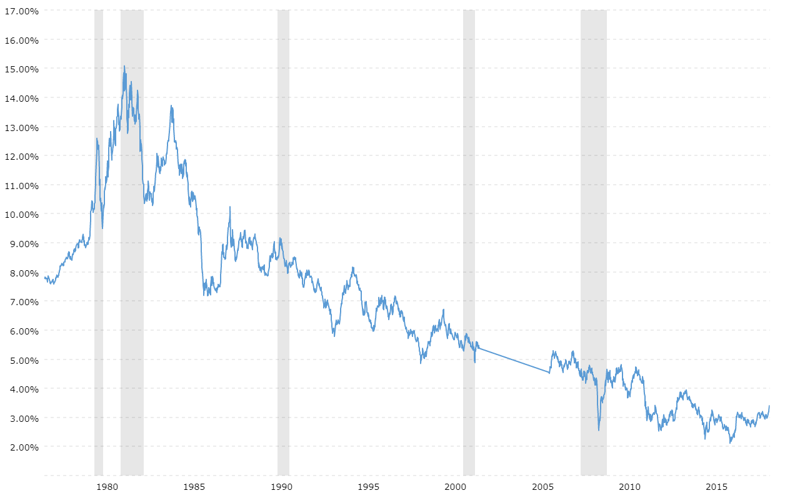

## Table of Contents

## What is a Thirty-Year U.S. Treasury Bond?

A Thirty-Year U.S. Treasury Bond is a type of government bond that lasts for 30 years. It's like a loan you give to the U.S. government. In return, the government promises to pay you interest every six months until the bond matures. When it matures, they also give you back the amount you originally loaned them, which is called the face value or principal.

These bonds are considered very safe because they are backed by the U.S. government. This means there's a very low chance that the government won't pay you back. Because they are safe, they usually offer lower interest rates compared to riskier investments like stocks. People often buy these bonds to save money over a long time or to make sure they have a steady income in the future.

## How does a Thirty-Year U.S. Treasury Bond work?

When you buy a Thirty-Year U.S. Treasury Bond, you are lending money to the U.S. government for 30 years. In return, the government agrees to pay you interest twice a year. This interest is a percentage of the bond's face value, which is the amount you loaned. For example, if you buy a bond with a face value of $1,000 and it has an interest rate of 2%, you will get $20 every six months. At the end of the 30 years, the government will give you back the $1,000 you originally paid for the bond.

These bonds are seen as very safe investments because they are backed by the U.S. government. This means it's very unlikely that you won't get your money back. Because they are safe, the interest rates on these bonds are usually lower than what you might get from riskier investments like stocks. People often buy these bonds to save money over a long period or to have a steady income in the future. They are popular with people who want to make sure their money is safe and will grow slowly over time.

## What are the benefits of investing in a Thirty-Year U.S. Treasury Bond?

Investing in a Thirty-Year U.S. Treasury Bond has several benefits. One big benefit is that it's very safe. Since it's backed by the U.S. government, there's a very low chance you won't get your money back. This makes it a good choice if you want to keep your money safe and don't want to take big risks. Another benefit is that it gives you a steady income. Every six months, you get interest payments, which can help you plan your finances because you know exactly how much money you'll get and when.

Another advantage is that it's a long-term investment. If you're saving for something far in the future, like retirement, a Thirty-Year U.S. Treasury Bond can be a good way to make sure your money grows slowly but surely over time. It's also good for people who want to balance out riskier investments in their portfolio. By having some money in these safe bonds, you can feel more secure even if other parts of your investments go up and down.

## What are the risks associated with Thirty-Year U.S. Treasury Bonds?

One risk of investing in Thirty-Year U.S. Treasury Bonds is interest rate risk. If interest rates go up after you buy your bond, new bonds will be issued with higher interest rates. This means your bond, which has a lower interest rate, will be worth less if you want to sell it before it matures. You might lose money if you need to sell it early.

Another risk is inflation. If inflation goes up a lot, the money you get from your bond might not be worth as much as when you first bought it. For example, if you get $20 every six months, but prices for things you buy go up a lot, that $20 won't buy as much as it used to. This can make your investment less valuable over time.

Even though these bonds are backed by the U.S. government and are considered very safe, there's still a tiny chance the government could default on its debt. This is very unlikely, but it's something to think about. Overall, while Thirty-Year U.S. Treasury Bonds are a safe investment, they do come with some risks that you should know about.

## How can one purchase a Thirty-Year U.S. Treasury Bond?

You can buy a Thirty-Year U.S. Treasury Bond directly from the U.S. Department of the Treasury through their website, TreasuryDirect.gov. You'll need to set up an account first, which is easy to do. Once your account is set up, you can go to the part of the website where they sell bonds, choose the Thirty-Year U.S. Treasury Bond, and buy it with money from your bank account. It's a straightforward process that you can do from home.

Another way to buy these bonds is through a bank or a broker. If you already have a relationship with a bank or a financial advisor, you can ask them to help you buy the bond. They might charge a fee for this service, but they can guide you through the process and help you understand everything. This can be a good option if you want some extra help or if you're not comfortable buying things online.

## What is the interest rate typically offered by Thirty-Year U.S. Treasury Bonds?

The interest rate on Thirty-Year U.S. Treasury Bonds changes over time. It depends on what's happening in the economy and what the Federal Reserve is doing. In the past, these rates have been as high as around 15% in the early 1980s, but they can also be much lower. For example, in recent years, they've been around 2% to 3%. The rate you get when you buy the bond stays the same for the whole 30 years, so it's important to think about what rates are like when you're buying.

These interest rates are usually lower than what you might get from riskier investments like stocks. That's because Thirty-Year U.S. Treasury Bonds are very safe. People buy them to keep their money secure and to get a steady income over a long time. If you're thinking about buying one, it's a good idea to check the current rate on the Treasury's website or talk to a financial advisor to make sure you understand what you're getting into.

## How does inflation impact the value of Thirty-Year U.S. Treasury Bonds?

Inflation can make Thirty-Year U.S. Treasury Bonds less valuable over time. When inflation goes up, the prices of things you buy, like food and gas, also go up. But the interest you get from your bond stays the same. So, the money you get from your bond won't buy as much as it used to. For example, if you get $20 every six months, but prices go up a lot, that $20 won't go as far as it did before.

This is why inflation is a big risk for people who invest in these bonds. If inflation is high, the money you get from the bond loses its value. Even though the bond is safe and you're sure to get your payments, the real value of those payments goes down. So, it's important to think about what inflation might do to your money when you're deciding if a Thirty-Year U.S. Treasury Bond is a good investment for you.

## What is the historical performance of Thirty-Year U.S. Treasury Bonds?

The historical performance of Thirty-Year U.S. Treasury Bonds has been pretty steady but can change a lot depending on what's happening in the economy. Over the years, these bonds have given people a safe place to put their money. For example, in the early 1980s, the interest rates on these bonds were really high, around 15%. But as time went on and the economy changed, the rates went down. In more recent years, the rates have been much lower, usually between 2% and 3%. This shows how the performance of these bonds can be different at different times.

Even though the interest rates have gone up and down, Thirty-Year U.S. Treasury Bonds have always been seen as a safe investment. They are backed by the U.S. government, so people know they will get their money back. But the value of the bond can change if you want to sell it before it matures. If interest rates go up after you buy your bond, the value of your bond might go down because new bonds will have higher rates. Also, inflation can make the money you get from the bond worth less over time. So, while these bonds are safe, their performance can be affected by a lot of things.

## How do Thirty-Year U.S. Treasury Bonds compare to other types of bonds?

Thirty-Year U.S. Treasury Bonds are different from other types of bonds in a few ways. They last a long time, 30 years, which is longer than most other bonds. This makes them good for people who want to save money for a long time, like for retirement. They are also very safe because they are backed by the U.S. government. This means there's a very low chance you won't get your money back. But because they are so safe, they usually have lower interest rates than other bonds. For example, corporate bonds, which are issued by companies, can offer higher interest rates but come with more risk because the company might not be able to pay you back.

Another type of bond to compare with Thirty-Year U.S. Treasury Bonds are municipal bonds, which are issued by local governments or cities. These bonds can also be pretty safe, but they sometimes offer tax benefits that Treasury Bonds don't. For example, the interest you get from municipal bonds might not be taxed by the federal government. On the other hand, Thirty-Year U.S. Treasury Bonds are taxable. There are also shorter-term Treasury bonds, like the 10-year or 5-year bonds, which might offer different interest rates and less risk from interest rate changes because they mature sooner. So, when choosing between these bonds, it's important to think about how long you want to invest, how much risk you're okay with, and what kind of returns you're looking for.

## What role do Thirty-Year U.S. Treasury Bonds play in a diversified investment portfolio?

Thirty-Year U.S. Treasury Bonds can be a helpful part of a diversified investment portfolio. They are very safe because they are backed by the U.S. government, so they can help balance out riskier investments like stocks. If the stock market goes down, the value of your Thirty-Year U.S. Treasury Bonds is likely to stay steady. This can make you feel more secure because you know you have some money in a safe place. They also give you a steady income every six months, which can be good if you need regular money coming in.

In a diversified portfolio, having some money in Thirty-Year U.S. Treasury Bonds can help spread out your risk. While these bonds might not give you the high returns that stocks can, they protect your money over a long time. This is important if you're saving for something far in the future, like retirement. By mixing these safe bonds with other types of investments, you can have a good balance of safety and growth in your portfolio. This way, you can feel more confident about your money no matter what happens in the economy.

## How are Thirty-Year U.S. Treasury Bonds affected by changes in monetary policy?

Thirty-Year U.S. Treasury Bonds are affected a lot by changes in monetary policy, which is controlled by the Federal Reserve. When the Federal Reserve changes interest rates, it can change the value of these bonds. If the Federal Reserve raises interest rates, new bonds will have higher interest rates. This makes the old bonds with lower rates less valuable because people would rather buy the new bonds that pay more. So, if you want to sell your Thirty-Year U.S. Treasury Bond before it matures, you might have to sell it for less money.

On the other hand, if the Federal Reserve lowers interest rates, the value of your Thirty-Year U.S. Treasury Bond might go up. This is because new bonds will have lower interest rates, so people might want to buy your bond instead because it pays more. But even if the value of your bond goes up, the interest you get from it stays the same. So, changes in monetary policy can make the value of your bond go up or down, but they don't change the interest payments you get every six months.

## What advanced strategies can be used when investing in Thirty-Year U.S. Treasury Bonds?

One advanced strategy for investing in Thirty-Year U.S. Treasury Bonds is called laddering. This means you buy bonds that mature at different times instead of all at once. For example, you could buy some bonds that mature in 10 years, some in 20 years, and some in 30 years. This way, you get money back at different times, which can help you manage your cash flow better. It also helps you deal with changes in interest rates. If rates go up, you can reinvest the money from the bonds that mature sooner at the new, higher rates. If rates go down, you still have the higher rates from the bonds you bought earlier.

Another strategy is to use Thirty-Year U.S. Treasury Bonds as part of a bond swap. This means you sell your old bonds and buy new ones to take advantage of changes in interest rates or to get a better tax situation. For example, if interest rates go up, you might sell your old bonds and buy new ones with higher rates. Or, if you're in a higher tax bracket, you might swap your Treasury Bonds for municipal bonds that have tax benefits. This can help you make the most of your investments and manage your taxes better.

A third strategy is to use these bonds in a hedging strategy. This means you use them to protect other parts of your investment portfolio from risk. For example, if you have a lot of money in stocks, you can buy Thirty-Year U.S. Treasury Bonds to balance out the risk. If the stock market goes down, the value of your bonds is likely to stay steady or even go up. This can help you feel more secure because you know you have some money in a safe place. By using these advanced strategies, you can make your investments work better for you and manage different kinds of risks.

## References & Further Reading

[1]: Bergstra, J., Bardenet, R., Bengio, Y., & Kégl, B. (2011). ["Algorithms for Hyper-Parameter Optimization."](https://dl.acm.org/doi/10.5555/2986459.2986743) Advances in Neural Information Processing Systems 24.

[2]: ["Advances in Financial Machine Learning"](https://www.amazon.com/Advances-Financial-Machine-Learning-Marcos/dp/1119482089) by Marcos Lopez de Prado

[3]: ["Evidence-Based Technical Analysis: Applying the Scientific Method and Statistical Inference to Trading Signals"](https://www.amazon.com/Evidence-Based-Technical-Analysis-Scientific-Statistical/dp/0470008741) by David Aronson

[4]: ["Machine Learning for Algorithmic Trading"](https://github.com/stefan-jansen/machine-learning-for-trading) by Stefan Jansen

[5]: ["Quantitative Trading: How to Build Your Own Algorithmic Trading Business"](https://www.amazon.com/Quantitative-Trading-Build-Algorithmic-Business/dp/1119800064) by Ernest P. Chan