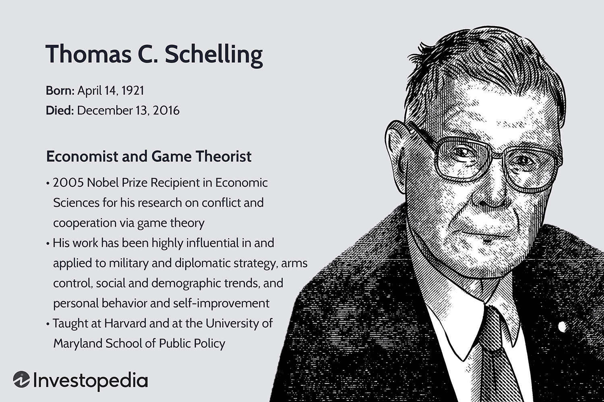

The world of finance and government policies is rapidly evolving, influenced by emerging technologies and theoretical advancements that are reshaping decision-making processes. At this intersection lies the intriguing connection between the teachings of Thomas C. Schelling, a renowned economist and game theorist, and the burgeoning field of algorithmic trading. This article aims to explore these connections, highlighting how Schelling's contributions to game theory find application in modern trading algorithms.

Thomas C. Schelling's work in game theory introduced strategic concepts that have profoundly impacted various fields, particularly economics and political science. His ideas on conflict resolution and cooperative behavior provide critical insights that can be applied to algorithmic trading, where strategic decision-making and predictive analytics play pivotal roles. As technological advancements continue to redefine markets, leveraging Schelling's teachings can enhance the development of robust trading strategies.



Education and government institutions are at the forefront of integrating these technology-driven strategies into their frameworks. By understanding and applying the synergy between Schelling's theoretical models and advanced trading methodologies, policymakers and educators can enrich curricula, producing graduates equipped to navigate complex financial systems. This integration paves the way for fostering an informed and adaptable future workforce capable of tackling the dynamic challenges of economic governance.

The cross-pollination of game theory and algorithmic trading not only aids in deciphering strategic interactions in financial markets but also illuminates pathways for improved policy-making and education in economic sciences. As we explore these themes, it becomes evident that the convergence of classical economic thought and technological innovation holds significant promise for shaping resilient and strategically sound future markets.

## Table of Contents

## Thomas C. Schelling: A Brief Overview

Thomas C. Schelling was a prominent economist and Nobel Laureate recognized for his seminal contributions to game theory, particularly relating to conflict resolution and cooperation strategies. Born in Oakland, California, in 1921, Schelling's academic journey in economics began at the University of California, Berkeley, where he laid the initial groundwork for his future explorations. He furthered his studies by obtaining a Ph.D. from Harvard University, a decision that opened doors for him to delve deeper into economic and strategic thought.

Schelling's intellectual prowess came to the forefront during the Cold War era, a period marked by intense geopolitical tensions between the United States and the Soviet Union. His insights into strategy and diplomacy were instrumental during this time. Schelling's work supported the development of the 'red telephone,' a direct communication link between Washington, D.C., and the Kremlin. This initiative was part of a broader strategy to manage nuclear risks and enhance diplomatic communication channels between the two superpowers.

Beyond his academic pursuits, Schelling's professional career was closely tied with the RAND Corporation, a notable think tank where he contributed to strategic military and political scenarios. His tenure as a professor at Harvard University further established his role as a pioneer in modern strategic thought, influencing both international diplomacy and public policy formulation.

Schelling's impact transcended the boundaries of academia and found relevance in practical policy decision-making. His theories on nuclear deterrence facilitated dialogue and negotiations around nuclear weapon policies, providing frameworks that nations could use to avert catastrophic conflicts. In climate change, Schelling's work emphasized the importance of negotiations and international cooperation, guiding policies aimed at mitigating environmental impacts through collective action. Moreover, his explorations into economic behavior shed light on market dynamics, influencing regulatory practices and competitive strategies.

Thus, the legacy of Thomas C. Schelling is multifaceted, bridging critical academic theories with real-world applications in policy and international relations. His contributions continue to resonate in contemporary strategic thinking and economic policymaking.

## Game Theory and Its Implications in Policy and Strategy

Game theory, a mathematical framework developed to analyze strategic interactions among rational decision-makers, was significantly advanced by Thomas C. Schelling. His work emphasized how the outcome for each participant is inherently dependent on the decisions made by others. This field has profound implications in policy and strategy, particularly through Schelling's introduction of key concepts such as the "Schelling Point" and "mutually assured destruction."

The Schelling Point, or focal point, refers to a solution that people tend to use in the absence of communication because it seems natural or special to them. An illustrative example of a Schelling Point occurs when individuals, without prior communication, successfully agree on a single location to meet in a city—often choosing an iconic landmark. In global political dynamics, this concept highlights how parties can coordinate in the absence of direct communication, playing a critical role in international diplomacy and conflict resolution.

Mutually assured destruction (MAD) is another crucial concept devised by Schelling. It was instrumental in Cold War strategies, encapsulating the notion that two opposing sides with nuclear capabilities could deter the use of nuclear weapons because the resulting scenario would lead to the total annihilation of both parties. Thus, MAD enforced a strategic status quo, making nuclear conflict unattractive and emphasizing the importance of strategic deterrence.

In economic policy, game theory aids in comprehending competitive behaviors in markets. It informs regulatory frameworks that prevent monopolistic practices by analyzing how firms can collude or compete. By understanding these interactions, policymakers can better address potential anti-competitive behaviors, ensuring a fairer marketplace for consumers and businesses.

Government strategies increasingly employ Schelling's insights to negotiate international treaties and manage economic sanctions. For instance, in treaty negotiations, understanding the strategic considerations of other nations allows for more effective engagement, leveraging commitments, and countering threats. Similarly, when implementing economic sanctions, game theory assists in anticipating the behaviors of the targeted nation and its allies, enhancing the efficacy of the sanctions.

The application of game theory also extends to business strategies. Corporations employ these concepts to make informed decisions in competitive environments. By evaluating potential moves and countermoves of competitors, businesses can optimize pricing strategies, investment decisions, and market entry tactics. For example, a company may use game-theoretic models to forecast competitor reactions to a new product launch, allowing it to strategize effectively.

In conclusion, Thomas C. Schelling's contributions have significantly shaped the understanding of strategic interactions across various domains. His work in game theory provides valuable frameworks for analyzing and predicting behaviors in both economic and political contexts, thereby informing more coherent and strategic decision-making processes.

## Algorithmic Trading: An Overview

Algorithmic trading utilizes computer algorithms to automate trading decisions in financial markets, revolutionizing the speed and precision with which financial transactions are conducted. By employing various models and strategies, [algorithmic trading](/wiki/algorithmic-trading) aims to exploit market efficiencies and generate profits. Prominent strategies include statistical [arbitrage](/wiki/arbitrage), [trend following](/wiki/trend-following), and [market making](/wiki/market-making).

Statistical arbitrage involves exploiting price inefficiencies between related financial instruments, often using sophisticated statistical models to identify and capitalize on these discrepancies. A common method employed by traders is the [pair trading](/wiki/pair-trading) strategy, where two historically correlated stocks are monitored, and deviations from their expected price relationship are used as trading signals.

Trend following, a strategy based on analyzing market data to identify and capitalize on the continuation of existing market trends, employs algorithms to detect patterns in price movements. These algorithms assess historical data to predict future trends, enabling traders to make informed buy or sell decisions.

Market making enhances [liquidity](/wiki/liquidity-risk-premium) by continuously providing buy and sell quotes, profiting from the bid-ask spread, the difference between the buying and selling prices of asset securities. Algorithms here are designed to execute trades swiftly, maximizing the spread captured while minimizing risk exposure from adverse market movements.

The primary advantage of algorithmic trading lies in the ability to execute large volumes of trades rapidly with reduced market impact. This efficiency allows traders to handle considerable orders without disrupting market prices, a crucial [factor](/wiki/factor-investing) for institutional investors.

Integral to effective algorithmic trading is robust risk management, which involves the use of algorithms to monitor market conditions continuously and adjust trading strategies accordingly. Predictive analytics play a key role, leveraging historical and real-time data to forecast market movements and minimize potential losses.

The growing popularity of algorithmic trading can be attributed to its capacity to process vast datasets and execute complex strategies with remarkable efficiency and accuracy. Advancements in technology and data processing capabilities continue to enhance these algorithms' speed and performance, solidifying algorithmic trading's status as a cornerstone of modern financial markets.

## Integrating Schelling's Theories with Algorithmic Trading

Thomas C. Schelling's theories significantly contribute to the development of trading algorithms by providing frameworks that address decision-making and strategic behavior. One of the core concepts of game theory, as pioneered by Schelling, involves strategic interactions where the actions of one participant significantly influence others. This concept is crucial in algorithmic trading, where understanding and anticipating the moves of various market participants is imperative.

Strategic decision-making, a key component of Schelling's theories, can be leveraged to enhance predictive models in algorithmic trading. By simulating potential strategic interactions among market players, algorithms can improve forecasts of market movements, thus optimizing trading decisions. For example, incorporating a Nash equilibrium model, which represents a state where no player benefits from unilaterally changing their strategy, could help assess scenarios that optimize expected profits under given market conditions. In Python, a basic implementation might look like this:

```python
import numpy as np
from scipy.optimize import minimize

def nash_equilibrium(payoffs):
    """
    Finds the Nash equilibrium for a given payoff matrix.

    :param payoffs: A square payoff matrix
    :return: Strategy for player 1 and player 2
    """
    num_strategies = payoffs.shape[0]

    def objective(x):
        return -np.sum(x * np.min(payoffs, axis=1))

    cons = [{'type': 'eq', 'fun': lambda x: np.sum(x) - 1}]
    bounds = [(0, 1) for _ in range(num_strategies)]

    result = minimize(objective, np.ones(num_strategies) / num_strategies, constraints=cons, bounds=bounds)
    return result.x

payoffs = np.array([[3, 1], [0, 2]])
strategy = nash_equilibrium(payoffs)
print("Nash Equilibrium Strategy:", strategy)
```

Perhaps more importantly, the insights from Schelling's work around cooperation and conflict resolution can refine algorithms that must function within competitive and sometimes adversarial market dynamics. Understanding these dynamics allows algorithms to make strategic trades that anticipate reactions from other market participants, thus maintaining or gaining competitive advantage.

Integrating Schelling's theoretical frameworks in educational settings can thus have profound implications. Academic institutions can design curricula that intertwine economic theory with technological applications, preparing students to create sophisticated trading algorithms. For instance, incorporating case studies that analyze historical market events through the lens of game theory could enhance students' analytical skills. This approach produces graduates who are adept at understanding the complexities of modern financial systems and capable of employing advanced technological tools.

Government bodies and financial institutions also stand to benefit from leveraging Schelling's theories in algorithmic trading. For governments, fostering environments that encourage the fusion of economic theory with practical technology can lead to informed policy-making that is responsive to rapidly evolving financial landscapes. For the financial sector, the integration can bolster trading strategies that not only perform efficiently under normal conditions but are robust against market disruptions. This synergy can create more stable trading environments and lead to policy initiatives that consider the intricate interplay of strategic economic actions. 

Ultimately, adopting such interdisciplinary approaches ensures that both educational frameworks and real-world trading infrastructures are well-equipped to tackle the intricate challenges posed by contemporary economic and technological developments.

## The Role of Government Education in Advanced Trading Strategies

Government and educational institutions play a pivotal role in preparing individuals to navigate the complexities of modern financial systems. As financial markets increasingly incorporate sophisticated technological tools, such as algorithmic trading, the need for innovative educational strategies becomes paramount. Integrating Thomas C. Schelling's theoretical frameworks into economics and finance curricula offers a unique approach to enhancing strategic decision-making skills among students and future professionals.

Schelling's contributions to game theory, particularly his insights into strategic behavior and conflict resolution, provide a robust foundation for understanding market dynamics. By embedding these concepts into educational programs, institutions can cultivate graduates who possess a nuanced understanding of strategic interactions within financial markets. This integration facilitates the development of skills that are critical for leveraging technology in trading environments.

Educational initiatives that emphasize the synergy between game theory and financial technology can offer students a competitive advantage. For instance, courses that combine theoretical models with practical applications, such as coding trading algorithms or analyzing market trends through game-theoretic lenses, can enhance students' analytical capabilities. This fusion of knowledge equips individuals to design and implement strategies that are both innovative and effective in maximizing market opportunities.

Governments hold the potential to be catalysts in the advancement of financial technologies through policies that encourage partnerships between academic institutions and industry stakeholders. By fostering research initiatives and innovation hubs focused on financial technologies, governments can ensure that educational institutions are at the forefront of developing cutting-edge curricula. Collaborative efforts can lead to the creation of platforms where theoretical insights and practical applications converge, thus driving progress in the field.

Moreover, such educational reforms can prepare future policymakers and financial professionals to address the complex, interrelated challenges of a globalized economy. By prioritizing a curriculum that integrates Schelling's insights with technological prowess, educational systems can produce leaders who are well-versed in both classical economic thought and modern technological practices. These individuals would be prepared to craft informed and strategic policy decisions that bolster financial systems against [volatility](/wiki/volatility-trading-strategies) and foster sustainable economic growth.

In summary, by embedding advanced game-theoretic principles and technological applications in their programs, educational and governmental institutions can cultivate a generation of financially savvy professionals. Such an approach not only serves to enhance individual competencies but also contributes to the overall resilience and competitiveness of national and global economies.

## Conclusion

The intersection between Thomas C. Schelling’s pioneering work in game theory and the advent of algorithmic trading serves as a promising advancement in the domains of financial strategy and policy formulation. Schelling's insights into strategic interactions provide a foundational framework that can be integrated with algorithmic trading technologies to yield innovative financial strategies. This synthesis not only leverages the principles of strategic decision-making but also adapts them to the fast-paced, data-driven environment of modern markets.

By harnessing these insights, governments are positioned to transform educational frameworks, cultivating leaders who are adept at navigating the evolving complexities of global financial landscapes. Incorporating game theory into educational curricula furthers the understanding of strategic dynamics, thus equipping future financial professionals with the ability to predict and respond to competitive market behavior effectively. As technology reshapes financial markets, marrying classical economic theories with modern trading algorithms can foster innovation and enhance market resilience.

The benefits of this approach extend beyond financial markets to inform strategic policy-making at a governmental level. Policies informed by the integration of Schelling’s theories and algorithmic trading techniques can be designed to effectively address the challenges posed by globalization and technological advancements. This amalgamation ensures that public policy is rooted in both quantitative analytics and strategic foresight, thus promoting sustainable economic growth and stability.

Ultimately, embracing the integration of Schelling’s theoretical insights with algorithmic trading methodologies could foster a more robust and adaptive economic future. This fusion encourages environments where cooperation and competitive advantage coexist, driving forward an era of strategic harmony and economic prosperity. As a result, both governments and the private sector can benefit from a strategic framework that is equipped to manage and thrive amidst the complexities of contemporary financial systems.

## References & Further Reading

[1]: Schelling, T. C. (1960). ["The Strategy of Conflict."](https://archive.org/details/strategyofconfli0000sche) Harvard University Press.

[2]: Schelling, T. C. (1984). ["Choice and Consequence: Perspectives of an Errant Economist."](https://archive.org/details/choiceconsequenc00sche) Yale University Press.

[3]: Dixit, A., & Nalebuff, B. (2008). ["The Art of Strategy: A Game Theorist’s Guide to Success in Business and Life."](https://archive.org/details/artofstrategygam0000dixi) W. W. Norton & Company.

[4]: Lopez de Prado, M. (2018). ["Advances in Financial Machine Learning."](https://www.amazon.com/Advances-Financial-Machine-Learning-Marcos/dp/1119482089) Wiley.

[5]: Rogers, L. C. G., & Talay, D. (Editors). (1997). ["Numerical Methods in Finance."](https://www.cambridge.org/core/books/numerical-methods-in-finance/1F1F080A9C7B69745C09F41C8E5B4057) Cambridge University Press.