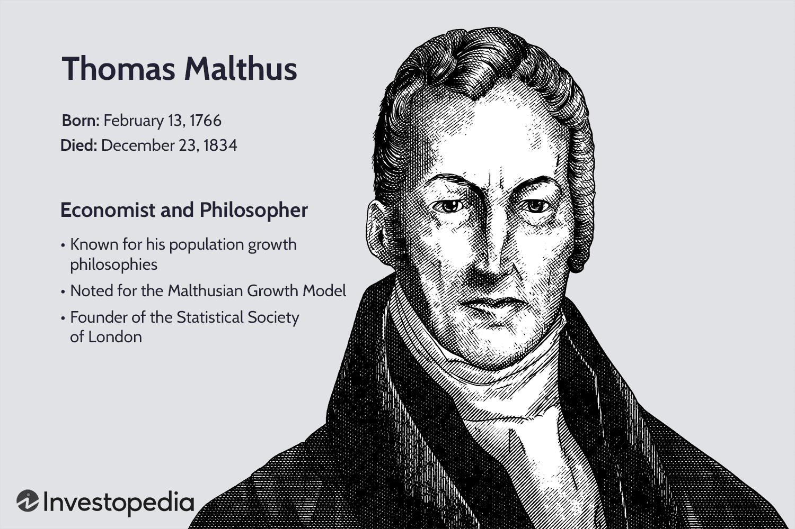

The Malthusian Theory, proposed by Thomas Malthus in 1798, continues to be a significant framework for understanding the dynamics of population growth. His theory postulates that while populations grow geometrically, the resources necessary for sustenance, like food, increase arithmetically. This predicted imbalance, according to Malthus, would inevitably lead to overpopulation and societal challenges such as famine, disease, and poverty. Despite its age, Malthus' theory still stimulates debates across various fields, notably in economics and modern technological contexts. 

Interestingly, there exists a surprising merger between Malthusian ideas and algorithmic trading strategies, two seemingly disparate areas. Algorithmic trading, defined by the use of computer programs to execute trades at speeds and frequencies unmanageable by humans, reflects Malthusian concerns of unsustainable growth. As automation overtakes financial markets, examining these intersections becomes crucial to understanding how historical theories apply to contemporary technological advances. 



This article explores the application of Malthus' theory to algorithmic models not only in trading but also in forecasting population growth. By drawing parallels between exponential growth patterns noted by Malthus and the predictive capabilities intrinsic to algorithmic trading, we gain insights into how traditional theories can enhance modern analytical frameworks. Additionally, this analysis provides an opportunity to understand the implications of automation in trading and its confluence with Malthusian concepts, offering both a retrospective and prospective view on sustainability in economics and technology.

## Table of Contents

## Understanding Malthus' Ideas on Population Growth

Thomas Malthus, an influential 18th-century philosopher and economist, is best known for his theories on population growth that he outlined in his seminal work, "An Essay on the Principle of Population" published in 1798. Malthus posited that while population tends to increase in a geometric progression (e.g., 2, 4, 8, 16), food production grows at an arithmetic rate (e.g., 1, 2, 3, 4). This fundamental disparity, Malthus argued, would inevitably lead to a scenario where the resources available would not suffice to support the burgeoning population, culminating in societal challenges such as famine, disease, and increased mortality rates.

Malthus's ideas garnered significant attention and were foundational in the early discourse on population dynamics. The geometric progression of population can be expressed mathematically as $P(t) = P_0 \cdot r^t$, where $P_0$ is the initial population size, $r$ is the growth rate, and $t$ represents time. In contrast, arithmetic growth of food supply could be expressed as $F(t) = F_0 + ct$, where $F_0$ is the initial food supply, and $c$ is a constant rate of increase. This model starkly illustrates the compounding nature of population growth against the linear progression of food resource expansion.

Although many of Malthus's predictions have not come to fruition due to technological advancements, particularly in agricultural practices known as the Green Revolution, his work was pivotal in raising awareness about the potential strain of population growth on resources. The development of high-yield crops, improved irrigation techniques, and the use of fertilizers have dramatically increased food production capacities, effectively countering Malthus's anticipated outcomes.

Despite its limitations, Malthus's model has prompted critical dialogues about sustainable practices long before these concepts became widely acknowledged. Furthermore, it established a foundation for subsequent theories in various fields, including evolutionary biology—where the struggle for existence and natural selection are key concepts—and economics, particularly in discussions surrounding resource allocation and sustainable development.

While contemporary criticisms highlight the oversimplifications inherent in Malthusian theory, particularly its underestimation of human ingenuity and technological evolution, the basic premise continues to offer valuable insights into understanding population dynamics and resource management, influencing policies and economic strategies aimed at achieving long-term sustainability.

## Algorithmic Trading: A Brief Overview

Algorithmic trading is a sophisticated approach to financial markets, utilizing computer programs to execute trades by adhering to a specified set of rules or algorithms. These algorithms are designed to analyze market data and identify opportunities based on various factors such as time, price, and quantity. This method is distinguished by its ability to operate at speeds and frequencies that are far beyond human capability, thus potentially maximizing profits.

One of the fundamental strategies in [algorithmic trading](/wiki/algorithmic-trading) is [arbitrage](/wiki/arbitrage), which involves exploiting price differences of the same asset across different markets or forms. Additionally, trend-following strategies are widely employed, where algorithms detect patterns in market data, predicting future movements based on historical trends. Mean reversion is another technique, which revolves around the assumption that the price of an asset will revert to its average over time.

The proliferation of algorithmic trading is significantly driven by technological advancements. With the development of faster processors and enhanced data transfer capabilities, algorithms can process vast amounts of data almost instantaneously. This evolution has minimized the role of emotional decision-making in trading, contrasting with traditional trading methods where human emotions, such as fear and greed, can heavily influence outcomes. Algorithms operate based on logical analysis and data, offering a level of precision and consistency not achievable by human traders.

In contemporary financial markets, automated trading systems represent a considerable proportion of trading activity. Their ability to analyze historical data and identify predictive patterns bears similarities to population forecasting models, where data analysis is crucial to understanding and predicting growth dynamics. The effectiveness of algorithmic trading hinges on its capacity to discern reliable patterns amidst the noise of market fluctuations, much like how population predictions must account for various dynamic factors to be accurate.

Overall, algorithmic trading exemplifies the integration of technology into the financial industry, showcasing how structured algorithms can influence market outcomes predictively and consistently. As technology continues to advance, the impact and scope of algorithmic trading are expected to expand, further influencing market behaviors and investment strategies.

## Drawing Parallels: Malthusian Theory and Algorithmic Models

In algorithmic trading, the identification of patterns akin to those predicted by Malthusian theory can offer significant insights for investment strategies. Thomas Malthus' observations of exponential population growth parallel traders' quests for growth patterns or market disruptions. Historically, Malthus posited that while resources such as food increase arithmetically, population tends to grow geometrically. This disparity implied inevitable societal challenges unless checked by external factors like famine or disease.

Traders similarly exploit historical data for predictive purposes. By analyzing past market trends, they aim to foresee future fluctuations that may signal potential financial gains or losses. Algorithmic models take advantage of this method by incorporating vast quantities of historical data to detect nuances in market trajectories, akin to forecasting population escalations or dwindlings in Malthusian terms.

In practice, interpreting and forecasting market 'calamities' such as financial bubbles can draw from Malthusian principles. Just as an unchecked population surge might prelude a systemic collapse, unsustainable market growth might hint at an impending bubble. Such predictive foresight is integral to developing strategic responses to avert financial downfalls.

Consider an algorithm designed to forecast potential bubbles using a simple representation of exponential growth disparities:

```python
import numpy as np

# An array representing historical market prices
market_prices = np.array([100, 105, 110, 108, 115, 120, 125, 130, 135, 150])

# Calculate the growth rate
growth_rate = np.diff(market_prices) / market_prices[:-1]

# Identify when growth rate starts exceeding a certain threshold, signaling a potential bubble
bubble_threshold = 0.15
potential_bubble = np.where(growth_rate > bubble_threshold)[0] + 1

print("Potential bubble detected at indices:", potential_bubble)
```

The above code uses historical data to calculate growth rates, highlighting potential bubbles when steep rises are detected. Such models can emulate the Malthusian assessment of growth forecasts to predict significant market events.

Both Malthusian theory and algorithmic trading underscore the importance of leveraging historical data to anticipate future scenarios, emphasizing the enduring relevance of classical theories in refining contemporary technological applications.

## Innovations Overcoming Malthusian Predictions

Thomas Malthus's theory on population growth posited that food supply would be unable to keep pace with the rapid increase in population. This prediction, however, was largely counteracted by significant advancements in agricultural practices and technology. The Green Revolution, characterized by the development of high-yield crops and improved agricultural techniques, played a crucial role in alleviating food scarcity fears. Similarly, innovations are transforming algorithmic trading by addressing its inherent limitations and enhancing the capability of trading systems.

One of the most significant innovations in algorithmic trading is the implementation of [artificial intelligence](/wiki/ai-artificial-intelligence) (AI) and [machine learning](/wiki/machine-learning) (ML). These technologies enable trading systems to process vast amounts of data at unprecedented speeds. Unlike traditional rule-based algorithms, AI and ML can learn from past data to predict future trends, thus adapting to changing market conditions without manual adjustments. For example, [reinforcement learning](/wiki/reinforcement-learning) can optimize trading strategies by training algorithms using historical data sets to simulate market conditions. This adaptability mirrors the agricultural advancements that countered Malthus's predictions, as both rely on leveraging new technologies to enhance productivity and resilience.

AI-driven algorithms are capable of recognizing intricate patterns in data, which allows them to anticipate market shifts and minimize risks. Machine learning models like decision trees and neural networks can forecast stock price movements by analyzing complex correlations that human traders might overlook. This capability is akin to the way improved seed varieties and cultivation methods transformed agricultural output.

Moreover, innovative algorithms now incorporate sentiment analysis from social media and news outlets to gauge market sentiment, providing an additional layer of predictive power. Natural language processing (NLP) techniques analyze textual data to generate sentiment scores that can influence trading decisions. Such innovations extend beyond the mathematical precision of traditional models by incorporating qualitative insights, much like how crop diversification and genetic engineering addressed multifaceted agricultural challenges.

These technological advancements not only enhance the precision and adaptability of algorithmic trading systems but also highlight humanity's ability to transcend perceived theoretical constraints like those proposed by Malthus. By creatively applying innovative solutions, the financial sector continues to evolve, maintaining efficiency and reliability akin to the sustained growth of food production systems. This ongoing evolution underscores the importance of continuous innovation and adaptability in overcoming theoretical forecasts, whether in population dynamics or financial markets.

## Conclusion: Relevance of Malthusian Theory in Algorithmic Context

Though largely disproven in the context of agriculture, the Malthusian theory remains pertinent when examining growth patterns, particularly in the modern landscape of algorithmic trading. The core of Malthusian thought, centered on the conflict between exponential population growth and linear resource expansion, offers a framework for understanding market dynamics. In financial contexts, similar tensions can arise between market growth and the available information or capital resources, potentially leading to market corrections or financial "calamities."

The applicability of Malthusian principles in algorithmic trading can offer fresh insights into market behaviors and forecast potential systemic risks. Algorithmic trading relies heavily on historical data, much like Malthus used historical population data to make predictions. By analyzing this data through a Malthusian lens, traders can identify patterns of unsustainable growth or impending corrections, drawing parallels to overpopulation predictions of the past.

For instance, consider the predictive modeling techniques used in algorithmic trading. These techniques can incorporate Malthusian-based assumptions about limits and constraints to forecast potential tipping points in the market. The simple mathematical principle $P(t) = P_0 e^{rt}$, where $P$ is the population size, can be analogized to investor interest or market size, $r$ represents the growth rate, and $t$ signifies time. Such modeling can alert analysts to conceivably unsustainable growth trending towards a critical point.

Moreover, the parallels highlight the importance of sustainability and preparation in both ecological and economic systems. Just as agricultural innovations have significantly mitigated Malthusian concerns about food scarcity, advancements in algorithmic models—through AI and machine learning—progressively counteract potential market inefficiencies. These technological innovations underscore human ingenuity's ability to reinterpret classic theories in contemporary settings, fostering robust strategies designed to withstand volatile economic landscapes.

In sum, evaluating Malthusian theory alongside algorithmic trading strategies underscores a deep-rooted need for sustainability, forecasting, and preparation. By leveraging classical concepts within modern technological frameworks, analysts can better anticipate and navigate growth constraints, ensuring more stable and predictable economic environments.

## References & Further Reading

[1]: Malthus, T. R. (1798). ["An Essay on the Principle of Population."](http://www.esp.org/books/malthus/population/malthus.pdf) 

[2]: ["The Population Bomb"](https://en.wikipedia.org/wiki/The_Population_Bomb) by Paul Ehrlich

[3]: Lopez de Prado, M. (2018). ["Advances in Financial Machine Learning."](https://www.amazon.com/Advances-Financial-Machine-Learning-Marcos/dp/1119482089) Wiley.

[4]: Aronson, D. R. (2007). ["Evidence-Based Technical Analysis: Applying the Scientific Method and Statistical Inference to Trading Signals."](https://onlinelibrary.wiley.com/doi/book/10.1002/9781118268315) Wiley.

[5]: Jansen, S. (2020). ["Machine Learning for Algorithmic Trading: Predictive Models to Extract Signals from Market and Alternative Data for Systematic Trading Strategies with Python."](https://www.amazon.com/Machine-Learning-Algorithmic-Trading-alternative/dp/1839217715) Packt Publishing.