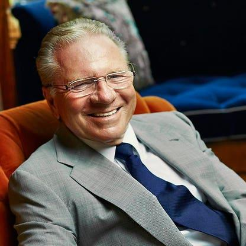

## Table of Contents

## Who is Thomas Peterffy?

Thomas Peterffy is a businessman who started a company called Interactive Brokers. He was born in Hungary and moved to the United States when he was young. He worked hard and used computers to help him trade stocks. His company helps people buy and sell stocks easily on the internet.

He is also known for being very rich. In fact, he is one of the richest people in the world. Thomas likes to help others too. He gives money to schools and other good causes. He believes in using his success to make the world a better place.

## Where and when was Thomas Peterffy born?

Thomas Peterffy was born in Budapest, Hungary. He came into the world on September 30, 1944. This was a tough time because World War II was happening.

Growing up in Hungary, Thomas faced many challenges. But he worked hard and later moved to the United States to chase his dreams. There, he started a successful business and became very well-known.

## What was Thomas Peterffy's early life like?

Thomas Peterffy was born in Budapest, Hungary, in 1944. This was during World War II, so times were hard. His family faced many challenges because of the war. When he was young, Thomas learned to be tough and smart. He went to school in Hungary and did well, but he always dreamed of more.

When Thomas was 20 years old, he moved to the United States. He didn't speak much English at first, but he worked hard to learn. He started as an architectural draftsman but soon got interested in the stock market. Thomas used his skills with computers to help him trade stocks. This was the start of his big success.

## How did Thomas Peterffy start his career in finance?

Thomas Peterffy started his career in finance after moving to the United States from Hungary. At first, he worked as an architectural draftsman. But he got interested in the stock market. He saw that computers could help him trade stocks better. So, he started using computers to make his trades.

In the early 1970s, Thomas began working at a small brokerage firm. He used his computer skills to create a system that could help him trade options. This was new and different. It helped him make more money and do better than others. This was the start of his big success in finance.

## What is Thomas Peterffy's most notable achievement?

Thomas Peterffy's most notable achievement is founding [Interactive Brokers](/wiki/interactive-brokers-api). This company helps people all over the world buy and sell stocks easily using the internet. Before Interactive Brokers, trading stocks was hard and only for rich people. Thomas made it simple and open to everyone. His company grew big and successful, making him one of the richest people in the world.

Another important achievement of Thomas Peterffy is how he used computers to change trading. He was one of the first to use computers to trade stocks and options. This made trading faster and more accurate. His ideas and hard work helped make the stock market better for everyone.

## How did Thomas Peterffy contribute to the development of electronic trading?

Thomas Peterffy made a big difference in electronic trading. He was one of the first people to use computers to trade stocks and options. Before him, trading was done by hand, which was slow and could make mistakes. Thomas saw that computers could do it faster and better. He started using computers to make his trades, which helped him do well in the stock market.

His work led to the creation of Interactive Brokers. This company lets people all over the world trade stocks easily on the internet. Before Interactive Brokers, only rich people could trade stocks because it was hard and expensive. Thomas made it simple and open to everyone. His ideas and hard work changed the stock market, making it better and easier for everyone to use.

## What companies has Thomas Peterffy founded or been involved with?

Thomas Peterffy founded Interactive Brokers. This company helps people buy and sell stocks on the internet. It makes trading easy for everyone, not just rich people. Before Interactive Brokers, trading was hard and expensive. Thomas used his computer skills to make trading simple and open to everyone. His company grew big and successful, making him one of the richest people in the world.

Thomas also started a company called Timber Hill. This was before Interactive Brokers. Timber Hill was one of the first to use computers for trading options. Thomas used his computer skills to make trading faster and more accurate. Timber Hill helped him learn and grow, leading to the success of Interactive Brokers later on.

## What is the impact of Thomas Peterffy's work on the financial industry?

Thomas Peterffy's work changed the financial industry a lot. He started using computers to trade stocks and options. Before him, trading was done by hand, which was slow and could make mistakes. Thomas saw that computers could do it faster and better. He used computers to make his trades, which helped him do well in the stock market. His ideas made trading faster and more accurate, which helped the whole industry.

Thomas also made trading easier for everyone. He founded Interactive Brokers, a company that lets people all over the world buy and sell stocks on the internet. Before Interactive Brokers, only rich people could trade stocks because it was hard and expensive. Thomas made it simple and open to everyone. His company grew big and successful, making the stock market better and easier for everyone to use.

## What challenges did Thomas Peterffy face in his career, and how did he overcome them?

Thomas Peterffy faced many challenges in his career. When he first moved to the United States from Hungary, he didn't speak much English. This made it hard for him to find good jobs. He started working as an architectural draftsman, but he wanted to do more. He got interested in the stock market, but at that time, trading was hard and only for rich people. Thomas saw that computers could help, but no one else was using them for trading yet.

Thomas overcame these challenges by working hard and using his skills. He learned English and started using computers to trade stocks and options. He was one of the first to do this, and it helped him do better than others. He also started his own companies, Timber Hill and Interactive Brokers. These companies made trading easier for everyone, not just rich people. By being smart and never giving up, Thomas turned his challenges into big successes.

## How has Thomas Peterffy's approach to business and technology evolved over time?

Thomas Peterffy's approach to business and technology started with a simple idea: using computers to trade stocks and options. When he first moved to the United States, trading was done by hand, which was slow and could make mistakes. Thomas saw that computers could do it faster and better. He started using computers to make his trades, which helped him do well in the stock market. This was new and different, and it helped him stand out. He founded Timber Hill, one of the first companies to use computers for trading options. His focus was on using technology to make trading more accurate and efficient.

Over time, Thomas's approach grew and changed. He founded Interactive Brokers, a company that lets people all over the world buy and sell stocks easily on the internet. Before Interactive Brokers, trading was hard and only for rich people. Thomas made it simple and open to everyone. His company grew big and successful, showing how his focus on technology could change the whole industry. Thomas kept using new technology to make trading better and easier. His work showed that being smart with technology and never giving up can lead to big success.

## What are some of Thomas Peterffy's views on economic and regulatory policies?

Thomas Peterffy believes that too many rules can make it hard for businesses to grow. He thinks that the government should not control the economy too much. He has said that high taxes and strict rules can stop people from starting new businesses. Thomas believes that if people have more freedom to make their own choices, it can help the economy grow. He has shared these ideas in interviews and talks, saying that less control from the government can lead to more jobs and more money for everyone.

Thomas also cares a lot about how the stock market works. He thinks that clear and fair rules are important for trading. He has spoken out against rules that he thinks are too hard on businesses. Thomas believes that the stock market should be open and easy for everyone to use. He has used his own company, Interactive Brokers, to show how technology can help make trading better. He wants to see a future where people can trade stocks easily and fairly, without too many rules getting in the way.

## What is Thomas Peterffy's legacy in the field of finance and technology?

Thomas Peterffy's legacy in finance and technology is huge. He started using computers to trade stocks and options when no one else was doing it. This made trading faster and more accurate. He founded Interactive Brokers, a company that lets people all over the world buy and sell stocks easily on the internet. Before Interactive Brokers, trading was hard and only for rich people. Thomas made it simple and open to everyone. His company grew big and successful, showing how technology can change the whole industry.

Thomas also showed that being smart with technology and never giving up can lead to big success. He faced many challenges, like not speaking much English when he moved to the United States. But he worked hard and used his skills to make trading better. His ideas helped make the stock market easier for everyone to use. Thomas's work changed the way people think about trading and technology. He made a big difference in the financial world, and his legacy will be remembered for a long time.

## References & Further Reading

[1]: ["The Man Who Revolutionized Wall Street: Behind the Success of Thomas Peterffy and Interactive Brokers"](https://en.wikipedia.org/wiki/Thomas_Peterffy) by MarketWatch

[2]: ["Thomas Peterffy's Profile"](https://en.wikipedia.org/wiki/Thomas_Peterffy) on Forbes

[3]: ["How Thomas Peterffy Used a Computer Program to Beat Wall Street at Its Own Game"](https://en.wikipedia.org/wiki/Thomas_Peterffy) by Institutional Investor

[4]: ["Interactive Brokers: Thomas Peterffy's Scripts for Success"](https://www.investors.com/news/management/leaders-and-success/thomas-peterffy-doesnt-waste-words-interactive-brokers/) by Financial Times

[5]: ["Thomas Peterffy: The Father of High-Speed Trading"](https://en.wikipedia.org/wiki/Thomas_Peterffy) by The Wall Street Journal

[6]: ["Electronic and Algorithmic Trading Technology: The Complete Guide"](https://www.amazon.com/Electronic-Algorithmic-Trading-Technology-Financial/dp/0123724910) by Kendall Kim

[7]: ["Automated Trading: How the First Computers Changed the Stock Market"](https://www.theregister.com/2013/06/21/hft_financial_trading_rise_of_the_machines/) by Bloomberg

[8]: ("The Power of Algorithms in Financial Markets"](https://www.bestwebtrader.com/unlocking-the-power-of-algorithms-in-financial-markets/) by Martin Sewell and Yuval Millo

[9]: ["The Evolution of the Stock Market: From Paper to Algorithms"](https://wjaets.com/sites/default/files/WJAETS-2024-0136.pdf) by The New York Times