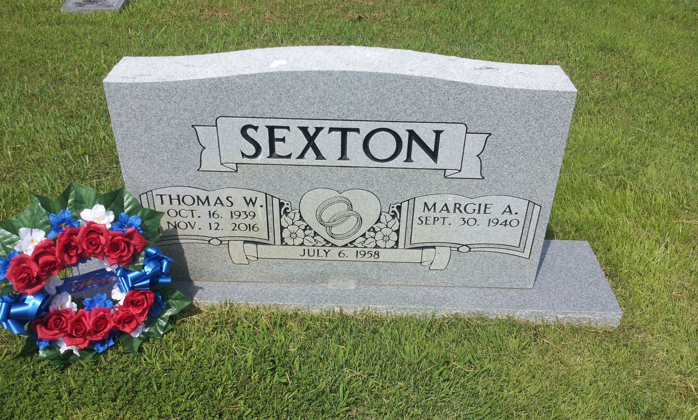

Thomas W. Sexton III is a distinguished leader in the financial industry, currently serving as the President and Chief Executive Officer (CEO) of the National Futures Association (NFA). He has carved out a respected place within the sector through his incisive work on regulatory issues, particularly focusing on the complex landscape of derivatives. His role at the NFA underscores his importance, as the organization plays a crucial part in ensuring integrity and transparency in futures markets. Sexton's efforts have not only reinforced the regulatory framework but also enhanced industry confidence through strategic oversight and governance. His contributions are pivotal in navigating the dynamic challenges associated with derivatives, underscoring his significance as a key figure in financial regulation.

## Table of Contents

## Early Life and Educational Background

Thomas W. Sexton III exhibited an early interest in the fields of law and finance, setting the foundation for his impactful career in the financial regulatory landscape. Sexton's formative years were marked by a keen inclination toward understanding the complexities of governance and financial systems, which later translated into a distinguished academic pursuit.

Sexton pursued his undergraduate education at the University of Notre Dame, where he earned a bachelor's degree in government. This degree provided him with a robust understanding of political and administrative systems, equipping him with the knowledge necessary to navigate the intricacies of financial regulation later in his career. His education at Notre Dame played a pivotal role in shaping his analytical and critical thinking skills, essential attributes for his future endeavors in regulatory roles.

In his continuous quest for knowledge and specialization, Sexton obtained a Juris Doctor degree from Notre Dame Law School. This achievement underscores his commitment to understanding the legal frameworks that underpin the financial industry. The Juris Doctorate armed him with a comprehensive understanding of legal practices and principles, proving invaluable in his subsequent roles where regulatory compliance was paramount.

Further enhancing his proficiency in managing financial and business operations, Sexton pursued a Master of Business Administration (MBA) from Loyola University Chicago. The MBA program provided him with advanced insights into business management, strategic decision-making, and financial analysis, ensuring a well-rounded expertise in both the legal and financial arenas.

Through his educational background, Thomas W. Sexton III developed a formidable foundation in government, law, and business, which seamlessly integrated to facilitate his future success in the financial regulatory sector. His academic accomplishments at these prestigious institutions underscored his preparedness to tackle the multifaceted challenges of the derivatives and futures trading industries.

## Career Beginnings and Growth

Thomas W. Sexton III's career began with his role as an associate at the law firm Ogden, Murphy & Wallace in Seattle, where he gained initial experience in the legal and financial environment. His transition into the National Futures Association (NFA) occurred in 1991 when he joined as an attorney. Sexton's legal expertise and comprehension of financial regulations facilitated his steady progression within the NFA. 

In his initial years at the NFA, Sexton's responsibilities primarily involved legal and regulatory aspects, providing him with a comprehensive understanding of the financial markets and the challenges faced by the derivatives industry. His capacity to navigate complex legal frameworks enabled him to address critical regulatory issues effectively. 

By 2001, after a decade of service, Sexton's career had advanced significantly, culminating in his appointment as the general counsel and secretary of the NFA. This role marked a pivotal point in his career, as he became the chief legal officer responsible for overseeing all legal matters of the organization. His leadership was instrumental in formulating and implementing policies that ensured compliance with the regulatory requirements, thereby reinforcing the NFA's mission in promoting market integrity and protection for investors.

## Leadership at the National Futures Association

Thomas W. Sexton III assumed the position of President and CEO of the National Futures Association (NFA) in March 2017. Sexton's leadership at the NFA involves a broad range of responsibilities critical to the integrity and oversight of the derivatives markets. As president, he has been actively engaged in representing the NFA at various industry conferences. These engagements involve speaking on regulatory developments and discussing the association's initiatives to uphold market integrity and protect investors.

In his role, Sexton oversees significant regulatory initiatives that are pivotal in maintaining transparency and trust within the futures and derivatives markets. His leadership has been marked by efforts to strengthen operational procedures and adapt to the ever-evolving financial landscape. This includes addressing challenges such as market [volatility](/wiki/volatility-trading-strategies), technological advances in trading, and ensuring compliance with both domestic and international standards.

Sexton's expertise and influence extend beyond the NFA, as he plays a significant role in the Commodity Futures Trading Commission (CFTC) Global Markets Advisory Committee. This committee advises the CFTC on various issues that impact the competitiveness of U.S. markets and its participants, including international regulatory developments. Sexton's involvement allows him to bring insights and recommendations to the table, contributing to informed decisions that shape the global regulatory environment.

His leadership reflects a commitment to enhancing the NFA's role as a dedicated industry watchdog, ensuring that the regulatory frameworks are robust and adaptable to future challenges. Through his work, Sexton has made significant contributions to the efficiency and stability of the financial systems he oversees.

## Challenges and Achievements

Thomas W. Sexton III's tenure at the National Futures Association (NFA) has been marked by his navigating significant challenges, notably the Peregrine Financial Group scandal in 2012. The incident involved the brokerage firm's CEO, Russell Wasendorf Sr., misappropriating over $200 million in customer funds, which exposed deficiencies in the oversight mechanisms of derivatives and futures trading. As a response, Sexton played a crucial role in restructuring the regulatory framework to prevent future occurrences of such fraudulent activities.

In addressing the fallout from the scandal, Sexton and the NFA focused on strengthening the organization's regulatory oversight. One of the critical measures implemented was the introduction of enhanced reporting requirements for firms. This included rigorous daily confirmation of account balances directly from banks housing customer funds, adding an extra layer of transparency and security. Additionally, the NFA supplemented its auditing processes with cutting-edge technology to better detect anomalies in financial reporting.

Sexton's strategic emphasis on bolstering internal controls and employing advanced analytics to monitor member activity ushered in a new era of accountability within the NFA. Under his leadership, the organization also expanded its educational programs, targeting both industry professionals and the public to increase awareness of regulatory compliance and the importance of consumer protection.

Throughout his career, Sexton has received a number of accolades acknowledging his contributions to advancing regulatory standards in the financial industry. While specifics of such recognitions are not detailed in the provided material, his continued influence and leadership at the NFA are indicative of his respected status among peers and regulatory bodies.

Sexton's proactive strategies following the Peregrine Financial Group scandal exemplify his commitment to integrity and innovation in financial regulation, solidifying his legacy as a stabilizing force in an often tumultuous industry.

## Contributions to Algo Trading and Financial Regulation

Thomas W. Sexton III has made substantial contributions to the field of [algorithmic trading](/wiki/algorithmic-trading) within his regulatory role at the National Futures Association (NFA). As the President and CEO of the NFA, Sexton has played a vital role in overseeing the formulation and implementation of policies that govern algorithmic trading, which is a significant component of modern financial markets.

One of the key areas where Sexton's influence is evident is the development of regulatory standards that ensure the integrity and stability of algorithmic trading systems. Sexton has advocated for stringent compliance measures to mitigate risks associated with high-frequency trading, such as market manipulation and systemic risks. Under his leadership, the NFA has emphasized the importance of "best execution" practices, where firms are required to ensure that trades are executed under the most favorable conditions for clients, reducing undue market impact.

Sexton has also supported initiatives that promote transparency and accountability in algorithmic trading. These initiatives include mandating that member firms maintain a thorough audit trail that captures all aspects of their trading algorithms, from design to deployment. This ensures that in the event of a regulatory inquiry or market disruption, a comprehensive review of the algorithmic strategies used can be conducted swiftly.

Another critical policy area under Sexton's guidance has been the resilience of trading systems. This involves establishing norms for stress testing and validating algorithms before they are deployed in live environments. Such measures are designed to avoid "flash crashes" and other destabilizing events by ensuring that trading algorithms can withstand adverse market conditions without contributing to volatility.

In his broader impact on financial regulation, Sexton's work emphasizes the harmonization of global regulatory standards. Recognizing that financial markets operate across borders, Sexton has participated in international committees that strive for consensus on principles for regulating algorithmic trading. His role in the Commodity Futures Trading Commission's (CFTC) Global Markets Advisory Committee reflects his commitment to global dialogue on these issues.

Sexton's contributions have led to significant advancements in how the financial industry approaches regulation and compliance concerning algorithmic trading. By fostering an environment that prioritizes robust governance and operational risk management, Sexton has helped shape a regulatory framework that balances innovation in trading technology with the need for market stability and investor protection. This balanced approach continues to serve as a benchmark for regulatory bodies worldwide. 

Overall, Thomas Sexton's contributions have not only bolstered the integrity and stability of financial markets but have also enhanced the industry's ability to adapt to the rapid changes introduced by technological advancements in trading. For further insights into his work and influence, resources such as MarketsWiki and LinkedIn provide valuable information.

## Conclusion

Thomas W. Sexton III has achieved substantial progress in shaping the regulatory framework of the derivatives and futures trading sector through his strategic leadership and policy direction. Since taking on the role of President and CEO of the National Futures Association (NFA) in 2017, Sexton has played a pivotal role in steering regulatory initiatives that contribute to the integrity and stability of the financial markets. His vision has been instrumental in addressing complex challenges, particularly through significant events such as the Peregrine Financial Group scandal, where his decisive strategies and reforms fortified NFA’s regulatory policies and practices.

The financial industry continues to benefit from Sexton’s emphasis on transparency, compliance, and robust regulatory frameworks. His contributions are especially noted in the growing field of algorithmic trading, where his insights and policies have influenced industry practices, ensuring that technological advancements do not compromise market fairness and integrity. Sexton’s role in the Commodity Futures Trading Commission (CFTC) Global Markets Advisory Committee reflects his commitment to fostering international collaboration and harmonization in financial regulation.

Recognized for his leadership and impact, Thomas W. Sexton III remains a key figure whose influence extends beyond immediate regulatory mandates. His work exemplifies a forward-thinking approach to governance within the derivatives sector, and he continues to engage with industry stakeholders to address evolving challenges. For those interested in understanding Sexton’s comprehensive impact on the financial landscape, resources such as MarketsWiki and his professional profile on LinkedIn offer further insights into his career and contributions.

## References & Further Reading

[1]: ["Advances in Financial Machine Learning"](https://www.amazon.com/Advances-Financial-Machine-Learning-Marcos/dp/1119482089) by Marcos Lopez de Prado

[2]: ["Evidence-Based Technical Analysis: Applying the Scientific Method and Statistical Inference to Trading Signals"](https://www.amazon.com/Evidence-Based-Technical-Analysis-Scientific-Statistical/dp/0470008741) by David Aronson

[3]: ["Machine Learning for Algorithmic Trading"](https://github.com/stefan-jansen/machine-learning-for-trading) by Stefan Jansen

[4]: ["Quantitative Trading: How to Build Your Own Algorithmic Trading Business"](https://www.amazon.com/Quantitative-Trading-Build-Algorithmic-Business/dp/1119800064) by Ernest P. Chan

[5]: Commodity Futures Trading Commission. ["Global Markets Advisory Committee (GMAC)."](https://www.cftc.gov/About/AdvisoryCommittees/GMAC)

[6]: National Futures Association. ["NFA Overview."](https://www.nfa.futures.org/)