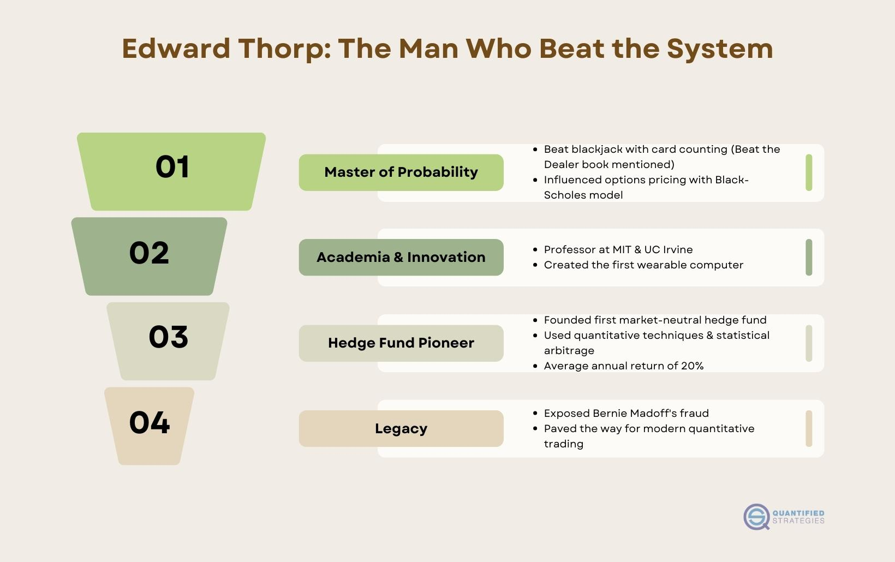

Edward Thorp is a legendary figure known for his contributions to both the gambling and financial sectors. Celebrated for his groundbreaking use of mathematics and probability theory, Thorp revolutionized conventional gaming strategies and subsequently brought similar innovation to algorithmic trading. His methodical approach in analyzing and exploiting flawed systems allowed him to outsmart casinos, particularly through card counting in blackjack, a technique detailed in his pioneering book, "Beat the Dealer."

Thorp's influence extends far beyond the casino floors as his innovative application of mathematics paved the way for the development of advanced quantitative trading strategies. His methodologies, underscored by rigorous statistical analysis and probability modeling, have left a lasting impact on the world of finance. The algorithms and theories he devised form the backbone of many modern-day trading systems, cementing his reputation as a forefather of algorithmic trading.

This article focuses on Edward Thorp's substantial impact on algorithmic trading, examining his revolutionary contributions and the enduring legacy of his strategies. We explore how his theories have been adapted for today's financial markets, demonstrating the continued relevance of his insights. By integrating mathematical precision with practical financial applications, Thorp's strategies remain influential, guiding traders and investors in navigating complex market dynamics with confidence and clarity.

## Table of Contents

## The Genius of Edward Thorp: A Brief Biography

Edward Thorp, born in Chicago in 1932, is widely recognized for his profound contributions to both mathematics and its practical applications in gaming and finance. From a young age, Thorp demonstrated an exceptional aptitude for mathematics, which would form the foundation of his pioneering career. His academic journey led him to attain a Ph.D. in mathematics from the University of California, Los Angeles, enhancing his analytical abilities and cementing his path as a thinker inclined towards problem-solving using quantitative methods.

Thorp's entry into the public spotlight came with the publication of his groundbreaking book, "Beat the Dealer" in 1962. This work was revolutionary, as it provided the first scientifically backed strategy for card counting in blackjack. Thorp's card-counting system was based on mathematical principles that allowed players to determine when they had a probabilistic advantage over the house. This strategic approach to blackjack was not merely theoretical but was proven in practice, leading to significant success for Thorp and others who adopted his method. His work demystified the game and changed the perception of gambling strategies, highlighting how mathematical skill could shift the odds in favor of the player.

A key contributor to Thorp's innovative thinking was his collaboration with Claude Shannon, regarded as the father of information theory. Together, they explored the application of their advanced mathematical knowledge to various complex problems. Their work included the development of wearable computers in the early 1960s to predict roulette wheel outcomes, showcasing their ability to push the boundaries of technology and mathematics of the time. This collaboration was crucial in propelling Thorp's intellectual ventures beyond academia and into practical domains where theoretical models could provide real-world benefits.

Thorp's biography is a testament to the impact of early formative experiences and collaborative efforts in crafting a legacy that spans multiple fields. His ability to apply rigorous mathematical analysis to unconventional problems laid the groundwork for his subsequent transition into quantitative finance, further underscoring his role as a pioneer in leveraging mathematics as a tool for innovation.

## Thorp's Transition to Algorithmic Trading

Edward Thorp's transition from casinos to the stock market signified a groundbreaking shift that laid the foundation for his explorations into [algorithmic trading](/wiki/algorithmic-trading). His expertise in probability theory, initially applied to the world of blackjack, provided him with unique insights into financial markets, allowing for the development of quantitative models aimed at identifying pricing anomalies.

Thorp realized that the stock market, much like casino games, could be approached with mathematical precision. By applying his knowledge of probability and [statistics](/wiki/bayesian-statistics), he devised strategies to exploit inefficiencies in market prices. One of the fundamental strategies he developed was statistical [arbitrage](/wiki/arbitrage), which involves taking advantage of price discrepancies between securities. This approach enabled him to generate consistent profits irrespective of the market direction, a strategy that remains integral to modern [quantitative trading](/wiki/quantitative-trading).

One of the key tools in Thorp's toolkit was the development of market-neutral strategies. These strategies focus on balancing long and short positions in such a manner that exposure to market movements is minimized. By doing so, Thorp's methodologies could generate returns based on the relative performance of selected securities rather than the overall market dynamics.

Thorp is also credited with pioneering the application of the Kelly Criterion in financial markets. This formula, originally devised by John L. Kelly, is used to determine the optimal size of a series of bets or investments. It is mathematically expressed as:

$$
f^* = \frac{bp - q}{b}
$$

In this formula, $f^*$ represents the fraction of the capital to be wagered, $b$ is the odds received on the wager, $p$ stands for the probability of winning, and $q$ is the probability of losing. Thorp's use of the Kelly Criterion allowed for optimal capital allocation, enhancing returns while effectively managing risk.

Throughout his career, Thorp's quantitative and systematic approaches became essential frameworks for the burgeoning field of algorithmic trading. His innovative models and strategies are influential blueprints that continue to inspire and guide the development of sophisticated trading algorithms used in financial markets today.

## Strategies and Techniques

Edward Thorp's approach to algorithmic trading was groundbreaking, primarily due to his innovative use of [statistical arbitrage](/wiki/statistical-arbitrage) and market-neutral strategies. These methods were deeply rooted in his understanding and application of quantitative models, reflecting his profound grasp of mathematics and probability.

Statistical arbitrage involves exploiting pricing inefficiencies between related financial instruments, taking long positions in undervalued securities while simultaneously shorting overvalued ones. This strategy aims to profit from the eventual convergence of prices. Thorp's expertise in probability theory allowed him to develop and refine models that could accurately identify these inefficiencies, setting a precedent for future quantitative analysts.

A key element of Thorp's technique was his use of market-neutral strategies. By constructing portfolios that are indifferent to market direction, Thorp minimized exposure to systemic market risk. These strategies often involve balancing long and short positions, thereby protecting his investments from broad market movements and focusing on the performance of individual assets relative to each other.

Central to Thorp's trading methodology was the Kelly Criterion, a formula for optimal capital allocation. The Kelly Criterion is expressed as:

$$
f^* = \frac{bp - q}{b}
$$

where $f^*$ is the fraction of the portfolio to wager, $b$ is the odds received on the wager, $p$ is the probability of winning, and $q$ is the probability of losing ($q = 1 - p$).

Applying the Kelly Criterion allowed Thorp to maximize the growth of his capital while maintaining a prudent level of risk management. This approach not only enhanced returns but also ensured sustainability in his trading practices by avoiding the perils of over-leveraging.

Thorp's data-driven and systematic approach to trading has become the blueprint for modern algorithmic trading. His methods emphasize the importance of rigor in analyzing data, formulating strategies, and executing trades. By leveraging sophisticated statistical models and algorithms, he demonstrated the effectiveness of a disciplined, quantitative approach in generating consistent returns. 

Overall, Edward Thorp's strategies and techniques remain influential, providing a robust framework for traders and investors seeking to apply mathematical strategies to today's complex financial markets.

## Influence on Modern Trading Practices

Edward Thorp is often celebrated as the 'father of quantitative finance,' principally due to his seminal contributions, which have laid a robust foundation for contemporary trading algorithms. Through his pioneering work, Thorp introduced methodologies that stressed the pivotal role of data analysis and [backtesting](/wiki/backtesting), elements that are now integral to the development of trading strategies.

Thorp's approach to trading was grounded in mathematical and statistical rigour, which he applied with remarkable precision. His use of quantitative techniques allowed for the identification of pricing anomalies and inefficiencies in the market. By leveraging statistical arbitrage and market-neutral strategies, Thorp set the stage for the quant-driven approaches that dominate today's financial markets.

One of the fundamental aspects of Thorp's success was his application of the Kelly Criterion, a formula for determining optimal bet sizes to maximize capital growth over time. This mathematical strategy not only improved risk management but also allowed traders to enhance returns systematically. The formula is expressed as:

$$
f^* = \frac{bp - q}{b}
$$

where:
- $f^*$ is the fraction of the capital to wager,
- $b$ is the odds received on the wager,
- $p$ is the probability of winning,
- $q$ is the probability of losing ($1 - p$).

Through rigorous data analysis and backtesting, Thorp proved that disciplined, structured approaches could yield significant advantages over more intuitive or ad-hoc trading methods. His emphasis on empirical validation of trading strategies through historical data has become a standard practice, ensuring that strategies are not only theoretically sound but also practically viable.

The narrative of Thorp's achievements serves as compelling evidence of the efficacy of mathematical and structured methodologies in trading. By prioritizing data-driven insights and systematic evaluation, Thorp demonstrated how sophisticated mathematical tools could be adapted to address the complexities of financial markets. His legacy continues to inspire traders and analysts, underscoring the enduring value of logical, well-calibrated approaches in financial success.

## Applying Thorp's Wisdom Today

Edward Thorp's pioneering work in risk evaluation and return maximization continues to hold significant value in today’s financial markets. At the core of Thorp's methodology is the meticulous evaluation of risk and reward, a concept that remains pertinent for contemporary investors and traders. This process includes the use of mathematical models to scrutinize potential financial outcomes, facilitating informed decision-making grounded in statistical analysis rather than intuition or speculation.

Investors and traders can draw valuable lessons from Thorp’s emphasis on discipline and the leveraging of informational advantages. Discipline is crucial in maintaining a consistent and objective approach to trading and investment, mitigating the impact of emotional biases. By adhering to a well-defined strategy, traders can systematically approach markets, avoiding reactionary behavior that often leads to suboptimal financial decisions. Moreover, Thorp advocated for the use of superior information or analytical techniques as a means to gain an edge in the market. This approach underscores the importance of data-driven analytics and continuous learning, allowing traders to refine their strategies in response to market dynamics.

Despite the rapid technological advancements that have transformed the trading landscape, the foundational principles championed by Thorp endure as constants. His advocacy for the use of statistical methods like the Kelly Criterion, which calculates an optimal size of investment to maximize return while managing risk, remains influential. The Kelly Criterion is mathematically expressed as follows:

$$
f^* = \frac{bp - q}{b}
$$

where $f^*$ is the fraction of the capital to bet, $b$ is the net odds received on the wager, $p$ is the probability of winning, and $q$ is the probability of losing ($q = 1 - p$). This formula assists investors in determining the most advantageous level of exposure for a given level of risk, still applicable amid modern computational techniques used in trading.

Incorporating Thorp's principles into contemporary financial strategies involves maintaining a commitment to analytical precision and risk management while utilizing available technology to analyze large datasets and backtest strategies. The discipline inherent in Thorp's methodologies acts as a crucial anchor for traders in markets characterized by [volatility](/wiki/volatility-trading-strategies) and complexity, emphasizing a methodical approach to achieving long-term financial success.

## Conclusion

Edward Thorp's legacy in algorithmic trading underscores the transformative potential of mathematical rigor in the financial markets. By applying probability theory and quantitative modeling, Thorp revolutionized both gambling and finance, demonstrating how analytical precision can uncover opportunities that elude conventional wisdom. His pioneering work established methodologies that seamlessly blend mathematical theory with practical trading applications, setting a standard for systematic investment strategies.

Thorp's influence persists in modern trading practices, particularly in the deployment of statistical arbitrage and market-neutral strategies. These strategies typically involve identifying mispricings between related securities to profit from their convergence. The systematic approach Thorp advocated, which includes thorough data analysis and backtesting of strategies, remains a cornerstone of algorithmic trading. This process ensures that strategies are robust and capable of adapting to changing market conditions.

Furthermore, Thorp introduced the financial world to the Kelly Criterion, a formula for determining the optimal size of a series of bets to maximize wealth over time. This criterion is pivotal in risk management, balancing potential returns with the likelihood of success to maintain a sustainable trading strategy. In mathematical terms, for a given probability $p$ of a winning bet with a net gain of $b$, the Kelly Criterion prescribes betting a fraction $f^*$ of capital given by:

$$
f^* = \frac{bp - q}{b}
$$

where $q = 1 - p$ is the probability of losing. This principle ensures that investors avoid the pitfall of over-betting, which can lead to significant drawdowns, by advocating rational bet sizing based on statistical evidence.

Thorp's disciplined approach and emphasis on leveraging informational advantages continue to offer valuable insights for traders and investors. As technological advancements refine data acquisition and analysis, the foundational principles championed by Thorp — accuracy, discipline, and risk management — remain constants that enhance the efficacy of trading strategies. His work acts as a beacon for those aiming to navigate the complexities of the financial markets with precision, illustrating that the fusion of meticulous mathematical analysis and strategic acumen is indispensable for enduring success in trading.

## References & Further Reading

[1]: Thorp, E. O. (1966). ["Beat the Dealer: A Winning Strategy for the Game of Twenty-One."](https://books.google.com/books/about/Beat_the_Dealer.html?id=ts9vDwAAQBAJ) Vintage.

[2]: Thorp, E. O. (2008). ["Beat the Market: A Scientific Stock Market System."](https://www.semanticscholar.org/paper/Beat-the-Market%3A-A-Scientific-Stock-Market-System-Samuelson-Thorp/f81b224e52f5dfeac3fb06676c84b2ce402ffa8e) Wiley.

[3]: Kelly, J. L. (1956). ["A New Interpretation of Information Rate."](https://www.princeton.edu/~wbialek/rome/refs/kelly_56.pdf) Bell System Technical Journal, 35(4), 917-926.

[4]: Poundstone, W. (2006). ["Fortune's Formula: The Untold Story of the Scientific Betting System That Beat the Casinos and Wall Street."](https://www.amazon.com/Fortunes-Formula-Scientific-Betting-Casinos/dp/0809045990) Hill and Wang.

[5]: Niederhoffer, V. (1997). ["The Education of a Speculator."](https://www.amazon.com/Education-Speculator-Victor-Niederhoffer/dp/0471249483) Wiley. 

[6]: ["The Man Who Beat the Dealer and the Market"](https://chatwithtraders.com/ep-109-edward-thorp/) - The New York Times. 

[7]: Lo, A. W. (2010). ["Hedge Funds: An Analytic Perspective."](https://www.jstor.org/stable/j.ctt7rq28) Princeton University Press.