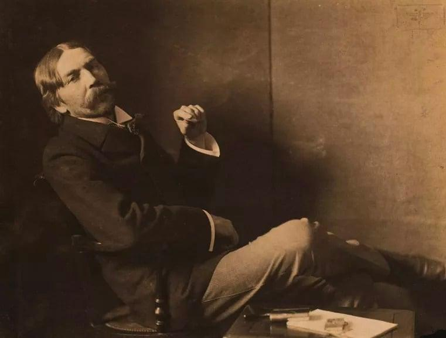

## Table of Contents

## Who was Thorstein Veblen?

Thorstein Veblen was an American economist and sociologist born in 1857. He is best known for his book "The Theory of the Leisure Class," where he introduced the idea of "conspicuous consumption." This idea means that people buy things not because they need them, but to show off their wealth and status. Veblen's ideas were new and different from the common economic theories of his time.

Veblen studied at different universities and worked as a professor at several places, including the University of Chicago. He had a unique way of looking at society and the economy. He believed that many social behaviors were influenced by economic factors. Veblen's work is still important today because it helps us understand how people's buying habits and social status are connected. His ideas have influenced many fields, including economics, sociology, and even marketing.

## When and where was Thorstein Veblen born?

Thorstein Veblen was born on July 30, 1857. He was born in Cato, Wisconsin, in the United States. Cato is a small town, and it was a good place for Veblen to grow up.

Veblen's family was Norwegian. They moved to the United States before he was born. His family helped shape his ideas about work and society.

## What were the major influences on Veblen's early life?

Thorstein Veblen grew up in a Norwegian family that had moved to the United States. His parents were hard-working farmers, and they taught him the value of work. Veblen's family spoke Norwegian at home, which made him feel different from other kids. This feeling of being different helped him see the world in unique ways.

Living in rural Wisconsin also had a big impact on Veblen. He saw how people in his community worked hard and how they valued their land and their possessions. These experiences helped him understand how economics and society are connected. Veblen's early life gave him the ideas that he would later write about in his books.

## What were Veblen's most important academic positions?

Thorstein Veblen held several important academic positions during his career. He started working at the University of Chicago in 1892. At Chicago, he was a fellow, an instructor, and then an assistant professor. This was a big deal because the University of Chicago was a new and important school at the time. Veblen's time at Chicago helped him develop his ideas and write his famous books.

After leaving Chicago, Veblen worked at Stanford University for a short time. He then moved to the University of Missouri, where he was a professor of sociology. Later, he went back to teaching economics at the University of Chicago for a while. Finally, Veblen ended his career at the New School for Social Research in New York City. Each of these positions helped him share his ideas with students and other scholars.

## What is Veblen known for in the field of economics?

Thorstein Veblen is famous in economics for his idea of "conspicuous consumption." This means that people buy things to show off their wealth and status, not because they need them. Veblen wrote about this in his book "The Theory of the Leisure Class." He said that people in the upper class spend a lot of money on fancy things to show others how rich they are. This idea was new and different from what other economists were saying at the time.

Veblen also talked about "Veblen goods." These are things that people want more of when the price goes up, because they think it makes them look richer. His ideas helped people understand why people buy things and how it relates to their social status. Veblen's work is still important today because it helps us see how economics and society are connected.

## What is the concept of 'conspicuous consumption' and how did Veblen develop it?

Conspicuous consumption is when people buy things to show off how rich they are, not because they need them. Thorstein Veblen came up with this idea in his book "The Theory of the Leisure Class." He said that people in the upper class spend a lot of money on fancy things to show others how wealthy they are. This is different from buying things because you need them. Veblen thought that this kind of spending was a way for people to show their status in society.

Veblen developed this idea by looking at how people in his time acted. He saw that people were buying expensive things like fancy clothes and big houses to impress others. He believed that this behavior was not just about having nice things, but about showing off wealth. Veblen's idea of conspicuous consumption helped people understand why some people spend a lot of money on things they don't really need. His work is still important today because it helps us see how our buying habits are connected to our social status.

## How did Veblen's theory of the leisure class impact social theory?

Thorstein Veblen's theory of the leisure class had a big impact on social theory. He said that people in the upper class spend a lot of money on fancy things to show off their wealth. This idea helped people understand that buying things is not always about needing them, but about showing status. Before Veblen, many people thought that economic behavior was all about getting what you need. Veblen showed that it is also about showing off and trying to look better than others.

His ideas changed how people thought about society and economics. Veblen's theory made social theorists think more about how people's actions are influenced by their social class. It helped them see that many things people do are about showing their place in society. This new way of thinking helped start new areas of study, like sociology of consumption and cultural economics. Veblen's work is still important today because it helps us understand how our actions and buying habits are connected to our social status.

## What are some of Veblen's key works and their main themes?

Thorstein Veblen wrote many important books. One of his most famous books is "The Theory of the Leisure Class." In this book, Veblen talks about "conspicuous consumption." He says that rich people buy fancy things to show off their wealth. They do this to look better than others. This idea was new and it changed how people thought about why we buy things. Veblen also wrote about how people in the upper class don't have to work much. They spend their time doing things that show they are rich, like going to fancy parties.

Another key work by Veblen is "The Theory of Business Enterprise." In this book, he talks about how businesses work. Veblen says that businesses often focus on making money for the owners, not on making good products. He thinks that this can hurt the economy. Veblen also wrote about how technology changes businesses. He believed that new technology can make businesses more efficient, but it can also cause problems if it is not used well.

Veblen's book "The Instinct of Workmanship" is also important. In this book, he talks about how people like to make things and do good work. Veblen thinks that this instinct can help make society better. He says that people should focus on making useful things instead of just trying to make money. This idea is different from what many economists thought at the time. Veblen's work helps us understand how people's actions are connected to their jobs and the economy.

## How did Veblen critique the business practices of his time?

Thorstein Veblen didn't like many of the business practices he saw in his time. He thought that businesses were too focused on making money for the owners and not enough on making good products. Veblen called this "pecuniary gain," which means making money is the main goal. He believed that this focus on money hurt the economy because businesses were not trying to make things that people really needed. Instead, they were just trying to make money, even if it meant selling things that were not very good.

Veblen also talked about how businesses used technology. He said that new technology could make businesses more efficient, which is good. But he also thought that businesses sometimes used technology in bad ways. For example, they might use it to control workers or to make things that people don't really need. Veblen believed that businesses should focus more on making useful things and less on just trying to make money. His ideas made people think about how businesses could be better for everyone, not just the owners.

## What was Veblen's view on technological change and its impact on society?

Thorstein Veblen thought that technological change could be really good for society. He believed that new technology could help make businesses more efficient. This means that businesses could make things faster and better. Veblen thought that if businesses used technology the right way, they could make more useful things for people. He said that technology could help people do their jobs better and make society better overall.

But Veblen also saw that technology could cause problems. He thought that businesses might use technology in bad ways. For example, they might use it to control workers or to make things that people don't really need. Veblen worried that businesses were more interested in making money than in using technology to help people. He believed that if businesses focused too much on money, technology could hurt society instead of helping it.

## How have Veblen's theories been applied or critiqued in modern economic and sociological studies?

Veblen's theories are still used and talked about today in economics and sociology. His idea of conspicuous consumption helps people understand why we buy things. Modern studies use Veblen's ideas to look at how people show off their wealth through things like fancy cars and expensive clothes. Economists and sociologists also use Veblen's work to study how social status affects what people buy. His ideas about businesses focusing on making money instead of making good products are also used to look at how companies work today.

Some people have critiqued Veblen's theories too. They say that his ideas are too focused on the upper class and don't explain why people in other classes buy things. Critics also say that Veblen didn't think enough about how people's personal choices affect what they buy. They argue that his theories can't explain all the reasons why people do things. But even with these critiques, Veblen's work is still important. It helps us see how our actions and buying habits are connected to our social status and the economy.

## What is the legacy of Thorstein Veblen in contemporary economic thought?

Thorstein Veblen's legacy in contemporary economic thought is very important. He came up with the idea of conspicuous consumption, which says that people buy things to show off their wealth and status. This idea is still used today to understand why people buy things they don't really need. Economists and sociologists use Veblen's work to study how social status affects what people buy. His ideas help us see that buying habits are not just about needing things, but also about showing off and trying to look better than others.

Veblen also talked about how businesses focus on making money instead of making good products. This idea is still important because it helps us understand how companies work today. Some people have critiqued Veblen's theories, saying they focus too much on the upper class and don't explain why other people buy things. But even with these critiques, Veblen's work is still very influential. It helps us think about how our actions and buying habits are connected to our social status and the economy.

## What are the implications for current economic practices?

In contemporary financial markets, the influence of conspicuous consumption is evident in the practices surrounding algorithmic and high-frequency trading (HFT). These trading methods emphasize speed, data processing capabilities, and technological prowess, which can be perceived as a manifestation of economic status and power. Such emphasis reinforces the concept of conspicuous consumption by prioritizing technology-driven prestige over traditional trading fundamentals.

The cultural focus on rapid trading has implications for economic inequality. High-frequency trading is often associated with significant capital investments in technology infrastructure, including low-latency connections and high-performance computing systems. Firms with the resources to invest in these technologies can execute trades at speeds unattainable by traditional investors, gaining a competitive advantage that highlights economic disparities. This dynamic can be expressed through an inequality where:

$$
v_\text{HFT} > v_\text{Trad}
$$

where $v_\text{HFT}$ represents the execution velocity for high-frequency trades and $v_\text{Trad}$ for traditional trades. The discrepancy between these velocities underscores the barriers faced by market participants without access to sophisticated trading platforms.

Furthermore, the practice of fast trading introduces additional [volatility](/wiki/volatility-trading-strategies) to the markets. Algorithmic trading, driven by complex models and strategies such as [statistical arbitrage](/wiki/statistical-arbitrage) or [market making](/wiki/market-making), can respond rapidly to market stimuli, propagating minute fluctuations into larger price movements. This was demonstrated in events such as the Flash Crash of 2010, where rapid, automated trading contributed to a dramatic drop in market indices.

These trading behaviors raise entry barriers for traditional investors by skewing market dynamics in favor of participants who can effectively leverage advanced technologies. The speed at which trades are executed and the reduced latency in decision-making are not merely tactical advantages but have become symbolic of market status, reminiscent of the conspicuous consumption patterns Veblen critiqued.

In summary, while algorithmic and high-frequency trading represent technological advancements in modern finance, they also reflect economic behaviors that echo the conspicuous consumption Veblen highlighted. The prestige associated with high-speed trading intensifies economic inequalities by privileging entities with the resources to access such technologies, thereby reshaping market dynamics to the detriment of traditional investors.

## References & Further Reading

[1]: Veblen, T. (1899). ["The Theory of the Leisure Class."](https://archive.org/details/theoryleisurecl00veblgoog) Macmillan.

[2]: Lopez de Prado, M. (2018). ["Advances in Financial Machine Learning."](https://www.amazon.com/Advances-Financial-Machine-Learning-Marcos/dp/1119482089) John Wiley & Sons.

[3]: Chan, E. P. (2008). ["Quantitative Trading: How to Build Your Own Algorithmic Trading Business."](https://github.com/ftvision/quant_trading_echan_book) John Wiley & Sons.

[4]: Jansen, S. (2020). ["Machine Learning for Algorithmic Trading."](https://github.com/stefan-jansen/machine-learning-for-trading) Packt Publishing.

[5]: Aronson, D. R. (2007). ["Evidence-Based Technical Analysis: Applying the Scientific Method and Statistical Inference to Trading Signals."](https://onlinelibrary.wiley.com/doi/book/10.1002/9781118268315) John Wiley & Sons.