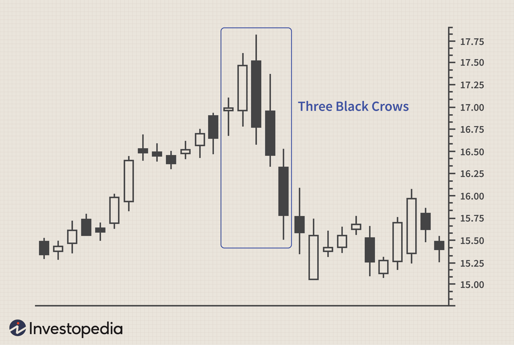

## Table of Contents

## What is the Three Black Crows pattern?

The Three Black Crows pattern is a term used in stock market analysis. It is a bearish pattern that appears on a candlestick chart. It shows that the price of a stock might go down soon. The pattern has three long candlesticks that are all red or black. Each candlestick opens within the body of the previous one and closes lower than the previous one.

This pattern is important because it can help traders decide when to sell their stocks. When they see the Three Black Crows, it means that the sellers are in control and the price is likely to keep falling. Traders often look for other signs too, to be sure that the pattern is a strong signal. If they see other signs that also show a bearish trend, they might decide to sell their stocks to avoid losing money.

## How does the Three Black Crows pattern appear on a chart?

The Three Black Crows pattern shows up on a chart as three long red or black candlesticks in a row. Each candlestick starts at a price that is inside the body of the candlestick before it. This means the new candlestick opens at a price that is higher than where the last one closed. But then, the price goes down a lot during that day or time period, and the candlestick closes at a lower price than the one before it.

This pattern is easy to spot because all three candlesticks look very similar. They all have long bodies and they all close lower than they opened. When you see this pattern, it means that the sellers are pushing the price down more and more each day. It's like a signal that the price might keep going down, so people who trade stocks pay close attention to it.

## What does the Three Black Crows pattern indicate about market trends?

The Three Black Crows pattern tells us that the market might be starting a downward trend. It shows up on a chart as three long red or black candlesticks in a row. Each candlestick opens at a price that is higher than where the last one closed, but then the price drops a lot during that day or time period. This means that sellers are getting stronger and pushing the price down more and more each day.

When traders see the Three Black Crows pattern, they think it's a sign that the price of the stock might keep going down. This pattern is a warning that the sellers are in control and the buyers are not strong enough to stop the price from falling. Traders often look for other signs too, to make sure the pattern is a strong signal. If they see other signs that also show a bearish trend, they might decide to sell their stocks to avoid losing money.

## What are the key characteristics of the Three Black Crows pattern?

The Three Black Crows pattern is a bearish signal that shows up on a stock chart. It has three long red or black candlesticks in a row. Each candlestick starts at a price that is higher than where the last one closed, but then the price drops a lot during that day or time period. This means that the sellers are getting stronger and pushing the price down more and more each day.

When traders see the Three Black Crows pattern, they think it's a sign that the price of the stock might keep going down. This pattern is a warning that the sellers are in control and the buyers are not strong enough to stop the price from falling. Traders often look for other signs too, to make sure the pattern is a strong signal. If they see other signs that also show a bearish trend, they might decide to sell their stocks to avoid losing money.

## How can the Three Black Crows pattern be distinguished from other bearish patterns?

The Three Black Crows pattern is special because it has three long red or black candlesticks in a row. Each candlestick opens at a price that is higher than where the last one closed, but then the price drops a lot during that day or time period. This means that the sellers are getting stronger and pushing the price down more and more each day. This pattern is different from other bearish patterns because it shows a clear and strong downward trend over three days.

Other bearish patterns might not be as clear or strong. For example, the Evening Star pattern has three candlesticks too, but the middle one is small and can be either red or green. The Bearish Engulfing pattern has just two candlesticks, where the second one completely covers the first one. These patterns can also show that the price might go down, but they don't show a strong and steady downward trend like the Three Black Crows does. So, the Three Black Crows pattern is easier to spot and gives a stronger warning that the price might keep falling.

## What are the common time frames for observing the Three Black Crows pattern?

The Three Black Crows pattern can be seen on different time frames, like daily, weekly, or even hourly charts. Traders often look at daily charts because they give a good view of what's happening over a few days. This helps them see if the pattern is a strong sign that the price might keep going down.

On shorter time frames like hourly charts, the Three Black Crows pattern can also appear. But it might not be as strong a signal because the price can change a lot in just a few hours. Traders might use these shorter time frames to make quick decisions, but they usually look at longer time frames too to be sure the pattern is a good sign of a bearish trend.

## What are the psychological factors behind the formation of the Three Black Crows pattern?

The Three Black Crows pattern shows up when a lot of people start to feel worried about a stock's price. At first, the stock opens higher than the day before, which might make some people think it's still doing okay. But then, more and more people decide to sell because they're scared the price will keep going down. This fear makes the price drop a lot during the day, and it closes lower than it opened. This happens for three days in a row, showing that more and more people are getting scared and selling their stocks.

This pattern is a strong sign that people's feelings about the stock are changing from hopeful to worried. When the price keeps going down like this, it makes even more people want to sell. They think it's better to sell now before the price drops even more. This cycle of fear and selling is what creates the Three Black Crows pattern on the chart. It's like a signal that tells traders that the sellers are in control and the price might keep falling because of how people are feeling.

## How reliable is the Three Black Crows pattern in predicting market downturns?

The Three Black Crows pattern is seen as a strong sign that the market might go down. It shows up when the price of a stock drops a lot for three days in a row. Each day, the stock opens higher than the day before but then falls a lot by the end of the day. This pattern tells traders that more and more people are selling their stocks because they're worried the price will keep going down. When traders see this pattern, they often think it's a good time to sell their stocks too, to avoid losing money.

But, the Three Black Crows pattern isn't always right. Sometimes, the market can still go up even after this pattern shows up. Traders need to look at other signs too, like other patterns or news about the company, to be sure the pattern is a strong signal. If other signs also show that the market might go down, then the Three Black Crows pattern is more likely to be right. But if there are no other signs, traders might wait and see what happens next before they decide to sell their stocks.

## What are some strategies for trading based on the Three Black Crows pattern?

When traders see the Three Black Crows pattern, they often think it's a good time to sell their stocks. This pattern shows up when the price of a stock drops a lot for three days in a row. Each day, the stock opens higher than the day before but then falls a lot by the end of the day. This means that more and more people are selling their stocks because they're worried the price will keep going down. So, traders might decide to sell their stocks too, to avoid losing money. They might also use other tools, like looking at other patterns or news about the company, to be sure the Three Black Crows pattern is a strong signal.

Another strategy is to use the Three Black Crows pattern to start short selling. Short selling means borrowing stocks and selling them, hoping to buy them back later at a lower price. When traders see this pattern, they think the price will keep going down, so they might borrow stocks, sell them, and then buy them back when the price is lower. This can make them money if the price does go down like they expect. But it's risky because if the price goes up instead, they can lose money. So, traders need to be careful and look at other signs too before they decide to short sell based on the Three Black Crows pattern.

## Can the Three Black Crows pattern be used in conjunction with other technical indicators?

Yes, traders often use the Three Black Crows pattern along with other technical indicators to make better trading decisions. The Three Black Crows pattern by itself can be a strong sign that the price of a stock might go down. But, to be more sure, traders look at other things too. For example, they might use moving averages to see if the price is below a certain average, which can also show that the price might keep going down. Or, they might look at the Relative Strength Index (RSI) to see if the stock is overbought, which means it might be ready to drop.

Another common indicator traders use with the Three Black Crows pattern is the [volume](/wiki/volume-trading-strategy). If the volume is high during the Three Black Crows pattern, it means a lot of people are selling their stocks, which makes the pattern even stronger. Traders might also look at other patterns, like the Bearish Engulfing pattern or the Evening Star pattern, to see if they show up at the same time. When these other indicators and patterns agree with the Three Black Crows, traders feel more confident that the price will go down. This helps them decide when to sell their stocks or start short selling.

## What are some real-world examples of the Three Black Crows pattern in financial markets?

One real-world example of the Three Black Crows pattern happened with the stock of Apple Inc. in early 2016. After a period of growth, the stock started to show signs of a downturn. Over three consecutive trading days in January, the stock opened higher each day but closed significantly lower, forming the classic Three Black Crows pattern. This signaled to traders that the sellers were taking control, and many decided to sell their shares. The pattern was a clear warning that Apple's stock price might continue to fall, and indeed, the stock did experience a further decline in the following weeks.

Another example occurred with the S&P 500 index in late 2018. After a strong run-up, the index started to show weakness. In December, the Three Black Crows pattern appeared over three days, with each day's trading session opening higher but closing much lower than the previous day. This pattern indicated a strong bearish trend, and many investors and traders took it as a signal to reduce their exposure to the market. The S&P 500 continued to decline in the weeks that followed, confirming the pattern's predictive power in that instance.

## How can algorithmic trading systems be designed to recognize and act on the Three Black Crows pattern?

Algorithmic trading systems can be designed to recognize the Three Black Crows pattern by programming them to look for three long red or black candlesticks in a row on a stock chart. Each candlestick should open higher than the previous one's close and close lower than the previous one's close. The system needs to check these conditions over three consecutive trading days. Once it spots this pattern, the system can send a signal to traders or automatically execute a trade based on predefined rules. For example, if the system is set up for short selling, it might borrow and sell the stock when it sees the Three Black Crows pattern, hoping to buy it back at a lower price later.

To make the system more reliable, it can be programmed to use other technical indicators along with the Three Black Crows pattern. For instance, the system could check the volume to see if it's high during the pattern, which would make the signal stronger. It might also look at moving averages to see if the stock price is below a key average, or check the Relative Strength Index (RSI) to see if the stock is overbought. By combining these indicators, the system can better predict whether the stock price will continue to fall. This way, the [algorithmic trading](/wiki/algorithmic-trading) system can make more informed decisions, reducing the risk of false signals and increasing the chances of successful trades.

## References & Further Reading

[1]: Bulkowski, T. N. (2008). ["Encyclopedia of Candlestick Charts"](https://onlinelibrary.wiley.com/doi/book/10.1002/9781119202288) (Wiley Trading).

[2]: Pring, M. J. (2002). ["Technical Analysis Explained"](https://www.amazon.com/Technical-Analysis-Explained-Fifth-Successful/dp/0071825177), Fourth Edition (McGraw-Hill).

[3]: Cory, D. A. (2019). ["Algorithmic Trading Using Python"](https://www.datacamp.com/tutorial/finance-python-trading) (Independently Published).

[4]: Murphy, J. J. (1999). ["Technical Analysis of the Financial Markets: A Comprehensive Guide to Trading Methods and Applications"](https://archive.org/details/technicalanalysi0000murp) (New York Institute of Finance).

[5]: Chan, E. P. (2009). ["Quantitative Trading: How to Build Your Own Algorithmic Trading Business"](https://github.com/ftvision/quant_trading_echan_book) (Wiley Trading).