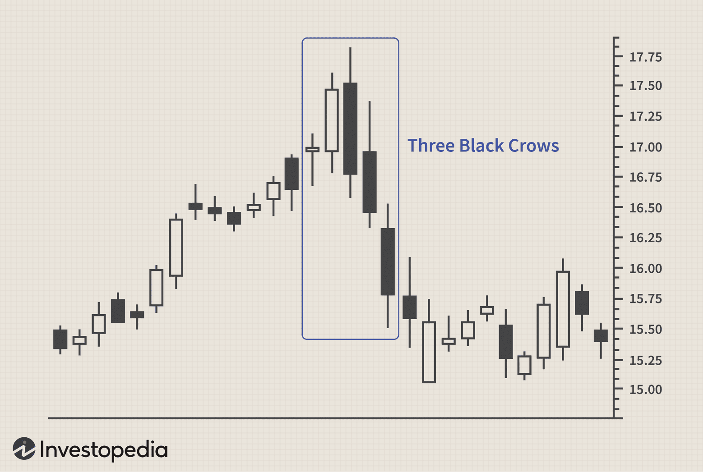

In the world of trading, candlestick patterns offer valuable insights into market psychology and potential future price movements. Among these, the 'Three Black Crows' pattern stands out as a significant indicator for traders focused on technical analysis and algorithmic trading. This pattern, known for its bearish implications, provides a signal of potential trend reversals, making it an essential tool in the trader's toolkit.

The Three Black Crows pattern consists of three consecutive bearish candlesticks, each of which opens within or near the previous candle body and closes at a level lower than the previous candle. Such consecutive bearish closes typically signify robust market momentum and a shift in trader sentiment from bullish to bearish. By understanding this pattern, traders can better predict market downtrends, aiding their decision-making process in both manual and automated trading environments.



With the rise of automated trading systems, recognizing and integrating candlestick patterns like the Three Black Crows into algorithmic trading strategies has become increasingly significant. By leveraging these patterns, traders can enhance their strategy's effectiveness, allowing for optimized entry and exit points while minimizing emotional biases. This article will explore the intricacies of the Three Black Crows pattern, its applications in trading strategies, and how it is utilized in algorithmic trading, equipping traders to optimize their approach to financial markets. Understanding such patterns is crucial, as it provides traders with a critical advantage in navigating complex market dynamics efficiently.

## Table of Contents

## Understanding the Three Black Crows Pattern

The 'Three Black Crows' is a candlestick pattern that signals the potential reversal of an uptrend. It is characterized by three consecutive long-bodied bearish candlesticks, each opening within the real body of the previous candle and closing at a lower price than the preceding candle. This pattern is typically interpreted as a strong bearish signal, indicating a shift in market sentiment from bullish to bearish. To enhance its reliability, traders often use the Three Black Crows pattern in conjunction with other technical indicators to confirm a trend reversal.

Key characteristics of the Three Black Crows pattern include minimal shadows or wicks and a consistent price decline over three trading sessions. These attributes suggest robust selling pressure, as the absence of long shadows indicates that buyers were unable to push the price upward significantly during the formation of the candle. This makes the pattern a compelling indicator of a weakening uptrend.

The opposite of the Three Black Crows pattern is known as the 'Three White Soldiers'. This pattern comprises three consecutive bullish candlesticks, each opening within the real body of the previous candle and closing at a higher price. The Three White Soldiers pattern signals the reversal of a downtrend and is viewed as a positive sign of strengthening bullish sentiment.

When identifying the Three Black Crows pattern, it's essential to consider the overall market context and combine it with other technical tools for reliable signals. While the pattern itself provides a visual indication of a bearish reversal, integrating additional indicators can help validate the pattern and reduce the likelihood of false signals. 

Traders should also be mindful of the pattern's limitations, as it does not account for external factors or broader market trends that may impact its efficacy.

## How to Identify and Use the Three Black Crows Pattern

The Three Black Crows pattern is distinguished by the presence of three consecutive bearish candlesticks, each signaling a potential reversal from a preceding upward trend. The identification of this pattern rests on several distinct characteristics. Firstly, the three bearish candlesticks typically exhibit long bodies, which signify consistent selling pressure throughout their respective trading sessions. Ideally, these candlesticks have minimal shadows—also known as wicks—indicating that the opening prices are close to the highs and the closing prices are near the lows for each session. This lack of significant shadows underscores the dominance of sellers over buyers during this period, suggesting a strong bearish sentiment in the market.

To confirm the validity of this bearish reversal, traders often employ additional technical indicators such as the Relative Strength Index (RSI) or the Moving Average Convergence Divergence (MACD). For example, an overbought RSI condition preceding the Three Black Crows pattern can lend credence to a bearish reversal, as it may indicate that the previous uptrend was overextended. Similarly, a bearish crossover in the MACD following the appearance of the pattern can further affirm the strength of the reversal signal.

Incorporating the Three Black Crows pattern into a trading strategy involves a comprehensive analysis of the overall market context. This includes examining trading [volume](/wiki/volume-trading-strategy), as increased volume accompanying the pattern can imply heightened selling activity and reinforce the bearish signal. Additionally, traders must consider support and resistance levels, as these can influence the pattern's effectiveness. A break of a significant support level following the pattern could validate a long-term downtrend.

Understanding historical market data where this pattern has appeared can provide valuable insights into its implications and suitable timing for trade execution. For instance, reviewing past instances where the Three Black Crows preceded significant downward movements can help in gauging potential price targets and stop-loss levels. Such an approach allows traders to refine their strategies and adapt to changing market conditions effectively.

By integrating these components, the Three Black Crows pattern can serve as a robust tool for traders aiming to anticipate and capitalize on bearish market reversals.

## Integrating Three Black Crows with Algorithmic Trading

In [algorithmic trading](/wiki/algorithmic-trading), the Three Black Crows pattern serves as a fundamental component in developing automated trading strategies. By programming this bearish candlestick pattern into trading algorithms, traders can initiate specific trading actions based on predefined criteria, removing subjective decision-making and emotional biases. This approach enhances trading precision and allows for efficient execution, maximizing potential returns.

Trading algorithms can automatically detect the emergence of the Three Black Crows pattern and execute trades based on rules set by the trader. These rules often involve risk management strategies such as stop-loss orders and position sizing, which mitigate potential losses and protect capital. For instance, traders might incorporate the Relative Strength Index (RSI) to ensure the market isn't oversold before entering a position, adding a layer of validation to the pattern's signal.

To improve accuracy, the Three Black Crows pattern is often combined with quantitative metrics. Moving averages, such as the 50-day or 200-day moving average, provide a broader view of the trend and can help confirm the pattern's bearish implications. Volume changes also serve as critical indicators; a high trading volume accompanying the Three Black Crows pattern may suggest stronger confirmation of the bearish trend.

Here's an example of how this might be implemented in Python:

```python
import pandas as pd
import numpy as np

def detect_three_black_crows(data):
    """
    Detect the Three Black Crows pattern in a dataset of candlestick data.

    Parameters:
    data (DataFrame): Contains 'Open', 'High', 'Low', 'Close' prices and 'Volume'.

    Returns:
    DataFrame: Signals indicating the presence of the Three Black Crows pattern.
    """
    # Ensure data is sorted by date
    data.sort_index(inplace=True)

    # Calculate conditions for the Three Black Crows pattern
    condition1 = data['Close'] < data['Open']
    condition2 = data['Close'].shift(1) < data['Open'].shift(1)
    condition3 = data['Close'].shift(2) < data['Open'].shift(2)

    # Check for long-bodied candles
    long_body = abs(data['Close'] - data['Open']) > (data['High'] - data['Low']) * 0.6

    # Confirm the pattern
    pattern = condition1 & condition2 & condition3 & long_body
    data['Three Black Crows'] = np.where(pattern, 1, 0)

    return data

# Example usage
# data = pd.read_csv('market_data.csv', index_col='Date', parse_dates=True)
# signals = detect_three_black_crows(data)
# print(signals[signals['Three Black Crows'] == 1])
```

Backtesting is a crucial step in refining these automated strategies. By running historical data through the algorithm, traders can evaluate performance, identify weaknesses, and optimize parameters to ensure alignment with real-time market conditions. This iterative process enables traders to adjust strategies dynamically, adapting to market [volatility](/wiki/volatility-trading-strategies) and evolving trends.

Through integration with algorithmic trading, the Three Black Crows pattern allows traders to capitalize on bearish market reversals with heightened accuracy and efficiency. The use of additional technical indicators and rigorous [backtesting](/wiki/backtesting) further solidifies the reliability of these systems, providing a competitive advantage in the dynamic landscape of financial markets.

## Limitations and Considerations

The Three Black Crows pattern, while a valuable tool in technical analysis, is not without its limitations and should be employed with caution to avoid potential pitfalls. One of the primary concerns is the possibility of false signals. This pattern is typically associated with a bearish reversal; however, in some instances, it may occur during a strong uptrend or in a market exhibiting significant bullish [momentum](/wiki/momentum). In such cases, the pattern might not indicate a true reversal but rather a temporary dip, leading to misleading conclusions.

Traders should be mindful of oversold conditions that may arise after the appearance of the Three Black Crows pattern. The consistent and significant decline in price indicated by this pattern can lead to extremely low price levels, triggering buying interest from traders looking for undervalued opportunities. This rebound, driven by oversold conditions, can potentially reverse or stall the downward trend, contradicting the initial bearish signal.

Relying exclusively on the Three Black Crows pattern without integrating other technical indicators or contextual market information can result in suboptimal trading outcomes. This pattern should be viewed as part of a broader analytical toolkit, complemented by indicators such as the Relative Strength Index (RSI) or Moving Average Convergence Divergence (MACD). These tools can help confirm the authenticity of the reversal signal and provide additional layers of validation for decision-making.

The market context is equally crucial when interpreting the Three Black Crows pattern. External economic factors, overall market sentiment, and prevailing trends must be considered to assess the pattern's relevance accurately. Ignoring these factors might lead to erroneous judgments about the market's direction and future price movements.

Ultimately, successful integration of the Three Black Crows pattern into trading strategies requires robust risk management techniques. This involves setting appropriate stop-loss orders, determining acceptable levels of risk exposure, and preparing contingency plans for unexpected market behavior. By applying such precautions, traders can mitigate potential downside risks and improve the reliability of their trading strategies when engaging with this pattern.

## Conclusion

The Three Black Crows candlestick pattern serves as a powerful indicator for identifying bearish reversals in price trends, making it a valuable tool in technical analysis. Its ability to forecast shifts in market sentiment allows traders to fine-tune their entry and [exit](/wiki/exit-strategy) points, whether they are engaging in manual or automated trading. The integration of this pattern with supplementary analytical tools and comprehensive risk management strategies markedly enhances its effectiveness in trading scenarios. By understanding and incorporating the Three Black Crows pattern into trading practices, traders are equipped with a crucial advantage in navigating complex financial markets, facilitating strategic decision-making, and optimizing trading outcomes. Regardless of whether one is a novice or seasoned trader, mastering the Three Black Crows pattern promises to be an enriching addition to any trading strategy.

## References & Further Reading

[1]: Bulkowski, T. N. (2008). ["Encyclopedia of Candlestick Charts"](https://onlinelibrary.wiley.com/doi/book/10.1002/9781119202288) by Thomas N. Bulkowski

[2]: Pring, M. J. (2002). ["Technical Analysis Explained, Fifth Edition: The Successful Investor's Guide to Spotting Investment Trends and Turning Points"](https://www.amazon.com/Technical-Analysis-Explained-Fifth-Successful/dp/0071825177) by Martin J. Pring

[3]: Murphy, J. J. (1999). ["Technical Analysis of the Financial Markets: A Comprehensive Guide to Trading Methods and Applications"](https://archive.org/details/technicalanalysi0000murp) by John J. Murphy

[4]: Nison, S. (1991). ["Japanese Candlestick Charting Techniques: A Contemporary Guide to the Ancient Investment Techniques of the Far East"](https://archive.org/details/japanesecandlest0000niso) by Steve Nison

[5]: Elder, A. (1993). ["Trading for a Living: Psychology, Trading Tactics, Money Management"](https://www.amazon.com/Trading-Living-Psychology-Tactics-Management/dp/0471592242) by Alexander Elder