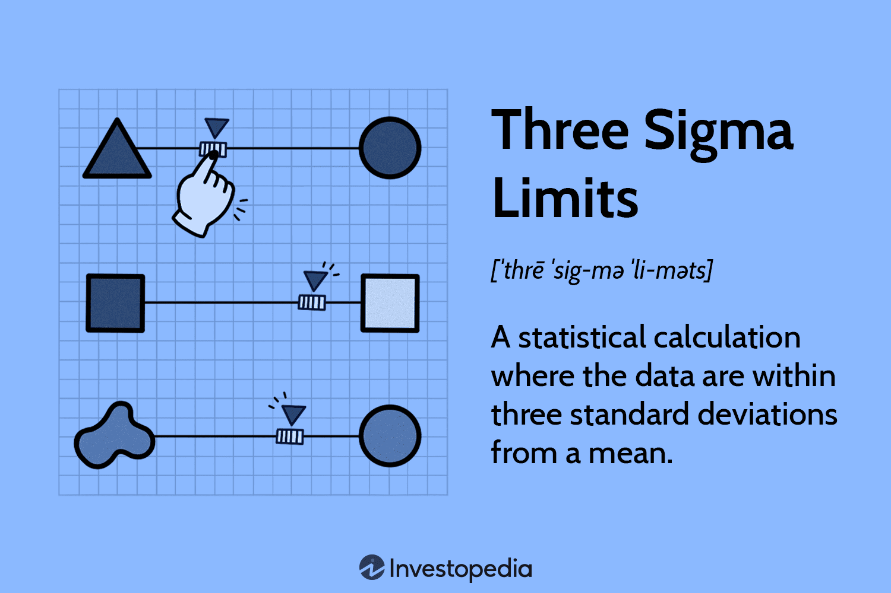

## Table of Contents

## What are Three Sigma Limits and why are they important in statistics?

Three Sigma Limits refer to a statistical method used to measure how much a set of data varies from the average. In simple terms, it looks at how spread out the numbers are. The "sigma" is a Greek letter used to represent standard deviation, which is a way to measure this spread. When we talk about Three Sigma, we mean three times the standard deviation. This means that if you take the average of a set of data and add or subtract three times the standard deviation, you create a range where about 99.7% of all the data points should fall.

These limits are important in statistics because they help us understand how reliable our data is. If all the data points fall within the Three Sigma Limits, it suggests that the data is very consistent and predictable. This is useful in many fields, like manufacturing, where companies want to make sure their products are always the same quality. If data points fall outside these limits, it might mean there's a problem or something unusual happening. By using Three Sigma Limits, people can spot these issues early and fix them, which can save time and money.

## How do Three Sigma Limits relate to the normal distribution?

Three Sigma Limits are closely tied to the normal distribution, which is a bell-shaped curve that shows how data is spread out. In a normal distribution, most of the data points cluster around the average, and fewer points are found as you move away from the average. The Three Sigma Limits are important because they tell us where almost all the data points should be if the data follows a normal distribution. Specifically, if you go three standard deviations away from the average on both sides, you cover about 99.7% of all the data points.

This connection to the normal distribution makes Three Sigma Limits a powerful tool. When we look at data and see that nearly all of it falls within these limits, it suggests that the data behaves in a predictable way, similar to a normal distribution. If some data points fall outside these limits, it can be a sign that something unusual is happening, or that the data might not follow a normal distribution. Understanding this helps people in many fields, like quality control in factories, to keep their processes stable and catch problems early.

## What is the mathematical formula for calculating Three Sigma Limits?

To calculate the Three Sigma Limits, you need to know the average (mean) of your data and the standard deviation. The average is what you get when you add up all the numbers and divide by how many there are. The standard deviation tells you how spread out the numbers are. To find the Three Sigma Limits, you take the average and add three times the standard deviation to get the upper limit. Then, you take the average and subtract three times the standard deviation to get the lower limit. So, the formulas are: Upper Limit = Average + (3 × Standard Deviation) and Lower Limit = Average - (3 × Standard Deviation).

These limits are useful because they help you understand how much your data can vary. If you have a set of data that follows a normal distribution, almost all of the data points (about 99.7%) will fall within these limits. This means that if you see data points outside these limits, it might be a sign that something unusual is happening. For example, in a factory, if a measurement of a product falls outside the Three Sigma Limits, it could mean there's a problem with the manufacturing process. By using these limits, people can keep an eye on their data and make sure everything is working as expected.

## Can you explain the concept of standard deviation in the context of Three Sigma Limits?

Standard deviation is a way to measure how spread out the numbers in a set of data are. Imagine you have a bunch of numbers, and you want to know if they are close together or all over the place. The standard deviation helps you figure this out. It's like finding out how much each number in your set differs from the average of all the numbers. If the numbers are close to the average, the standard deviation will be small. If the numbers are all over the place, the standard deviation will be large.

In the context of Three Sigma Limits, the standard deviation is really important. Three Sigma Limits are calculated by taking the average of your data and then adding or subtracting three times the standard deviation. This creates a range where almost all of your data should fall if it follows a normal distribution. So, if you know the standard deviation, you can figure out where the Three Sigma Limits are. This helps you see if your data is behaving normally or if something unusual is happening. For example, if a data point falls outside these limits, it might mean there's a problem that needs to be checked.

## How do you apply Three Sigma Limits in quality control processes?

In quality control, Three Sigma Limits are used to make sure products are made well and consistently. Imagine a factory where they make lots of the same thing, like car tires. They want every tire to be the same size and quality. To check this, they measure each tire and see if the measurements fall within the Three Sigma Limits. If all the measurements are within these limits, it means the tires are being made consistently and there are no big problems. But if a measurement falls outside these limits, it's a sign that something might be wrong with the machine or the process, and they need to fix it to keep making good tires.

Using Three Sigma Limits helps factories catch problems early. If they find a measurement outside the limits, they can stop the production line and check what's wrong. Maybe a machine needs to be fixed, or maybe someone made a mistake. By fixing these problems quickly, they can keep making high-quality products and avoid wasting time and money on bad ones. This way, Three Sigma Limits help keep the quality of products high and make sure customers get what they expect.

## What are the steps to calculate Three Sigma Limits from a dataset?

To calculate Three Sigma Limits from a dataset, you first need to find the average of all the numbers in your dataset. The average is what you get when you add up all the numbers and then divide by how many numbers there are. Once you have the average, you need to figure out the standard deviation. The standard deviation tells you how spread out the numbers are. To find it, you take each number, subtract the average, square the result, add up all these squared differences, divide by the number of data points minus one, and then take the square root of that.

After you have the average and the standard deviation, you can calculate the Three Sigma Limits. The upper limit is found by adding three times the standard deviation to the average. The lower limit is found by subtracting three times the standard deviation from the average. So, the upper limit is the average plus three times the standard deviation, and the lower limit is the average minus three times the standard deviation. These limits create a range where about 99.7% of your data should fall if it follows a normal distribution.

## How do Three Sigma Limits help in identifying outliers in data?

Three Sigma Limits help in identifying outliers in data by creating a range where most of the data should fall. When you calculate these limits, you take the average of your data and add or subtract three times the standard deviation. This gives you an upper and lower limit. If your data follows a normal distribution, about 99.7% of the data points should be within these limits. So, if you find a data point that is outside these limits, it's a sign that it might be an outlier.

Outliers are numbers that are very different from the rest of the data. They could be mistakes, or they could show something unusual happening. By using Three Sigma Limits, you can quickly see which data points are outliers. This helps you decide if you need to check those points more closely. Maybe there's a problem that needs fixing, or maybe the outlier is important information. Either way, Three Sigma Limits make it easier to spot these unusual numbers and take action if needed.

## What is the difference between Two Sigma and Three Sigma Limits?

Two Sigma and Three Sigma Limits are ways to check how spread out data is. Two Sigma Limits are found by taking the average of the data and then adding or subtracting two times the standard deviation. This makes a range where about 95% of the data should fall if it follows a normal distribution. Three Sigma Limits are found by taking the average and adding or subtracting three times the standard deviation. This creates a wider range where about 99.7% of the data should fall.

The main difference between them is how much of the data they cover. Two Sigma Limits are narrower and catch fewer data points, so they might miss some unusual numbers that are still important. Three Sigma Limits are wider and catch almost all the data, so they are better at spotting any unusual numbers or outliers. In places like factories, using Three Sigma Limits helps make sure that even small problems are noticed and fixed quickly, keeping the quality of products high.

## How can Three Sigma Limits be used to predict future performance in a process?

Three Sigma Limits can help predict how well a process will do in the future by showing how much the results can change. If you keep track of how a process is doing over time and see that all the results stay within the Three Sigma Limits, it means the process is stable and predictable. This helps you guess that the process will keep working well in the future, making the same good results.

But if you start seeing results that go outside the Three Sigma Limits, it's a warning sign. It means something might be changing in the process, and it could start making different results. By watching these limits, you can catch problems early and fix them before they mess up the future performance of the process. This way, Three Sigma Limits help keep things running smoothly and predictably.

## What are the limitations of using Three Sigma Limits in statistical analysis?

Using Three Sigma Limits can be very helpful, but they do have some limits. One big problem is that they assume the data follows a normal distribution, which is like a bell-shaped curve. But not all data fits this shape perfectly. If the data is not normal, using Three Sigma Limits might not give you the right picture of how spread out the data is. This can lead to missing important information or thinking something is wrong when it's not.

Another issue is that Three Sigma Limits might not catch all the unusual things happening in the data. They cover about 99.7% of the data, but there's still a small chance that important outliers are outside these limits. In some cases, you might need to look at even wider limits or use other methods to find all the unusual numbers. Also, if you have a small amount of data, Three Sigma Limits might not be very accurate because there's not enough information to know if the data is really spread out or not.

## How do Three Sigma Limits fit into Six Sigma methodologies?

Three Sigma Limits are a big part of Six Sigma methodologies. Six Sigma is a way to make things better in a business by making fewer mistakes and saving money. In Six Sigma, they use Three Sigma Limits to see how well a process is doing. If a process stays within the Three Sigma Limits, it means it's working well and not making many mistakes. But if the results start going outside these limits, it's a sign that something needs to be fixed to make the process better.

Using Three Sigma Limits helps Six Sigma teams find problems quickly. They can look at the data and see if anything is outside the limits. This helps them know where to focus their efforts to make the process more reliable and consistent. By keeping things within the Three Sigma Limits, Six Sigma helps businesses make sure their products or services are always good quality, which makes customers happy and saves money.

## Can you provide a real-world example where Three Sigma Limits were effectively used to improve a process?

A car company wanted to make sure every car door was the same size. They started measuring the doors and found that most of them were close to the average size, but some were too big or too small. They used Three Sigma Limits to see if the sizes were within the expected range. They found that a few doors were outside the limits, which meant there was a problem with the machines making the doors. By fixing the machines, they made sure all the doors were the right size, and the number of doors that were too big or too small went down a lot.

In another example, a hospital wanted to make sure patients didn't have to wait too long to see a doctor. They started keeping track of how long each patient waited and used Three Sigma Limits to see if the wait times were normal. They found that most wait times were okay, but sometimes patients waited much longer than they should. By looking at the times outside the Three Sigma Limits, they figured out that the problem happened when too many patients came at the same time. The hospital changed its schedule to spread out the appointments, and the wait times got much better. Now, almost all patients see the doctor within the expected time.

## What are Three Sigma Limits and how do we understand them?

Three sigma limits, or 3-sigma limits, are a fundamental statistical concept rooted in the properties of the normal distribution. These limits represent the range within which approximately 99.73% of data points are expected to fall when the data follows a normal distribution. Mathematically, the three sigma limits are calculated by adding and subtracting three standard deviations to and from the mean. Given a data set with a mean $\mu$ and a standard deviation $\sigma$, the three sigma limits are expressed as: 

$$
\text{Upper Limit} = \mu + 3\sigma
$$

$$
\text{Lower Limit} = \mu - 3\sigma
$$

These limits are pivotal beyond the confines of statistical theory, finding practical applications in fields such as manufacturing and [algorithmic trading](/wiki/algorithmic-trading). They act as benchmarks to identify unusual or significant variations which might suggest underlying issues or opportunities. In manufacturing, for example, three sigma limits help in monitoring process variations, ensuring quality control, and maintaining standards. Deviations beyond these limits often signify defects or anomalies that warrant attention.

Within the context of trading, the significance of three sigma limits lies in their ability to identify anomalous market activities. This could relate to identifying potential buy or sell signals when market prices deviate significantly from the norm, or it could involve assessing risk by identifying periods of heightened [volatility](/wiki/volatility-trading-strategies). When prices or returns breach these statistical thresholds, traders may interpret this as a signal to investigate further, as such deviations might signal market corrections, reversals, or other significant market events. This method allows for more informed decision-making and the potential automation of trading strategies, leveraging statistical insights to capitalize on market inefficiencies.

## What is the Statistical Calculation of Three Sigma Limits?

To calculate three sigma limits, you begin by determining the mean (average) of the dataset. This mean serves as a central point around which the data is distributed. The calculation of the mean ($\bar{x}$) is given by:

$$
\bar{x} = \frac{1}{n} \sum_{i=1}^{n} x_i
$$

where $x_i$ represents each data point, and $n$ is the total number of data points.

Next, you calculate the variance, which measures the spread of the data points around the mean. The formula for variance ($\sigma^2$) is:

$$
\sigma^2 = \frac{1}{n} \sum_{i=1}^{n} (x_i - \bar{x})^2
$$

The variance is essential for understanding the degree of variation within the dataset.

Following this, compute the standard deviation ($\sigma$), which is the square root of the variance. This statistic provides a quantifiable measure of the amount of deviation or [dispersion](/wiki/dispersion-trading) of data points from the mean. The formula for standard deviation is:

$$
\sigma = \sqrt{\sigma^2}
$$

Finally, determine the three sigma limits by adding and subtracting three times the standard deviation from the mean. These limits are defined as follows:

- Upper Control Limit (UCL): $\bar{x} + 3\sigma$
- Lower Control Limit (LCL): $\bar{x} - 3\sigma$

These limits are crucial for monitoring control in algorithmic trading by helping identify data points that deviate significantly from the expected norm. Observations outside these limits may indicate abnormal market conditions, prompting further analysis or automated trading actions. The application of three sigma limits enhances the robustness of trading strategies by equipping traders with a statistical tool to evaluate market stability and risks.

## What is an Example of Calculation?

Consider a dataset of trading returns: 8.4, 8.5, 9.1, 9.3, 9.4, 9.5, 9.7, 9.7, 9.9, and 9.9. To calculate the three sigma limits for this dataset, we follow these steps:

1. **Calculate the Mean:**

   The mean ($\mu$) of the dataset is the sum of all data points divided by the number of data points. For the given dataset:
$$
   \mu = \frac{8.4 + 8.5 + 9.1 + 9.3 + 9.4 + 9.5 + 9.7 + 9.7 + 9.9 + 9.9}{10} = 9.34

$$

2. **Calculate the Variance:**

   Variance ($\sigma^2$) is determined by averaging the squared deviations from the mean. For each data point, subtract the mean and square the result, then find the average of these squared differences:
$$
   \sigma^2 = \frac{(8.4-9.34)^2 + (8.5-9.34)^2 + \cdots + (9.9-9.34)^2}{10} = 0.2564

$$

3. **Calculate the Standard Deviation:**

   The standard deviation ($\sigma$) is the square root of the variance:
$$
   \sigma = \sqrt{0.2564} = 0.5064

$$

4. **Determine the Three Sigma Limits:**

   The three sigma limits are calculated by adding and subtracting three times the standard deviation from the mean to find the upper and lower bounds:

   Upper Limit = $\mu + 3\sigma = 9.34 + 3 \times 0.5064 = 10.9$

   Lower Limit = $\mu - 3\sigma = 9.34 - 3 \times 0.5064 = 7.78$

These calculations show that trading returns falling outside the range of 7.78 to 10.9 might indicate abnormal market activity or anomalies. Such insights can be fundamental in assessing whether the trading process is in control and identifying strategic opportunities or risks in algorithmic trading.

## References & Further Reading

[1]: Wheeler, D. J., & Chambers, D. S. (1992). ["Understanding Statistical Process Control"](https://archive.org/details/understandingsta0000whee). SPC Press.

[2]: Montgomery, D. C. (2009). ["Introduction to Statistical Quality Control"](https://books.google.com/books/about/Introduction_to_Statistical_Quality_Cont.html?id=oh7zDwAAQBAJ). John Wiley & Sons.

[3]: Bengio, Y., Courville, A., & Vincent, P. (2013). ["Representation Learning: A Review and New Perspectives"](https://arxiv.org/abs/1206.5538). IEEE Transactions on Pattern Analysis and Machine Intelligence.

[4]: Thorp, E. O. (1967). ["Beat the Market: A Scientific Stock Market System"](https://www.amazon.com/Beat-Market-Scientific-Stock-System/dp/0394424395). Random House.

[5]: Engle, R. F. (1982). ["Autoregressive Conditional Heteroscedasticity with Estimates of the Variance of United Kingdom Inflation"](https://www.semanticscholar.org/paper/Autoregressive-conditional-heteroscedasticity-with-Engle/2ee6cb87fc81ecd78d161c4a92c9dfce00c8961c). Econometrica.