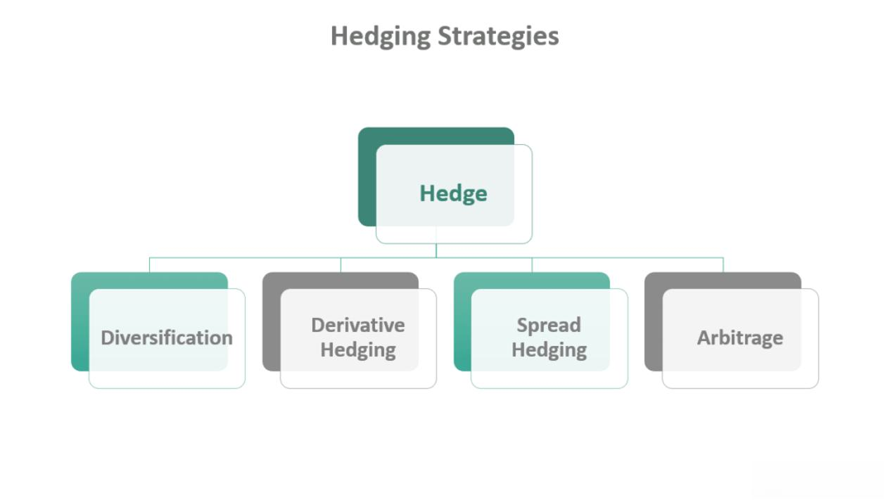

Investment in foreign exchange markets inherently carries risks due to the fluctuating nature of exchange rates. These fluctuations can significantly affect the value of international investments, making it imperative for traders and investors to adopt measures to mitigate potential losses. One effective method to manage this risk is through tactical FX hedging strategies, which can be seamlessly integrated into algorithmic trading systems.

Algorithmic trading, with its capacity for precise and systematic execution, provides a structured approach to implementing such hedging strategies. It allows traders to automate the process, enabling them to react quickly to market conditions without the influence of emotional biases or human error. This is particularly important in the foreign exchange markets, where changes can occur rapidly and unexpectedly.



The article aims to explore three simple yet effective tactical FX hedging strategies that utilize algorithmic trading techniques. By understanding and implementing these strategies, traders can enhance the resilience of their portfolios against adverse currency movements. This involves leveraging momentum, carry, and value-based approaches, each offering unique advantages depending on market conditions and investment goals.

Through a detailed examination of these strategies, traders will gain insights into how to tailor their approaches to suit varying levels of risk tolerance and market scenarios. Ultimately, the objective is to provide a comprehensive framework that not only protects against currency risk but also provides opportunities for profit enhancement in the dynamic and often unpredictable FX market.

## Table of Contents

## The Importance of FX Hedging

Exchange rate [volatility](/wiki/volatility-trading-strategies) can significantly affect returns, particularly in the context of international investments. Currency fluctuations can cause unpredictable changes in the value of foreign-denominated assets, thereby impacting the overall performance of an investment portfolio. Foreign exchange ([FX](/wiki/fx-anomaly)) hedging is a strategic tool employed by investors to protect their investments from the adverse impacts of such currency movements.

The purpose of FX hedging is to mitigate the risk associated with currency exposure. By employing hedging techniques, investors can stabilize the value of their foreign asset holdings against unwanted exchange rate movements. This reduces the potential for significant financial losses, thereby providing a smoother stream of returns over time.

However, it's important to understand that while hedging can effectively reduce the risk of potential losses, it does not negate risk entirely. There are costs associated with implementing hedge positions, and these costs can sometimes outweigh the benefits if the market moves favorably for the investor without hedging. 

The decision of whether to employ FX hedging hinges on a multitude of factors, including current market conditions, the investor's risk tolerance, and cost considerations. For instance, in environments characterized by high currency volatility, hedging might be more justified as a means to preserve capital. On the other hand, in more stable conditions, investors might opt to avoid the costs and potential opportunity losses that hedging may introduce.

Risk tolerance plays a critical role in the hedging decision. More risk-averse investors might favor extensive hedging to protect their assets, while those with a higher risk appetite might accept some level of currency risk in exchange for the possibility of higher returns. Ultimately, careful evaluation of these aspects is crucial for investors in determining the right hedging approach that aligns with their investment goals and market perceptions.

## FX Momentum Hedging Strategy

Momentum strategies in foreign exchange (FX) hedging are centered around the premise that currencies tend to exhibit persistence in their price movements over certain periods. This persistence or [momentum](/wiki/momentum) is utilized by traders to make informed predictions about future currency movements. 

To apply a momentum strategy, traders typically employ a range of technical indicators such as moving averages, Relative Strength Index (RSI), or other momentum oscillators to analyze historical price data and identify trends. When a currency exhibits strong momentum that suggests potential depreciation, traders may opt to 'short' that currency—selling it in anticipation of buying it back at a lower price. This short positioning acts as a hedge against potential currency losses by capitalizing on the downward momentum.

An essential aspect of momentum strategies is their flexibility. Traders can dynamically adjust their positions in response to changing market conditions. For instance, if a currency's momentum begins to weaken, indicating a potential reversal, traders can either close their positions or take an opposite stance to shield their portfolios from adverse movements.

The mathematical representation of such strategies often revolves around price comparatives over different time frames to gauge momentum. For example, a common technique is to compute the rate of change (ROC) of a currency's price over a specific period:

$$
\text{ROC} = \frac{\text{Current Price} - \text{Price } n \text{ periods ago}}{\text{Price } n \text{ periods ago}} \times 100
$$

Traders use this ROC value to determine whether to maintain, modify, or [exit](/wiki/exit-strategy) their positions. Another technique involves employing moving averages, where the crossing of short and long-term moving averages (e.g., a 50-day moving average crossing below a 200-day moving average) signals a potential trend change.

This systematic approach to trading through momentum hedging is enhanced in the context of [algorithmic trading](/wiki/algorithmic-trading). Algorithms can automatically execute trades based on pre-programmed criteria, allowing traders to efficiently capitalize on identified momentum without being influenced by emotional decision-making. This automation ensures consistent application of the strategy, enhancing both the speed and accuracy of execution.

## FX Carry Hedging Strategy

Carry-based strategies in foreign exchange (FX) markets leverage the [interest rate](/wiki/interest-rate-trading-strategies) differentials between currencies to generate returns while mitigating currency risk. At its core, a [carry](/wiki/carry-trading) trade involves borrowing or selling a currency with a relatively low-interest rate (funding currency) and using the proceeds to buy a currency with a higher interest rate (investment currency). The difference in interest rates, known as the carry, represents potential profit.

### Conceptual Framework

The fundamental idea behind carry trading is straightforward: by maintaining a position in the higher-yielding currency, investors earn interest that can either offset hedging costs or contribute to overall profits. The relationship between two currencies in a carry strategy can be expressed as:

$$
\text{Net Profit} = \left( \text{Interest Rate of Investment Currency} - \text{Interest Rate of Funding Currency} \right) - \text{Hedging Costs}
$$

A positive carry arises when the interest income from the investment currency surpasses the costs associated with any hedging activities undertaken to protect against adverse currency movements.

### Risk Management and Hedging

While carry trades can potentially offer substantial returns, they also come with inherent currency risk, especially if the interest rate differential narrows or if there is an abrupt change in the exchange rate. To hedge against these risks while maintaining the benefits of the carry, traders often employ tactical hedging strategies. Such strategies may involve using forward contracts, options, or other derivatives to lock in exchange rates or cap potential losses.

### Example

Suppose a trader borrows in Japanese yen (JPY) at an interest rate of 0.1% to purchase Australian dollars (AUD) with an interest rate of 3.0%. The carry earned by the trader is:

$$
\text{Carry} = 3.0\% - 0.1\% = 2.9\%
$$

If the cost to hedge the FX exposure, perhaps through options or forwards, is 1.0%, the net profit from the carry trade, assuming no change in exchange rates, would be:

$$
\text{Net Profit} = 2.9\% - 1.0\% = 1.9\%
$$

### Advantages and Challenges

Carry strategies offer the advantage of providing a regular income stream from interest differentials. However, they are vulnerable to market dynamics, specifically changes in interest rate policies and currency fluctuations, which can reverse the expected gains if the investment currency depreciates significantly compared to the funding currency.

Assessing the macroeconomic environment and being vigilant about central bank policies are crucial for the success of carry trades. By aligning carry strategies with robust hedging mechanisms, traders can harness the potential of interest rate differentials while controlling for currency volatility.

## FX Value Hedging Strategy

Value hedging strategies focus on identifying currencies that are mispriced by comparing them against long-term historical data. This approach to foreign exchange (FX) hedging leverages the concept of mean reversion, which suggests that currency prices tend to return to their long-term average over time. Traders employing this strategy attempt to hedge their exposure when currencies are deemed overvalued or undervalued compared to historical norms, anticipating a reversion to the mean.

### Identification of Mispriced Currencies

The process begins with the analysis of historical exchange rate data, seeking patterns where current currency valuations deviate significantly from historical averages. Statistical tools such as moving averages or more complex econometric models can be employed to ascertain these deviations.

For instance, assume a simple moving average is used to determine the average exchange rate of a currency over a ten-year period. If the current exchange rate significantly exceeds this average, the currency might be considered overvalued. Conversely, if it falls well below, it might be undervalued.

### Implementation Strategy

Upon identifying overvalued or undervalued currencies, traders can implement hedging strategies to mitigate potential adverse movements. The strategy involves taking positions that benefit from the anticipated reversal towards historical averages—selling overvalued currencies or buying undervalued ones to hedge against potential losses.

Consider an overvalued currency $C$ with a current exchange rate $S_t$ compared to its long-term mean $\bar{S}$. The trade would involve shorting currency $C$ while simultaneously taking a long position in a currency with a stable or favorable long-term outlook.

### Formula and Python Example

Using a z-score to standardize currency deviation from its mean can guide decision-making:

$$
Z = \frac{S_t - \bar{S}}{\sigma}
$$

Where:
- $S_t$ is the current exchange rate.
- $\bar{S}$ is the long-term average exchange rate.
- $\sigma$ is the standard deviation.

A Python pseudo-code example to compute the z-score and trigger a hedge might be:

```python
import pandas as pd

# Assume df is a DataFrame with historical exchange rates for currency C

df['mean'] = df['exchange_rate'].rolling(window=120).mean()
df['std'] = df['exchange_rate'].rolling(window=120).std()
df['z_score'] = (df['exchange_rate'] - df['mean']) / df['std']

# Trigger a hedge when the absolute z-score exceeds a threshold
hedge_signal = df['z_score'].abs() > 2
```

### Capitalizing on Long-term Reversals

By anticipating that the exchange rate will revert to its historical mean, traders can hedge their portfolios against adverse currency movements while positioning themselves to benefit from potential reversals. Unlike momentum or carry strategies, value hedging requires patience and a long-term view, aligning well with macroeconomic factors and structural changes within economies.

The use of value hedging strategies presents a diversified approach to FX risk management. It not only provides protection against unfavorable currency trends but also creates an opportunity for profit when executed with precision and supported by robust historical data analysis.

## Evaluating and Comparing the Strategies

Evaluating and comparing FX hedging strategies involves understanding their application in various market conditions and aligning them with specific investment objectives. Each strategy has distinct characteristics that make it suitable for particular scenarios, ultimately hinging on factors such as volatility, interest rate stability, and expected currency value trends.

Momentum-based strategies are optimal for volatile markets where currency trends can be anticipated through momentum indicators. These strategies exploit short-term price movements by identifying currencies with strong upward or downward trajectories. Traders might use tools like moving averages, Relative Strength Index (RSI), or stochastic oscillators to analyze momentum. This approach is beneficial for capturing gains in dynamic market environments, allowing for quick reaction to price changes. However, it requires continual market monitoring and rapid decision-making.

In contrast, carry-based strategies favor stable interest rate environments. These strategies are grounded in borrowing in a currency with a low interest rate and investing in a currency with a higher interest rate, thereby profiting from the interest differential, known as "carry." The formula for potential profit is:

$$
\text{Profit} = (\text{Interest rate of currency A} - \text{Interest rate of currency B}) - \text{Transaction costs}
$$

Carry strategies are typically less sensitive to sudden price fluctuations and are more aligned with stable market conditions where interest rates remain relatively unchanged over time.

Value strategies, on the other hand, excel in conditions where currency values are expected to revert to their historical norms. These strategies involve identifying currencies that are mispriced—either overvalued or undervalued—based on historical exchange rate data. By taking positions against overvalued currencies, traders can hedge against potential losses while anticipating value corrections. This approach is anchored on the principle of mean reversion, which posits that prices will eventually return to their historical averages.

Selection of the appropriate strategy depends on several crucial factors. Market conditions are paramount; volatile markets necessitate agile strategies like momentum hedging, while stable environments are conducive to carry strategies. Traders’ risk appetite also plays a significant role—those with higher risk tolerance might opt for momentum strategies, while conservative investors might prefer value or carry strategies for their relative stability. Finally, investment time horizon influences strategy selection. Short-term traders might benefit more from momentum strategies, whereas long-term investors could find value strategies aligned with their objectives.

In conclusion, effectively comparing and evaluating FX hedging strategies necessitates a keen understanding of market conditions, personal risk preferences, and investment timelines. By aligning these elements, traders can optimize their portfolios to mitigate risks and potentially enhance returns through strategic hedging.

## Implementation in Algo Trading

Algorithmic trading allows for a precise and efficient execution of foreign exchange (FX) hedging strategies by enabling traders to automate decisions based on predetermined criteria. These automated systems are designed to execute buy or sell orders when specific market conditions are met, minimizing human intervention which can lead to errors or emotionally-driven decisions.

To implement FX hedging strategies through algorithmic trading, traders first develop a model that encapsulates their chosen strategy. This involves defining the rules and parameters that will trigger hedging actions. For example, in a momentum-based strategy, the algorithm might be programmed to enter a hedge when a currency pair exhibits a certain trend in its price movement.

Once the model is established, traders can use various algorithmic trading platforms that provide the necessary tools and application programming interfaces (APIs) to execute these strategies. These platforms can connect to multiple exchanges and automatically handle order generation, execution, and position management across different currency pairs.

Automation in trading offers several advantages:
1. **Consistency**: Algorithms operate 24/7 without fatigue, ensuring trading decisions are consistent with the predefined strategy.
2. **Speed and Efficiency**: Automated systems can analyze vast data sets and execute trades at speeds that are impossible for human traders.
3. **Risk Management**: By allowing predetermined rules for entering and exiting trades, algorithmic systems help in managing risks more effectively. This reduces the likelihood of significant losses due to delayed decision-making.
4. **Backtesting and Optimization**: Algorithmic platforms often include tools for backtesting strategies on historical data, allowing traders to refine their models before implementation. This process helps in optimizing strategies for better performance under different market conditions.

Here is a simple example of how a basic algorithm could be structured in Python using pseudocode:

```python
def momentum_hedging_strategy(data):
    for currency_pair in data:
        if detect_momentum_trend(currency_pair):
            hedge_position(currency_pair)

def detect_momentum_trend(currency_pair):
    # Analyze recent price movements
    if recent_trend_is_downward(currency_pair):
        return True
    return False

def hedge_position(currency_pair):
    # Logic to enter a hedge
    execute_trade(order_type='sell', currency_pair=currency_pair)
```

Overall, the ability to set predefined rules and automate the trading process through algorithmic platforms greatly enhances the implementation of tactical FX hedging strategies. By leveraging these technological advancements, traders can systematically manage currency risk while improving the overall efficiency and reliability of their trading operations.

## Conclusion

Tactical FX hedging strategies offer a compelling framework for mitigating currency risks in the trading landscape. These strategies, when employed correctly, serve as a shield against the unpredictable nature of exchange rate fluctuations. By employing algorithmic trading techniques, investors can automate the execution of these hedging strategies, ensuring precision and consistency that manual trading often lacks.

Algorithmic trading systems enable traders to set specific, rule-based parameters for initiating and closing hedges, thus reducing the impact of human error and emotional biases. This automation not only enhances the effectiveness of tactical FX hedging strategies but also improves the efficiency of their execution. Furthermore, algo trading platforms typically provide a suite of tools and APIs designed to facilitate the seamless integration of these strategies.

The dual nature of tactical FX hedging strategies means they function as both risk management tools and potential profit enhancers for informed traders. By hedging effectively, traders can protect their investments from adverse currency movements while capitalizing on opportunities that arise from exchange rate fluctuations. This capability makes these strategies invaluable not just for risk mitigation but also for augmenting returns when aligned with strategic market insights.

In sum, implementing tactical FX hedging strategies through algorithmic trading affords investors a structured approach to managing currency risk and optimizing portfolio performance. As such, these strategies are indispensable components of a sophisticated trading arsenal, empowering traders to navigate the complexities of the [forex](/wiki/forex-system) market with confidence.

## References & Further Reading

[1]: Katz, J. O., & McCormick, D. (2000). ["The Encyclopedia of Trading Strategies"](https://www.amazon.com/Encyclopedia-Trading-Strategies-Jeffrey-Ph-D/dp/0070580995) McGraw-Hill.

[2]: ["Advances in Financial Machine Learning"](https://www.amazon.com/Advances-Financial-Machine-Learning-Marcos/dp/1119482089) by Marcos Lopez de Prado

[3]: ["Quantitative Trading: How to Build Your Own Algorithmic Trading Business"](https://books.google.com/books/about/Quantitative_Trading.html?id=j70yEAAAQBAJ) by Ernest P. Chan

[4]: Lustig, H., Roussanov, N., & Verdelhan, A. (2011). ["Common Risk Factors in Currency Markets."](https://www.nber.org/papers/w14082) The Review of Financial Studies.

[5]: ["Machine Learning for Algorithmic Trading"](https://github.com/PacktPublishing/Machine-Learning-for-Algorithmic-Trading-Second-Edition) by Stefan Jansen