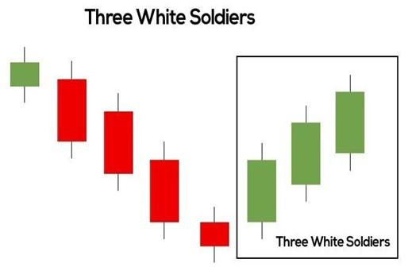

## Table of Contents

## What is the Three White Soldiers pattern in technical analysis?

The Three White Soldiers pattern is a term used in stock market analysis. It is a pattern that shows up on a chart and can tell traders that a stock's price might go up. The pattern has three long, green (or white) candles in a row. Each candle opens within the body of the previous candle and closes higher than the previous one. This shows that buyers are in control and pushing the price up.

This pattern often appears at the end of a downtrend. When traders see it, they might think the downtrend is over and it's a good time to buy the stock. The Three White Soldiers pattern is seen as a strong sign of a coming uptrend because it shows strong buying pressure over three days. However, it's always important for traders to use other tools and indicators to confirm this pattern before making any decisions.

## How does the Three White Soldiers pattern form on a chart?

The Three White Soldiers pattern forms on a chart when you see three long, green candles in a row. Each candle starts within the body of the candle before it and ends higher than the one before. This shows that buyers are getting stronger and pushing the price up more each day.

This pattern usually shows up after the price of a stock has been going down. When you see these three green candles, it can mean that the downtrend is over and the price might start going up. It's like the buyers are taking over from the sellers, and it's a sign that the stock might keep going up.

## What does the Three White Soldiers pattern indicate about market sentiment?

The Three White Soldiers pattern shows that people who want to buy a stock are feeling more confident. When you see three long green candles in a row, it means that more and more people are buying the stock each day. Each candle starts within the body of the one before it and ends higher, which shows that buyers are getting stronger and pushing the price up.

This pattern usually appears after the stock's price has been going down. When traders see the Three White Soldiers, they think that the time of falling prices is over. It's a sign that the stock might start going up because buyers are now in control. This can make traders feel more positive about the stock's future.

## Can you explain the key characteristics of the Three White Soldiers pattern?

The Three White Soldiers pattern is easy to spot on a chart. It has three long green candles in a row. Each candle starts within the body of the candle before it and ends higher than the previous one. This shows that buyers are getting stronger and pushing the price up more each day.

This pattern usually shows up after a stock's price has been going down. When traders see these three green candles, they think that the time of falling prices is over. It's a sign that the stock might start going up because buyers are now in control. This can make traders feel more positive about the stock's future.

## How reliable is the Three White Soldiers pattern as a bullish signal?

The Three White Soldiers pattern is seen as a strong sign that a stock's price might go up. It shows that buyers are getting stronger over three days, which can make traders feel more positive about the stock. But, like any pattern, it's not perfect. It works best when it shows up after a time when the stock's price has been going down. Traders often look for other signs to make sure the pattern is a good signal.

Even though the Three White Soldiers pattern can be a good sign, it's not always right. Sometimes, the stock's price might not go up after you see this pattern. That's why it's important for traders to use other tools and indicators to check if the pattern is a good signal. By looking at more than just this one pattern, traders can make better choices about when to buy or sell a stock.

## What are the ideal market conditions for the Three White Soldiers pattern to be effective?

The Three White Soldiers pattern works best when it shows up after a time when the stock's price has been going down. This means the pattern is most effective at the end of a downtrend. When traders see these three green candles in a row, it can mean that the time of falling prices is over and the stock might start going up. The pattern shows that buyers are getting stronger and pushing the price up more each day.

For the pattern to be a good sign, the market should also have good [volume](/wiki/volume-trading-strategy). This means more people are trading the stock when the pattern shows up. High volume can make the pattern more reliable because it shows that more traders believe the stock's price will go up. So, the ideal conditions for the Three White Soldiers pattern are a clear downtrend before it appears and strong trading volume when it happens.

## How should traders confirm the Three White Soldiers pattern before making a trade?

Traders should use other tools and indicators to make sure the Three White Soldiers pattern is a good sign before they decide to buy a stock. One way to do this is by looking at the trading volume. If the volume is high when the pattern shows up, it means more people are trading the stock, which can make the pattern more reliable. Another way is to check other technical indicators like the Relative Strength Index (RSI) or Moving Averages to see if they also show that the stock's price might go up.

It's also helpful to look at the bigger picture of the stock's price movement. The Three White Soldiers pattern works best when it appears at the end of a downtrend. So, traders should check if the stock's price has been going down before the pattern shows up. By using these extra checks, traders can feel more confident that the pattern is a good sign and make better choices about when to buy or sell a stock.

## What are common mistakes traders make when interpreting the Three White Soldiers pattern?

One common mistake traders make when looking at the Three White Soldiers pattern is not checking the trading volume. The pattern is more reliable if it comes with high volume, which shows that more people are buying the stock. If the volume is low, the pattern might not be a strong sign that the stock's price will go up.

Another mistake is not looking at the bigger picture of the stock's price movement. The Three White Soldiers pattern works best at the end of a downtrend. If traders see this pattern but the stock's price has been going up or sideways, it might not mean the same thing. It's important to see if the stock has been going down before the pattern appears.

Traders also sometimes rely too much on just this one pattern without using other tools and indicators. They should check things like the Relative Strength Index (RSI) or Moving Averages to see if they also show that the stock's price might go up. By using more than just the Three White Soldiers pattern, traders can make better choices about when to buy or sell a stock.

## How does the Three White Soldiers pattern differ from other bullish candlestick patterns?

The Three White Soldiers pattern is different from other bullish candlestick patterns because it shows three long green candles in a row. Each candle starts within the body of the one before it and ends higher than the previous one. This pattern shows strong buying pressure over three days, which is not as common in other bullish patterns. For example, the Bullish Engulfing pattern only has two candles, where the second one completely covers the first one. This shows a quick change from selling to buying, but it doesn't show the same steady buying pressure as the Three White Soldiers.

Another pattern, the Morning Star, also signals a bullish reversal but in a different way. It has three candles: a long red one, a small one that can be red or green, and a long green one. The Morning Star shows a shift from a downtrend to an uptrend over three days, but it includes a period of indecision with the small candle in the middle. The Three White Soldiers, on the other hand, shows a clear and continuous rise in buying pressure without any hesitation. This makes it a stronger and more reliable sign of a bullish reversal when it appears at the end of a downtrend.

## Can the Three White Soldiers pattern be used in conjunction with other technical indicators?

Yes, traders often use the Three White Soldiers pattern with other technical indicators to make better choices about when to buy or sell a stock. One way to do this is by looking at the trading volume. If the volume is high when the pattern shows up, it means more people are trading the stock, which can make the pattern more reliable. Another way is to check other indicators like the Relative Strength Index (RSI) or Moving Averages. If these indicators also show that the stock's price might go up, it can give traders more confidence in the pattern.

For example, if the RSI is moving from being oversold to a more neutral level when the Three White Soldiers pattern appears, it can confirm that the stock's price might start going up. Moving Averages can also be helpful. If the stock's price moves above a key Moving Average like the 50-day or 200-day line around the same time as the pattern, it can be a strong sign that the uptrend is starting. By using these extra checks, traders can feel more sure that the Three White Soldiers pattern is a good sign and make better choices about when to buy or sell a stock.

## What are some advanced strategies for trading the Three White Soldiers pattern?

One advanced strategy for trading the Three White Soldiers pattern is to wait for confirmation from other technical indicators before making a trade. For example, traders can look at the Relative Strength Index (RSI) to see if it's moving from an oversold condition to a more neutral level. This can help confirm that the stock's price might start going up. Another useful indicator is the Moving Average. If the stock's price moves above a key Moving Average, like the 50-day or 200-day line, around the same time as the Three White Soldiers pattern, it can be a strong sign that an uptrend is starting. By waiting for these extra signs, traders can feel more confident that the pattern is a good signal to buy.

Another strategy is to pay close attention to the trading volume when the Three White Soldiers pattern appears. High volume can make the pattern more reliable because it shows that more people are interested in buying the stock. If the volume is low, the pattern might not be as strong a sign that the stock's price will go up. Traders can also use stop-loss orders to manage their risk. For example, they might set a stop-loss just below the lowest point of the Three White Soldiers pattern. This way, if the stock's price starts to fall instead of rise, the trader can limit their losses. By combining these strategies, traders can use the Three White Soldiers pattern more effectively and make smarter trading decisions.

## How can the Three White Soldiers pattern be integrated into a comprehensive trading system?

The Three White Soldiers pattern can be a helpful part of a bigger trading plan. Traders can use it as a sign to buy a stock when it shows up at the end of a time when the stock's price has been going down. But, it's important not to just look at this one pattern. Traders should also check other things like the trading volume to see if it's high when the pattern appears. High volume means more people are buying the stock, which can make the pattern a stronger sign that the stock's price will go up. They can also look at other tools like the Relative Strength Index (RSI) or Moving Averages. If these tools also show that the stock's price might go up, it can give traders more confidence in the pattern.

In a complete trading system, the Three White Soldiers pattern can be used along with other strategies to manage risk and make better choices. For example, traders might set a stop-loss order just below the lowest point of the Three White Soldiers pattern. This way, if the stock's price starts to fall instead of rise, the trader can limit their losses. Another strategy is to look at the bigger picture of the stock's price movement. The pattern works best at the end of a downtrend, so traders should check if the stock has been going down before the pattern shows up. By using the Three White Soldiers pattern with these other checks and strategies, traders can build a more reliable trading system and make smarter decisions about when to buy or sell a stock.

## How can the Three White Soldiers Pattern be integrated into trading strategies?

The Three White Soldiers pattern is a powerful tool for traders seeking to capitalize on market reversals. To effectively incorporate this pattern into trading strategies, traders should focus on precise entry and [exit](/wiki/exit-strategy) points, alongside robust risk management techniques.

### Incorporation into Trading Strategies

**Entry Strategies**

The Three White Soldiers pattern is ideally used to signal a potential bullish reversal, marking an optimal entry point for long positions. Traders should look for this pattern following a downtrend, where three consecutive bullish candles form, each with a higher close than the previous one. The entry points can be determined as follows:

1. **Immediate Entry**: Enter at the close of the third candle, confirming the pattern's completion. This approach is for traders who wish to capitalize swiftly on the momentum shift.

2. **Pullback Entry**: Wait for a slight pullback or consolidation after the third candle to enter at a potentially lower price, reducing entry risk.

3. **Breakout Entry**: Enter when the price surpasses a specific resistance level formed before the pattern, reinforcing the uptrend signaled by the Three White Soldiers.

**Exit Strategies**

As important as entry strategies, exit strategies help maximize profit and minimize risk. Consider the following:

1. **Target Price Exit**: Set a predefined price target based on technical analysis elements like resistance levels or Fibonacci retracements. Once the target is reached, traders can close their positions.

2. **Trailing Stop Loss**: Utilize a trailing stop to lock in profits as the price ascends. This method adjusts the stop loss to the highest price the asset achieves, less a specific percentage or dollar amount.

3. **Technical Indicator Exit**: Use technical indicators such as the RSI or MACD to identify when a stock is overbought, prompting an exit from the position.

### Risk Management Techniques

Risk management is essential to safeguard against potential losses associated with the pattern:

1. **Position Sizing**: Calculate the optimal position size using the formula:
$$
   \text{Position Size} = \frac{\text{Account Risk} \times \text{Account Balance}}{\text{Stop Loss Distance}}

$$

   This formula helps ensure losses do not exceed a predetermined percentage of the trading account.

2. **Stop-Loss Placement**: Place stop-loss orders just below the pattern’s first candle to limit downside risk. For a more conservative approach, set the stop loss below the entire pattern.

3. **Risk-Reward Ratio**: Establish a risk-reward ratio (e.g., 1:2 or 1:3), where potential profit exceeds potential loss. This strategy ensures that even if only a fraction of trades are successful, they can still be profitable overall.

By integrating the Three White Soldiers pattern into well-devised trading strategies with clear entry and exit criteria and stringent risk management, traders can leverage this powerful pattern for trading success.

## References & Further Reading

[1]: Bergstra, J., Bardenet, R., Bengio, Y., & Kégl, B. (2011). ["Algorithms for Hyper-Parameter Optimization."](https://papers.nips.cc/paper/4443-algorithms-for-hyper-parameter-optimization) Advances in Neural Information Processing Systems 24.

[2]: ["Advances in Financial Machine Learning"](https://www.amazon.com/Advances-Financial-Machine-Learning-Marcos/dp/1119482089) by Marcos Lopez de Prado

[3]: ["Evidence-Based Technical Analysis: Applying the Scientific Method and Statistical Inference to Trading Signals"](https://www.amazon.com/Evidence-Based-Technical-Analysis-Scientific-Statistical/dp/0470008741) by David Aronson

[4]: ["Machine Learning for Algorithmic Trading"](https://github.com/stefan-jansen/machine-learning-for-trading) by Stefan Jansen

[5]: ["Quantitative Trading: How to Build Your Own Algorithmic Trading Business"](https://www.amazon.com/Quantitative-Trading-Build-Algorithmic-Business/dp/1119800064) by Ernest P. Chan

[6]: Bulkowski, T. N. (2008). ["Encyclopedia of Candlestick Charts"](https://content.e-bookshelf.de/media/reading/L-570904-9ece1795ee.pdf). Wiley Trading. 

[7]: Murphy, J. J. (1999). ["Technical Analysis of the Financial Markets: A Comprehensive Guide to Trading Methods and Applications"](https://archive.org/details/technicalanalysi0000murp). New York Institute of Finance.

[8]: Nison, S. (2001). ["Japanese Candlestick Charting Techniques: A Contemporary Guide to the Ancient Investment Techniques of the Far East"](https://drive.google.com/file/d/0B_CADMk621uLNDEyZTEzZjYtMmZjOS00ZmUyLTlhYmYtN2E1YTViOWRiOTdi/view). Prentice Hall Press.