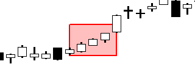

Candlestick patterns are a cornerstone of technical analysis, serving as visual representations of price movements in financial markets over specific time frames. These patterns provide traders with insights into market sentiment and potential future price movements. Among the diverse array of candlestick patterns, the Three White Soldiers pattern stands out due to its significance as a bullish reversal indicator. This pattern comprises three consecutive long-bodied candlesticks, each closing higher than the previous, and typically emerges after a downward trend, signaling a potential shift to bullish momentum.

Algorithmic trading has further revolutionized the use of candlestick patterns by automating the identification and execution of trades based on these signals. Algorithms can process vast amounts of market data in real-time, allowing them to recognize patterns like the Three White Soldiers more swiftly and accurately than manual analysis. By doing so, algorithmic trading systems can capitalize on emerging trends and price movements, enhancing the efficiency and reliability of trading strategies.



The convergence of traditional candlestick pattern analysis with advanced algorithmic trading methods creates powerful trading strategies. By leveraging the reliable signals of the Three White Soldiers pattern through automated systems, traders can potentially improve their decision-making process and increase their chances of achieving profitable outcomes. As we explore the integration of these elements, it becomes evident how modern technology complements age-old trading techniques, paving the way for more sophisticated and data-driven trading strategies.

## Table of Contents

## Understanding the Three White Soldiers Pattern

The Three White Soldiers pattern is a significant candlestick pattern utilized in technical analysis to signify a bullish reversal in market sentiment. This pattern is recognized by the distinct arrangement of three consecutive long-bodied bullish candlesticks. Each candlestick typically opens within or near the closing price of the previous day and closes higher than the prior candle, demonstrating a significant upward momentum.

### Components of the Three White Soldiers Pattern

1. **First Soldier**: The pattern begins with a long bullish candlestick that typically occurs after a downtrend, marking the potential beginning of a market reversal.

2. **Second Soldier**: This candle continues the upward trajectory. It opens within or slightly above the body of the first candle and closes higher than the first candle's close price, reinforcing the bullish sentiment.

3. **Third Soldier**: The final candle in the pattern further confirms the bullish reversal. It opens within or near the second soldier’s body and closes higher, solidifying the likelihood of a continued upward trend.

### Significance as a Bullish Reversal Indicator

The Three White Soldiers pattern is a strong bullish reversal signal observed in various financial markets, including stocks, [forex](/wiki/forex-system), and cryptocurrencies. Its emergence often indicates a shift in market sentiment from bearish to bullish, suggesting that the buying pressure is surpassing the selling pressure, and a potential uptrend is impending.

The significance of this pattern is largely attributed to its ability to suggest a robust shift in trader psychology. Each consecutive bullish candlestick demonstrates increasing buyer confidence, and the pattern as a whole can be symbolic of strength and continuity in the upward [momentum](/wiki/momentum).

### Development Over Three Consecutive Trading Sessions

The evolution of the Three White Soldiers occurs over three trading sessions. Initially, the first soldier indicates a potential reversal from a preceding downtrend. As the pattern progresses with the appearance of the second and third soldiers, the bullish sentiment is confirmed, and the pattern is completed. Importantly, the absence of significant lower wicks in the candles usually emphasizes the persistent buying pressure without major pullbacks.

### Visual Representation

To visualize the Three White Soldiers pattern, consider a scenario where a stock has been in a downtrend. On the first day of the pattern, a long bullish candle forms, breaking the continuous selling pressure. The following day, another bullish candlestick opens slightly above or within the body of the first candle and closes higher, reinforcing the bullish sentiment. The pattern is completed on the third day with another bullish candle that opens higher than the previous day and closes at a new high, often with minimal shadows to indicate a decisive bullish market stance.

In summary, the Three White Soldiers pattern is a powerful technical tool for identifying potential bullish reversals, characterized by its three long-bodied candlesticks that symbolize a shift towards a stronger bullish trend.

## Technical Significance and Reliability

The Three White Soldiers pattern holds considerable technical significance in technical analysis due to its robust bullish reversal signal. This pattern, characterized by three consecutive long-bodied candlesticks, typically occurs after a downtrend, suggesting a potential uptrend reversal. Each candlestick should open within the body of the previous one and close progressively higher, demonstrating strong buying pressure and enhancing the pattern's reliability as a signal for a market upturn.

A crucial [factor](/wiki/factor-investing) that enhances the effectiveness of the Three White Soldiers pattern is trading [volume](/wiki/volume-trading-strategy). Elevated volume during the formation of this pattern further confirms strong bullish sentiment, as it indicates increased activity and commitment from buyers. Conversely, low trading volume may diminish the pattern's reliability as it could reflect a lack of conviction among market participants, suggesting a weaker reversal signal.

Prior trends also play a significant role in assessing the reliability of this pattern. When the Three White Soldiers appear after a pronounced downtrend, the pattern is generally more reliable as it signifies a substantial shift in market sentiment. However, if the pattern emerges in a sideways or choppy market, the implications may be less clear. Additionally, external factors such as overall market conditions and macroeconomic indicators should be considered to gauge broader sentiment.

In comparison, the Three Black Crows pattern serves as the bearish counterpart to the Three White Soldiers. This pattern consists of three consecutive long-bodied candlesticks with progressively lower closes, emerging after an uptrend, and signals a potential downtrend reversal. Similar to its bullish counterpart, the reliability of the Three Black Crows is bolstered by increased trading volume, indicating strong selling pressure.

Both patterns underscore the importance of volume and prior trend analysis in evaluating their potential market implications. While the Three White Soldiers suggest a shift from bearish to bullish sentiment, the Three Black Crows indicate a transition from bullish to bearish. Understanding these factors is vital for traders aiming to leverage these patterns effectively within their trading strategies.

## Algorithmic Trading and Pattern Recognition

Algorithmic trading has revolutionized the way financial markets operate by utilizing computational algorithms to execute trades based on specific market signals. One such signal is the identification of candlestick patterns like the Three White Soldiers, which is widely recognized as a bullish reversal pattern in technical analysis. These patterns provide critical insights when algorithms analyze historical and real-time market data to forecast future price movements and execute trades accordingly.

### Pattern Recognition Algorithms

Pattern recognition algorithms are designed to automatically identify recurring patterns in price data. For the Three White Soldiers pattern, the task of these algorithms is to detect three consecutive long-bodied white candlesticks, each of which opens higher than the previous day's close, signaling increased buying pressure. These algorithms operate on principles derived from [machine learning](/wiki/machine-learning), statistical analysis, and digital signal processing.

At a basic level, these algorithms involve the following steps:

1. **Data Collection**: Gather historical price data at specific time intervals.
2. **Signal Processing**: Clean and preprocess this data to enhance the focus on price movements.
3. **Pattern Matching**: Implement algorithms to scan for characteristics of the Three White Soldiers such as defining a minimum required length of the bodies and ensuring each candle's opening price is within or above the prior candle's body.
4. **Validation**: Apply statistical tests to validate the identified patterns, ensuring they meet the predefined criteria for a robust pattern.

A simple example in Python leveraging libraries like Pandas for data manipulation and NumPy for numerical calculations could be as follows:

```python
import pandas as pd
import numpy as np

def identify_three_white_soldiers(data):
    signals = []
    for i in range(2, len(data)):
        current_candle = data.iloc[i]
        prev_candle = data.iloc[i-1]
        prev_prev_candle = data.iloc[i-2]

        is_white_soldier = (
            current_candle['Close'] > current_candle['Open'] and
            prev_candle['Close'] > prev_candle['Open'] and
            prev_prev_candle['Close'] > prev_prev_candle['Open'] and
            current_candle['Open'] > prev_candle['Close'] and
            prev_candle['Open'] > prev_prev_candle['Close']
        )

        if is_white_soldier:
            signals.append(i)

    return signals

# Example data input
data = pd.DataFrame({'Open': [1, 2, 3, 4, 5], 'Close': [2, 3, 4, 5, 6]})
print(identify_three_white_soldiers(data))
```

### Advantages of Algorithmic Trading

One of the most significant advantages of [algorithmic trading](/wiki/algorithmic-trading) is its ability to process vast amounts of data far quicker than a human could. This speed allows the immediate execution of trades once a pattern like the Three White Soldiers is detected, capitalizing on its bullish signal before the market fully reacts.

Furthermore, algorithmic trading reduces the emotional and psychological biases that often impair human decision-making. Algorithms strictly adhere to preprogrammed criteria, ensuring consistent application of trading strategies. Moreover, algorithmic systems can be back-tested across historical data, offering insights into how the Three White Soldiers pattern performs under various market conditions, thereby enhancing strategy reliability.

Incorporating automation, accuracy, and precision, algorithmic trading offers distinct advantages in recognizing and exploiting the Three White Soldiers pattern. As technology advances, these systems will likely become even more sophisticated, incorporating a broader range of data types and sources for the successful execution of trades.

## Integrating the Three White Soldiers Pattern in Trading Strategies

The Three White Soldiers pattern is a powerful tool for traders seeking to capitalize on market reversals. To effectively incorporate this pattern into trading strategies, traders should focus on precise entry and [exit](/wiki/exit-strategy) points, alongside robust risk management techniques.

### Incorporation into Trading Strategies

**Entry Strategies**

The Three White Soldiers pattern is ideally used to signal a potential bullish reversal, marking an optimal entry point for long positions. Traders should look for this pattern following a downtrend, where three consecutive bullish candles form, each with a higher close than the previous one. The entry points can be determined as follows:

1. **Immediate Entry**: Enter at the close of the third candle, confirming the pattern's completion. This approach is for traders who wish to capitalize swiftly on the momentum shift.

2. **Pullback Entry**: Wait for a slight pullback or consolidation after the third candle to enter at a potentially lower price, reducing entry risk.

3. **Breakout Entry**: Enter when the price surpasses a specific resistance level formed before the pattern, reinforcing the uptrend signaled by the Three White Soldiers.

**Exit Strategies**

As important as entry strategies, exit strategies help maximize profit and minimize risk. Consider the following:

1. **Target Price Exit**: Set a predefined price target based on technical analysis elements like resistance levels or Fibonacci retracements. Once the target is reached, traders can close their positions.

2. **Trailing Stop Loss**: Utilize a trailing stop to lock in profits as the price ascends. This method adjusts the stop loss to the highest price the asset achieves, less a specific percentage or dollar amount.

3. **Technical Indicator Exit**: Use technical indicators such as the RSI or MACD to identify when a stock is overbought, prompting an exit from the position.

### Risk Management Techniques

Risk management is essential to safeguard against potential losses associated with the pattern:

1. **Position Sizing**: Calculate the optimal position size using the formula:
$$
   \text{Position Size} = \frac{\text{Account Risk} \times \text{Account Balance}}{\text{Stop Loss Distance}}

$$

   This formula helps ensure losses do not exceed a predetermined percentage of the trading account.

2. **Stop-Loss Placement**: Place stop-loss orders just below the pattern’s first candle to limit downside risk. For a more conservative approach, set the stop loss below the entire pattern.

3. **Risk-Reward Ratio**: Establish a risk-reward ratio (e.g., 1:2 or 1:3), where potential profit exceeds potential loss. This strategy ensures that even if only a fraction of trades are successful, they can still be profitable overall.

By integrating the Three White Soldiers pattern into well-devised trading strategies with clear entry and exit criteria and stringent risk management, traders can leverage this powerful pattern for trading success.

## Potential Pitfalls and Considerations

When trading the Three White Soldiers pattern, traders may encounter several pitfalls that can impact the effectiveness of this bullish reversal indicator. Firstly, one common pitfall is mistaking similar patterns for the Three White Soldiers, leading to false signals. For instance, three consecutive bullish candles might appear superficially similar; however, if the candles do not open within the previous candle's body and have short upper shadows, they may not qualify as Three White Soldiers. This can lead to premature or misplaced trades.

Another potential challenge is ignoring the larger market context. The Three White Soldiers pattern is most effective following a downward price trend and signals a potential reversal. If this pattern emerges in a sideways or upward trending market, its predictive power may weaken, resulting in erroneous trading decisions. Volume considerations are also critical; the pattern is strengthened when accompanied by increasing volume, but traders might overlook this factor, which can result in less reliable signals.

To confirm the pattern's signals, traders can use additional technical indicators. One such indicator is the Relative Strength Index (RSI), which identifies overbought or oversold conditions and helps validate the Three White Soldiers' reversal signal. An RSI value crossing above 30 from an oversold region, alongside the appearance of the pattern, can serve as a robust confirmation tool.

Further, the Moving Average Convergence Divergence (MACD) indicator could be employed to complement the pattern. A MACD crossover, where the signal line crosses above the MACD line, can confirm the bullish sentiment indicated by the Three White Soldiers. By using these tools together, traders can improve the reliability of trade signals provided by the pattern.

Incorporating risk management techniques is another crucial strategy. Setting stop-loss orders just below the low of the first candle in the pattern can protect against sudden adverse price movements. By pairing these technical strategies with prudent risk management, traders can mitigate potential losses while effectively leveraging the Three White Soldiers pattern.

## Real-World Examples and Case Studies

Candlestick patterns, such as the Three White Soldiers, often emerge in various financial markets, including stock, forex, and cryptocurrencies. This pattern is typically observed during bullish reversals, signaling potential upward momentum over three consecutive trading sessions. Here, we provide real-world examples and case studies highlighting instances where this pattern has been identified and utilized for profitable trading, facilitated by algorithmic trading systems.

### Stock Market Example

One notable instance of the Three White Soldiers pattern appeared in Tesla Inc. (TSLA) stock in early 2020. Following a prolonged downtrend due to broader market sell-offs, the Three White Soldiers pattern emerged on the daily chart. This pattern often acts as a precursor to significant price movements, suggesting a bullish reversal. Traders who recognized this pattern were well-positioned to benefit from the subsequent rally, which saw Tesla's stock price more than double over the following months.

### Forex Market Example

In the forex market, the Three White Soldiers pattern was observed in the EUR/USD currency pair in July 2021. After a period of consolidation, the emergence of this pattern indicated a shift in market sentiment from bearish to bullish. Algorithmic trading systems, designed to detect such patterns, executed buy orders at the onset of the pattern. The subsequent appreciation in the EUR/USD exchange rate validated the pattern's bullish signal, offering profitable trades to those who acted on this technical indicator.

### Cryptocurrency Market Example

Cryptocurrency markets, known for their [volatility](/wiki/volatility-trading-strategies), also exhibit candlestick patterns like the Three White Soldiers. In early 2021, during a correction phase for Bitcoin (BTC), this pattern appeared on the daily chart. Algorithmic trading systems identified the pattern and executed strategic long positions. As a result, traders who leveraged these algorithms capitalized on Bitcoin’s subsequent upward trend.

### Algorithmic Trading and Pattern Recognition

Algorithmic trading systems have increasingly incorporated candlestick pattern recognition to enhance trade profitability. These systems utilize historical data to train models capable of accurately identifying the Three White Soldiers pattern. By automating the recognition process, they eliminate human error and emotional bias, executing trades based on predefined criteria as soon as the pattern is detected. This method of trading ensures timely entry into the market, often before manual traders can react.

### Case Study: The 2019-2020 Bull Market

A case study illustrating the power of algorithmic trading involves the broader market recovery in 2019-2020. During this time, multiple stocks displayed the Three White Soldiers pattern following the market dip in late 2018. Algorithmic systems, attuned to these formations, generated buy signals across a diversified portfolio of stocks. As markets transitioned from bearish to bullish, these systems helped traders capture gains efficiently, with minimal delay in order execution.

In summary, the successful application of the Three White Soldiers pattern in various markets underscores its validity as a bullish indicator. Algorithmic trading systems further amplify this effect by leveraging advanced pattern recognition to execute trades with precision and speed. Such integration of technical analysis and algorithmic execution not only improves trading outcomes but also showcases the dynamic capabilities of modern trading technology.

## Advanced Applications and Future Trends

The integration of [artificial intelligence](/wiki/ai-artificial-intelligence) (AI) and machine learning (ML) into candlestick pattern recognition, including the Three White Soldiers, is poised to revolutionize the landscape of technical analysis and trading. The prowess of AI in processing and analyzing vast amounts of data allows it to identify patterns which might be imperceptible to human traders. Machine learning algorithms, particularly those employing techniques such as neural networks and support vector machines, are being utilized to enhance the recognition of candlestick patterns and predict market movements with increasing accuracy.

Innovations in trading algorithms concerning the Three White Soldiers pattern focus on refining pattern recognition capabilities and improving predictive outcomes. Traditional recognition methods relied heavily on predefined rules and human interpretation, which often led to inconsistencies. In contrast, AI-driven algorithms can be trained to recognize complex patterns with a higher degree of precision. These algorithms are adept at considering numerous variables simultaneously, such as trading volume and historical price data, thereby enabling a more nuanced understanding of pattern dynamics.

The Three White Soldiers pattern signifies a bullish reversal, and when recognized accurately, it can be a powerful tool in trading strategies. Machine learning-enhanced algorithms can optimize the timing of entries and exits by continuously learning from market data, hence improving potential returns. Additionally, algorithms can be programmed to adapt to different market conditions, further ensuring the robustness of trading strategies that rely on this pattern. 

Speculating on future market conditions and their influence on the efficacy of the Three White Soldiers pattern reveals several possible scenarios. As markets evolve with technological advances, patterns may become more or less pronounced, affecting their reliability. For instance, if markets become more efficient due to increased algorithmic trading, traditional patterns might lose their predictive power. Conversely, advancements in AI could lead to the discovery of sub-patterns within the Three White Soldiers that enhance its efficacy.

Moreover, the increasing use of high-frequency trading ([HFT](/wiki/high-frequency-trading-strategies)) and other algorithmic strategies can impact the dynamics of candlestick patterns. While HFT can introduce noise and distort traditional patterns, it simultaneously creates opportunities for AI to detect and exploit micro-patterns that occur on shorter timescales. Future trading systems will likely integrate real-time data analysis with predictive modeling, enabling algorithms to adjust strategies dynamically in response to shifting market environments.

The application of AI and ML in pattern recognition, specifically with the Three White Soldiers, promises not just to augment traditional technical analysis but also to shape the future of trading. As these technologies continue to advance, traders equipped with sophisticated, AI-powered tools will be better positioned to navigate increasingly complex financial markets.

## Conclusion

The Three White Soldiers pattern holds a key place in technical analysis due to its ability to signal bullish reversals, providing traders with actionable insights. Its significance is enhanced by its straightforward formation—a series of three consecutive long-bodied white candlesticks, each opening within the body of the previous candle and closing progressively higher. This pattern serves as a reliable indicator of buyer dominance in the market, bringing clarity to price action dynamics over three trading sessions.

Incorporating the Three White Soldiers pattern with modern algorithmic trading strategies significantly boosts trading efficiency. Algorithmic trading capitalizes on this pattern's clear criteria, allowing for the development of robust trading models that quickly identify and execute trades. By combining traditional technical analysis with the speed and precision of algorithms, traders can gain a competitive edge, as algorithms can discern subtle shifts and opportunities in the market.

Traders are encouraged to integrate the Three White Soldiers pattern into their trading repertoire, practicing its application across various markets and timeframes. Embracing both classical methods and contemporary technological advancements will enable traders to enhance their strategy's robustness and adaptability. Ultimately, a thoughtful combination of these approaches will better equip investors to navigate the complexities of evolving market landscapes.

## References & Further Reading

[1]: Bergstra, J., Bardenet, R., Bengio, Y., & Kégl, B. (2011). ["Algorithms for Hyper-Parameter Optimization."](https://papers.nips.cc/paper/4443-algorithms-for-hyper-parameter-optimization) Advances in Neural Information Processing Systems 24.

[2]: ["Advances in Financial Machine Learning"](https://www.amazon.com/Advances-Financial-Machine-Learning-Marcos/dp/1119482089) by Marcos Lopez de Prado

[3]: ["Evidence-Based Technical Analysis: Applying the Scientific Method and Statistical Inference to Trading Signals"](https://www.amazon.com/Evidence-Based-Technical-Analysis-Scientific-Statistical/dp/0470008741) by David Aronson

[4]: ["Machine Learning for Algorithmic Trading"](https://github.com/stefan-jansen/machine-learning-for-trading) by Stefan Jansen

[5]: ["Quantitative Trading: How to Build Your Own Algorithmic Trading Business"](https://www.amazon.com/Quantitative-Trading-Build-Algorithmic-Business/dp/1119800064) by Ernest P. Chan

[6]: Bulkowski, T. N. (2008). ["Encyclopedia of Candlestick Charts"](https://content.e-bookshelf.de/media/reading/L-570904-9ece1795ee.pdf). Wiley Trading. 

[7]: Murphy, J. J. (1999). ["Technical Analysis of the Financial Markets: A Comprehensive Guide to Trading Methods and Applications"](https://archive.org/details/technicalanalysi0000murp). New York Institute of Finance.

[8]: Nison, S. (2001). ["Japanese Candlestick Charting Techniques: A Contemporary Guide to the Ancient Investment Techniques of the Far East"](https://drive.google.com/file/d/0B_CADMk621uLNDEyZTEzZjYtMmZjOS00ZmUyLTlhYmYtN2E1YTViOWRiOTdi/view). Prentice Hall Press.