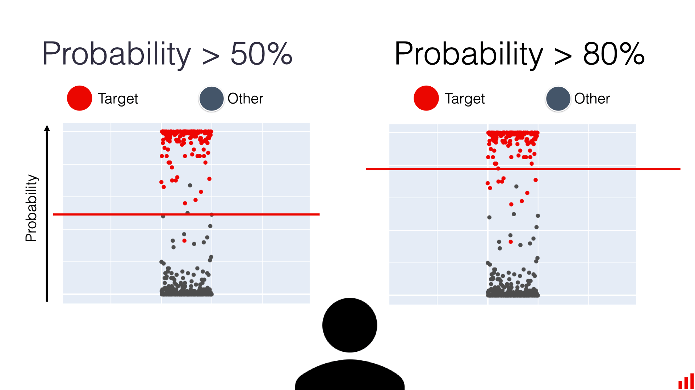

## Table of Contents

## What is a threshold in the context of decision trees in machine learning?

In the context of decision trees in machine learning, a threshold is a specific value used to split the data at a node. When the decision tree algorithm is building the tree, it tries to find the best way to divide the data into two groups based on a feature. The threshold is the cutoff point for that feature. For example, if the feature is "age," the threshold might be 30 years old. The algorithm would then split the data into two groups: one group where the age is less than or equal to 30, and another group where the age is greater than 30.

The goal of choosing the right threshold is to make the groups as different from each other as possible in terms of the target variable. This helps the decision tree make better predictions. The algorithm tests different thresholds and picks the one that results in the best split. By doing this at each node, the decision tree can create a series of decisions that lead to a final prediction. Thresholds are crucial because they determine how the data is divided at each step, which ultimately affects the accuracy and performance of the decision tree.

## How does a threshold help in making decisions within a decision tree?

A threshold in a decision tree helps make decisions by splitting the data into two groups based on a specific value of a feature. Imagine you're sorting people into two groups using their age. If you set the threshold at 30 years old, everyone 30 or younger goes into one group, and everyone older than 30 goes into the other group. The decision tree uses this threshold to decide which path to take next, guiding the data down the tree until it reaches a final decision or prediction.

The choice of threshold is important because it affects how well the decision tree can separate the data. The tree tries different thresholds to find the one that makes the two groups as different as possible in terms of what you're trying to predict. For example, if you're predicting whether someone will buy a product, the tree might find that using an age threshold of 30 splits the data in a way that one group is much more likely to buy than the other. By carefully choosing thresholds at each step, the decision tree can make more accurate predictions.

## What is the process of selecting a threshold in a decision tree?

When building a decision tree, the process of selecting a threshold starts with choosing a feature to split the data. The decision tree algorithm looks at each feature and tries different values as possible thresholds. For example, if the feature is age, the algorithm might test thresholds like 20, 25, 30, and so on. The goal is to find a threshold that makes the two groups of data as different as possible in terms of the target variable. This difference is measured using metrics like Gini impurity or information gain.

Once the algorithm has tested different thresholds for a feature, it picks the one that results in the best split. The best split is the one that maximizes the difference between the two groups according to the chosen metric. For instance, if using the age threshold of 30 years old results in the highest information gain, then 30 becomes the threshold for that node. This process is repeated at each node of the decision tree, with the algorithm selecting the best feature and threshold to split the data further until it reaches a stopping criterion, such as a maximum tree depth or a minimum number of samples per leaf.

## Can you explain the concept of splitting criteria in relation to thresholds?

Splitting criteria in decision trees are the rules used to decide where to split the data. The threshold is a big part of these rules. Imagine you're sorting apples and oranges by size. The threshold is the size where you decide to put an apple in one pile and an orange in another. The splitting criteria tell the decision tree how to pick this size. It looks at different sizes and chooses the one that makes the two piles as different as possible. This helps the tree make better guesses about new apples and oranges.

The decision tree uses math to figure out the best threshold. It might use something called Gini impurity or information gain. These are ways to measure how mixed up the data is. If the threshold makes the data less mixed up, it's a good split. For example, if you're sorting people by age to guess if they'll buy a product, the tree tries different ages and picks the one that makes the "will buy" and "won't buy" groups as different as possible. This process happens at every step of building the tree, making sure each split helps the tree make the best decisions.

## How do different impurity measures (like Gini impurity and entropy) affect threshold selection?

Different impurity measures like Gini impurity and entropy help decision trees choose the best threshold by measuring how mixed up the data is. Gini impurity looks at how often a randomly chosen element would be incorrectly labeled if it was labeled according to the distribution of labels in the subset. If the threshold splits the data into two groups that are very different, the Gini impurity will be low, which is good. On the other hand, if the groups are very similar, the Gini impurity will be high, which means the split isn't very helpful. So, the decision tree will pick the threshold that makes the Gini impurity as low as possible.

Entropy, on the other hand, measures the randomness or unpredictability of the data. It uses the concept of information gain, which is how much uncertainty is reduced after the split. The formula for entropy is $$ H(S) = -\sum_{i=1}^{n} p_i \log_2(p_i) $$, where $$ p_i $$ is the probability of class $$ i $$ in the set $$ S $$. If the threshold splits the data into two groups that have very different entropies, the information gain will be high, which is what the decision tree wants. The tree will choose the threshold that maximizes this information gain, making the data less random and easier to predict. Both measures help the tree find the best way to split the data, but they do it in slightly different ways.

## What are the common methods used to determine the optimal threshold in a decision tree?

The two most common methods to find the best threshold in a decision tree are using Gini impurity and entropy. Gini impurity looks at how mixed up the data is. If you split the data and one group is mostly one thing and the other group is mostly another thing, the Gini impurity will be low, which is good. The decision tree tries different thresholds and picks the one that makes the Gini impurity as low as possible. This helps the tree make good guesses about new data by choosing splits that make the groups as different as they can be.

Entropy measures how random the data is. It uses something called information gain, which is how much less random the data becomes after you split it. The formula for entropy is $$ H(S) = -\sum_{i=1}^{n} p_i \log_2(p_i) $$, where $$ p_i $$ is the chance of class $$ i $$ in the set $$ S $$. If the threshold splits the data into two groups that are very different, the entropy will go down a lot, which is what the decision tree wants. The tree will choose the threshold that makes the information gain as high as possible, which means the data is easier to predict after the split. Both methods help the tree find the best way to split the data, but they do it in different ways.

## How does the choice of threshold impact the model's performance and complexity?

The choice of threshold in a decision tree directly affects the model's performance and complexity. When the decision tree picks a good threshold, it can make better guesses about new data because the splits make the groups more different. This means the model can predict things more accurately. For example, if the tree is trying to guess if someone will buy a product based on their age, a good threshold like 30 years old might split the data into groups where one group is much more likely to buy than the other. This helps the model make better predictions and perform well.

On the other hand, the choice of threshold also affects how complex the decision tree becomes. If the tree uses thresholds that make very small groups, it can get very detailed and complicated. This might make the tree fit the data it was trained on very well, but it might not work as well with new data because it's too specific. This is called overfitting. To avoid this, the decision tree might use rules to stop growing too much, like setting a maximum depth or a minimum number of samples per leaf. By choosing thresholds carefully, the tree can balance being accurate and not getting too complex, which helps it perform well on new data too.

## What are the challenges associated with setting thresholds in decision trees?

Setting thresholds in decision trees can be tricky because it's important to find the right balance. If the threshold is too specific, the tree might split the data into very small groups, making it too detailed. This can lead to overfitting, where the tree works well on the data it was trained on but not on new data. On the other hand, if the threshold is too general, the tree might not be able to tell the groups apart well enough, leading to underfitting. This means the tree won't be able to make good guesses about new data because it's not detailed enough.

Another challenge is figuring out which threshold is the best one. The decision tree uses math to help with this, like Gini impurity or entropy. Gini impurity looks at how mixed up the data is, and the tree tries to pick a threshold that makes the groups as different as possible. Entropy measures how random the data is, and the tree tries to find a threshold that reduces this randomness the most. The formula for entropy is $$ H(S) = -\sum_{i=1}^{n} p_i \log_2(p_i) $$, where $$ p_i $$ is the chance of class $$ i $$ in the set $$ S $$. Even with these tools, it can still be hard to find the perfect threshold because it depends a lot on the data and what the tree is trying to predict.

## How can overfitting be mitigated when choosing thresholds in decision trees?

Overfitting in decision trees can be mitigated by carefully choosing thresholds and using techniques to control the tree's complexity. One way to do this is by setting a maximum depth for the tree. This means the tree can't grow too tall, so it won't split the data into too many small groups. Another way is to set a minimum number of samples per leaf. This stops the tree from making very small groups that might fit the training data too well but not work on new data. By using these rules, the tree can find thresholds that make good splits without getting too detailed.

Another technique to prevent overfitting is pruning. Pruning means cutting back parts of the tree that don't help much with predictions. The decision tree can try different thresholds and then remove branches that don't improve the tree's accuracy on a separate set of data, called a validation set. This helps the tree focus on the most important splits and thresholds, making it simpler and more likely to work well on new data. By balancing the tree's ability to fit the data with its simplicity, the choice of thresholds can be managed to reduce overfitting.

## What advanced techniques exist for dynamically adjusting thresholds during tree growth?

One advanced technique for dynamically adjusting thresholds during tree growth is called adaptive thresholding. This method involves continuously updating the thresholds as the tree grows, based on the data it's seeing. For example, if the decision tree is trying to split the data by age, it might start with a threshold of 30 years old. But as more data comes in, it might find that a threshold of 35 years old works better. The tree keeps checking different thresholds and picks the one that makes the groups as different as possible at each step. This helps the tree stay accurate even when the data changes over time.

Another technique is called cost-complexity pruning. This method involves growing a very detailed tree first and then cutting back branches that don't help much with predictions. The tree uses a formula called the cost-complexity parameter, $$ \alpha $$, to decide which branches to cut. The formula is $$ R_\alpha(T) = R(T) + \alpha |T| $$, where $$ R(T) $$ is the misclassification error of the tree, and $$ |T| $$ is the number of leaves. By adjusting $$ \alpha $$, the tree can find the right balance between being detailed and simple. This helps the tree pick thresholds that work well without overfitting.

## How do ensemble methods like Random Forests handle thresholds differently from single decision trees?

Ensemble methods like Random Forests handle thresholds differently from single decision trees because they use many decision trees together. Each tree in a Random Forest tries different thresholds, but instead of [picking](/wiki/asset-class-picking) the best one like a single tree does, Random Forests let each tree pick its own thresholds. This means that if one tree picks a threshold of 30 years old for age, another tree might pick 35 years old. By using many trees with different thresholds, Random Forests can make better guesses about new data because they look at the problem from many angles.

When Random Forests make a prediction, they take a vote from all the trees. If most trees say someone will buy a product because their age is above the threshold they picked, then the Random Forest will predict that too. This voting system helps the Random Forest be more accurate because it can balance out mistakes that individual trees might make with their thresholds. By using many trees and different thresholds, Random Forests can handle complex data better than a single decision tree.

## What research is being conducted on threshold optimization in decision trees for improving machine learning models?

Researchers are working on new ways to pick the best thresholds in decision trees to make [machine learning](/wiki/machine-learning) models better. One big idea is using something called "adaptive thresholding." This means the decision tree keeps changing its thresholds as it sees more data. For example, if the tree starts by using a threshold of 30 years old for age, it might change to 35 years old if that works better later on. This helps the tree stay accurate even when the data changes over time. Another idea is "cost-complexity pruning," which involves growing a very detailed tree first and then cutting back branches that don't help much with predictions. The tree uses a formula called the cost-complexity parameter, $$ \alpha $$, to decide which branches to cut. The formula is $$ R_\alpha(T) = R(T) + \alpha |T| $$, where $$ R(T) $$ is the misclassification error of the tree, and $$ |T| $$ is the number of leaves. By adjusting $$ \alpha $$, the tree can find the right balance between being detailed and simple.

Ensemble methods like Random Forests are also being studied for how they handle thresholds differently from single decision trees. Random Forests use many decision trees, and each tree picks its own thresholds. This means that if one tree picks a threshold of 30 years old for age, another tree might pick 35 years old. By using many trees with different thresholds, Random Forests can make better guesses about new data because they look at the problem from many angles. When Random Forests make a prediction, they take a vote from all the trees. If most trees say someone will buy a product because their age is above the threshold they picked, then the Random Forest will predict that too. This voting system helps the Random Forest be more accurate because it can balance out mistakes that individual trees might make with their thresholds.

## References & Further Reading

[1]: Breiman, L. (2001). ["Random Forests."](https://link.springer.com/article/10.1023/A:1010933404324) Machine Learning, 45(1), 5-32.

[2]: Louppe, G. (2014). ["Understanding Random Forests: From Theory to Practice."](https://arxiv.org/abs/1407.7502) arXiv preprint arXiv:1407.7502.

[3]: Quinlan, J. R. (1986). ["Induction of Decision Trees."](https://link.springer.com/article/10.1007/BF00116251) Machine Learning, 1(1), 81-106.

[4]: Hastie, T., Tibshirani, R., & Friedman, J. (2009). ["The Elements of Statistical Learning: Data Mining, Inference, and Prediction."](https://link.springer.com/book/10.1007/978-0-387-84858-7) Springer.

[5]: Rokach, L., & Maimon, O. (2005). ["Decision Trees."](https://link.springer.com/chapter/10.1007/0-387-25465-X_9) In Data Mining and Knowledge Discovery Handbook (pp. 165-192). Springer US.