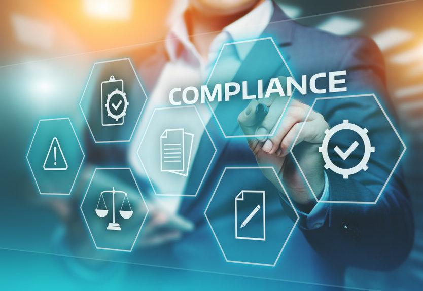

## Table of Contents

## What is the Threshold Securities List?

The Threshold Securities List is a record kept by the U.S. Securities and Exchange Commission (SEC). It shows stocks that have problems with their trades. These problems happen when there are too many "fail to deliver" shares. This means that when someone buys a stock, the seller does not give the stock to the buyer on time.

The list helps the SEC watch these stocks more closely. It makes sure that the stock market is fair and honest. If a stock is on the list, it means it needs more attention to fix the trading issues. This list is updated every day and can be checked by anyone who wants to know about these stocks.

## Why was the Threshold Securities List created?

The Threshold Securities List was created to help keep the stock market fair and honest. When people buy and sell stocks, sometimes the seller doesn't give the stock to the buyer on time. This is called a "fail to deliver." If this happens a lot with a certain stock, it can cause problems. The list helps the SEC, which is like a watchdog for the stock market, to see which stocks have these issues.

By keeping track of stocks with many "fail to deliver" shares, the SEC can watch them more closely. This helps make sure that the problems get fixed and that everyone trading stocks is treated fairly. The list is updated every day so that people can see which stocks might have issues and make better choices about their investments.

## Who maintains the Threshold Securities List?

The Threshold Securities List is kept up to date by the U.S. Securities and Exchange Commission, or SEC for short. The SEC is like a guardian that makes sure the stock market is fair and honest. They watch over the market to make sure everyone follows the rules.

The list helps the SEC see which stocks have a lot of "fail to deliver" shares. This happens when someone buys a stock, but the seller doesn't give the stock to the buyer on time. By keeping this list, the SEC can pay more attention to these stocks and help fix any problems that come up.

## How often is the Threshold Securities List updated?

The Threshold Securities List is updated every day. This means that new information about stocks with a lot of "fail to deliver" shares is added to the list each day. By doing this, the list stays current and helps people see which stocks might have problems.

The U.S. Securities and Exchange Commission, or SEC, is the group that updates the list. They do this to keep an eye on the stock market and make sure it is fair. If a stock is on the list, it means the SEC will watch it more closely to fix any issues that come up.

## What types of securities are included on the Threshold Securities List?

The Threshold Securities List includes stocks that have a lot of "fail to deliver" shares. This happens when someone buys a stock, but the seller does not give the stock to the buyer on time. These stocks are usually from companies listed on big stock markets like the New York Stock Exchange or NASDAQ.

The list helps the SEC watch these stocks more closely. It makes sure that the stock market stays fair and honest. If a stock is on the list, it means it needs more attention to fix the trading issues. This list is updated every day and can be checked by anyone who wants to know about these stocks.

## What are the criteria for a security to be added to the Threshold Securities List?

A security gets added to the Threshold Securities List when it has too many "fail to deliver" shares. This happens when someone buys a stock, but the seller does not give the stock to the buyer on time. To be on the list, a stock must have "fail to deliver" shares for five straight business days. Also, the number of these shares must be at least 0.5% of the total shares of the company, or at least 10,000 shares, whichever is less.

Once a stock meets these rules, it goes on the list. The list helps the SEC keep a close watch on these stocks. It makes sure that the stock market stays fair and honest. If a stock is on the list, it means it needs more attention to fix the trading issues. The list is updated every day so people can see which stocks might have problems.

## How does a security get removed from the Threshold Securities List?

A security gets removed from the Threshold Securities List when the number of "fail to deliver" shares goes down. This happens when the seller finally gives the stock to the buyer. The stock stays on the list until the "fail to deliver" shares are less than 0.5% of the total shares of the company, or less than 10,000 shares, whichever is less, for five straight business days.

Once these rules are met, the stock is taken off the list. This helps the SEC know that the trading issues with that stock are getting better. The list is checked every day to see which stocks can be removed and which ones still need more attention.

## What are the implications for investors when a security is on the Threshold Securities List?

When a security is on the Threshold Securities List, it means there are a lot of "fail to deliver" shares. This can be a warning sign for investors. It tells them that something might be wrong with the stock. Investors might want to be more careful when they think about buying or selling that stock. They might also want to do more research to understand why the stock is on the list and what it could mean for their investment.

Being on the list does not always mean the stock is a bad investment, but it does mean it needs more watching. The SEC keeps a close eye on these stocks to make sure any problems get fixed. Investors should keep an eye on the list and see if the stock gets taken off it. If the stock stays on the list for a long time, it might be a sign of bigger problems. So, it's a good idea for investors to stay informed and maybe talk to a financial advisor before making any big decisions.

## How does the Threshold Securities List affect market transparency?

The Threshold Securities List helps make the stock market more open and clear. When a stock is on the list, it means there are a lot of "fail to deliver" shares. This tells everyone that something might be wrong with how the stock is being traded. By putting this information out there every day, the SEC makes it easier for people to see which stocks might have problems. This helps investors make better choices because they know more about what is happening in the market.

Having a list like this also shows that the SEC is working to keep the market fair. When people can see which stocks are having issues, they can trust the market more. It's like having a clear window into the market, where everyone can see what's going on. This can help stop bad things from happening and make sure that everyone is playing by the rules.

## What are the regulatory requirements associated with securities on the Threshold Securities List?

When a security is on the Threshold Securities List, it means the SEC is watching it closely. The SEC has rules that say if a stock has too many "fail to deliver" shares for five days in a row, and those shares are at least 0.5% of the company's total shares or 10,000 shares, it goes on the list. This helps the SEC make sure that the stock market stays fair and honest. The SEC keeps an eye on these stocks to see if the problems get fixed.

If a stock is on the list, the company and the people trading the stock have to follow certain rules. They need to work on fixing the "fail to deliver" problem. The stock stays on the list until the number of "fail to deliver" shares goes down to less than 0.5% of the company's total shares or less than 10,000 shares for five days in a row. This helps make sure that the market stays clear and that everyone knows what's going on with these stocks.

## How can investors use the Threshold Securities List to inform their investment decisions?

Investors can use the Threshold Securities List to be more careful with their money. When a stock is on the list, it means there are a lot of "fail to deliver" shares. This can be a warning sign that something might be wrong with the stock. Investors should think twice before buying or selling these stocks. They might want to do more research to find out why the stock is on the list and what it could mean for their investment. This can help them make smarter choices and avoid big risks.

The list also helps investors stay informed about the market. By checking the list every day, investors can see which stocks are having problems and which ones are getting better. If a stock stays on the list for a long time, it might be a sign of bigger issues. On the other hand, if a stock gets taken off the list quickly, it could mean the problems are being fixed. Investors can use this information to decide when to buy, sell, or hold onto their stocks. Talking to a financial advisor can also help them understand the list better and make the best choices for their investments.

## What are some advanced strategies for trading securities that appear on the Threshold Securities List?

One advanced strategy for trading securities on the Threshold Securities List is to use short selling. When a stock is on the list, it means there are a lot of "fail to deliver" shares. This can be a sign that the stock's price might go down. Investors can borrow the stock and sell it, hoping to buy it back later at a lower price. This way, they can make money from the difference. But short selling can be risky because if the stock price goes up instead, the investor could lose money.

Another strategy is to wait and watch. Investors can keep an eye on the list to see if the stock gets taken off it. If the number of "fail to deliver" shares goes down and the stock is removed from the list, it might be a good time to buy. This shows that the problems with the stock are getting better. Investors can also look at other information about the company, like news and financial reports, to decide if it's a good investment. This strategy needs patience and careful watching, but it can help investors make smart choices.

## References & Further Reading

[1]: Bergstra, J., Bardenet, R., Bengio, Y., & Kégl, B. (2011). ["Algorithms for Hyper-Parameter Optimization."](https://papers.nips.cc/paper/4443-algorithms-for-hyper-parameter-optimization) Advances in Neural Information Processing Systems 24.

[2]: ["Advances in Financial Machine Learning"](https://www.amazon.com/Advances-Financial-Machine-Learning-Marcos/dp/1119482089) by Marcos Lopez de Prado

[3]: ["Evidence-Based Technical Analysis: Applying the Scientific Method and Statistical Inference to Trading Signals"](https://www.amazon.com/Evidence-Based-Technical-Analysis-Scientific-Statistical/dp/0470008741) by David Aronson

[4]: ["Machine Learning for Algorithmic Trading"](https://github.com/stefan-jansen/machine-learning-for-trading) by Stefan Jansen

[5]: ["Quantitative Trading: How to Build Your Own Algorithmic Trading Business"](https://www.amazon.com/Quantitative-Trading-Build-Algorithmic-Business/dp/1119800064) by Ernest P. Chan