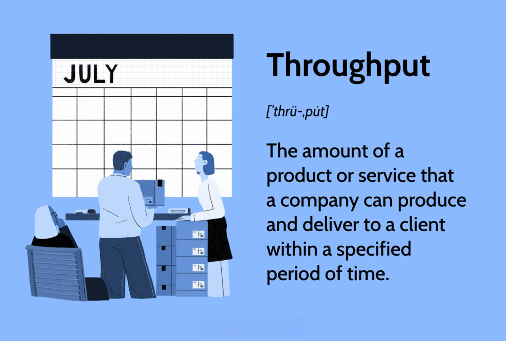

## Table of Contents

## What is throughput in simple terms?

Throughput is a measure of how much work a system can handle in a given amount of time. Think of it like a highway: the throughput is how many cars can pass a certain point on the highway every hour. In computers and networks, throughput might be how many files a server can process or how much data can be sent over a network in a second.

Understanding throughput is important because it helps us know if a system is working well or if it needs improvements. If a system has high throughput, it means it can handle a lot of work quickly. But if the throughput is low, it might mean the system is slow or overloaded, and we might need to fix or upgrade it to make it better.

## Why is throughput important in business and technology?

Throughput is really important in business and technology because it shows how well a system or a process is working. Imagine you run a fast-food restaurant. The throughput would be how many customers you can serve in an hour. If your throughput is high, you can serve more customers, make more money, and keep everyone happy. But if your throughput is low, customers might get frustrated waiting for their food, and you might lose business to a faster restaurant.

In technology, throughput matters a lot too. For example, if you have a website, the throughput could be how many people can visit your site at the same time without it slowing down. If your website can handle a lot of visitors quickly, people will have a good experience and come back. But if your website is slow because it can't handle the traffic, people might leave and go to a different site. So, understanding and improving throughput can help businesses and technology systems work better and keep customers happy.

## How is throughput different from bandwidth?

Throughput and bandwidth are related but different. Think of bandwidth like the size of a highway. It's the maximum amount of data that can travel through a network at one time. If you have a big highway with lots of lanes, you have high bandwidth, which means you can send a lot of data at once.

Throughput, on the other hand, is like how many cars actually get through the highway in an hour. It's the actual amount of data that gets sent successfully over the network in a given time. Even if you have a big highway (high bandwidth), if there are a lot of accidents or slow drivers, your throughput might be low because not many cars are getting through. So, bandwidth is about the potential, while throughput is about what actually happens.

## What is the basic formula for calculating throughput?

Throughput is calculated by dividing the amount of data that successfully passes through a system by the time it takes to do so. For example, if you send 100 files in 10 seconds, your throughput would be 10 files per second. The basic formula is: Throughput = Amount of Data / Time.

This formula can be used in many different situations. In a network, you might measure throughput in bits per second (bps), showing how many bits of data are successfully sent over the network each second. In a factory, throughput could be measured in units produced per hour, showing how many items are made in that time. No matter what you're measuring, the idea is the same: you're looking at how much gets done in a certain amount of time.

## Can you explain the units of measurement used for throughput?

Throughput can be measured using different units depending on what you're looking at. In computers and networks, a common unit is bits per second (bps). This shows how many bits of data are successfully sent over a network each second. If you have a faster connection, you might measure throughput in megabits per second (Mbps) or gigabits per second (Gbps), which are just bigger versions of bits per second.

In other areas, like factories or businesses, throughput might be measured in units per hour or items per day. For example, a factory might measure how many cars they can build in an hour, so their throughput would be in cars per hour. A fast-food restaurant might measure how many customers they can serve in an hour, so their throughput would be in customers per hour. The key thing is that the unit always shows how much work gets done in a certain amount of time.

## What factors can affect throughput in a network?

Many things can slow down or speed up how much data a network can handle. One big thing is how many people are using the network at the same time. If lots of people are trying to use the internet in your house at the same time, like streaming videos or playing games, the network might get slow because it's trying to handle too much at once. Another thing is the quality of the network equipment. If you have old or cheap routers and cables, they might not be able to handle a lot of data quickly, which means your throughput will be lower.

The type of data being sent also matters. Some types of files, like videos or large downloads, take up more space on the network than simple text messages or emails. If you're trying to send a lot of big files, it might slow down the whole network. And don't forget about things outside your control, like the internet service provider. If they have problems or if their network is slow, it can affect how much data you can send or receive. All these things together can make your network's throughput go up or down.

## How can throughput be improved in a system?

To make a system's throughput better, you need to find out what's slowing it down and fix those problems. One way to do this is by upgrading the hardware. If your computer or network has old or slow parts, like an old router or not enough memory, getting new, faster parts can help. Another way is to make the software better. Sometimes, the programs you use might not be working as well as they could. Updating them or using better ones can help the system handle more work faster. Also, making sure the system isn't trying to do too many things at once can help. If you close apps you're not using or stop background processes, the system can focus on the important tasks and get them done quicker.

Another important thing is to manage the network better. If lots of people are using the internet at the same time, it can slow everything down. You can set rules so that important tasks, like work or school, get more of the network's attention. Also, checking for and fixing any problems in the network, like broken cables or bad connections, can help. Sometimes, just moving your router to a better spot can make a big difference. By looking at all these things and making smart changes, you can help your system handle more work and get things done faster.

## What are the common tools used to measure throughput?

There are several tools that help measure how much work a system or network can handle. One common tool is a network analyzer, which can show you how much data is moving through your network at any time. It's like a speedometer for your internet, telling you how fast data is going and how much is getting through. Another tool is a performance monitor, which you can use on computers to see how well they're working. It can tell you how many files your computer can process in a certain amount of time.

Another useful tool is a bandwidth monitor, which keeps an eye on how much of your network's capacity is being used. It's like checking how full a highway is to see if it's moving cars efficiently. There are also specific software programs, like iPerf, that are made just for testing network throughput. They send data back and forth between computers to see how fast the network can handle it. By using these tools, you can get a good idea of how well your system or network is working and where you might need to make improvements.

## How does throughput relate to system performance and efficiency?

Throughput is a big part of how well a system works and how efficient it is. Think of it like this: if you have a machine that can make 100 toys in an hour, that's its throughput. If you want to know if the machine is doing a good job, you look at how many toys it makes compared to how many it could make if it was working perfectly. So, throughput tells you if the system is working as fast as it should be, or if there are things slowing it down.

Improving throughput can make a system more efficient. If you find out what's slowing things down and fix those problems, like getting better parts for the machine or making the software run smoother, the system can handle more work in less time. This means you can get more done with the same resources, which is what efficiency is all about. So, by keeping an eye on throughput and making it better, you can make sure your system is working its best and getting the most out of what it has.

## What are the advanced techniques for optimizing throughput in large-scale systems?

In big systems, one way to make throughput better is by using something called load balancing. Imagine you have a lot of people trying to use a website at the same time. Load balancing is like having a bunch of doors at the front of the website, and each person gets sent to a different door so they don't all pile up at one place. This way, the work gets spread out evenly across different parts of the system, and more people can use the website without it getting slow. Another technique is using caching, which is like keeping quick copies of important data close by. If the system can grab the data it needs quickly instead of looking for it every time, it can handle more requests faster.

Another advanced way to optimize throughput is through parallel processing. This means breaking down a big job into smaller pieces and letting different parts of the system work on them at the same time. It's like having a team of workers instead of just one person doing everything. This can make the system much faster because more work gets done at once. Also, using smarter algorithms can help. These are like better recipes for how the system does its work. If the system follows a smarter recipe, it can do things more efficiently and handle more work in less time. By using these techniques, big systems can keep up with a lot of work and keep things running smoothly.

## Can you discuss the role of throughput in cloud computing environments?

In cloud computing, throughput is really important because it shows how well the cloud can handle the work it's given. Imagine you're using a cloud service to store and share files. The throughput would be how many files you can upload or download in a certain amount of time. If the cloud has high throughput, it means it can handle a lot of files quickly, which is great for businesses that need to move a lot of data around. But if the throughput is low, it might take a long time to get your files, and that can slow down your work and make people frustrated.

To make sure the cloud has good throughput, cloud providers use special techniques. One way is by spreading the work across different servers, so no single server gets too busy. This is called load balancing, and it helps keep things running smoothly. Another way is by using caching, which is like keeping quick copies of important data close by. This means the cloud can grab the data it needs faster, which helps with throughput. By keeping an eye on throughput and using these techniques, cloud providers can make sure their services are fast and efficient, which is what people need when they're using the cloud.

## How do real-time applications handle throughput challenges?

Real-time applications, like video calls or online games, need to handle a lot of data quickly to work well. If the throughput is low, it can make the video choppy or the game slow, which can be really frustrating for users. To deal with this, these applications use special tricks. One trick is to make the data smaller before sending it, which is called compression. This way, more data can be sent in less time, which helps with throughput. Another trick is to guess what data might be needed next and send it ahead of time. This is called predictive sending, and it can make things smoother because the app is ready with the data before it's even asked for.

Another way real-time applications handle throughput challenges is by using something called adaptive bitrate streaming. This means the app can change how much data it sends based on how fast the network is. If the network is slow, the app might send less data so it can keep up, and if the network is fast, it might send more data to make the video or game look better. By doing these things, real-time applications can keep working well even when the network is busy or slow. It's all about making sure the data gets where it needs to go as quickly as possible, so users don't notice any problems.

## What is the understanding of throughput in algo trading?

Throughput in algorithmic trading is a crucial performance metric that quantifies how efficiently a trading system processes transactions. Essentially, it measures the rate at which a trading platform can successfully complete orders over a specified period. This metric is instrumental in assessing a system's capacity to manage and execute a high volume of trades swiftly and accurately, which is fundamental to the effectiveness of automated trading systems.

The significance of throughput in algorithmic trading cannot be overstated. High throughput is synonymous with efficiency, as it reflects the system's capability to handle a substantial load of trading data and perform transactions at a rate that meets market demands. In the context of high-frequency trading ([HFT](/wiki/high-frequency-trading-strategies)), where decisions are made and executed within microseconds, having a high throughput ensures that trading algorithms can capitalize on opportunities faster than competitors, thereby maintaining a competitive edge.

Throughput can be mathematically expressed as:

$$
\text{Throughput} = \frac{\text{Number of Processed Transactions}}{\text{Time Period}}
$$

This formula highlights the importance of speed and [volume](/wiki/volume-trading-strategy) in evaluating throughput. A trading system with high throughput can process more transactions in a given time frame, which is particularly valuable in environments where market conditions can change rapidly.

The ability to handle large volumes of data efficiently is essential for traders who rely on automation and algorithmic strategies. A system that can quickly interpret vast datasets and execute trades based on that information significantly enhances a trader's ability to respond to market fluctuations and execute strategies effectively.

Moreover, high throughput is not only crucial for trade execution but also for post-processing activities such as risk management, compliance checks, and reporting. These processes benefit from a system that can swiftly execute transactions and manage subsequent operations without bottlenecks.

In summary, throughput serves as both a measure of performance and a competitive differentiator in [algorithmic trading](/wiki/algorithmic-trading). Systems designed with high throughput capabilities are better positioned to exploit market opportunities, manage risks, and achieve trading objectives efficiently.

## How do you calculate throughput for algorithmic trading systems?

Throughput in algorithmic trading systems is generally quantified by determining the number of orders a system can process within a specific time frame. The calculation of throughput necessitates a comprehensive analysis of the trading system's workflow from the point of data acquisition to the final execution of trades. This involves understanding and optimizing each stage within the trading pipeline, as inefficiencies and bottlenecks can arise at various points, impacting overall performance.

The trading process begins with the reception of market data, followed by data processing, which includes filtering and analysis. Efficient data handling is crucial as delays in processing can significantly impact throughput. The algorithm then generates trading signals based on the processed data, which are subsequently translated into executable orders. Finally, these orders are dispatched to the market. Each stage requires fine-tuning to ensure that the maximum number of transactions can be handled simultaneously.

Mathematically, throughput ($T$) can be expressed as:

$$
T = \frac{N}{\Delta t}
$$

where:
- $N$ represents the total number of orders processed.
- $\Delta t$ is the time period over which these orders are processed.

To accurately calculate throughput, one must monitor the time taken for each transaction from data reception to order execution. This involves logging timestamps at each critical stage and analyzing these logs to identify delays. By pinpointing the exact locations of bottlenecks within the system, improvements can be made. For instance, if data reception is identified as a slow point, upgrading network connections or optimizing data ingestion algorithms may be necessary.

Adopting a systematic approach to throughput calculation helps illuminate inefficiencies that could otherwise hinder trading performance. Tools and techniques such as profiling and performance benchmarking can aid in this process, while visualization of data flow can provide further insights into potential issues. By conducting a meticulous evaluation of each pipeline component, traders can achieve higher throughput levels, ensuring that their systems are well equipped to handle the demands of fast-paced financial markets.

## References & Further Reading

[1]: Bergstra, J., Bardenet, R., Bengio, Y., & Kégl, B. (2011). ["Algorithms for Hyper-Parameter Optimization."](https://papers.nips.cc/paper/4443-algorithms-for-hyper-parameter-optimization) Advances in Neural Information Processing Systems 24.

[2]: ["Advances in Financial Machine Learning"](https://www.amazon.com/Advances-Financial-Machine-Learning-Marcos/dp/1119482089) by Marcos Lopez de Prado

[3]: Aronson, D. R. (2007). ["Evidence-Based Technical Analysis: Applying the Scientific Method and Statistical Inference to Trading Signals."](https://www.amazon.com/Evidence-Based-Technical-Analysis-Scientific-Statistical/dp/0470008741) John Wiley & Sons.

[4]: Jansen, S. (2018). ["Machine Learning for Algorithmic Trading."](https://github.com/stefan-jansen/machine-learning-for-trading) Packt Publishing.

[5]: Chan, E. P. (2008). ["Quantitative Trading: How to Build Your Own Algorithmic Trading Business."](https://github.com/ftvision/quant_trading_echan_book) John Wiley & Sons.