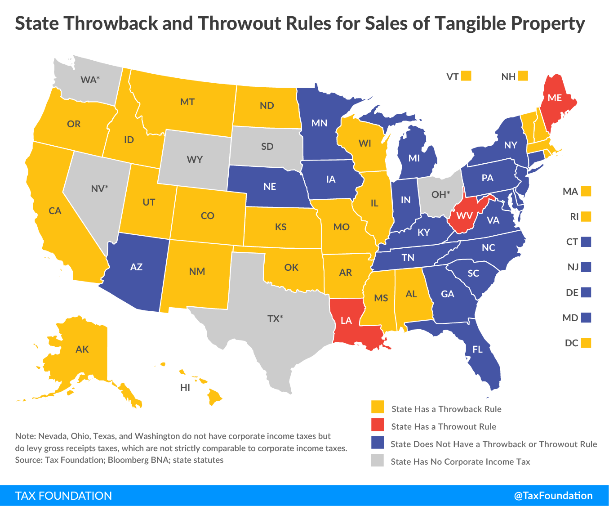

## Table of Contents

## What is the basic concept of a throwback?

A throwback is when people share or talk about things from the past. It could be old photos, videos, or memories that remind us of earlier times. People often use throwbacks to feel nostalgic and to remember good times they had before.

Throwbacks are popular on social media. People post throwback pictures or stories and use hashtags like #ThrowbackThursday or #FlashbackFriday. It's a fun way for people to connect with each other by sharing their past experiences and memories.

## How did the term 'throwback' originate?

The term 'throwback' has been around for a long time, but it became really popular with the rise of social media. Originally, 'throwback' just meant something from the past that reminds us of earlier times. It could be an old photo, a memory, or even an old-fashioned style that comes back into fashion.

In the early 2010s, people started using 'throwback' a lot on social media sites like Instagram and Twitter. They would share old pictures or stories and use hashtags like #ThrowbackThursday or #FlashbackFriday. This made the term 'throwback' even more popular and it became a fun way for people to share their memories and connect with others.

## Can you provide simple examples of throwbacks in everyday life?

A throwback in everyday life can be as simple as looking at old family photos. Maybe you find a picture of your grandparents when they were young, or a photo of yourself as a baby. You might feel happy and nostalgic as you remember those times. Sharing these photos with family or friends can make everyone smile and feel closer to each other.

Another example is when you hear an old song on the radio that reminds you of your teenage years. You might start singing along and remember the fun times you had with your friends back then. It's like taking a little trip back in time, and it can make you feel happy and connected to your past.

Sometimes, throwbacks can also be about fashion or trends. You might see someone wearing a style of clothes that was popular when you were younger, like bell-bottom jeans or a certain type of sneakers. Seeing these old styles again can bring back memories and make you feel a bit nostalgic. It's a fun way to connect the past with the present.

## What are some common uses of throwbacks in social media?

On social media, throwbacks are often used to share old memories with friends and followers. People post old photos or videos from their past, like pictures from a family vacation or a birthday party from years ago. They use hashtags like #ThrowbackThursday or #FlashbackFriday to show that the post is a throwback. This helps others know that the post is about something from the past, and it can start fun conversations and bring people together as they share their own memories.

Throwbacks can also be used to celebrate special moments or people. For example, someone might post a throwback photo of a loved one on their birthday or anniversary, sharing a memory that means a lot to them. It's a way to honor the past and show appreciation for the people and moments that have been important in their lives. By sharing these throwbacks, people can feel more connected to their past and to each other.

## How do throwbacks contribute to nostalgia?

Throwbacks help make people feel nostalgic by bringing back memories from the past. When someone sees an old photo or hears a song they used to love, it can make them think about happy times they had before. This feeling of nostalgia can be comforting and make people feel good, like they are visiting their past for a little while.

Sharing throwbacks on social media or with friends can also make people feel more connected to each other. When someone posts an old picture or tells a story about something that happened years ago, it can start conversations and bring people together. They might share their own memories and feel closer to each other because they are remembering good times together.

## What are the psychological effects of experiencing throwbacks?

Experiencing throwbacks can make people feel happy and nostalgic. When someone sees an old picture or hears a song from their past, it can bring back good memories. This feeling of nostalgia can be comforting and make people feel warm inside. It's like taking a little trip back to happy times, which can improve their mood and make them feel more positive about the present.

Throwbacks can also help people feel more connected to others. When someone shares an old photo or a story from the past, it can start conversations with friends or family. They might share their own memories and feel closer to each other. This sense of connection can be really important for people's mental health, as it helps them feel supported and part of a community.

## In what ways can throwbacks be used in marketing and branding?

Throwbacks can be a powerful tool in marketing and branding because they help companies connect with people's emotions. When a company uses old photos, videos, or styles from the past in their ads, it can make people feel nostalgic. This feeling can make customers feel good about the brand and more likely to buy their products. For example, a company might use a throwback ad showing people enjoying their product in the 80s or 90s. This can make customers think about happy times and associate those good feelings with the brand.

Using throwbacks can also help companies stand out and seem more authentic. When a brand brings back an old logo or uses a classic slogan, it can make them seem more real and connected to their history. This can build trust with customers, who might feel like the company values tradition and quality. For instance, a clothing brand might bring back a popular style from the past, which can attract both new customers and those who remember and loved that style before. By tapping into people's nostalgia, companies can create a strong emotional bond with their audience.

## What are the potential limitations or drawbacks of using throwbacks?

Using throwbacks can have some problems. Not everyone feels the same way about the past. Some people might not like to be reminded of old times because it makes them feel sad or upset. If a company uses throwbacks in their ads, they might accidentally make some people feel bad instead of good. Also, if a company uses throwbacks too much, it might start to seem like they are not doing anything new. People might get tired of seeing the same old things and lose interest in the brand.

Another thing to think about is that throwbacks might not work for everyone. Younger people might not understand or care about old styles or memories from before they were born. If a brand uses throwbacks that only older people get, they might miss out on connecting with younger customers. It's important for companies to know their audience and make sure their throwbacks will really connect with the people they want to reach.

## How can throwbacks be effectively integrated into digital content strategies?

Throwbacks can be a great way to make digital content more interesting and connect with people's emotions. When creating digital content, like social media posts or videos, you can use old photos, videos, or styles from the past to make people feel nostalgic. This can make them feel happy and more likely to engage with your content. For example, you might post an old picture on Throwback Thursday and ask your followers to share their own memories. This can start fun conversations and make people feel closer to your brand.

But it's important to think about who your audience is and what kind of throwbacks will work best for them. Not everyone feels the same way about the past, so you need to be careful not to use throwbacks that might make some people feel sad or upset. Also, you don't want to use throwbacks too much, or people might get bored and think you're not doing anything new. By mixing throwbacks with fresh, new content, you can keep your digital strategy exciting and keep people interested.

## What are the ethical considerations when using throwbacks, especially in media?

When using throwbacks in media, it's important to think about how they might affect people. Not everyone feels the same way about the past. Some people might feel happy and nostalgic when they see old photos or videos, but others might feel sad or upset. It's important to be careful and think about how your audience might feel. If you use throwbacks in a way that makes people feel bad, it could hurt your relationship with them. Always try to understand your audience and use throwbacks in a way that respects their feelings.

Another thing to consider is the truthfulness of the throwbacks. Sometimes, old photos or stories might not be accurate or might be changed to fit a certain message. It's important to be honest and not use throwbacks to trick people. If you're sharing something from the past, make sure it's real and not changed in a way that could mislead your audience. Being honest helps build trust and keeps people interested in your content.

## How do throwbacks influence cultural trends and historical perceptions?

Throwbacks can bring back old styles and ideas, making them popular again. When people see old photos or hear old songs, they might start to like the styles from those times. This can make old fashion trends come back, like when bell-bottom jeans or certain kinds of sneakers become popular again. Companies might also bring back old products or logos because they know people like to feel nostalgic. This can change what is trendy and make people think about the past in new ways.

Throwbacks can also change how people see history. When old photos or stories are shared, they can help people remember important events or times in a different way. Sometimes, throwbacks can make people feel more connected to the past and understand it better. But sometimes, throwbacks might only show part of the story or leave out important details. It's important to be careful and make sure throwbacks are used in a way that shows the truth about history, so people can learn and remember the past correctly.

## What advanced techniques can be used to analyze the impact of throwbacks on audience engagement?

To understand how throwbacks affect audience engagement, you can use special tools and methods. One way is to look at the data from social media. You can see how many people like, comment, or share a throwback post. This can help you know if people are interested in the throwback. Another way is to use surveys or polls to ask people directly how they feel about the throwback content. This can give you more detailed information about what people like or don't like about the throwbacks.

Another technique is to use sentiment analysis. This is when you use a computer program to read the comments and reactions to a throwback post and see if they are positive, negative, or neutral. This can help you understand how people feel about the throwback. You can also look at how long people spend looking at the throwback content. If they spend a lot of time, it might mean they are really interested in it. By using these methods, you can learn a lot about how throwbacks affect your audience and make better choices about what to share in the future.

## What are the differences between Throwback and Fibonacci Retracements?

Throwbacks are a specific type of price retracement observed in trading, characterized by the price returning to a [breakout](/wiki/breakout-trading) level after breaching a resistance. This occurrence is particularly significant for traders using algorithmic strategies, as it highlights potential entry or [exit](/wiki/exit-strategy) points following the initial price breakout. While throwbacks focus on the return to the breakout point, Fibonacci retracements utilize predefined percentage levels derived from the Fibonacci sequence to anticipate areas of support or resistance within a trending market.

Fibonacci retracements are based on key Fibonacci ratios: 23.6%, 38.2%, 50%, 61.8%, and 100%. These levels are calculated by taking two extreme points on a stock chart, typically the high and low of a price movement, and dividing the vertical distance by the key Fibonacci ratios. Traders use these retracement levels to identify potential reversal levels in an ongoing trend.

For instance, if an asset's price rises from $100 to $150, the 38.2% Fibonacci retracement level would be calculated as follows:

$$
\text{Retracement Level} = \text{High} - (\text{High} - \text{Low}) \times \text{Fibonacci Ratio}
$$

$$
\text{Retracement Level} = 150 - (150 - 100) \times 0.382 = 131
$$

At $131, traders might expect a consolidation or reversal. Conversely, throwbacks involve the price returning to the breakout level (e.g., $150) before possibly continuing its previous trend.

Traders often integrate both throwbacks and Fibonacci retracements within their algorithms to enhance the decision-making process in trading strategies. By using throwbacks to confirm breakouts and Fibonacci retracements to identify potential support and resistance levels, traders can corroborate the timing of market entry or exit points. This combination helps refine the strategy by reducing false signals and increasing the probability of successful trades.

Algorithmically, the combination of these tools can be implemented in Python as follows:

```python
def fibonacci_retracement(high, low, ratio):
    return high - (high - low) * ratio

def is_throwback(current_price, breakout_price):
    return current_price >= breakout_price

# Usage example
high = 150
low = 100
fibonacci_level = fibonacci_retracement(high, low, 0.382)
breakout_price = high

# Check if the current price is a throwback
current_price = 151
if is_throwback(current_price, breakout_price):
    print("Potential throwback scenario.")

print(f"38.2% Fibonacci Level: {fibonacci_level}")
```

Using these methods allows for a comprehensive analysis of price movements, aligning trading strategies with market dynamics. By effectively employing throwbacks and Fibonacci retracements, algorithmic traders can improve their prediction accuracy, potentially enhancing their trading outcomes.

## References & Further Reading

[1]: ["Advances in Financial Machine Learning"](https://www.amazon.com/Advances-Financial-Machine-Learning-Marcos/dp/1119482089) by Marcos Lopez de Prado

[2]: ["Evidence-Based Technical Analysis: Applying the Scientific Method and Statistical Inference to Trading Signals"](https://www.amazon.com/Evidence-Based-Technical-Analysis-Scientific-Statistical/dp/0470008741) by David Aronson

[3]: ["Machine Learning for Algorithmic Trading"](https://github.com/stefan-jansen/machine-learning-for-trading) by Stefan Jansen

[4]: ["Quantitative Trading: How to Build Your Own Algorithmic Trading Business"](https://www.amazon.com/Quantitative-Trading-Build-Algorithmic-Business/dp/1119800064) by Ernest P. Chan

[5]: Bruetsch, A., Härdle, W. K., & Lessmann, C. (2019). ["Predicting price retracements in financial markets using machine learning."](https://www.sciencedirect.com/science/article/pii/S0957417423013428) Statistical Papers.