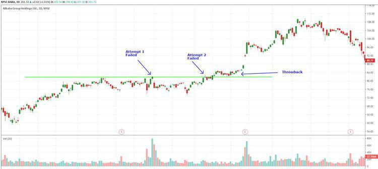

Algorithmic trading has transformed the financial industry by enabling the execution of trades with a degree of speed and precision unattainable through manual methods. This form of trading uses complex algorithms to make decisions based on predefined criteria and market conditions, allowing for the high-frequency trading of assets. As a result, traders can capitalize on fleeting market opportunities faster than human intuition and reaction times allow.

Despite its significant benefits, algorithmic trading is not without its challenges. Automated systems can encounter limitations, such as technical glitches or flawed algorithms, leading to substantial financial risks. Moreover, reliance on quantitative models necessitates a thorough understanding of the market environment and continual adaptation to market shifts.



A critical element in the development of successful algorithmic trading strategies is the incorporation of technical analysis concepts, such as 'throwbacks.' A throwback occurs when a security's price retraces to retest a previously breached resistance level. This behavior can be pivotal for traders aiming to optimize their entry and exit points in the market. Identifying and understanding throwbacks can enhance the effectiveness of trading algorithms, providing traders with additional insights and potentially profitable trading opportunities.

This article will focus on exploring throwbacks within algorithmic trading. It will provide illustrative examples and examine the limitations associated with employing throwback strategies. By understanding these nuances, traders can better navigate the complexities of the financial market and improve their algorithmic trading outcomes.

## Table of Contents

## What is a Throwback?

In technical analysis, a throwback refers to the price action where an asset's price retraces back towards the breakout point after surpassing a resistance level. This behavior typically occurs after a stock, currency, or any financial instrument experiences a breakout, which is a decisive price move through a level of resistance or support.

The occurrence of a throwback provides both opportunities and challenges for algorithmic traders. On the one hand, correctly anticipating and identifying a throwback can allow traders to execute profitable trades by entering the market at a favorable price point, often before the continuation of the trend. On the other hand, the unpredictability of throwbacks poses challenges. Not every breakout is followed by a throwback, making it critical for traders to discern when one is likely to occur and when it may signify a false breakout.

Throwbacks can be especially useful in [algorithmic trading](/wiki/algorithmic-trading) as they offer parameters for algorithms designed to time trades effectively. By understanding this price pattern, algorithms can be structured to detect potential throwbacks and optimize trade entry or [exit](/wiki/exit-strategy) points. To illustrate, consider a scenario in which a trader has identified a previous resistance level $R$. Once the price breaks through $R$ to $P$, a throwback would see the price retrace back close to $R$ before potentially resuming its upward [momentum](/wiki/momentum).

In practice, developing algorithms to predict throwbacks requires a blend of technical analysis and pattern recognition. Algorithms are often designed to recognize the [breakout](/wiki/breakout-trading) event and preset conditions for a retracement back to the critical level. The challenge lies in distinguishing between a genuine throwback and price [volatility](/wiki/volatility-trading-strategies) that does not lead back to the breakout point. Thus, traders must calibrate their algorithms carefully, considering volatility measures, historical patterns, and other technical indicators.

Algorithmically, the process might involve defining a condition such as:

```python
def is_throwback(breakout_level, current_price, retracement_threshold=0.02):
    return abs(current_price - breakout_level) <= retracement_threshold * breakout_level
```

This function checks whether the current price is sufficiently close to the breakout level, within a set threshold, to be considered a throwback. Understanding and implementing such functions within trading algorithms are vital steps towards leveraging throwbacks effectively.

## Examples of Throwbacks in Algorithmic Trading

A classic example of a throwback can be observed with assets like Alibaba Group Holdings Ltd. in the stock market, where a resistance level is established around a specific price. For instance, when Alibaba's stock price rises past a resistance point, a throwback might occur, retracing back to the breakout level before continuing its upward trajectory. Algorithmic traders regard such patterns as opportunities for developing strategies that capitalize on predicted upward movements following a throwback.

To effectively leverage throwbacks, trading algorithms can incorporate technical indicators and historical price data to identify resistance levels and potential throwback points. By doing this, traders can set parameters for their algorithms to execute trades when a high probability of a successful throwback is detected.

Here is a simple Python example using a popular library, `pandas`, and `numpy`, for identifying potential throwbacks. This example assumes prior knowledge of the historical price data of a stock:

```python
import pandas as pd
import numpy as np

# Load historical stock data
data = pd.read_csv('stock_data.csv')  # Assume stock_data.csv contains date, open, high, low, close columns
data['resistance'] = data['close'].rolling(window=20).max()  # Example resistance level as 20-day rolling max

# Identify breakouts
data['breakout'] = np.where(data['close'] > data['resistance'], True, False)

# Identify throwbacks (where price retraces back to resistance level)
data['throwback'] = np.where((data['breakout'].shift(1) == True) & 
                             (data['close'] <= data['resistance']), True, False)

# Filter for throwback instances
throwbacks = data[data['throwback']]

# Display dates and prices where throwbacks occurred
print(throwbacks[['date', 'close']])
```

The ability to accurately predict and trade on throwbacks can indeed form a cornerstone of a successful trading algorithm. Traders can optimize algorithms to dynamically adapt to the behavior of specific stocks like Alibaba by consistently [backtesting](/wiki/backtesting) and adjusting parameters based on observed market conditions. This prepares the algorithm to take advantage of the potential upward movement following a throwback, thus aiming to enhance trading performance.

## Throwback vs. Fibonacci Retracements

Throwbacks are a specific type of price retracement observed in trading, characterized by the price returning to a breakout level after breaching a resistance. This occurrence is particularly significant for traders using algorithmic strategies, as it highlights potential entry or exit points following the initial price breakout. While throwbacks focus on the return to the breakout point, Fibonacci retracements utilize predefined percentage levels derived from the Fibonacci sequence to anticipate areas of support or resistance within a trending market.

Fibonacci retracements are based on key Fibonacci ratios: 23.6%, 38.2%, 50%, 61.8%, and 100%. These levels are calculated by taking two extreme points on a stock chart, typically the high and low of a price movement, and dividing the vertical distance by the key Fibonacci ratios. Traders use these retracement levels to identify potential reversal levels in an ongoing trend.

For instance, if an asset's price rises from $100 to $150, the 38.2% Fibonacci retracement level would be calculated as follows:

$$
\text{Retracement Level} = \text{High} - (\text{High} - \text{Low}) \times \text{Fibonacci Ratio}
$$

$$
\text{Retracement Level} = 150 - (150 - 100) \times 0.382 = 131
$$

At $131, traders might expect a consolidation or reversal. Conversely, throwbacks involve the price returning to the breakout level (e.g., $150) before possibly continuing its previous trend.

Traders often integrate both throwbacks and Fibonacci retracements within their algorithms to enhance the decision-making process in trading strategies. By using throwbacks to confirm breakouts and Fibonacci retracements to identify potential support and resistance levels, traders can corroborate the timing of market entry or exit points. This combination helps refine the strategy by reducing false signals and increasing the probability of successful trades.

Algorithmically, the combination of these tools can be implemented in Python as follows:

```python
def fibonacci_retracement(high, low, ratio):
    return high - (high - low) * ratio

def is_throwback(current_price, breakout_price):
    return current_price >= breakout_price

# Usage example
high = 150
low = 100
fibonacci_level = fibonacci_retracement(high, low, 0.382)
breakout_price = high

# Check if the current price is a throwback
current_price = 151
if is_throwback(current_price, breakout_price):
    print("Potential throwback scenario.")

print(f"38.2% Fibonacci Level: {fibonacci_level}")
```

Using these methods allows for a comprehensive analysis of price movements, aligning trading strategies with market dynamics. By effectively employing throwbacks and Fibonacci retracements, algorithmic traders can improve their prediction accuracy, potentially enhancing their trading outcomes.

## Limitations of Using Throwbacks in Algorithmic Trading

A primary limitation of relying on throwbacks in algorithmic trading is their inherent unpredictability. Not every breakout from a resistance level will be followed by a throwback; hence, assuming that a throwback will always occur can lead to significant trading errors. This unpredictability is compounded by the fact that even when a throwback does occur, it might not necessarily result in the continuation of the anticipated trend. Such occurrences are often termed as false breakouts, which can lead to losses if traders fail to accurately identify them.

For example, consider a situation where a stock price breaks through a resistance level and briefly retraces back towards it, creating a potential throwback scenario. If an algorithm erroneously anticipates a subsequent upward trend continuation, the trader might enter or hold a position based on this flawed expectation. However, if the price fails to resume its upward trajectory, the trade could result in a loss.

Implementing throwback strategies within trading algorithms necessitates a delicate balance between potential profits and the risks associated with false breakouts. This is because the assumption that throwbacks will consistently lead to profitable trades can result in over-optimized algorithms that perform well under certain conditions but fail when market dynamics shift. 

To mitigate these risks, traders can employ comprehensive backtesting and robust risk management techniques. Python, a popular programming language in algorithmic trading, can be used for developing and backtesting these trading algorithms. Here is a simple example of how one might incorporate a basic risk management strategy using a stop-loss mechanism to safeguard against false breakouts:

```python
def trading_strategy(price_data, resistance_level, stop_loss_percent=0.02):
    position_open = False
    entry_price = 0

    for current_price in price_data:
        if not position_open and current_price > resistance_level:
            # Assuming a breakout followed by a throwback
            entry_price = current_price
            position_open = True

        if position_open:
            if current_price < entry_price * (1 - stop_loss_percent):
                # Trigger stop-loss if the price falls below the stop-loss threshold
                print("Stop-loss triggered. Exiting position.")
                position_open = False

            # Additional logic to detect continuation of upward trend can be added here

# Example usage
price_data = [100, 105, 102, 98, 110, 115]  # Hypothetical price data
resistance_level = 104
trading_strategy(price_data, resistance_level)
```

This example showcases a basic algorithm that enters a trade when a price surpasses a specified resistance level. If the price then falls below a stop-loss threshold, the algorithm exits the trade, thereby mitigating potential losses associated with false breakouts. While the simplifications in this code are for illustrative purposes, they underscore the importance of developing algorithms that can adapt to the dynamic and often unpredictable nature of financial markets.

## Mitigating Risks and Enhancing Strategies

Proper risk management techniques are essential in algorithmic trading, particularly when implementing strategies that involve throwbacks. One common method to mitigate risks is the use of stop-loss orders. These orders automatically execute the sale of an asset when its price reaches a predetermined level, thereby limiting potential losses if a throwback turns into a false breakout. For example, if an algorithm predicts a throwback towards a previous resistance level, a stop-loss order can be set just below this level to prevent losses should the price continue to fall instead of rebounding.

In addition to stop-loss orders, combining throwback analysis with other technical indicators can enhance the accuracy and robustness of trading algorithms. Indicators such as moving averages, the Relative Strength Index (RSI), and Bollinger Bands can provide additional context to price movements, allowing algorithms to better differentiate between genuine throwbacks and false signals. By cross-verifying throwback patterns with these indicators, traders can increase the confidence level of their predictions.

Enhancing algorithms with [machine learning](/wiki/machine-learning) techniques can further improve prediction accuracy in trading. Machine learning models, such as decision trees, support vector machines, or neural networks, can analyze complex patterns in historical and real-time data that might be imperceptible through traditional analysis. By training these models on historical data, traders can develop algorithms capable of predicting future price movements with a higher degree of precision. Python libraries such as scikit-learn and TensorFlow are commonly used for implementing machine learning models in trading.

Below is an example of how a simple machine learning model might be implemented to predict throwbacks:

```python
import pandas as pd
from sklearn.model_selection import train_test_split
from sklearn.ensemble import RandomForestClassifier
from sklearn.metrics import accuracy_score

# Example data preparation
data = pd.read_csv('historical_market_data.csv')
features = data[['feature1', 'feature2', 'feature3']]
target = data['throwback_indicator']

# Split data into training and test sets
X_train, X_test, y_train, y_test = train_test_split(features, target, test_size=0.2, random_state=42)

# Train a Random Forest Classifier
model = RandomForestClassifier(n_estimators=100, random_state=42)
model.fit(X_train, y_train)

# Evaluate model accuracy
predictions = model.predict(X_test)
accuracy = accuracy_score(y_test, predictions)
print(f'Model Accuracy: {accuracy:.2f}')
```

Effective backtesting with historical data is crucial for refining these algorithms before deploying them in real-world trading. Backtesting involves simulating the performance of an algorithm using past market data to assess its potential effectiveness and risks. This process helps identify weaknesses in the algorithm and allows for adjustments to improve its resilience against market volatility. Comprehensive backtesting can be implemented using frameworks like Backtrader in Python, which provides traders with the tools to test strategies across different timeframes and assets.

Overall, successful trading algorithms employing throwback strategies integrate robust risk management, diverse technical indicators, machine learning enhancements, and thorough backtesting to adapt to the dynamic nature of financial markets.

## Conclusion

Throwbacks in algorithmic trading harness patterns of price retracement to offer significant opportunities for profit. However, these opportunities come with inherent limitations, requiring traders to exercise careful consideration in their strategy development. The unpredictable nature of throwbacks, where not all breakouts revert to the breakout point, highlights the necessity for robust prediction techniques. 

Accurate prediction is crucial, as it enables traders to anticipate market movements and align their trading algorithms effectively. This involves integrating comprehensive risk management strategies, such as implementing stop-loss orders to mitigate losses from false breakouts. The reliance on precise prediction systems underscores the importance of leveraging advanced statistical methods and machine learning to enhance algorithmic accuracy. For instance, integrating neural networks can help in identifying complex patterns within the market data that are not easily discernible through traditional methods.

Moreover, traders must continuously adapt their strategies to the ever-evolving financial market landscape. This dynamic nature demands vigilance and flexibility, ensuring that algorithms remain robust against potential uncertainties. Effective backtesting with historical data is essential here; it validates algorithmic strategies under various market conditions, enhancing their reliability and performance. Implementing a feedback loop within trading systems is also vital for adjusting trading parameters in response to real-time market signals.

In conclusion, while throwbacks present valuable opportunities in algorithmic trading, the associated risks and unpredictability necessitate a balanced approach. This balance involves not only refined prediction mechanisms but also comprehensive risk management and adaptable strategies. By continually enhancing algorithmic systems, traders can maximize their potential for success amidst the complexities of financial markets.

## References & Further Reading

[1]: ["Advances in Financial Machine Learning"](https://www.amazon.com/Advances-Financial-Machine-Learning-Marcos/dp/1119482089) by Marcos Lopez de Prado

[2]: ["Evidence-Based Technical Analysis: Applying the Scientific Method and Statistical Inference to Trading Signals"](https://www.amazon.com/Evidence-Based-Technical-Analysis-Scientific-Statistical/dp/0470008741) by David Aronson

[3]: ["Machine Learning for Algorithmic Trading"](https://github.com/stefan-jansen/machine-learning-for-trading) by Stefan Jansen

[4]: ["Quantitative Trading: How to Build Your Own Algorithmic Trading Business"](https://www.amazon.com/Quantitative-Trading-Build-Algorithmic-Business/dp/1119800064) by Ernest P. Chan

[5]: Bruetsch, A., Härdle, W. K., & Lessmann, C. (2019). ["Predicting price retracements in financial markets using machine learning."](https://www.sciencedirect.com/science/article/pii/S0957417423013428) Statistical Papers.