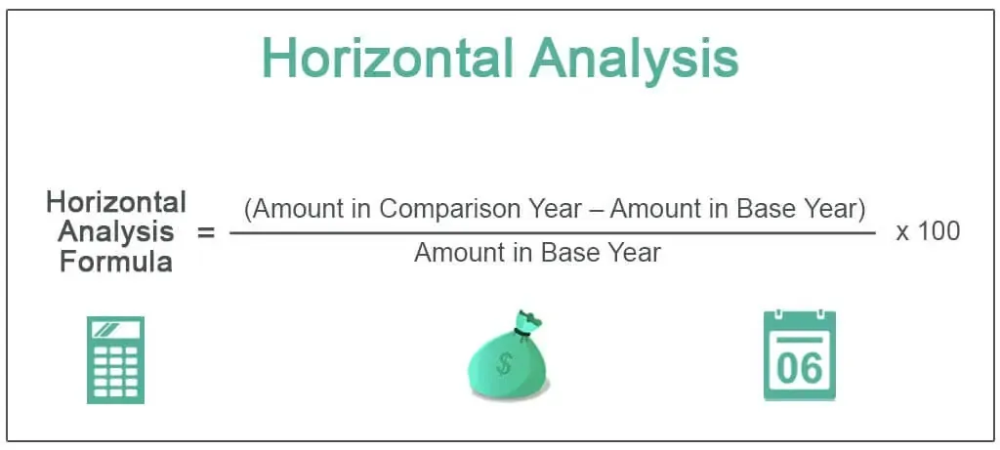

Understanding interest rate benchmarks is critical for both investors and traders, as these benchmarks provide a reference point for various financial transactions and instruments. The Tokyo Interbank Offered Rate (TIBOR) represents a key benchmark within the Japanese financial market, playing a significant role in shaping borrowing and lending conditions. As a widely-recognized indicator, TIBOR is essential for assessing the cost of interbank loans in Japan, allowing for more informed decision-making by financial institutions.

This article aims to explore TIBOR's significance as a financial benchmark, delving into its calculation process and its implications within algorithmic trading. By understanding the factors that drive TIBOR, traders and investors can better anticipate market trends and make strategic decisions to leverage changes in interest rates. Furthermore, the article will investigate TIBOR's impact on financial markets, including its influence on pricing loans and financial products. Through a comprehensive examination, this article will highlight the pivotal role of TIBOR in Japan's financial system and its broader implications for global markets.



## Table of Contents

## What is TIBOR?

TIBOR, or the Tokyo Interbank Offered Rate, is a crucial interest rate benchmark used in the Japanese financial markets. It represents the average interest rates at which banks are willing to lend unsecured funds to one another in the Tokyo interbank market. As such, it provides a vital measurement of the cost of short-term borrowing within Japan’s banking sector.

The Japanese Bankers Association (JBA) is responsible for publishing TIBOR rates, doing so every business day at 11:00 a.m. Japan Standard Time (JST). The dissemination of these rates offers transparency and provides market participants with important information regarding the prevailing conditions in the interbank lending market.

TIBOR is divided into two main sets of rates: the European TIBOR rate and the Japanese Yen TIBOR rate. The European TIBOR rate pertains to transactions in the euroyen market, which involves yen-denominated deposits held outside Japan. This rate is reflective of loan conditions in the offshore market, offering insights into the global demand for Japanese yen-denominated funds.

Conversely, the Japanese Yen TIBOR rate is concerned with the domestic unsecured call market, where short-term loans are offered without collateral. This rate is indicative of conditions within Japan itself, shedding light on the domestic banking sector’s short-term liquidity needs and borrowing costs.

Collectively, these rates paint a comprehensive picture of the short-term borrowing environment available to financial institutions in Japan. This information is critical for a wide range of financial stakeholders, including investors, financial analysts, and policymakers, who rely on these benchmarks to inform their strategies and decisions.

## Understanding TIBOR's Calculation

The Tokyo Interbank Offered Rate (TIBOR) is calculated by the JBA TIBOR Administration (JBATA) using a systematic approach designed to ensure accuracy and reflect true market conditions. The process involves gathering [interest rate](/wiki/interest-rate-trading-strategies) quotes from a panel of banks. These rates represent the interest these banks would charge other financial institutions for short-term loans within the Japanese interbank market.

The calculation incorporates quotes for six different maturities: one week, one month, two months, three months, six months, and 12 months. The quotes reflect borrowing conditions for these specific time frames. To maintain robustness and exclude outliers that may distort the integrity of the rate, the JBATA implements a trimming process. Specifically, after collecting quotes from the participating banks, the highest and lowest figures are discarded. This trimming ensures that extreme values do not skew the average, providing a more reliable indication of current market conditions.

Once the top and bottom quotes are removed, an arithmetic mean is calculated using the remaining data. This method is expressed mathematically as:

$$
\text{TIBOR}_{\text{maturity}} = \frac{\sum_{i=k+1}^{n-k} Q_i}{n-2k}
$$

Where:
- $Q_i$ represents the quoted rates from the contributing banks.
- $n$ is the total number of banks in the panel.
- $k$ is the number of quotes to discard from each end.

The calculated TIBOR rates are then disseminated through authorized financial information providers such as Thomson Reuters. These platforms are chosen for their widespread accessibility among financial market participants, thus facilitating broad distribution. This ensures that the market has access to precise and reliable information, which is critical for maintaining transparency and confidence in the quoted benchmarks.

This method of calculation and dissemination highlights the intricate balance between obtaining accurate market reflection and maintaining a process that is straightforward enough to be reliably repeated every business day. By using such a structured approach, JBATA ensures that TIBOR serves as a credible benchmark for both domestic and international financial transactions involving Japanese yen.

## TIBOR and Its Role in Algorithmic Trading

Algorithmic trading leverages complex algorithms to execute trades at speeds and frequencies that are impractical for human traders. Within this domain, benchmarks like the Tokyo Interbank Offered Rate (TIBOR) serve as crucial indicators, influencing trading decisions and strategies.

Fluctuations in TIBOR can have significant implications for trading activities, particularly in currency and interest rate markets. These movements are essential inputs for predictive models that aim to forecast market trends. For instance, a rise in TIBOR could signal tighter borrowing conditions, which might exert upward pressure on interest rate instruments or influence currency valuations due to shifts in capital flows.

Algorithmic models utilize high-frequency data to respond to these fluctuations efficiently. By incorporating changes in TIBOR into their algorithms, traders can automate the execution of trades within milliseconds. This rapid response capability allows these systems to exploit even minute shifts in market conditions, optimizing trading opportunities and potential profit margins.

For example, an algorithm designed in Python might incorporate a function to dynamically adjust trading positions based on real-time TIBOR data. Here is a simple illustration:

```python
import requests

def get_tibor_rate():
    # Hypothetical API call to fetch current TIBOR rate
    response = requests.get('https://api.example.com/tibor')
    return response.json()['tibor_rate']

def execute_trade(current_tibor_rate, threshold=0.05):
    # Example logic to determine trade action
    if current_tibor_rate > threshold:
        print("Execute buy order")
    else:
        print("Execute sell order")

# Main loop for trading execution
current_tibor = get_tibor_rate()
execute_trade(current_tibor)
```

This code snippet represents a simplified version of the decision-making process within an [algorithmic trading](/wiki/algorithmic-trading) strategy, illustrating how real-time TIBOR data can directly influence trading actions.

Ultimately, the integration of TIBOR into algorithmic trading systems underscores the importance of financial benchmarks. These rates provide critical insights that help traders understand and anticipate market dynamics, enabling them to strategize effectively in the ever-evolving landscape of global finance.

## Impact of TIBOR on Financial Markets

TIBOR, or the Tokyo Interbank Offered Rate, extends its influence beyond simple interbank lending rates to significantly impact various facets of financial markets. One primary area of influence is in shaping government financial policies. TIBOR serves as a critical indicator for the Ministry of Finance in Japan, playing a role similar to that of interest rate benchmarks utilized by the U.S. Department of Treasury. The data provided by TIBOR aids in financial analysis and helps formulate monetary policies. These policies can dictate national economic strategies, having downstream effects on inflation rates, currency valuation, and ultimately, economic growth.

Furthermore, TIBOR's utility as a benchmark for loan pricing is profound. It provides the foundation for determining interest rates on a wide range of financial products, including personal loans, corporate loans, and mortgages. By doing so, TIBOR impacts both lenders and borrowers. Lenders utilize TIBOR to ensure loan offerings align with current market conditions, maintaining competitive yet profitable interest rate margins. Borrowers, on the other hand, experience the fluctuations of TIBOR in the cost of borrowing. An increase in TIBOR typically leads to higher interest payments, affecting personal finance and corporate capital expenditures.

In the financial markets, TIBOR's role as a benchmark can determine the pricing and valuation of interest rate swaps and derivatives. Traders and financial institutions rely on accurate TIBOR rates to hedge risk effectively and manage portfolios. Variations in TIBOR influence trading strategies and the structuring of financial instruments, affecting [liquidity](/wiki/liquidity-risk-premium) and market dynamics.

In summary, TIBOR's significance in financial markets is multifaceted, affecting government policy, loan pricing, and trading strategies. By serving as a critical benchmark, TIBOR ensures financial products and market activities remain aligned with prevailing economic conditions, thereby fostering a stable financial environment.

## Conclusion

TIBOR continues to be a central component of Japan's financial ecosystem, providing critical reference data that guides decision-making for investors and traders alike. Its significance stems not only from its reflection of the current interbank interest rates but also from its broader applicability in diverse financial operations. 

In the era of algorithmic trading, financial benchmarks like TIBOR are indispensable for the formulation of trading strategies. These benchmarks enable traders to design algorithms that can swiftly respond to interest rate fluctuations, optimizing trading outcomes. The precision and reliability of TIBOR make it a trustworthy data point that algorithmic trading models can leverage, driving efficiency and profitability in highly competitive markets.

As international financial markets transform and grow increasingly interconnected, the understanding and application of benchmarks such as TIBOR will become even more critical. Market participants who grasp the nuances of these benchmarks will be well-positioned to anticipate market trends and make informed investment choices. Hence, TIBOR is not just a metric for measuring short-term interest rates in Japan but is a vital tool influencing global financial dynamics.

## References & Further Reading

[1]: Fama, E. F., & French, K. R. (1989). ["Business Conditions and Expected Returns on Stocks and Bonds."](https://www.sciencedirect.com/science/article/pii/0304405X89900950) Journal of Financial Economics, 25(1), 23-49.

[2]: Kaminsky, G. L., & Reinhart, C. M. (1999). ["The Twin Crises: The Causes of Banking and Balance-of-Payments Problems."](https://www.aeaweb.org/articles?id=10.1257/aer.89.3.473) The American Economic Review, 89(3), 473-500.

[3]: Iida, T., Kimura, T., & Saito, M. (2011). ["Re-estimating the term structure of interest rates for Japan"](https://www.semanticscholar.org/paper/Regulatory-Reforms-and-the-Dollar-Funding-of-Global-Iida-Kimura/9ac28c2bd04e79268654fbb46baa7081c87083f3) NLI Research Institute.

[4]: Shirai, S. (2017). ["Bank of Japan’s Monetary Policy Easing since the 2008 Global Financial Crisis"](https://link.springer.com/article/10.1007/s42495-019-00018-w) Journal of Economic Surveys, 27(27), 30-45.

[5]: Hull, J. C. (2018). ["Options, Futures, and Other Derivatives"](https://www.semanticscholar.org/paper/Options%2C-Futures%2C-and-Other-Derivatives-Hull/89bdee500c8623864fc9eb7a471546aa713acc44) 10th Edition. Pearson. 

[6]: "Understanding 'Japan Post Bank Co Ltd' Banking Performance with TIBOR" in ["Banking in Japan"](https://dcf.fm/blogs/investors/7163t-investor-profile), Routledge, 2022.