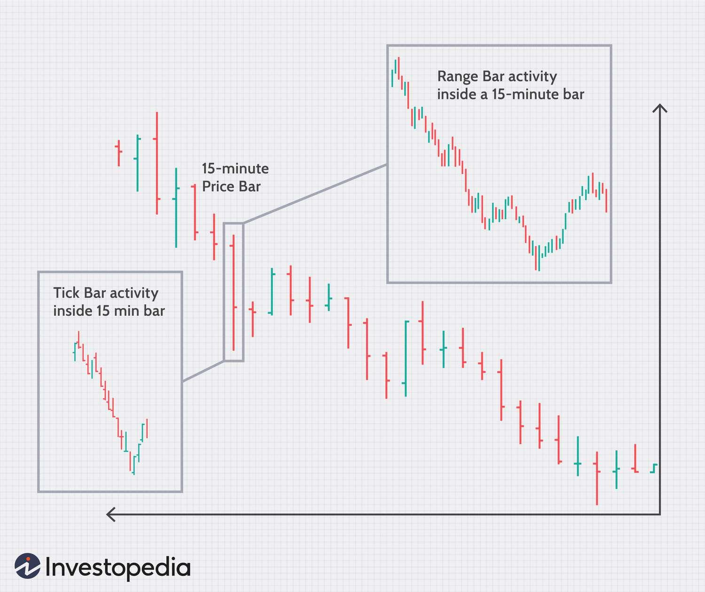

## Table of Contents

## What are tick bars and how do they differ from time-based bars?

Tick bars are a type of chart used in trading that show price movements based on the number of trades, or ticks, rather than time. For example, a 100-tick bar chart will create a new bar after every 100 trades, no matter how long it takes. This means that during busy trading times, when there are lots of trades happening quickly, the bars will appear faster. During quieter times, it might take longer for a new bar to form.

Time-based bars, on the other hand, are charts that show price movements over fixed time periods, like every minute, hour, or day. For instance, a 1-hour bar chart will create a new bar every hour, regardless of how many trades happen in that hour. This makes time-based bars easier to predict because they always change at the same time intervals. However, they might not show as much detail about trading activity as tick bars do.

The main difference between tick bars and time-based bars is what triggers the creation of a new bar. Tick bars focus on the number of trades, giving a clearer picture of market activity and volume. Time-based bars focus on fixed time intervals, which can be simpler to understand and use for planning, but they might miss out on showing sudden changes in trading activity.

## Why might traders prefer using tick bars over traditional time bars?

Traders might prefer using tick bars over traditional time bars because tick bars give a better picture of how busy the market is. When a lot of trades are happening, tick bars will show this activity more clearly than time bars. This can help traders see when the market is moving a lot and make decisions based on that. For example, if a trader sees that tick bars are forming quickly, it might mean there's a lot of interest in the market, and they might want to act on that information.

Another reason traders might choose tick bars is that they can help avoid times when the market is not very active. With time bars, you might see a new bar every hour, even if nothing much is happening. But with tick bars, if the market is quiet, it will take longer for a new bar to form. This can help traders focus on the times when the market is more active and ignore the quieter times. This way, they can make better use of their time and possibly make better trading decisions.

## How are tick bars constructed and what determines the number of ticks per bar?

Tick bars are made by counting the number of trades, or ticks, that happen in the market. When a certain number of ticks is reached, a new bar is created on the chart. For example, if you choose to use 100-tick bars, a new bar will appear after every 100 trades. The price information shown in each bar, like the highest and lowest prices during those 100 trades, is used to draw the bar.

The number of ticks per bar is decided by the trader. They can pick any number they want, like 50 ticks, 100 ticks, or even 1000 ticks. The choice depends on what the trader thinks will help them see the market's activity best. If they want to see more detail, they might choose a smaller number of ticks per bar. If they want to see bigger trends, they might choose a larger number of ticks per bar.

## What are the advantages of using tick bars in trading?

Using tick bars in trading can help traders see how busy the market is. When there are a lot of trades happening, tick bars will show this activity more clearly than time bars. This can help traders spot when the market is moving a lot and make better decisions. For example, if tick bars are forming quickly, it might mean the market is very active, and traders can use this information to act fast.

Another advantage of tick bars is they help traders focus on the times when the market is most active and ignore the quieter times. With time bars, you see a new bar every hour no matter what. But with tick bars, if the market is quiet, it takes longer for a new bar to form. This way, traders can pay more attention to the busy times and make better use of their time, which can lead to better trading choices.

## Can you explain the concept of volume and tick bars?

Volume bars and tick bars are two types of charts that traders use to see how busy the market is. Volume bars show how many shares or contracts are traded before a new bar is made. For example, if you choose a [volume](/wiki/volume-trading-strategy) bar of 1000, a new bar will appear after 1000 shares or contracts are traded. This helps traders see when a lot of trading is happening, which can mean the market is moving a lot.

Tick bars, on the other hand, show how many trades happen before a new bar is made. If you choose a 100-tick bar, a new bar will appear after 100 trades, no matter how many shares or contracts are in those trades. This can help traders see when the market is active because more trades mean more activity. Both volume and tick bars help traders focus on the busy times in the market and make better decisions.

## How do tick bars help in managing market volatility?

Tick bars can help traders manage market [volatility](/wiki/volatility-trading-strategies) by showing them how busy the market is. When there are a lot of trades happening quickly, tick bars will form faster. This means traders can see when the market is moving a lot and might be more volatile. By watching tick bars, traders can get a better sense of when the market is likely to have big price changes, and they can adjust their trading strategies to handle this volatility better.

For example, if a trader sees that tick bars are forming very quickly, they might think the market is getting more volatile. They could then decide to be more careful with their trades, maybe by using smaller trade sizes or setting tighter stop-loss orders to protect themselves from big price swings. By using tick bars, traders can react to changes in market activity and volatility more effectively, which can help them make better trading decisions and manage risks.

## What are some common strategies that utilize tick bars?

One common strategy that uses tick bars is called "[breakout](/wiki/breakout-trading) trading." Traders watch tick bars to see when the market is busy and prices are moving a lot. When they see a price break out of a certain range, they might decide to buy or sell. Tick bars help them see these breakouts more clearly because they show when a lot of trades are happening. This way, traders can jump into the market at the right time and maybe make more money.

Another strategy is "[trend following](/wiki/trend-following)." Traders use tick bars to spot when a trend is starting or getting stronger. If they see tick bars forming quickly and prices moving in one direction, they might decide to follow that trend. Tick bars help them see these trends better because they show how active the market is. By following the trend, traders can stay in the market longer and possibly make more profit as the trend continues.

## How can tick bars be used to improve the accuracy of technical indicators?

Tick bars can help make technical indicators more accurate by showing how busy the market is. When there are a lot of trades happening, tick bars will form faster. This means that technical indicators like moving averages or the Relative Strength Index (RSI) can react more quickly to changes in the market. By using tick bars, these indicators can give traders a better idea of what's happening right now, instead of waiting for a certain amount of time to pass. This can help traders make better decisions because they have more up-to-date information.

Another way tick bars can improve the accuracy of technical indicators is by helping traders focus on the times when the market is most active. When the market is quiet, it takes longer for tick bars to form, so technical indicators won't give signals as often. But when the market is busy, tick bars form quickly, and the indicators can give more signals. This means traders can use these signals to trade during the busiest times, when the market is moving a lot. By doing this, they can make better use of their technical indicators and possibly make more accurate trades.

## What are the potential drawbacks or limitations of using tick bars?

One problem with using tick bars is that they can be hard to understand at first. If you're used to looking at time bars, which always change at the same time, tick bars can seem strange because they change based on how many trades happen. This can make it tricky to plan when to look at the chart or make trades. Also, if the market is really quiet, it might take a long time for a new tick bar to show up, which can make it hard to see what's happening in the market.

Another issue is that tick bars might not work well for all kinds of trading. If you're trading something that doesn't have a lot of trades happening all the time, like a less popular stock or a certain kind of option, tick bars might not give you enough information. You might end up waiting a long time for a new bar to form, and by then, the market might have already changed. So, tick bars are best for markets that are busy and have a lot of trading going on.

## How do tick bars perform in different market conditions, such as high vs. low liquidity?

In high [liquidity](/wiki/liquidity-risk-premium) markets, where there are a lot of trades happening all the time, tick bars work really well. They show how busy the market is because new bars form quickly when there are lots of trades. This helps traders see when the market is moving a lot and make quick decisions. For example, if a trader sees that tick bars are forming fast, they might think the market is getting more active and decide to trade more often.

In low liquidity markets, where there aren't as many trades, tick bars can be less useful. It might take a long time for a new bar to show up because there aren't enough trades happening. This can make it hard for traders to see what's going on in the market and make good decisions. If a trader is waiting for a new tick bar to form and it takes a long time, they might miss out on other chances to trade.

## Can tick bars be customized for specific trading instruments or time frames?

Yes, tick bars can be customized for specific trading instruments or time frames. Traders can choose how many ticks they want to use for each bar, like 50 ticks, 100 ticks, or even 1000 ticks. This lets them see the market in a way that works best for what they are trading. For example, if someone is trading a very busy stock, they might use a smaller number of ticks per bar to see more detail. But if they are trading something less busy, they might use a larger number of ticks to see bigger trends.

The choice of how many ticks per bar can also depend on the time frame a trader is looking at. If they want to make quick trades and need to see what's happening right now, they might use a smaller number of ticks. This way, the bars will form faster, and they can react to the market more quickly. But if they are looking at longer time frames and want to see bigger trends over days or weeks, they might use a larger number of ticks. This helps them see the overall direction of the market without getting distracted by small changes.

## What advanced techniques can be applied to optimize trading systems using tick bars?

One advanced technique to optimize trading systems using tick bars is to use them with other types of charts, like volume bars or time bars. By looking at different kinds of charts together, traders can get a better idea of what's happening in the market. For example, if tick bars show a lot of activity and volume bars also show a lot of trading, it might mean there's a big trend starting. This can help traders make better decisions by confirming what they see on the tick bars with other information.

Another technique is to use tick bars to fine-tune trading signals. Traders can set up rules to only trade when tick bars show certain patterns or when the market is really busy. For instance, they might decide to only buy or sell when tick bars are forming quickly and prices are breaking out of a range. This can help them avoid trading during quiet times when the market isn't moving much, and focus on the times when there's more chance to make money. By using tick bars this way, traders can make their trading systems more accurate and effective.

## References & Further Reading

[1]: ["Advances in Financial Machine Learning"](https://www.amazon.com/Advances-Financial-Machine-Learning-Marcos/dp/1119482089) by Marcos Lopez de Prado

[2]: ["Evidence-Based Technical Analysis: Applying the Scientific Method and Statistical Inference to Trading Signals"](https://www.amazon.com/Evidence-Based-Technical-Analysis-Scientific-Statistical/dp/0470008741) by David Aronson

[3]: ["Machine Learning for Algorithmic Trading"](https://github.com/stefan-jansen/machine-learning-for-trading) by Stefan Jansen

[4]: ["Quantitative Trading: How to Build Your Own Algorithmic Trading Business"](https://books.google.com/books/about/Quantitative_Trading.html?id=j70yEAAAQBAJ) by Ernest P. Chan

[5]: Gordon Ritter (2017). ["Machine Learning for Trading."](https://papers.ssrn.com/sol3/papers.cfm?abstract_id=3015609) Social Science Research Network.