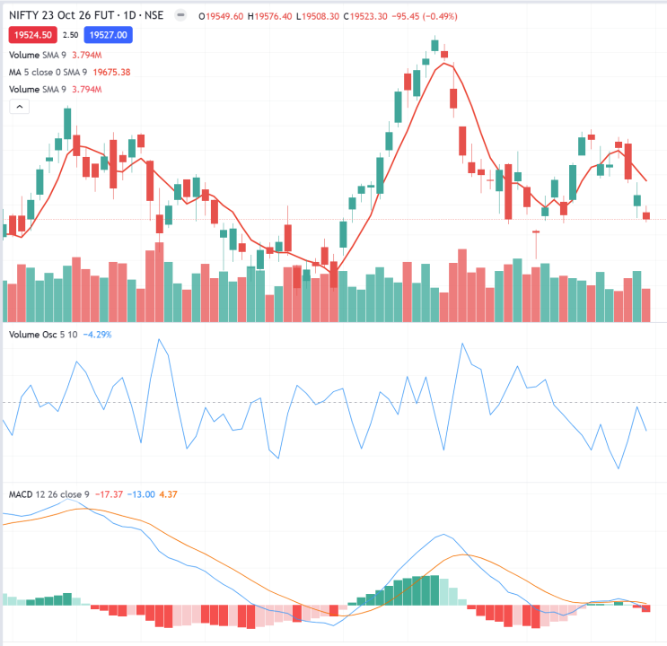

## Table of Contents

## What is tick-by-tick data?

Tick-by-tick data is information about the price and volume of trades in a financial market, recorded every time a trade happens. This means that instead of just seeing the price at the end of the day or hour, you get to see every single trade as it occurs. This kind of data is very detailed and can show you exactly how the price of a stock or other financial product changes from one trade to the next.

This data is useful for people who want to understand the market in great detail. Traders and researchers use tick-by-tick data to study how markets move and to develop strategies for buying and selling. Because it captures every trade, it can help them see patterns and trends that might not be obvious when looking at less detailed data.

## How is tick-by-tick data different from other types of financial data?

Tick-by-tick data is different from other types of financial data because it records every single trade that happens in the market. Most other types of data, like daily or hourly data, only show you the price at certain times, like the end of the day or hour. With tick-by-tick data, you can see the exact price and how much was traded every time a trade happens. This makes it much more detailed than other data that might just give you a summary of what happened over a longer period.

Because tick-by-tick data is so detailed, it helps people see things in the market that they might miss with less detailed data. For example, it can show small changes in price that happen quickly, which might be important for understanding how the market works. Other types of data, like daily closing prices, can hide these quick changes because they only show you what happened at the end of the day. So, tick-by-tick data is really useful for people who need to understand the market very closely, like traders and researchers.

## What are the common sources of tick-by-tick data?

Tick-by-tick data usually comes from stock exchanges, like the New York Stock Exchange or NASDAQ. These exchanges record every trade that happens on their platforms and often sell this data to companies that need it. Financial data providers, like Bloomberg or Reuters, buy this data from the exchanges and then sell it to traders, researchers, and other people who need detailed information about the market.

Another common source of tick-by-tick data is electronic trading platforms. These platforms, like those used for [forex](/wiki/forex-system) trading, also record every trade and can provide this data to users. Sometimes, big investment banks and financial institutions also collect their own tick-by-tick data from their trading activities and might share it with others or use it internally for their own analysis.

Overall, the main sources of tick-by-tick data are the places where trading happens, like exchanges and electronic platforms, and the companies that gather and sell this data, like financial data providers.

## How can tick-by-tick data be used in financial analysis?

Tick-by-tick data can be very helpful in financial analysis because it shows every single trade that happens. This lets analysts see exactly how prices move from one trade to the next. For example, they can look at the data to find patterns in how prices change. They might see that prices often go up quickly after a big trade, or they might notice that small trades happen a lot right before the market closes. By understanding these patterns, analysts can make better guesses about what might happen in the market next.

Another way tick-by-tick data is used is to test trading strategies. Traders can use this detailed data to see how their ideas would have worked in the past. For example, if a trader has a rule about buying when the price goes up a certain amount, they can use tick-by-tick data to see if following that rule would have made money. This helps them decide if their strategy is good or if they need to change it. Overall, tick-by-tick data gives a very close look at the market, which can help people make smarter decisions about buying and selling.

## What are the challenges of collecting and storing tick-by-tick data?

Collecting and storing tick-by-tick data can be hard because it's a lot of information. Every trade that happens in the market gets recorded, and this happens very fast, sometimes thousands of times a second. This means you need special computers and software that can handle all this data coming in so quickly. If your system isn't fast enough, you might miss some trades or the data might get mixed up. Also, it can be expensive to set up and keep running these systems because they need to be really good at dealing with so much information.

Once you collect the data, storing it is another challenge. Tick-by-tick data takes up a lot of space because it's so detailed. You need a lot of storage to keep all the trades recorded over time, and this can get very expensive. Plus, you have to make sure the data is safe and can be found easily when you need it. This means you need good systems for organizing and protecting the data. Keeping everything working well and making sure the data stays accurate and useful can be a big job.

## How does tick-by-tick data impact trading strategies?

Tick-by-tick data can really change how people trade because it shows every single trade that happens. Traders can use this data to see how prices move in tiny steps, which helps them make better decisions. For example, if a trader notices that prices often go up after a big trade, they might decide to buy right after they see a big trade happen. This kind of detailed information lets traders be more exact with their strategies, trying to take advantage of small changes in the market that they might miss with less detailed data.

But using tick-by-tick data also means traders have to be quick and have good computers. The data comes in very fast, and if a trader's computer is slow, they might miss important trades or not be able to act fast enough. This can make it harder to follow a strategy that depends on seeing every trade. Also, because the data is so detailed, traders need to be careful not to get overwhelmed by all the information and lose sight of their main goals. So, while tick-by-tick data can help traders make smarter moves, it also brings new challenges that they need to handle carefully.

## What tools and technologies are used to analyze tick-by-tick data?

To analyze tick-by-tick data, people use special software and computers that can handle a lot of information quickly. One common tool is high-frequency trading platforms, which are designed to process and analyze trades as they happen. These platforms use algorithms to look at the data and find patterns or signals that can help with trading decisions. Another important tool is data visualization software, which helps turn the detailed numbers into charts and graphs that are easier to understand. This makes it simpler for traders and analysts to see what's happening in the market.

Another technology used is big data analytics tools, like Hadoop or Apache Spark. These tools are good at storing and processing large amounts of data, which is exactly what you need for tick-by-tick information. They help analysts run complex calculations and find trends that might be hard to see otherwise. Also, [machine learning](/wiki/machine-learning) and [artificial intelligence](/wiki/ai-artificial-intelligence) are becoming more popular for analyzing tick-by-tick data. These technologies can learn from the data and make predictions about what might happen next in the market, which can be a big help for traders trying to make smart moves.

## How can one ensure the quality and accuracy of tick-by-tick data?

Ensuring the quality and accuracy of tick-by-tick data starts with getting it from reliable sources like stock exchanges or trusted financial data providers. These sources have systems in place to record every trade accurately. It's important to check that the data you receive matches what's happening in the market. This can be done by comparing the data with other sources or by using software that can spot errors or missing trades. Also, keeping the data secure and making sure no one can change it is crucial, so using strong security measures and keeping good records helps maintain its accuracy.

Once you have the data, using good tools to clean and check it is important. Data cleaning tools can help fix mistakes, like wrong numbers or missing trades, by looking for patterns that don't make sense. Regular checks and audits can also help keep the data accurate over time. It's a good idea to have a process in place for reviewing the data often and making sure everything looks right. By being careful about where the data comes from and how it's handled, you can make sure the tick-by-tick data you use is as accurate and useful as possible.

## What are the regulatory considerations when using tick-by-tick data?

When using tick-by-tick data, there are rules that companies need to follow. These rules are made by groups like the Securities and Exchange Commission (SEC) in the United States or the Financial Conduct Authority (FCA) in the United Kingdom. They want to make sure that the data is used fairly and that no one is cheating. Companies have to be careful about how they collect, store, and share this data. They also need to make sure they're not using the data to do things that might hurt the market or other traders.

Another thing to think about is privacy and data protection laws. These laws, like the General Data Protection Regulation (GDPR) in Europe, say that companies need to keep personal information safe. Even though tick-by-tick data is mostly about trades, it can sometimes include information about people. So, companies need to make sure they're not breaking any privacy rules when they use this data. Keeping everything legal and fair helps make sure the market works well for everyone.

## How does tick-by-tick data contribute to market microstructure research?

Tick-by-tick data is really important for market microstructure research because it shows every single trade that happens in the market. This lets researchers see exactly how prices move from one trade to the next. They can study things like how quickly prices change, how big trades affect the market, and how different traders behave. By looking at this detailed data, researchers can learn a lot about how the market works at a very small level, which helps them understand bigger patterns and trends.

Using tick-by-tick data, researchers can also test theories about how markets work. For example, they might want to see if big trades really do cause prices to move more than small trades. With this data, they can look at every trade and see if their ideas hold up. This kind of research helps make markets better and fairer by showing where rules might need to change or where new tools could help traders. Overall, tick-by-tick data is a key tool for understanding the tiny details that make up the big picture of the market.

## What advanced statistical methods are applied to tick-by-tick data?

Advanced statistical methods are used to make sense of tick-by-tick data because it's so detailed and comes in so fast. One common method is time series analysis, which looks at how prices change over time. This helps researchers see patterns and predict what might happen next. Another method is regression analysis, which can show how different things, like the size of a trade or the time of day, affect prices. These methods help break down the data into parts that are easier to understand and use.

Another important method is machine learning, which uses computers to learn from the data and find patterns that might be hard for people to see. For example, machine learning can help find out if certain kinds of trades are more likely to happen at certain times or if they lead to big price changes. Also, high-frequency data analysis is used to look at the data as it comes in, helping traders make quick decisions. These advanced methods help turn the huge amount of tick-by-tick data into useful information that can guide trading and research.

## How can machine learning enhance the analysis of tick-by-tick data?

Machine learning can make analyzing tick-by-tick data a lot easier and more accurate. It can look at all the trades that happen and find patterns that might be hard for people to see. For example, machine learning can learn that certain kinds of trades often happen at certain times of the day or that big trades usually lead to big price changes. By finding these patterns, machine learning can help traders and researchers make better guesses about what might happen next in the market. This can be a big help for making smart trading decisions or understanding how the market works.

Another way machine learning helps is by dealing with the huge amount of data that comes with tick-by-tick information. It can quickly process all the trades and find important information without getting overwhelmed. This means traders can get useful insights faster and more accurately than if they tried to do it all by themselves. Overall, machine learning makes it easier to turn the detailed and fast-moving tick-by-tick data into something that can be used to make better choices in the market.

## References & Further Reading

[1]: Tsang, E. P. K., Cheng, D., & Jin, N. (2012). ["Optimal Pivot Points for Algorithmic Trading Strategies."](https://pubmed.ncbi.nlm.nih.gov/16091557/) In Journal of Real-Time Image Processing.

[2]: Aldridge, I. (2010). ["High-Frequency Trading: A Practical Guide to Algorithmic Strategies and Trading Systems."](https://www.ahmetbeyefendi.com/wp-content/uploads/2020/07/High-Frequency-Trading-Irene-Aldridge.pdf) John Wiley & Sons.

[3]: Lopez de Prado, M. (2018). ["Advances in Financial Machine Learning."](https://www.amazon.com/Advances-Financial-Machine-Learning-Marcos/dp/1119482089) Wiley.

[4]: Kissell, R. (Ed.). (2014). ["The Science of Algorithmic Trading and Portfolio Management."](https://www.sciencedirect.com/book/9780124016897/the-science-of-algorithmic-trading-and-portfolio-management) Academic Press.

[5]: Chan, E. (2009). ["Quantitative Trading: How to Build Your Own Algorithmic Trading Business."](https://github.com/ftvision/quant_trading_echan_book) John Wiley & Sons.

[6]: Jansen, S. (2020). ["Machine Learning for Algorithmic Trading."](https://github.com/stefan-jansen/machine-learning-for-trading) Packt Publishing.