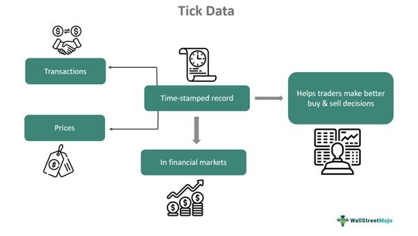

Tick data plays a crucial role in algorithmic trading, offering a detailed and granular view of financial markets. This data captures every executed trade and subsequent price movement of an asset, providing traders with near-instantaneous insights into market dynamics. Its importance is underscored by its ability to facilitate high-frequency trading (HFT), where trades are made at rapid speeds to exploit small price discrepancies. In such an environment, the real-time decision-making capability afforded by tick data is invaluable.

High-frequency trading algorithms depend heavily on the precision and timeliness of tick data to make profitable trades. Through the use of sophisticated analytical techniques, these algorithms are able to identify fleeting market opportunities that occur within fractions of a second. The granular nature of tick data allows traders to develop diverse algorithmic trading strategies, including scalping, market making, and arbitrage, by optimizing the timing of trade entries and exits.



In this article, we aim to explore the different methods involved in managing and analyzing tick data. Efficient processing requires advanced technology to ensure secure and rapid data transfer. Technologies like fiber optic cables and microwave transmission channels are employed to minimize data latency, while encryption techniques maintain data security during transmission.

Furthermore, integrating tick data into trading systems presents challenges such as managing data irregularities and ensuring consistency. Solutions to these challenges involve deploying robust data storage systems and sophisticated computational tools to analyze the large volumes of data generated. This guide intends to be a comprehensive resource for traders and developers who seek to harness the power of tick data in their trading operations, offering insights into overcoming the common challenges associated with this intricate data form.

## Table of Contents

## Understanding Tick Data

Tick data represents the most granular level of financial market data, recording every executed trade and every price fluctuation of an asset in real-time. This comprehensive data captures essential market dynamics, allowing traders to analyze each tick—the smallest measurable price movement. In high-frequency trading ([HFT](/wiki/high-frequency-trading-strategies)), where executing trades within nanoseconds can be crucial, tick data is indispensable due to the precision and immediacy it offers.

At its core, tick data encapsulates minute-by-minute shifts in supply and demand by documenting each transaction along with its price and [volume](/wiki/volume-trading-strategy) details. This real-time data stream provides traders with the ability to observe market [liquidity](/wiki/liquidity-risk-premium) and price trends at a very detailed level, enabling them to react swiftly to opportunities or risks. The importance of tick data comes from its ability to reveal micro-fluctuations in the market, which can inform the development of trading strategies tailored to capitalize on transient market conditions.

For example, consider a scenario where a trader is using an algorithm to execute a [scalping](/wiki/gamma-scalping) strategy—aimed at profiting from small price changes over short periods. Tick data is fundamental to such a strategy because it allows for precise entry and [exit](/wiki/exit-strategy) points. The trader’s algorithm scrutinizes the stream of tick data to identify favorable moments to place trades, balancing the potential gains from price micro-movements against transaction costs and market conditions.

In addition to its immediate applications, understanding tick data is crucial for [backtesting](/wiki/backtesting) and refining trading algorithms. By analyzing historical tick data, traders can simulate how their strategies would perform across different market conditions, thereby enhancing their models. This demands a robust infrastructure capable of efficiently processing and storing vast amounts of tick data, as the volume and granularity of this information can be overwhelming without proper computational resources and data management solutions.

Overall, the accurate and detailed nature of tick data makes it a pivotal asset in crafting high-performance [algorithmic trading](/wiki/algorithmic-trading) strategies that seek to leverage every nuance of market microstructure.

## Leveraging Tick Data in Algo Trading

Algorithmic trading strategies depend significantly on the precision and immediacy provided by tick data to seize market opportunities. High-frequency trading (HFT) algorithms specifically leverage this data to conduct rapid analyses and execute profitable trades by dissecting emergent price patterns. The unique, granular insights offered by tick data are instrumental in fortifying trading strategies such as scalping, [market making](/wiki/market-making), and statistical [arbitrage](/wiki/arbitrage).

Scalping strategies benefit immensely from tick data as they aim to exploit small price gaps created by order flows or spreads. The high granularity of tick data enables the trader or algorithm to identify and react to these micro-movements with enhanced precision, optimizing the timing of trade entries and exits to capture minimal yet frequent profits.

Similarly, market making strategies, which involve quoting both a buy and a sell price to benefit from the spread, also make extensive use of tick data. By continuously analyzing tick-by-tick movements, market makers can adjust their quotes dynamically, ensuring they remain competitive in the market while managing risk exposure.

Statistical arbitrage, which seeks to take advantage of price discrepancies between correlated financial instruments, utilizes tick data to accurately model and predict the convergence of price movements. By calculating statistical measures in real time, algorithms can accurately forecast deviations and identify profitable arbitrage opportunities.

To effectively exploit tick data, algorithms frequently adapt their trading models and refine them to ensure optimal performance. This involves leveraging [machine learning](/wiki/machine-learning) techniques and statistical algorithms to model market behavior and forecast potential trade opportunities. Python libraries such as NumPy and pandas are often used to handle intraday tick data efficiently, allowing for the computation of [volatility](/wiki/volatility-trading-strategies) measures or the development of predictive algorithms.

In this context, a typical example might involve using a moving average crossover strategy, where the crossover of short-term and long-term moving averages signals a potential buy or sell opportunity:

```python
import pandas as pd

# Assuming 'data' is a DataFrame with tick data including 'price' and 'timestamp'
# Calculate short and long term moving averages
data['short_ma'] = data['price'].rolling(window=20).mean()
data['long_ma'] = data['price'].rolling(window=50).mean()

# Generate signals
data['signal'] = 0
data.loc[data['short_ma'] > data['long_ma'], 'signal'] = 1
data.loc[data['short_ma'] < data['long_ma'], 'signal'] = -1

# Use signals to make trading decisions
trading_actions = data['signal'].diff()
```

Through these methodologies, tick data assists traders and algorithms in refining and tailoring their strategies, optimizing not only the timing but also the accuracy of trade executions to maximize returns. This strategic use underscores the critical role of tick data in the success of algorithmic trading systems.

## Data Transfer and Security in Tick Data

The rapid transmission of tick data is critical for maintaining the efficiency and effectiveness of algorithmic trading strategies, particularly in high-frequency trading (HFT) environments. To achieve the necessary speed and reliability, firms employ various communication technologies. Fiber optic cables are the backbone of modern data networks, offering high-speed and high-capacity data transmission with minimal latency. They [carry](/wiki/carry-trading) light pulses that represent data over long distances with little signal degradation, making them ideal for connecting data centers and trading venues.

Microwave transmission is another technology used to reduce latency. By transmitting data through the atmosphere rather than through fiber, microwave networks can offer faster paths over shorter distances. This is particularly valuable in trading scenarios where milliseconds can determine the profitability of a trade. Co-location services further enhance data transmission speeds by allowing trading firms to place their servers in close proximity to exchange servers. This reduces the physical distance data must travel, effectively minimizing latency and allowing for quicker trade execution.

Security is a major concern in the transmission of tick data. Encryption is employed to protect data integrity and confidentiality during transmission, safeguarding against unauthorized interception and access. Advanced encryption standards ensure that data remains confidential and unaltered throughout its journey across networks.

To mitigate the risk of data loss or delays due to technical failures, firms often establish redundant data feeds. These systems duplicate data pathways, providing backup routes for data to ensure continuous flow even if one link is compromised or experiences technical issues. This redundancy is vital for maintaining uninterrupted access to tick data, which is essential for time-sensitive trading decisions.

Overall, the technologies and strategies employed in the transmission and security of tick data underscore the importance of infrastructure in high-speed trading environments, where precision, speed, and reliability are paramount.

## Analyzing and Processing Tick Data

Processing large volumes of tick data necessitates high computational power and sophisticated data analysis techniques. The analysis of tick data is paramount for traders aiming to interpret market trends and capture trading signals effectively. Leveraging time series analysis, tick data provides insights into the sequence of trade prices and volumes that occur over time. Time series models, such as the Autoregressive Integrated Moving Average (ARIMA), are often employed to predict future price movements based on past behavior, enhancing the decision-making process.

Mathematical modeling is another crucial component in tick data analysis. By applying statistical and quantitative methods, traders and analysts can develop models that forecast price movements and identify potential trading opportunities. Techniques like regression analysis and machine learning algorithms can uncover hidden patterns and correlations within the data, offering a deeper understanding of market dynamics.

Volatility assessment is integral when working with tick data, as it quantifies the market's unpredictability and helps estimate the risk associated with trading decisions. Metrics such as the standard deviation of returns or the Exponentially Weighted Moving Average (EWMA) provide insights into price fluctuations and inform risk management strategies. These assessments enable traders to adjust their strategies in response to changing market conditions.

Efficient storage and retrieval systems are essential for managing tick data. Due to its high granularity, tick data generates massive volumes that require organized storage solutions. Technologies like NoSQL databases and data warehousing support the storage of large data sets while ensuring quick retrieval for analysis. Access to historical tick data records is crucial for traders who wish to backtest strategies and verify their effectiveness before deploying them in live trading environments.

Despite these advancements, traders face challenges in managing data irregularities and ensuring data quality. Tick data can suffer from gaps, outliers, and inaccurate data points resulting from misreported trades or system errors. Implementing data cleaning techniques, such as filtering out anomalies and filling data gaps, is essential for maintaining the reliability of analyses. Ensuring data quality through validation processes enhances the precision of trading models and instills confidence in the generated insights.

In summary, analyzing and processing tick data requires a combination of robust computational resources, advanced analytical models, and efficient data management systems. By addressing the challenges associated with data irregularities and quality, traders can unlock the full potential of tick data for informed and profitable trading decisions.

## Conclusion

Tick data serves as a crucial element in the toolkit of algorithmic traders, facilitating precise and timely decision-making in financial markets. Its unparalleled granularity allows traders to exploit even the smallest market movements to secure profitable trades. This capability is particularly valuable in high-frequency trading (HFT) environments, where rapid decision-making is essential.

Effectively utilizing tick data provides traders with a competitive advantage by facilitating the identification of micro-movements in asset prices. These micro-movements, though often overlooked in broader data sets, can reveal fleeting opportunities for profit that are critical to successful trading strategies like scalping and market making. By analyzing each trade's minute details, traders can refine their strategies to optimize trade entries and exits, thus maximizing returns.

The process of handling tick data involves several complexities, from ensuring its secure and rapid transmission to conducting comprehensive analyses. Robust HFT infrastructure is therefore indispensable. This infrastructure must support low-latency data transmission through technologies such as fiber optics and microwave links to ensure that traders receive data almost instantly. Furthermore, safeguarding data integrity during transmission with encryption techniques is necessary to prevent unauthorized access and data breaches.

An organization's ability to strategically incorporate tick data into its algorithmic trading operations can significantly enhance strategy development and lead to superior trading outcomes. By leveraging advanced processing techniques and infrastructure, traders can efficiently manage the vast volumes of tick data generated in real-time, ensuring data quality and reliability for analyzing and backtesting trading models. Through this structured approach, tick data not only supports existing strategies but also assists in formulating new, more effective trading strategies that are essential for thriving in today's competitive markets.

## Frequently Asked Questions (FAQs)

### What is tick data and why is it crucial for algo trading?
Tick data represents the most granular level of data in financial markets, recording each change in price and every trade that occurs for an asset. It is crucial for algorithmic trading as it provides intricate details of market movements, allowing traders to analyze and respond to micro-changes in market conditions. This fine-grained data is indispensable for creating strategies that capitalize on rapid price movements, enabling precise trade execution and enhancing potential profitability.

### How do high-frequency trading systems utilize tick data?
High-frequency trading (HFT) systems exploit tick data by making quick decisions based on the real-time flow of market information. HFT algorithms analyze tick data to detect fleeting patterns and arbitrage opportunities that occur in microseconds. By reacting swiftly to these signals, HFT systems execute large volumes of trades at speeds unattainable by human traders, thereby capturing minuscule profits that add up significantly over time.

### What technologies are used to ensure secure and rapid tick data transmission?
The transmission of tick data relies on technologies that ensure both speed and security. Fiber optic cables and microwave transmissions are commonly used to achieve low-latency communications, crucial for timely data delivery to trading platforms. Co-location services, where traders’ servers are placed near exchange data centers, further reduce latency. Security protocols, including data encryption, are essential to safeguard tick data from unauthorized access, ensuring data integrity during transmission. Additionally, redundant systems are often implemented to prevent data loss and maintain continuous data flow.

### What are the challenges associated with processing large volumes of tick data?
Processing large volumes of tick data presents several challenges. Firstly, the sheer volume of data demands substantial computational resources and high-performance storage solutions to handle real-time data analysis efficiently. Ensuring data quality is another critical challenge, involving the detection and correction of anomalies in the dataset, such as data irregularities or missing data points. Effective data management strategies, including indexing and compression techniques, are also necessary to optimize retrieval and analysis processes, enabling traders to perform reliable backtesting and strategy development.

### How does tick data enhance the performance of algorithmic trading strategies such as scalping and market making?
Tick data significantly enhances the performance of trading strategies like scalping and market making by providing a detailed view of market conditions. In scalping, traders capitalize on small price gaps created by order flows or spreads, and the granular tick data allows them to identify and exploit these gaps with greater precision. For market makers, tick data enables the continuous assessment of supply and demand, helping them to set more accurate bid-ask spreads and managing inventory more effectively. This detailed level of data supports the fine-tuning of algorithmic strategies, leading to optimized entry and exit points and improved profitability.

## References & Further Reading

[1]: Bergstra, J., Bardenet, R., Bengio, Y., & Kégl, B. (2011). ["Algorithms for Hyper-Parameter Optimization."](https://papers.nips.cc/paper/4443-algorithms-for-hyper-parameter-optimization) Advances in Neural Information Processing Systems 24.

[2]: ["Advances in Financial Machine Learning"](https://www.amazon.com/Advances-Financial-Machine-Learning-Marcos/dp/1119482089) by Marcos Lopez de Prado

[3]: ["Evidence-Based Technical Analysis: Applying the Scientific Method and Statistical Inference to Trading Signals"](https://www.amazon.com/Evidence-Based-Technical-Analysis-Scientific-Statistical/dp/0470008741) by David Aronson

[4]: ["Machine Learning for Algorithmic Trading"](https://github.com/stefan-jansen/machine-learning-for-trading) by Stefan Jansen

[5]: ["Quantitative Trading: How to Build Your Own Algorithmic Trading Business"](https://books.google.com/books/about/Quantitative_Trading.html?id=j70yEAAAQBAJ) by Ernest P. Chan