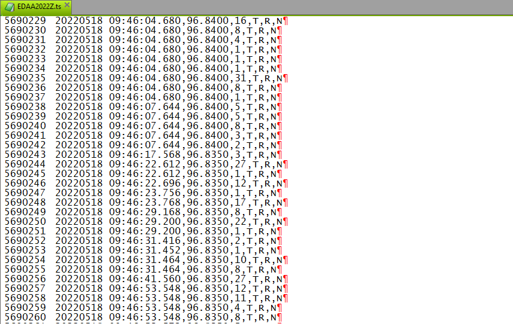

## Table of Contents

## What is tick data?

Tick data is information about the prices at which a stock or other financial instrument is bought and sold. It shows every single trade that happens, including the price and the time it happened. This data is very detailed and is used by people who want to understand the market better.

People like traders and analysts use tick data to see how the price of a stock changes throughout the day. It helps them make decisions about when to buy or sell. Because tick data is so detailed, it can be hard to work with, but it gives a lot of useful information about what is happening in the market.

## How is tick data different from other types of financial data?

Tick data is different from other types of financial data because it shows every single trade that happens for a stock or financial instrument. This means it includes the exact price and time of each trade, making it very detailed. Other types of financial data, like daily or weekly price data, only show the opening, closing, highest, and lowest prices for a certain period. So, tick data gives you a much closer look at what's happening in the market moment by moment.

Another way tick data differs is in how it's used. Because it's so detailed, tick data is often used by traders who need to make quick decisions based on the latest market movements. They can see patterns and trends that might not be clear with less detailed data. On the other hand, data like monthly or yearly summaries are more useful for long-term investors who are looking at bigger trends over time. So, the choice between tick data and other types of financial data depends on what kind of information someone needs and how quickly they need to act on it.

## Why is tick data important for traders and analysts?

Tick data is important for traders and analysts because it gives them a very detailed view of what's happening in the market. It shows every single trade, including the price and the exact time it happened. This means traders can see how the price of a stock is moving moment by moment. They can spot patterns and trends that might not be clear if they only looked at daily or weekly data. This helps them make better decisions about when to buy or sell.

Analysts also use tick data to understand the market better. They can study how different events affect the price of a stock throughout the day. This detailed information helps them make more accurate predictions about future price movements. Because tick data is so detailed, it can be hard to work with, but it gives analysts a lot of useful information that they can't get from less detailed data.

## Where can one obtain tick data?

You can get tick data from stock exchanges, like the New York Stock Exchange or NASDAQ. These exchanges collect all the trade information and sometimes sell it to people who want it. There are also companies that gather tick data from different places and then sell it to traders and analysts. These companies make it easier for people to get the data they need without having to go to each exchange separately.

Another place to get tick data is from financial data providers. Companies like Bloomberg, Reuters, and others collect and sell detailed market data, including tick data. They often have special services and tools that help people use the data more easily. Sometimes, you can also find free tick data from certain websites or through open-source projects, but it might not be as complete or up-to-date as the data you can buy.

## What are the common formats for storing tick data?

Tick data is often stored in two main formats: CSV (Comma-Separated Values) and binary formats. CSV files are easy to read and use because they are just text files where each line represents a trade, and the different pieces of information like time, price, and volume are separated by commas. This makes it simple for people to open and look at the data using programs like Excel or other spreadsheet software.

Binary formats, on the other hand, are more compact and faster for computers to read and write. They store the data in a way that is not easy for people to read directly, but they can be very useful for big sets of data because they take up less space and can be processed more quickly. Some common binary formats for tick data include HDF5 and Parquet, which are designed to handle large amounts of data efficiently.

## How can tick data be used to analyze market trends?

Tick data can help people see what's happening in the market very closely. By looking at every single trade, traders and analysts can spot patterns that might not show up in daily or weekly data. For example, they can see if a stock's price goes up or down quickly because of a lot of buying or selling. This can help them understand what's causing the price to change and predict what might happen next.

Another way tick data is useful is by showing how the market reacts to news or events. If something important happens, like a company announcing good or bad news, tick data can show how the stock's price changes right away. This helps traders and analysts see how sensitive the market is to different kinds of news. By studying these reactions over time, they can make better guesses about how the market might move in the future.

## What are the challenges associated with handling large volumes of tick data?

Handling large volumes of tick data can be really hard because there is so much information to keep track of. Every single trade for a stock or financial instrument gets recorded, and this can mean millions of data points every day. This makes the data files very big, and it can be tough to store all of this information. Computers need a lot of space to keep all the data, and it can take a long time to save and load it.

Another challenge is making the data easy to use. Because tick data is so detailed, it can be hard to find the important information quickly. People need special software and tools to sort through the data and see the patterns and trends they need. This software has to be fast and able to handle a lot of data at once. If it's not, it can slow down the whole process of analyzing the market and making decisions.

## How does tick data contribute to high-frequency trading strategies?

Tick data is super important for high-frequency trading because it shows every single trade that happens, giving traders a really close look at how prices are changing. High-frequency traders use computers to buy and sell stocks very quickly, and they need to know what's happening in the market right now. With tick data, they can see small changes in price and react to them almost instantly. This helps them make money by taking advantage of tiny price movements that might only last for a few seconds.

Using tick data also helps high-frequency traders spot patterns and trends that other people might miss. They can see if a lot of people are buying or selling a stock at the same time, which can tell them if the price might go up or down soon. By understanding these patterns, they can make better decisions about when to trade. This kind of detailed information is what makes high-frequency trading possible and helps traders stay ahead in a fast-moving market.

## What are the best practices for cleaning and preprocessing tick data?

Cleaning and preprocessing tick data is important to make sure it's accurate and easy to use. First, you need to check for any mistakes or missing information in the data. Sometimes, trades can be recorded wrong or not at all, so you have to find and fix these problems. You might need to remove any trades that don't make sense or fill in missing data with the best guess you can make. This helps make sure the data you're working with is as correct as possible.

Next, you should organize the data in a way that's easy to work with. This means putting the trades in the right order by time and making sure all the information is in the same format. You might need to change the way dates and times are written or convert prices to the same type of number. This makes it easier to analyze the data later. Also, if you have a lot of data, you might want to break it into smaller pieces or summarize it to make it easier to handle. By doing these things, you can make sure your tick data is ready to use for trading or analysis.

## How can one ensure the accuracy and integrity of tick data?

To make sure tick data is accurate and trustworthy, you need to check it carefully for any mistakes or missing information. Sometimes, trades can be recorded wrong or not at all, so you have to find and fix these problems. You might need to remove any trades that don't make sense or fill in missing data with the best guess you can make. This helps make sure the data you're working with is as correct as possible. It's also important to use data from reliable sources, like official stock exchanges or trusted data providers, to reduce the chance of errors.

Once you have checked the data, you should organize it in a way that's easy to work with. This means putting the trades in the right order by time and making sure all the information is in the same format. You might need to change the way dates and times are written or convert prices to the same type of number. This makes it easier to analyze the data later. Also, keeping a record of any changes you make to the data can help you track what you've done and make sure the data stays accurate. By doing these things, you can trust that your tick data is ready to use for trading or analysis.

## What advanced statistical techniques can be applied to tick data for predictive modeling?

Advanced statistical techniques can help traders and analysts predict what might happen in the market by looking at tick data. One technique is called time series analysis, which looks at how the price of a stock changes over time. By using this, people can find patterns and trends in the data that can help them guess what the price might do next. Another technique is machine learning, where computers learn from the data to make predictions. For example, a machine learning model can look at lots of past trades to figure out what might happen in the future. These methods need a lot of data and powerful computers, but they can give traders a big advantage.

Another useful technique is called regression analysis, which helps find relationships between different pieces of data. For example, it can show how the price of a stock might be affected by things like the time of day or the volume of trades. By understanding these relationships, traders can make better predictions about how the market might move. Also, techniques like volatility modeling can help traders understand how much the price of a stock might change. This is important because knowing how much a stock's price might go up or down can help traders decide when to buy or sell. By using these advanced techniques, traders can get a better idea of what might happen in the market and make smarter decisions.

## How does tick data integration with machine learning enhance trading algorithms?

Tick data integration with machine learning helps make trading algorithms better by giving them a lot of detailed information to learn from. Every single trade is recorded in tick data, so machine learning models can look at all these trades to find patterns and trends that might not be easy to see otherwise. This means the algorithms can learn how the market moves and make better guesses about what might happen next. By using tick data, the models can also react quickly to changes in the market, which is really important for traders who need to make fast decisions.

Using tick data with machine learning also helps trading algorithms adapt to new situations. The market is always changing, and what worked yesterday might not work today. But with tick data, machine learning models can keep learning from new trades and adjust their predictions. This makes the algorithms more flexible and able to handle different market conditions. Overall, combining tick data with machine learning helps traders make smarter and quicker decisions, which can lead to better results in trading.

## References & Further Reading

[1]: Bergstra, J., Bardenet, R., Bengio, Y., & Kégl, B. (2011). ["Algorithms for Hyper-Parameter Optimization."](https://papers.nips.cc/paper/4443-algorithms-for-hyper-parameter-optimization) Advances in Neural Information Processing Systems 24.

[2]: ["Advances in Financial Machine Learning"](https://www.amazon.com/Advances-Financial-Machine-Learning-Marcos/dp/1119482089) by Marcos Lopez de Prado

[3]: ["Evidence-Based Technical Analysis: Applying the Scientific Method and Statistical Inference to Trading Signals"](https://www.amazon.com/Evidence-Based-Technical-Analysis-Scientific-Statistical/dp/0470008741) by David Aronson

[4]: ["Machine Learning for Algorithmic Trading"](https://github.com/stefan-jansen/machine-learning-for-trading) by Stefan Jansen

[5]: ["Quantitative Trading: How to Build Your Own Algorithmic Trading Business"](https://books.google.com/books/about/Quantitative_Trading.html?id=j70yEAAAQBAJ) by Ernest P. Chan