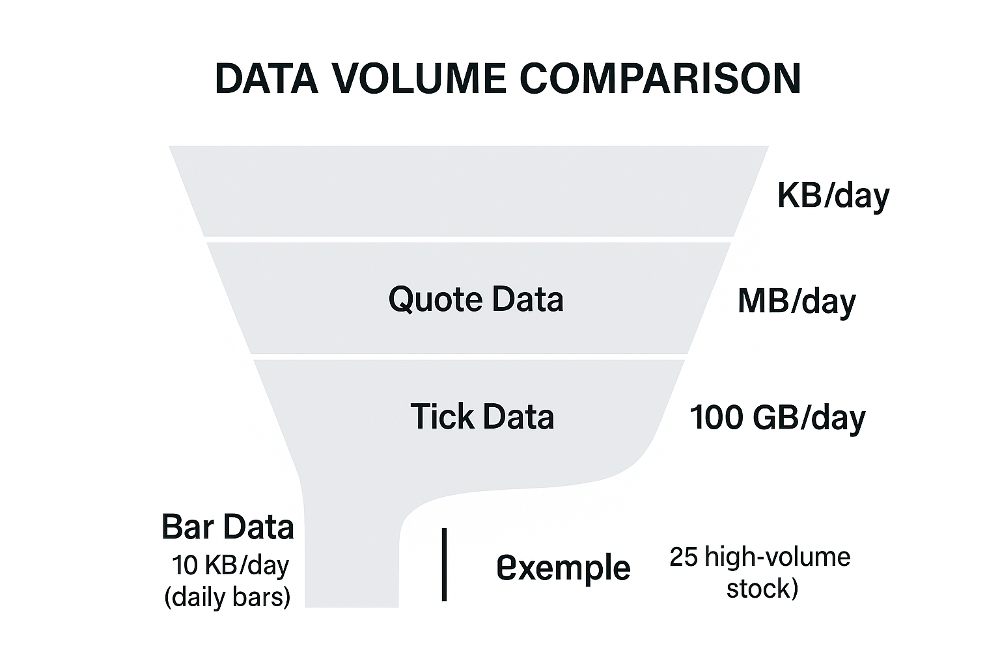

## Table of Contents


**Tick data** represents the most granular form of financial market data, capturing every single recorded event in the market. This includes each executed trade as well as changes in bid and ask quotes, all with precise timestamps. Unlike aggregated data (such as minute or daily bars that summarize activity over a fixed interval), tick data logs each event as it happens in real time. In other words, while a 1-minute OHLC bar might condense dozens of trades into one candle, tick data preserves the detail of *every* trade and quote update. This granular view is essential for **high-frequency trading (HFT)** and **market microstructure** analysis, where understanding each price movement and quote change is crucial. Traders and quants leverage tick data to gain near-instantaneous insights into market dynamics and exploit even the smallest price discrepancies.

## What is Tick Data?

Tick data refers to the **sequence of all individual market events**—most commonly trades and quote updates—recorded for a financial instrument. Each *tick* typically includes a timestamp (often with millisecond or microsecond precision), the price at which a trade occurred (or the updated bid/ask price for quotes), and the volume or size of the trade. For example, a single tick record might look like:

| Timestamp (UTC)         | Last Price | Best Bid | Best Ask | Volume (shares) |
| ----------------------- | ---------: | -------: | -------: | --------------: |
| 2025-06-02 09:30:15.123 |  **97.29** |    97.25 |    97.93 |           2,000 |

In the above example, the tick shows that at 09:30:15.123 there was a trade at \$97.29, while the best bid was \$97.25 and best ask \$97.93, with 2,000 shares traded. This would be considered a Level 1 tick (L1), meaning it captures the *top-of-book* bid/ask and last trade. Tick data can also encompass purely quote-level information even if no trade happened at that moment – for instance, whenever the best bid or ask changes, a quote tick can be recorded. In practice, **tick data** is a broad term that may include any published price data: every trade execution, every new or canceled order (for those with full order book access), or best bid/ask updates. This makes tick data **extremely detailed** and information-rich.

**Tick Data vs. Bar Data vs. Quote Data:**

In contrast to tick data’s event-by-event log, **bar data** (such as OHLCV bars) aggregates information over a time window. For example, a 1-minute bar might contain the open, high, low, and close prices for that minute, along with total volume. Bar data is easier to handle due to its fixed interval nature and smaller size, but it loses the sequence of trades within the interval. **Quote data** typically refers to the sequence of bid and ask prices (and sizes) over time. Often, “tick data” in the context of market data includes both trade ticks and quote ticks. In summary, tick data provides **tick-by-tick** detail of market activity, whereas bar data provides a summarized snapshot over intervals. As a result, tick data allows you to see **intra-bar movements** and order book changes that bar data would obscure. For instance, if a price quickly spiked up and back down within one minute, a 1-min bar might not reveal that transient jump, but tick data would show the exact sequence of trades and quotes during that volatility.

Tick data records are **irregular in time** – during busy periods there may be hundreds of ticks in a second, while in quiet periods seconds (or minutes) might pass with no new ticks. This is fundamentally different from time-bar data, which arrives at uniform intervals regardless of activity. Tick data also often separates **bid and ask** quotes: a full tick record may include the best bid and best ask at that moment, giving insight into the bid-ask spread and liquidity. In the example above, the spread was \$97.93 – \$97.25 = \$0.68 at that tick. In summary, key characteristics of tick data include:

* **Timeliness and Granularity:** Each tick has a precise timestamp, often to the millisecond or better, capturing the market’s state change by change.
* **Bid/Ask Structure:** Tick records (especially Level 1 quotes) include bid and ask prices and sizes, reflecting the current **bid-ask spread** and available liquidity at the top of the book.
* **Trade Volume:** Each trade tick shows exactly how many shares/contracts traded in that transaction (useful for volume analysis and identifying block trades).
* **Irregular Event Timing:** Events are recorded as they happen; there are no “empty” ticks when the market is inactive.
* **Massive Data Frequency:** High-volume instruments can generate an enormous number of ticks. For example, a heavily traded stock like MSFT might see on the order of 100,000 ticks in a single trading day.

## Use Cases for Tick Data in Trading and Backtesting

Because tick data provides the most **complete picture** of market behavior, it enables several important use cases in trading and quantitative analysis:

**High-Frequency Trading (HFT):**

Many HFT strategies rely on tick data for decision-making. Strategies such as **scalping**, **market making**, and statistical arbitrage operate on very short timescales and exploit tiny, short-lived inefficiencies. These algorithms process incoming tick data to identify opportunities that might last only milliseconds or seconds. The precision and immediacy of tick data is crucial – trades are often executed based on the arrival of a single tick (e.g., a quote change indicating an imbalance). Without tick-level data, these strategies would not have the reaction speed or detail needed. In fact, *high-frequency trading systems consume tick data to make split-second decisions*, leveraging the detailed order flow information to time entries and exits.

**Market Microstructure Analysis:**

Tick data is invaluable for researching how markets operate at a fundamental level. Because it includes every trade and quote, researchers can analyze **order flow, bid-ask spread dynamics, and liquidity provision** in fine detail. For example, one can study how the bid-ask spread widens or narrows around news events, or how many trades execute at the bid vs. at the ask (an indicator of buying or selling pressure). The **market microstructure** (the study of how orders interact in the order book) is best understood with tick data, since larger time bars might conceal important microstructure events. Granular data is vital for analyzing momentum ignition, order book resiliency, and short-term price impact. With tick data, one can compute metrics like realized spread, order book imbalance, or detect patterns like quote stuffing and algorithmic order flow, which are impossible to see on aggregated data.

**Backtesting Intraday Strategies with Realism:**

When backtesting trading strategies, using tick data allows for a much higher-fidelity simulation of reality. In lower-frequency backtests using only daily or minute bars, one often has to assume a simplifying execution model (e.g., assume you buy at the bar’s close price). This can be highly unrealistic for strategies that trade intraday or respond to rapid moves. By using tick data in backtesting, one can **simulate order execution more precisely** – for example, by filling orders at the actual next traded price after a signal, accounting for the bid-ask spread and market impact. This leads to more realistic performance metrics. Backtesting on tick data also enables testing of strategies that trigger based on ephemeral price moves (like a stop-loss hit within a bar, or a quick breakout that reverts). For example, a strategy might react to a sudden 0.5% drop that lasted only a second – only tick data would allow modeling that trigger and the subsequent execution. **Slippage modeling** is another benefit: by comparing the intended trade price to the actual tick price achieved, one can measure slippage on each trade and incorporate that into strategy evaluation.


**Execution Algorithms & Slippage Analysis:**

Traders and algorithmic execution systems use tick data to design and evaluate **execution algorithms** (like TWAP/VWAP or smart order routers). By replaying historical tick data, one can see how different execution strategies would have performed – e.g., would slicing an order into smaller pieces have gotten a better average price without moving the market? Tick data lets analysts measure **implementation shortfall**, examine how much price moved during execution, and calibrate **slippage** assumptions. It captures *real* market responses – for instance, if you place a large market order, tick data can show how the price moved tick-by-tick as your order walked through the order book.

**Strategy Types That Require Ticks:**

Certain strategy classes inherently need tick-level detail. For example, **order book trading strategies** (placing limit orders and hoping to get filled) require modeling the order book queue – you need tick data to backtest how often your orders would fill or get skipped. **Arbitrage strategies** between correlated instruments (like ETF vs futures, or cross-exchange crypto arbitrage) may need tick data across instruments to catch mispricings that exist for only seconds. **Event-driven strategies** that trade around announcements might use tick data to see the immediate impact of news on prices and spreads. Even some **technical analysis** metrics (like various intrabar pattern recognition or indicators based on tick volume) rely on tick data for accuracy.

In summary, any scenario where the *sequence* and *timing* of trades matter will benefit from tick data. Backtesting with tick data provides a more **accurate simulation** of live trading conditions, capturing the true market dynamics including rapid quote changes and volatile bursts. It’s especially important in **fast markets** (e.g., futures, FX, crypto) where significant moves can happen in seconds. Many practitioners note that using only bar data can paint an overly optimistic picture of strategy performance – incorporating tick data reveals the impact of **transaction costs, delays, and slippage**, often leading to more robust strategies.


## Challenges of Working with Tick Data

Despite its richness, tick data comes with significant **challenges** in handling and analysis. The very features that make it useful – high frequency and detail – also make it complex to manage:

**Enormous Data Volume:**

Tick data sets are **massive**. Storing every tick for multiple instruments over long periods can require terabytes of storage. Even a single day of tick data for one active instrument can be huge (e.g., hundreds of thousands of records). For instance, a high-volume stock can produce on the order of 100k ticks per day, and across thousands of stocks or across years of history, this becomes a big data problem. The sheer size means that reading, writing, and querying tick databases is resource-intensive. **Backtesting on tick data** can strain computational resources – it is often said that running a strategy on years of tick data on a standard PC is extremely slow or even infeasible. One algorithmic trading developer noted that backtesting with tick data for more than a few days of history may be *“impossible on any usual computer”* due to the memory and processing load.



**Processing Speed and Infrastructure:**

Because ticks arrive (and need to be processed) at a very high rate, specialized infrastructure is often required. In live trading, firms invest in high-throughput, low-latency systems (e.g., optimized in C++ or using FPGA hardware) to handle tick streams. For historical analysis, using tick data might require cluster computing or optimized databases. Simple Python loops over tick data will be **too slow**; instead, one must use vectorized operations, time-series databases, or event-driven backtesting frameworks designed for performance. Technologies like kdb+ (with its in-memory columnar design), or modern time-series databases (QuestDB, InfluxDB, etc.), are often used to store and query tick data efficiently. Even then, **I/O bottlenecks** are a concern – reading billions of records from disk can be a slow process, so data formats and compression (like Parquet, ZFP, or gzipped CSVs) and selective loading become important.

**Data Storage and Management:**

The storage format and architecture for tick data is a challenge in itself. Traditional relational databases are usually not ideal for tick data due to the volume – instead, specialized tick data stores or columnar databases are used. It’s common to partition tick data by date and symbol, and use compression and binary encoding to save space. Some firms use cloud storage for historical ticks and load only slices as needed. Designing a **tick data research environment** often involves setting up pipelines to ingest (capture) tick data, normalize it, and store it in a queryable format. Ensuring data integrity (no missing ticks, correct ordering) is also part of the challenge.

**Data Quality and Cleaning:**

**Bad ticks** (erroneous data points) are common in raw feeds. Glitches such as spikes to a price of 0, out-of-sequence timestamps, or duplicate ticks can occur due to feed errors or exchange corrections. Tick data is *“susceptible to data corruption and so must be cleaned”* before use. Cleaning tick data might involve removing or fixing obvious errors (e.g., a trade at price 0 or a huge outlier price), dealing with **out-of-order timestamps** (which can happen if data from multiple exchanges is merged), and consolidating simultaneous ticks. For example, if multiple trades occur at the exact same timestamp, one must aggregate or otherwise handle them (some backtest engines can’t process two events at the identical time stamp without logic to combine them). Another common issue is the **bid/ask bounce** – situations where the last trade price oscillates because trades print alternately at bid and ask – which can give a false impression of volatility if not understood properly. Robust analysis of tick data requires applying filters and sanity checks to avoid these pitfalls.

**Bid-Ask Spread and Order Book Considerations:**

One limitation of many historical tick data sets is that they might only include trades (trade ticks) and perhaps the top-of-book quotes. If one’s analysis needs the **full order book depth**, that is an order of magnitude more data (often called Level 2 or Level 3 data). Most exchanges do not readily provide full historical order book data because it’s so voluminous (capturing every order insert/cancel is a *huge* stream). As a result, backtesting certain strategies (like those that depend on depth beyond the best bid/ask) can be very challenging. Even understanding the true **spread** at a past moment might require knowing that moment’s best bid and ask. If your tick data consists only of trades, the spread has to be inferred indirectly or assumed. A practitioner pointed out that *trade-only tick data “won’t tell you the spread, just where trades actually executed”* – to get historical spread you need the bid/ask quotes recorded as well. Therefore, when working with tick data, one should ensure that **quote ticks** (at least best bid and ask) are included for realism. If not, one may underestimate slippage or miss the fact that no trade could have been executed between ticks due to spread.

**Computational Pitfalls in Backtesting:**

When running a tick-by-tick backtest, the logic must be carefully designed to handle the event-driven nature. Simulating strategies on tick data often means writing an event loop that processes one tick at a time in chronological order. Care must be taken to handle things like multiple signals within a short time, order latency (e.g., if you decide to trade on one tick, you might only fill on a subsequent tick), etc. The granularity of tick data can lead to **overfitting** if a model tries to use every wobble in price – hence, quants need to apply proper cross-validation and consider whether the extra detail is leading to meaningful improvements or just noise-fitting.

Despite these challenges, there are ways to mitigate the difficulties. Using efficient data structures, downsampling data for initial strategy prototyping (e.g., use 1-second bars, then go to ticks for fine-tuning), and leveraging high-performance libraries or hardware can make tick-level analysis feasible. Many modern algorithmic trading platforms provide built-in support for tick data simulation and will handle a lot of these issues (for example, handling order book mechanics or managing large data windows in memory). In summary, working with tick data requires a much greater **investment in data handling** and computational power than working with coarser data, but it rewards you with far more accurate and insightful analysis.

## Sources of Tick Data

Given the importance of tick data, a natural question is: **where can traders and researchers obtain tick data?** There are several avenues, each with pros and cons regarding cost, ease, and coverage:

**Brokerage Platforms:**

Many brokers provide access to historical tick data (or at least the ability to record it). For example, Interactive Brokers allows clients to query recent trades and quotes via its API (though often with rate limits and not the full market depth). Some trading platforms tied to brokers (like MetaTrader, cTrader, NinjaTrader, etc.) let users download or record tick data for instruments they have access to. The quality and length of history varies by broker. The advantage is that it can be free or included in the platform, but the coverage might be limited to what you can manually pull and might not be *tick-for-tick* perfect (some brokers aggregate or throttle their data feed). **Retail trading platforms** often give tick-level replay for shorter lookback periods for popular instruments.

**Exchanges:**

In many cases, you can purchase historical tick data directly from the exchange or its official data vendor. For example, the NASDAQ, NYSE, CME, and other major exchanges sell historical trades and quotes (often called **TAQ** data in equities, or depth-of-market history for futures). This data is usually very high quality and complete, but it can be **expensive**. Exchanges may charge by the amount of data or require subscriptions. For institutional traders, this is a primary source – e.g., subscribing to a *market data feed* and recording it. Some exchanges also make limited historical data publicly available (for example, cryptocurrency exchanges often provide past trade data via REST APIs for free, though usually not the full order book unless via their websocket live feed recording).

**Data Vendors:**

There are specialized third-party vendors that aggregate and clean tick data, offering it as a product. For instance, **TickData** (by OneMarketData) is a well-known vendor providing research-ready historical intraday data for equities, futures, and other asset classes. Other vendors include **Thomson Reuters (Refinitiv)** and **Bloomberg** (which provide tick data through products like Bloomberg’s B-Pipe or replay APIs), **QuantQuote**, **Nanotick**, **Polygon.io** (for equities/crypto), and **IQFeed** for real-time and historical ticks, among others. These vendors often provide data in convenient formats (CSV, Parquet, HDF5, etc.) and may also offer cloud-based access. The trade-off is cost: tick data covering many years and instruments can be pricey. However, what you get is typically **cleaned and quality-checked data**, saving substantial time on cleaning and formatting. Some vendors also supply Level 2 (order book) data for extra cost.

**Public or Academic Data Sets:**

In some cases, you can find free or low-cost tick data. For example, the **LOBSTER** data set (from a collaboration with academics) provides deep order book data for certain stocks, intended for research (for a fee, but much cheaper for academic use). Some government or regulatory agencies release data, such as the SEC’s MIDAS system data (which includes consolidated order book feeds for US equities, made available to researchers). In the crypto world, many exchanges allow full historical trade downloads. There are also community-driven repositories – for instance, Kaggle or academic websites might host sample tick data for research. Projects like Papers With Backtest may include *datasets on HuggingFace or GitHub* that contain sample tick data for demonstration purposes (e.g., crypto tick data sets, or event logs). Always ensure any data source covers the fields you need (trade vs quotes, level of depth, etc.) and is synchronized if you’re combining sources.

**Real-Time Data Capture:**

For those who need ongoing data, setting up your own capture of live ticks is an option. Using APIs or direct market feeds, a trader can record ticks to a database in real time and build their own historical archive. This requires technical know-how and reliable connectivity (especially if capturing fast feeds). The benefit is you accumulate exactly the data you need (perhaps only certain symbols) and avoid paying ongoing data fees, but the downside is you won’t have history prior to when you started recording, and you must ensure data quality yourself.

It’s worth noting that **brokers, trading platforms, and data providers are typical sources of tick-by-tick data**. Many algorithmic traders end up using a combination: for example, using free crypto exchange data for crypto markets, buying high-quality tick data for a particular futures contract they trade, and recording their own data going forward to keep it up-to-date. When evaluating a source, consider the **coverage** (which instruments and date range), **data fields** (trades only, or quotes too? any unusual fields like trade condition flags?), the **format** (and whether you need to write custom parsers), and the **cost vs. benefit**. If your strategy depends on nuances in the data, a higher-quality paid source may quickly pay for itself in better strategy performance or avoided pitfalls.

## Tick Data in Practice: Examples and Code Snippets

To illustrate how tick data is used in practice, let's look at a couple of simple examples. These examples use Python/pandas style pseudocode for clarity. In a real scenario, one might be using a specialized backtesting engine or a database query, but the concepts remain the same.

**1. Converting Tick Data to OHLC Bars:** Sometimes you may want to derive candlestick bars from tick data (for example, to compare a strategy’s behavior on tick data vs. bar data). This can be done by resampling the ticks. In pandas, for instance, if you have a DataFrame `tick_df` indexed by timestamp, you could do:

```python
# Resample tick data to 1-minute bars (OHLCV)
bars = tick_df['price'].resample('1Min').ohlc()
bars['volume'] = tick_df['volume'].resample('1Min').sum()
print(bars.head())
```

This would output a new DataFrame where each minute has an Open, High, Low, Close, and total Volume aggregated from the ticks in that minute. You could similarly resample to other intervals. This process is helpful for sanity-checking or for hybrid approaches (using tick data for execution logic but using bars for certain indicators, etc.).

**2. Simulating Trade Execution with Slippage:** A major advantage of tick data in backtesting is the ability to simulate more realistic trade executions. For example, suppose your strategy generates a buy signal at a certain timestamp. Using tick data, you can fill the order at the *next tick’s ask price*, thereby modeling the fact that you pay the spread and you cannot magically buy at the last trade price if that was a buyer-initiated trade. Here’s a simple example:

```python
signal_time = pd.Timestamp("2025-06-02 09:30:00.500000")  # strategy decided to buy at this time
# Find the first tick at or after the signal time
next_tick_index = tick_data.index.searchsorted(signal_time)
next_tick = tick_data.iloc[next_tick_index]

execution_price = next_tick['ask']  # assume we cross the spread and buy at the ask
print("Buy signal at", signal_time, "executed at ask price:", execution_price)
```

In this snippet, `tick_data` might be a DataFrame where each row is a tick with columns like 'bid', 'ask', 'price'. We find the tick immediately following the signal and take its ask price as the execution price. If we compared this to using bar data, we might have just taken the bar’s close or open, which could be significantly different. By doing this tick-level simulation, we **capture slippage** and the bid-ask spread cost in our backtest. We could extend this to simulate partial fills (if volume is limited) or waiting a few ticks if we want to simulate an aggressive limit order instead of a market order.

**3. Microstructure Analysis – Calculating Bid-Ask Spread:** Tick data allows us to analyze the spread and liquidity over time. For instance, we might want to know the average bid-ask spread during a certain period, or how often the spread was above a certain threshold (which could inform us about liquidity conditions). Using tick data with bid and ask columns:

```python
# Calculate the bid-ask spread for each tick and analyze
tick_data['spread'] = tick_data['ask'] - tick_data['bid']
avg_spread = tick_data['spread'].mean()
max_spread = tick_data['spread'].max()
print(f"Average spread: {avg_spread:.4f}, Maximum spread: {max_spread:.4f}")
```

This would give a sense of typical spread size (in whatever price units the instrument is in). One could further break this down by time of day (e.g., spreads are usually wider at market open or overnight) or by volume (maybe spread narrows when volume is high). Such analysis is important for **strategy feasibility** – e.g., a strategy that profits only 0.1% might not work in periods where the bid-ask spread itself is 0.1%. Tick data also lets you analyze metrics like *order book imbalance* (if you have Level 2 data) or the distribution of trade sizes and trade intervals.

**4. Order Book Event Analysis:** If working with Level 2 tick data (depth of book), one can analyze how the order book changes with each event. For example, you could iterate through tick-by-tick events to see how an large limit order entering the book affects price movements in subsequent ticks. While a full code example for that is complex, a simplified view might be:

```python
for tick in order_book_ticks:  # suppose each tick has details of an order book change
    if tick['type'] == 'NEW_ORDER' and tick['side'] == 'ask' and tick['size'] > LARGE_THRESHOLD:
        analyze_response(tick['price'])
```

The idea is to detect certain patterns (like large orders, or order cancellations) and measure market reaction. This is advanced analysis often done by HFT firms, but demonstrates the level of detail tick data provides.

**SEO and Accessibility Note:** When working with tick data, important keywords and concepts include **high-frequency trading**, **backtesting** (on tick data), **market microstructure**, **bid-ask spreads**, **order flow**, **tick size**, and **latency**. Understanding these terms helps contextualize the significance of tick data. From an accessibility standpoint, explaining tick data in a structured way (as we have done with headings and bullet points) helps demystify this complex topic for newcomers. It’s often useful to start with simple analogies (tick data as a detailed “video” of market trades, vs bar data as a summary “snapshot”) before diving into the technical details.

## Conclusion

Tick data is the **foundation of precise algorithmic trading analysis**. It provides an unfiltered view of the market’s every move, empowering traders to design and test strategies with a realistic understanding of price behavior, liquidity, and transaction costs. We’ve seen that tick data, compared to traditional bar data, offers unparalleled detail — essential for **HFT strategies, slippage modeling, and microstructure research**. We’ve also discussed practical challenges: the need for robust data handling and cleaning, and the computational load of processing millions or billions of ticks. With the right tools and infrastructure, however, these challenges can be managed, allowing one to unlock the full potential of tick-level information.

In practice, many successful trading operations harness tick data to gain a **competitive edge**. Whether it’s to backtest a strategy that reacts within seconds, to analyze how news impacts the order book, or to fine-tune execution to save a few basis points on each trade, tick data is indispensable. As data storage and processing technology continue to advance (and become more affordable), working with tick data is becoming more accessible even to independent traders. Platforms and libraries are emerging that handle much of the heavy lifting, from data vendors offering cleaned tick histories, to open-source time-series databases optimized for tick ingestion.

In conclusion, learning to work with tick data is a valuable investment for any algorithmic trader or quantitative researcher aiming for realism and rigor in their strategy development. It opens the door to understanding the market at the deepest level – one tick at a time – and thus to discovering trading insights that coarser data might never reveal. Armed with tick data and a solid approach to processing it, you can simulate and anticipate market behavior with a high degree of confidence, making your backtests **more predictive of real-world performance** and your trading strategies more robust.

## References & Further Reading

[1]: Bergstra, J., Bardenet, R., Bengio, Y., & Kégl, B. (2011). ["Algorithms for Hyper-Parameter Optimization."](https://papers.nips.cc/paper/4443-algorithms-for-hyper-parameter-optimization) Advances in Neural Information Processing Systems 24.

[2]: ["Advances in Financial Machine Learning"](https://www.amazon.com/Advances-Financial-Machine-Learning-Marcos/dp/1119482089) by Marcos Lopez de Prado

[3]: ["Evidence-Based Technical Analysis: Applying the Scientific Method and Statistical Inference to Trading Signals"](https://www.amazon.com/Evidence-Based-Technical-Analysis-Scientific-Statistical/dp/0470008741) by David Aronson

[4]: ["Machine Learning for Algorithmic Trading"](https://github.com/stefan-jansen/machine-learning-for-trading) by Stefan Jansen

[5]: ["Quantitative Trading: How to Build Your Own Algorithmic Trading Business"](https://books.google.com/books/about/Quantitative_Trading.html?id=j70yEAAAQBAJ) by Ernest P. Chan