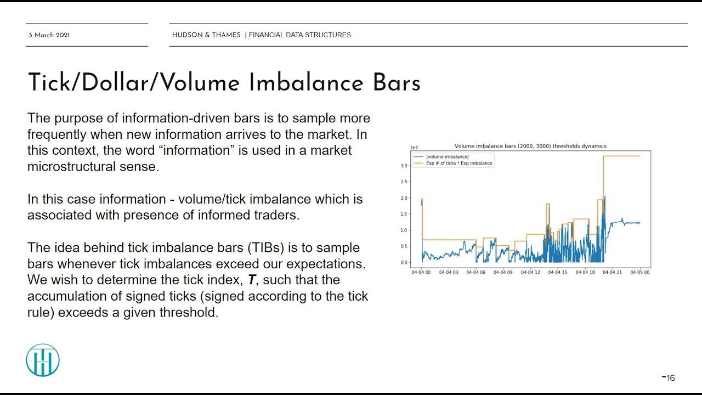

In the rapidly evolving world of algorithmic trading, new methods and tools are continually being developed to enhance both accuracy and efficiency. One such innovative tool is the use of tick imbalance bars (TIBs). TIBs provide traders with a mechanism to capture shifts in market dynamics, offering a more responsive trading perspective compared to traditional time-based bars. Unlike conventional methods that rely on fixed intervals for data sampling, TIBs adaptively sample data based on market activity, allowing for the timely recognition of significant trading patterns and trends.

This article explores tick imbalance bars as a crucial component in the toolkit of modern algorithmic trading. They serve as an advanced method to decode market signals by leveraging the frequency and direction of trades. Traditional time-based bars often fail to reflect real-time trading activities accurately, as they can either over or under-sample market events, leading to missed opportunities or misleading signals for traders.



Tick imbalance bars are constructed by evaluating the imbalance in trade directionality over a sequence of trades, usually quantified as signed ticks, which are derived from price movements between successive trades. These bars offer potential advantages over time-fixed bars by prioritizing periods of high activity where informed trading may be occurring. By doing so, TIBs highlight the presence of traders with potentially superior market information, thus serving as indicators of informed trading. Their application in algorithmic trading algorithms aids in refining entry and exit strategies based on real-time data insights.

Overall, tick imbalance bars represent a significant advancement in trading bar construction methods, aligning the sampling of market data more closely with the natural flow of informational content in the markets. This alignment provides traders with enhanced tools to discern market conditions and to take more calculated and effective trading actions.

## Table of Contents

## The Concept of Imbalance Bars

Imbalance bars, introduced by Lopez de Prado in "Advances in Financial Machine Learning," represent a novel way to sample market data, aiming to capture shifts in market dynamics that are often overlooked by traditional time-based methods. These bars are designed to adapt sampling frequency according to the intensity of informed trading activities. This approach allows traders to capitalize on new information as it becomes available, thus potentially enhancing trading accuracy and efficiency.

Imbalance bars can be constructed from different types of market data, including tick data, [volume](/wiki/volume-trading-strategy), or dollar exchanges. Tick imbalance bars are particularly focused on in this discussion. The fundamental concept involves establishing a threshold based on trade imbalances, which, when exceeded, triggers the sampling of a new bar. This mechanism ensures that bars are sampled more frequently during periods of high trading activity or significant information flow.

To generate these expectations or thresholds, specific calculations must be conducted on the trade imbalances. The threshold is dynamically adjusted based on ongoing trading activities, making the approach sensitive to shifts in market sentiment. Consequently, imbalance bars are adept at highlighting periods of informed trading, where the market is likely to react to new, potentially price-moving information.

By focusing on imbalances rather than the passage of time, these bars provide a more information-centric view of the market, allowing for a responsive and potentially more profitable trading strategy. This capability marks a significant advantage over traditional methods, which are often constrained by fixed time intervals that may not align with actual market conditions.

## Understanding Tick Imbalance

Tick imbalance is a method to quantify the directional [momentum](/wiki/momentum) of trades in a market by translating price movements into signed ticks. This process involves the tick rule, which is a simple mechanism for assigning a positive (+1) or negative (-1) value to each trade based on its price movement relative to the previous trade. If a trade's price is higher than the preceding trade, a tick of +1 is recorded, whereas a lower price results in a tick of -1. In cases where the price remains unchanged, the tick maintains the previous sign, ensuring continuity in the analysis.

The primary objective of tick imbalance is to transform a sequence of trades into a comprehensible numerical format that reflects the aggregate sentiment of market participants. By converting a series of trades into a sequence of signed ticks, traders and analysts can cumulatively sum these values to evaluate market pressure. For instance, if there is a sustained sequence of +1 ticks, this indicates bullish sentiment, with buyers potentially outweighing sellers. Conversely, a string of -1 ticks suggests bearish sentiment.

Mathematically, the cumulative sum of signed ticks over a particular period can be expressed as:

$$
\text{Cumulative Imbalance} = \sum_{i=1}^{n} \text{signed tick}_i
$$

Here, $\text{signed tick}_i$ represents the ith trade's tick value, and $n$ denotes the number of trades considered.

The significance of tick imbalance derives from its ability to uncover the underlying movements of informed traders. A higher number of ticks consistently oriented in a single direction might indicate that these traders, who typically possess superior information or strategies, are actively participating in the market. This potential information flow becomes a critical input for [algorithmic trading](/wiki/algorithmic-trading) strategies, as it may provide early signals of shifting market dynamics. By monitoring the tick imbalance, traders can infer the presence and intensity of informed trading, which is crucial for making timely decisions in fast-moving markets.

## Setting the Sampling Threshold

At the start of each tick imbalance bar, determining an appropriate sampling threshold is crucial for capturing significant market movements. This process involves predicting the expected imbalance via an exponentially weighted moving average (EWMA). The sequence of signed ticks, which indicate the direction of trade based on recent price movements, serves as the input for this estimation.

The expected imbalance, denoted as $E[I]$, is calculated using the EWMA of past imbalance values. The formula for the EWMA can be expressed as:

$$
E[I_t] = \alpha I_t + (1 - \alpha) E[I_{t-1}]
$$

where $I_t$ represents the current imbalance, $E[I_{t-1}]$ is the previously calculated expected imbalance, and $\alpha$ is the smoothing factor ranging between 0 and 1. This smoothing factor determines the weight of more recent data points compared to older ones. A higher $\alpha$ places more emphasis on recent imbalances, making the EWMA more responsive to recent market changes.

The threshold for sampling a new tick imbalance bar is then determined by multiplying this expected imbalance with the anticipated bar length, a parameter that can be adjusted based on historical data or trading preferences. This anticipated bar length effectively scales the expected imbalance, reflecting the varying market conditions and [liquidity](/wiki/liquidity-risk-premium) levels. The resulting threshold represents a level of cumulative imbalance at which a new bar should be initiated, indicating a meaningful and possibly informed trading activity.

When the cumulative sum of signed ticks exceeds this threshold, it triggers the creation of a new tick imbalance bar. This approach allows for dynamic adjustment to changing market conditions, enabling traders to respond more effectively to the information embedded within trade sequences.

## Defining Tick Imbalance Bars (TIBs)

Tick imbalance bars (TIBs) are designed to dynamically adjust and capture the true market activity by using continuous monitoring of trade imbalances. Mathematically, TIBs are generated by accumulating signed ticks until a cumulative imbalance surpasses a specific threshold. To begin with, each tick in the trade data is assigned a sign using the tick rule: a value of +1 is assigned when there is an uptick (price increase) and -1 when there is a downtick (price decrease). The sequence of these signed ticks is then cumulatively summed.

The computational process of forming a tick imbalance bar relies on a predefined threshold, denoted as $\theta$. This threshold is set based on the expected level of imbalance, typically calculated through statistical measures such as an exponentially weighted moving average (EWMA). The formula for determining the cumulative imbalance $I_t$ at each tick $t$ is as follows:

$$
I_t = \sum_{i=1}^{t} \text{sign}(\Delta P_i)
$$

where $\Delta P_i$ represents the price change between successive trades. A TIB is formed once $I_t$ exceeds the threshold $\theta$, indicating a significant directional movement in trades suggestive of informed trading activity. At this point, the accumulation stops, and a new bar begins, allowing traders to assess shifts in market direction.

```python
# Python code to calculate tick imbalance
import pandas as pd

# Sample data
data = {'Price': [100, 101, 100, 102, 101, 103]}
df = pd.DataFrame(data)

# Calculating signed ticks based on price movement
df['Sign'] = df['Price'].diff().apply(lambda x: 1 if x > 0 else (-1 if x < 0 else 0))

# Cumulative imbalance calculation
df['Imbalance'] = df['Sign'].cumsum()

# Define a threshold
threshold = 2

# Function to identify the formation of a tick imbalance bar
def find_tib_bars(df, threshold):
    start = 0
    bars = []

    for i in range(1, len(df)):
        if abs(df['Imbalance'][i]) >= threshold:
            bars.append((start, i))
            start = i
            df['Imbalance'] -= df['Imbalance'][i]  # Reset imbalance

    return bars

# Get the tick imbalance bars
tib_bars = find_tib_bars(df, threshold)
```

Utilizing TIBs allows traders to account for actual market actions instead of relying on arbitrary time intervals as in conventional time-based bars. This adaptability promotes earlier detection of meaningful shifts in trade directionality, providing a potential edge in algorithmic trading.

## Implementing and Observations

Implementing tick imbalance bars (TIBs) involves several challenges, primarily due to the need for precise initial conditions and the dynamic setting of thresholds. This complexity arises because TIBs rely on historical data to estimate expected imbalances, commonly using methods like the exponentially weighted moving average (EWMA). Precise initial conditions for expected values are crucial since they directly influence the prediction accuracy of imbalances and the subsequent formation of new bars.

A notable issue in the implementation of TIBs is the phenomenon of exploding threshold levels. This occurs when the threshold, designed to detect significant trade imbalances, increases disproportionately due to variable bar sizes. Such growth in threshold levels can hinder the effective detection of market dynamics, leading to delays in sampling and potentially missing critical trading signals.

To address this, a practical solution is to fix or limit the maximum candle size. By imposing a cap on the number of ticks or the cumulative imbalance within a single bar, it becomes possible to maintain stable sampling rates. This strategy ensures that the thresholds remain within a manageable range, enhancing the responsiveness of the imbalance bars to shifts in market conditions.

For example, consider a Python implementation where the maximum candle size is set as a fixed parameter:

```python
def calculate_tib(data, max_candle_size):
    # Initialize variables
    accumulated_imbalance = 0
    tib_list = []

    for trade in data:
        # Calculate signed tick
        signed_tick = calculate_signed_tick(trade)
        accumulated_imbalance += signed_tick

        if abs(accumulated_imbalance) >= max_candle_size:
            # Form a new tick imbalance bar
            tib_list.append(accumulated_imbalance)
            # Reset accumulated imbalance
            accumulated_imbalance = 0

    return tib_list
```

This approach effectively controls the growth of thresholds by resetting the accumulated imbalances once the maximum candle size is reached. Such implementations contribute to the operational stability of TIBs, allowing for consistent performance across varying market conditions.

Overall, while implementing TIBs presents certain complexities, strategic adjustments like limiting candle sizes can significantly enhance their application. These measures allow traders to leverage TIBs more effectively, ensuring that they capture relevant market signals without the impediment of inflated thresholds.

## Beyond Tick Imbalance: Volume and Dollar Imbalance Bars

The principles of tick imbalance bars can be effectively transitioned to form volume and dollar imbalance bars by adjusting the way cumulative imbalances are calculated. In tick imbalance bars, market imbalances are derived from the count of trades; however, this concept may be expanded by integrating either the volume of trades or their monetary value to construct volume imbalance bars or dollar imbalance bars, respectively.

For volume imbalance bars, the cumulative volume is calculated rather than the number of trades. The threshold is breached when this cumulative volume imbalance exceeds a preset level, indicating a need to sample a new bar. This approach is particularly advantageous when trade sizes vary considerably, allowing traders to assess whether large trades disproportionately influence the market, a likely indicator of informed trading.

For example, if the threshold $V$ for volume imbalance is calculated as a product of expected imbalance $\text{EWMA}_{\text{Volume}}$ and anticipated bar length $L$:
$$
V = \text{EWMA}_{\text{Volume}} \times L \].

Similarly, dollar imbalance bars focus on the value exchanged during trades. By employing the cumulative dollar values, traders can further customize their sampling technique. The preset threshold for such bars reflects changes, not in trade frequency or trade size, but in the financial impact of trades. This method can provide insights into the influence of economically significant trades on price movements, guiding strategic trading decisions.

Moreover, these forms of imbalance bars can be tailored to suit varied asset classes and financial instruments. For instance, high-frequency trading on equity markets may benefit from tick or volume analysis, while foreign exchange or [cryptocurrency](/wiki/cryptocurrency) markets might gain more insights from dollar imbalances due to their [volatility](/wiki/volatility-trading-strategies) and currency value fluctuations.

The extension of tick imbalance concepts to include volume and dollar values aids in creating a more nuanced picture of market activity, allowing traders to respond to diverse trading environments and asset behaviors efficiently.

## Statistical Properties of Imbalance Bars

Imbalance bars, such as tick imbalance bars, demonstrate certain statistical properties that distinguish them from traditional time-based bars, offering potential advantages for predictive modeling and algorithmic trading. One of the most significant statistical characteristics of imbalance bars is their tendency to exhibit lower serial correlation. Serial correlation, also known as autocorrelation, refers to the relationship between values in a time series and their preceding values. In traditional time-based bars, consecutive data points often display higher serial correlation due to their uniform sampling intervals, which can introduce noise and reduce the effectiveness of trading signals.

In imbalance bars, data points are sampled based on market activity rather than fixed time intervals. This process results in data series that react more dynamically to market changes, inherently reducing serial correlation. Lower serial correlation enhances the quality of the data for use in statistical models, as it implies that consecutive data points are less likely to influence each other, resulting in more genuine reflections of market movements.

Despite this advantage, imbalance bars may still present returns that deviate from normality. The deviations are partly because the non-time-based sampling does not inherently correct for factors like skewness and kurtosis, which affect the distribution of returns. However, the more independent nature of data points in imbalance bars provides traders with a cleaner dataset to apply statistical and [machine learning](/wiki/machine-learning) models without the confounding effects of high autocorrelation.

To quantify the reduction in serial correlation, traders can employ statistical tests such as the Ljung-Box test. This test evaluates whether a series of data points exhibits significant autocorrelation. For a Python implementation:

```python
import pandas as pd
from statsmodels.stats.diagnostic import acorr_ljungbox

# Example tick imbalance data
imbalance_data = pd.Series([...])  # Replace with real imbalance bar data

# Applying the Ljung-Box test
result = acorr_ljungbox(imbalance_data, lags=[10], return_df=True)
print(result)
```

Lower Ljung-Box [statistics](/wiki/bayesian-statistics) and higher p-values would indicate reduced serial correlation, affirming the stated statistical property of imbalance bars. Traders seeking to maximize the effectiveness of imbalance bars can leverage this lower serial correlation to enhance the robustness and accuracy of their trading strategies.

## Conclusion

Tick imbalance bars (TIBs) present a compelling alternative to traditional time-based candlesticks by offering a flexible and dynamic sampling approach that is closely aligned with market information flow. Unlike conventional methods that use fixed time intervals, TIBs adapt to the intensity of trading activity, allowing traders to focus on periods of heightened market movements more effectively.

The primary advantage of TIBs lies in their ability to detect trading opportunities earlier than time-based bars. By monitoring the cumulative tick imbalance and sampling based on when a predefined threshold is exceeded, traders can potentially capture directional market shifts sooner. This proactive approach can be particularly beneficial in algorithmic trading, where the speed of information processing and decision-making is crucial.

However, implementing tick imbalance bars is not without its challenges. Setting appropriate thresholds for sampling, ensuring stability in the face of large and volatile trade volumes, and managing the computational complexity associated with continuously adjusting bars are notable issues. Despite these hurdles, the potential rewards make TIBs an attractive tool for traders seeking to enhance their strategies.

Further research and development in this area may lead to even more advanced methods of constructing and utilizing imbalance bars. Potential areas of exploration include refining the threshold calculation processes, incorporating machine learning techniques to optimize sampling, and extending the concept to other types of financial data, such as volume and dollar exchanges. As these advancements unfold, tick imbalance bars could become a key component in the toolkit of algorithmic traders, providing deeper insights and improved performance across diverse trading scenarios.

## References & Further Reading

[1]: ["Advances in Financial Machine Learning"](https://www.amazon.com/Advances-Financial-Machine-Learning-Marcos/dp/1119482089) by Marcos Lopez de Prado

[2]: ["Evidence-Based Technical Analysis: Applying the Scientific Method and Statistical Inference to Trading Signals"](https://www.amazon.com/Evidence-Based-Technical-Analysis-Scientific-Statistical/dp/0470008741) by David Aronson

[3]: ["Machine Learning for Algorithmic Trading"](https://github.com/PacktPublishing/Machine-Learning-for-Algorithmic-Trading-Second-Edition) by Stefan Jansen

[4]: ["Quantitative Trading: How to Build Your Own Algorithmic Trading Business"](https://books.google.com/books/about/Quantitative_Trading.html?id=j70yEAAAQBAJ) by Ernest P. Chan

[5]: Bouchaud, J.P., Farmer, J.D., & Lillo, F. (2008). ["How markets slowly digest changes in supply and demand."](https://arxiv.org/abs/0809.0822) Handbook of Financial Markets: Dynamics and Evolution.