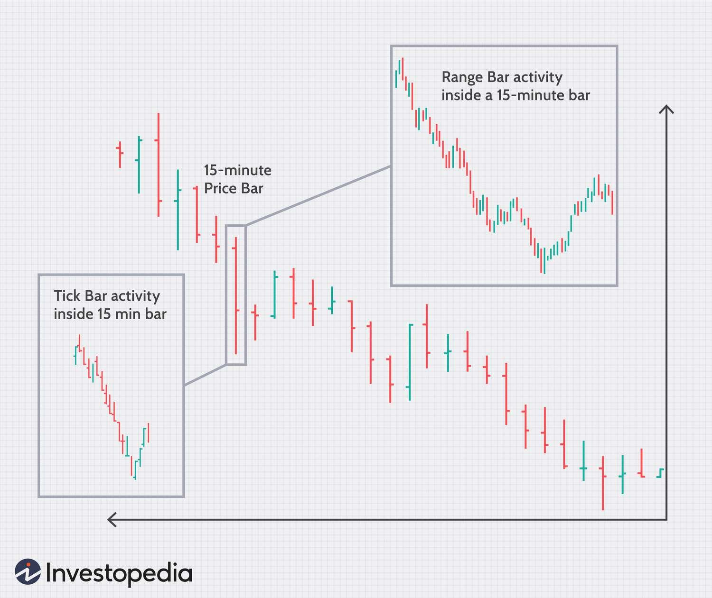

## Table of Contents

## What are Tick Imbalance Bars (TIBs)?

Tick Imbalance Bars (TIBs) are a way to look at how stock prices change over time. Instead of using regular time periods, TIBs focus on the number of trades that happen. They are created when the number of buy trades is very different from the number of sell trades. This helps traders see when there is a lot of buying or selling happening, which can be important for making decisions.

TIBs can be useful because they show times when the market is moving a lot. If there are many more buy trades than sell trades, it might mean the price will go up soon. On the other hand, if there are many more sell trades, the price might go down. By watching these imbalances, traders can try to predict what the market will do next and make better choices about when to buy or sell.

## How do TIBs differ from traditional time-based charts?

TIBs and traditional time-based charts show stock prices differently. Traditional charts divide the trading day into equal time periods, like minutes or hours. Each bar or candle on these charts represents what happened in that time. This can be helpful to see how prices change over time, but it doesn't show if there's a lot of buying or selling happening.

TIBs, on the other hand, focus on the number of trades, not the time. A TIB is created when there's a big difference between the number of buy and sell trades. This means TIBs can show when the market is moving a lot because of many trades happening. Traders using TIBs can see these imbalances and might be able to predict if the price will go up or down soon, which can help them make better trading decisions.

## Why might traders use TIBs instead of other types of bars?

Traders might use TIBs instead of other types of bars because TIBs show when there's a lot of buying or selling happening. This can help traders see when the market is moving a lot. If there are many more buy trades than sell trades, it might mean the price will go up soon. If there are many more sell trades, the price might go down. By watching these imbalances, traders can try to predict what the market will do next and make better choices about when to buy or sell.

Other types of bars, like time-based charts, just show what happens in set time periods. They don't tell you if there's a lot of buying or selling going on. TIBs focus on the number of trades, not the time. This can give traders more useful information about what's happening in the market right now. So, traders who want to know about market imbalances and make quick decisions might prefer using TIBs.

## How are TIBs constructed?

Tick Imbalance Bars are made by looking at the number of buy and sell trades, not the time. A new TIB is created when there's a big difference between the number of buy trades and sell trades. For example, if there are a lot more buy trades than sell trades, or a lot more sell trades than buy trades, a new TIB is formed. This helps traders see when the market is moving a lot because of many trades happening.

To make a TIB, you start counting the trades. If the number of buy trades is very different from the number of sell trades, you make a new bar. The size of the difference needed to make a new bar can be set by the trader. This way, TIBs show when there's a lot of buying or selling going on, which can help traders predict what the market will do next.

## What is the significance of tick imbalance in trading?

Tick imbalance is important in trading because it shows when there's a big difference between the number of buy and sell trades. If there are a lot more buy trades than sell trades, it might mean that the price of a stock will go up soon. On the other hand, if there are a lot more sell trades, the price might go down. Traders watch tick imbalances to understand what the market is doing right now and to make better guesses about what will happen next.

By looking at tick imbalances, traders can see when the market is moving a lot. This can help them decide when to buy or sell a stock. For example, if a trader sees a big tick imbalance with more buy trades, they might decide to buy the stock because they think the price will go up. Using tick imbalances can give traders an edge in making quick and smart trading choices.

## Can you explain the calculation of tick imbalance for TIBs?

To calculate tick imbalance for TIBs, you start by counting the number of buy trades and the number of sell trades. A "tick" is just another word for a trade. When the number of buy ticks is a lot different from the number of sell ticks, you have a tick imbalance. You decide how big the difference needs to be to make a new TIB. For example, you might say that a new TIB is made when there are 10 more buy ticks than sell ticks, or 10 more sell ticks than buy ticks.

Once you have this rule, you keep counting the ticks until the difference between buy and sell ticks reaches your set number. When it does, you create a new TIB. This new TIB shows that there was a big imbalance in the number of buy and sell trades. By doing this, you can see when the market is moving a lot because of many trades happening, which can help you make better trading decisions.

## What are the advantages of using TIBs for market analysis?

TIBs help traders see when there's a big difference between buy and sell trades. This can show when the market is moving a lot because many trades are happening. By watching these imbalances, traders can guess if the price will go up or down soon. This can help them make better choices about when to buy or sell a stock.

Unlike regular charts that just show what happens in set times, TIBs focus on the number of trades. This can give traders more useful information about what's happening in the market right now. Traders who want to know about market imbalances and make quick decisions might find TIBs very helpful.

## Are there any specific markets or instruments where TIBs are particularly useful?

TIBs can be really helpful in markets where there's a lot of trading going on, like the stock market or forex market. These markets have many trades happening all the time, so it's easier to see when there's a big difference between buy and sell trades. This can help traders in these markets make better guesses about where prices are going next.

For example, in the stock market, TIBs can show when a lot of people are buying or selling a certain stock. This can be useful for traders who want to know when to buy or sell that stock. In the forex market, where currencies are traded, TIBs can help traders see when there's a lot of buying or selling of a certain currency, which can help them decide when to trade.

## How do TIBs help in identifying market trends and reversals?

TIBs help traders see when the market might be starting a new trend or when a trend might be ending. When there are a lot more buy trades than sell trades, it can mean that a new upward trend is starting. Traders can look at these imbalances to guess if the price will keep going up. On the other hand, if there are a lot more sell trades than buy trades, it might mean that the price will start going down, showing the start of a downward trend.

TIBs also help traders spot when a trend might be reversing. If a stock has been going up for a while and then suddenly there's a big imbalance with more sell trades, it could mean that the upward trend is about to end and the price might start going down. By watching these imbalances, traders can get early signs of when the market might change direction, which can help them decide when to buy or sell their stocks.

## What are some common strategies traders employ with TIBs?

Traders often use TIBs to spot good times to buy or sell stocks. They look for big imbalances where there are a lot more buy trades than sell trades. This might mean the price will go up soon, so traders might decide to buy the stock at that time. On the other hand, if there are a lot more sell trades than buy trades, traders might think the price will go down and decide to sell their stocks.

Another strategy is to use TIBs to see when a trend might be starting or ending. If traders see a big imbalance with more buy trades after a time when the price was going down, they might think a new upward trend is starting. They could then buy the stock hoping to make money as the price goes up. If they see a big imbalance with more sell trades after the price has been going up, they might think the trend is about to reverse and sell their stocks to avoid losing money.

## How can TIBs be integrated into automated trading systems?

TIBs can be added to automated trading systems by setting up rules that watch for big differences between buy and sell trades. These systems can be told to make a trade when the number of buy trades is a lot more than sell trades, or the other way around. For example, if the system sees that there are 10 more buy trades than sell trades, it can automatically buy the stock because it thinks the price will go up soon. This helps the system make quick decisions without needing a person to watch the market all the time.

Using TIBs in automated trading can help catch trends and reversals faster than a person might. The system can be set to look for these imbalances all the time, even when the market is closed. This way, it can act on new information as soon as it comes in, which can lead to better trading choices. By using TIBs, the automated system can try to predict what the market will do next and make trades to make money based on these predictions.

## What are the limitations or criticisms of using TIBs in trading?

Using TIBs in trading can have some problems. One big issue is that they might not always be right about what the market will do next. Just because there are a lot more buy trades than sell trades doesn't mean the price will go up for sure. The market can be hard to predict, and TIBs are just one way to try to guess what will happen. Another problem is that TIBs can be hard to set up right. Traders need to decide how big the difference between buy and sell trades needs to be to make a new TIB. If they choose the wrong number, they might miss out on good trading chances or make bad trades.

Also, TIBs might not work well for all types of markets or stocks. In markets where not many trades happen, TIBs might not be very useful because there won't be enough trades to show a big imbalance. And even in busy markets, TIBs can be tricky because other things can affect the price, like news or big events. Traders need to be careful and use other tools along with TIBs to make the best trading choices.

## What is Understanding Tick Imbalance?

Tick imbalance is a method to quantify the directional [momentum](/wiki/momentum) of trades in a market by translating price movements into signed ticks. This process involves the tick rule, which is a simple mechanism for assigning a positive (+1) or negative (-1) value to each trade based on its price movement relative to the previous trade. If a trade's price is higher than the preceding trade, a tick of +1 is recorded, whereas a lower price results in a tick of -1. In cases where the price remains unchanged, the tick maintains the previous sign, ensuring continuity in the analysis.

The primary objective of tick imbalance is to transform a sequence of trades into a comprehensible numerical format that reflects the aggregate sentiment of market participants. By converting a series of trades into a sequence of signed ticks, traders and analysts can cumulatively sum these values to evaluate market pressure. For instance, if there is a sustained sequence of +1 ticks, this indicates bullish sentiment, with buyers potentially outweighing sellers. Conversely, a string of -1 ticks suggests bearish sentiment.

Mathematically, the cumulative sum of signed ticks over a particular period can be expressed as:

$$
\text{Cumulative Imbalance} = \sum_{i=1}^{n} \text{signed tick}_i
$$

Here, $\text{signed tick}_i$ represents the ith trade's tick value, and $n$ denotes the number of trades considered.

The significance of tick imbalance derives from its ability to uncover the underlying movements of informed traders. A higher number of ticks consistently oriented in a single direction might indicate that these traders, who typically possess superior information or strategies, are actively participating in the market. This potential information flow becomes a critical input for [algorithmic trading](/wiki/algorithmic-trading) strategies, as it may provide early signals of shifting market dynamics. By monitoring the tick imbalance, traders can infer the presence and intensity of informed trading, which is crucial for making timely decisions in fast-moving markets.

## What is the process for setting the sampling threshold?

At the start of each tick imbalance bar, determining an appropriate sampling threshold is crucial for capturing significant market movements. This process involves predicting the expected imbalance via an exponentially weighted moving average (EWMA). The sequence of signed ticks, which indicate the direction of trade based on recent price movements, serves as the input for this estimation.

The expected imbalance, denoted as $E[I]$, is calculated using the EWMA of past imbalance values. The formula for the EWMA can be expressed as:

$$
E[I_t] = \alpha I_t + (1 - \alpha) E[I_{t-1}]
$$

where $I_t$ represents the current imbalance, $E[I_{t-1}]$ is the previously calculated expected imbalance, and $\alpha$ is the smoothing factor ranging between 0 and 1. This smoothing factor determines the weight of more recent data points compared to older ones. A higher $\alpha$ places more emphasis on recent imbalances, making the EWMA more responsive to recent market changes.

The threshold for sampling a new tick imbalance bar is then determined by multiplying this expected imbalance with the anticipated bar length, a parameter that can be adjusted based on historical data or trading preferences. This anticipated bar length effectively scales the expected imbalance, reflecting the varying market conditions and [liquidity](/wiki/liquidity-risk-premium) levels. The resulting threshold represents a level of cumulative imbalance at which a new bar should be initiated, indicating a meaningful and possibly informed trading activity.

When the cumulative sum of signed ticks exceeds this threshold, it triggers the creation of a new tick imbalance bar. This approach allows for dynamic adjustment to changing market conditions, enabling traders to respond more effectively to the information embedded within trade sequences.

## What are Tick Imbalance Bars (TIBs) and how are they defined?

Tick imbalance bars (TIBs) are designed to dynamically adjust and capture the true market activity by using continuous monitoring of trade imbalances. Mathematically, TIBs are generated by accumulating signed ticks until a cumulative imbalance surpasses a specific threshold. To begin with, each tick in the trade data is assigned a sign using the tick rule: a value of +1 is assigned when there is an uptick (price increase) and -1 when there is a downtick (price decrease). The sequence of these signed ticks is then cumulatively summed.

The computational process of forming a tick imbalance bar relies on a predefined threshold, denoted as $\theta$. This threshold is set based on the expected level of imbalance, typically calculated through statistical measures such as an exponentially weighted moving average (EWMA). The formula for determining the cumulative imbalance $I_t$ at each tick $t$ is as follows:

$$
I_t = \sum_{i=1}^{t} \text{sign}(\Delta P_i)
$$

where $\Delta P_i$ represents the price change between successive trades. A TIB is formed once $I_t$ exceeds the threshold $\theta$, indicating a significant directional movement in trades suggestive of informed trading activity. At this point, the accumulation stops, and a new bar begins, allowing traders to assess shifts in market direction.

```python
# Python code to calculate tick imbalance
import pandas as pd

# Sample data
data = {'Price': [100, 101, 100, 102, 101, 103]}
df = pd.DataFrame(data)

# Calculating signed ticks based on price movement
df['Sign'] = df['Price'].diff().apply(lambda x: 1 if x > 0 else (-1 if x < 0 else 0))

# Cumulative imbalance calculation
df['Imbalance'] = df['Sign'].cumsum()

# Define a threshold
threshold = 2

# Function to identify the formation of a tick imbalance bar
def find_tib_bars(df, threshold):
    start = 0
    bars = []

    for i in range(1, len(df)):
        if abs(df['Imbalance'][i]) >= threshold:
            bars.append((start, i))
            start = i
            df['Imbalance'] -= df['Imbalance'][i]  # Reset imbalance

    return bars

# Get the tick imbalance bars
tib_bars = find_tib_bars(df, threshold)
```

Utilizing TIBs allows traders to account for actual market actions instead of relying on arbitrary time intervals as in conventional time-based bars. This adaptability promotes earlier detection of meaningful shifts in trade directionality, providing a potential edge in algorithmic trading.

## References & Further Reading

[1]: ["Advances in Financial Machine Learning"](https://www.amazon.com/Advances-Financial-Machine-Learning-Marcos/dp/1119482089) by Marcos Lopez de Prado

[2]: ["Evidence-Based Technical Analysis: Applying the Scientific Method and Statistical Inference to Trading Signals"](https://www.amazon.com/Evidence-Based-Technical-Analysis-Scientific-Statistical/dp/0470008741) by David Aronson

[3]: ["Machine Learning for Algorithmic Trading"](https://github.com/PacktPublishing/Machine-Learning-for-Algorithmic-Trading-Second-Edition) by Stefan Jansen

[4]: ["Quantitative Trading: How to Build Your Own Algorithmic Trading Business"](https://books.google.com/books/about/Quantitative_Trading.html?id=j70yEAAAQBAJ) by Ernest P. Chan

[5]: Bouchaud, J.P., Farmer, J.D., & Lillo, F. (2008). ["How markets slowly digest changes in supply and demand."](https://arxiv.org/abs/0809.0822) Handbook of Financial Markets: Dynamics and Evolution.