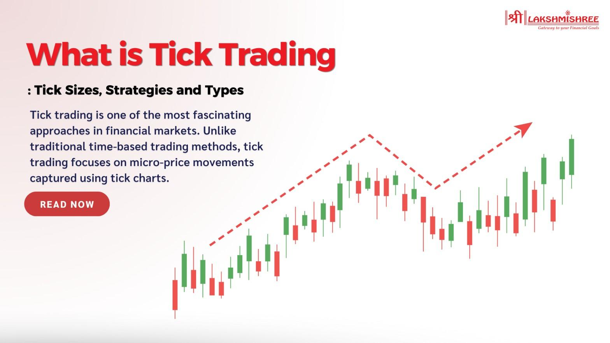

## Table of Contents

## What is a tick in securities trading?

In securities trading, a tick refers to the smallest possible change in the price of a security. It's like the smallest step a price can move up or down. For example, if a stock is trading at $10 and the next trade happens at $10.01, that one-cent difference is a tick.

Ticks are important because they help traders understand how a security's price is moving. They can show if a stock is becoming more or less valuable over time. Different securities might have different tick sizes. For instance, some stocks might move in one-cent ticks, while others might move in five-cent ticks. This can affect how traders make their decisions.

## How is a tick size determined?

A tick size is decided by the rules of the stock exchange where the security is traded. Different exchanges can have different rules about how big a tick should be. For example, the New York Stock Exchange might say that a tick for a certain stock should be one cent, while another exchange might say it should be five cents. The idea is to make sure that the price changes are clear and easy to understand for everyone trading.

Sometimes, the tick size can change based on how much the security costs. For cheaper stocks, the tick size might be smaller, like one cent, to allow for more precise trading. For more expensive stocks, the tick size might be bigger, like five or ten cents, because small changes in price don't matter as much. This helps keep trading fair and efficient for all kinds of securities.

## What is the difference between an uptick and a downtick?

An uptick happens when the price of a security goes up compared to the last trade. For example, if a stock was last traded at $10 and the next trade is at $10.01, that's an uptick. It shows that the price is moving up, even if it's just by a little bit. Traders watch upticks to see if a stock is getting more valuable over time.

A downtick is the opposite. It happens when the price of a security goes down from the last trade. If a stock was last traded at $10 and the next trade is at $9.99, that's a downtick. It means the price is going down, even if it's just a small change. Downticks can show that a stock might be losing value.

Upticks and downticks are important because they help traders understand the direction the price is moving. By looking at these small changes, traders can make better decisions about when to buy or sell a security.

## How do ticks affect the price of a security?

Ticks are the smallest changes in the price of a security. They show how the price moves up or down, even if it's just by a little bit. When a stock goes up by one tick, it means the price has increased by the smallest amount allowed by the exchange. For example, if a stock goes from $10 to $10.01, that one-cent change is a tick. These small changes can add up over time, making the stock more or less valuable.

Ticks can affect how traders make decisions. If a stock keeps going up by ticks, traders might think it's a good time to buy because the price is increasing. On the other hand, if a stock keeps going down by ticks, traders might decide to sell because the price is dropping. By watching these ticks, traders can get a sense of whether a stock is getting more or less valuable, helping them choose the best time to trade.

## What is the significance of tick data in trading?

Tick data is really important in trading because it shows the smallest changes in a security's price. Traders use this data to see how a stock is moving, even if it's just by a little bit. By looking at tick data, traders can tell if a stock is going up or down over time. This helps them decide when to buy or sell. For example, if a stock keeps going up by ticks, a trader might think it's a good time to buy because the price is increasing.

Tick data also helps traders understand the market better. They can see patterns in how prices change and use this information to make smarter trading decisions. For instance, if a stock often goes up by ticks at a certain time of day, traders might plan to buy at that time. Tick data gives traders a detailed view of price movements, which is key to making good trading choices.

## How can traders use tick data to make informed decisions?

Traders can use tick data to see how a stock's price is moving, even if it's just by a little bit. By watching these small changes, traders can tell if a stock is going up or down over time. For example, if a stock keeps going up by ticks, a trader might think it's a good time to buy because the price is increasing. On the other hand, if a stock keeps going down by ticks, a trader might decide to sell because the price is dropping. This helps traders make better decisions about when to buy or sell a stock.

Tick data also helps traders understand the market better. They can see patterns in how prices change and use this information to make smarter trading decisions. For instance, if a stock often goes up by ticks at a certain time of day, traders might plan to buy at that time. By looking at tick data, traders can get a detailed view of price movements, which is key to making good trading choices.

## What are the regulatory rules surrounding tick sizes?

The rules about tick sizes are set by the stock exchanges where the securities are traded. Different exchanges can have different rules. For example, the New York Stock Exchange might say that a tick for a certain stock should be one cent, while another exchange might say it should be five cents. These rules help keep trading clear and fair for everyone.

Sometimes, the tick size can change based on how much the security costs. For cheaper stocks, the tick size might be smaller, like one cent, to allow for more precise trading. For more expensive stocks, the tick size might be bigger, like five or ten cents, because small changes in price don't matter as much. This helps keep trading fair and efficient for all kinds of securities.

## How have tick sizes changed over time and why?

Over time, tick sizes have changed to make trading better and fairer. In the past, the smallest tick size was often one-eighth of a dollar, or $0.125. This was because trading was done by hand, and smaller changes were hard to handle. But as computers started to be used more in trading, exchanges could handle smaller tick sizes. So, in the 1990s and 2000s, many exchanges switched to smaller tick sizes, like one cent. This made trading more precise and let traders buy and sell stocks at prices that were closer to what they wanted.

The main reason for these changes was to make trading more efficient and fair. Smaller tick sizes let traders make smaller price changes, which can be important for stocks that don't move a lot in price. It also helps to make sure that the price of a stock is as close as possible to what people are willing to pay. But, there's a balance to find. If tick sizes are too small, it can make trading too complicated and might not help the market work better. So, exchanges keep looking at how tick sizes affect trading and might change them to keep things working well.

## What is the impact of tick size on market liquidity?

Tick size can affect how easy it is to buy and sell stocks, which we call market [liquidity](/wiki/liquidity-risk-premium). If the tick size is small, like one cent, it can make it easier for people to trade. This is because traders can make smaller price changes, which means they can buy or sell stocks at prices that are closer to what they want. More people might want to trade when the tick size is small, because they can get the prices they want more easily. This can make the market more liquid, with more buying and selling happening.

But, if the tick size is too small, it might not always help. Sometimes, very small tick sizes can make trading too complicated. It can be hard for traders to agree on prices if there are too many small changes happening all the time. On the other hand, if the tick size is bigger, like five or ten cents, it might make trading a bit harder. Fewer people might want to trade because they can't get the exact prices they want. This can make the market less liquid, with less buying and selling happening. So, finding the right tick size is important to keep the market working well.

## How do different markets handle tick sizes differently?

Different markets handle tick sizes in their own ways because they want to make trading fair and easy for everyone. For example, the New York Stock Exchange might use a one-cent tick size for most stocks. This makes it easy for traders to buy and sell at small price changes. But other markets might use a five-cent tick size for the same stocks. They might think that a bigger tick size helps keep trading simple and stops prices from changing too fast.

Some markets change the tick size depending on how much the stock costs. If a stock is cheap, the tick size might be smaller, like one cent, so traders can make small price changes. But if a stock is expensive, the tick size might be bigger, like ten cents, because small changes don't matter as much. This way, markets can make sure trading is fair for all kinds of stocks, whether they're cheap or expensive.

## What are the advanced strategies for trading based on tick data?

Traders can use tick data to spot trends and make smart moves. One way is to watch for upticks and downticks to see if a stock is going up or down over time. If a stock keeps going up by ticks, a trader might decide to buy because the price is getting higher. On the other hand, if a stock keeps going down by ticks, a trader might sell because the price is dropping. By looking at these small changes, traders can get a good idea of where the price might go next and make their moves based on that.

Another strategy is to use tick data to find patterns in how prices change. For example, if a stock often goes up by ticks at a certain time of day, a trader might plan to buy at that time. This can help traders make better decisions about when to trade. By understanding these patterns, traders can time their buys and sells to make the most money. Tick data gives traders a detailed view of price movements, which is key to making good trading choices.

## How can tick data be integrated with other market data for enhanced analysis?

Traders can use tick data along with other market data to get a better picture of what's going on. For example, they might look at tick data with [volume](/wiki/volume-trading-strategy) data, which shows how many shares of a stock are being traded. If a stock's price is going up by ticks and the volume is high, it might mean that a lot of people are buying the stock, which could be a good sign. On the other hand, if the price is going down by ticks and the volume is low, it might mean that not many people are interested in the stock, which could be a bad sign. By looking at tick data and volume together, traders can make better guesses about where the price might go next.

Another way to use tick data is with news and events. If there's big news about a company, like a new product or a change in leadership, traders can watch the tick data to see how the stock's price reacts. If the price goes up by ticks right after the news, it might mean that people like the news and think the stock will do well. But if the price goes down by ticks, it might mean that people are worried about the news. By combining tick data with news and other market data, traders can get a fuller understanding of what's happening and make smarter trading choices.

## References & Further Reading

[1]: Securities and Exchange Commission, ["Tick Size Pilot Program"](https://www.sec.gov/ticksizepilot)

[2]: [“The Impact of Tick Size on Financial Markets”](https://www.investopedia.com/terms/t/tick-size.asp) by CFA Institute

[3]: ["Advances in Financial Machine Learning"](https://www.amazon.com/Advances-Financial-Machine-Learning-Marcos/dp/1119482089) by Marcos Lopez de Prado

[4]: [“The Economics of Stock Exchange Listing Fees and Listing Requirements”](https://www.sciencedirect.com/science/article/pii/S1042957302903438) by Howell E. Jackson

[5]: ["Quantitative Trading: How to Build Your Own Algorithmic Trading Business"](https://www.amazon.com/Quantitative-Trading-Build-Algorithmic-Business/dp/1119800064) by Ernest P. Chan