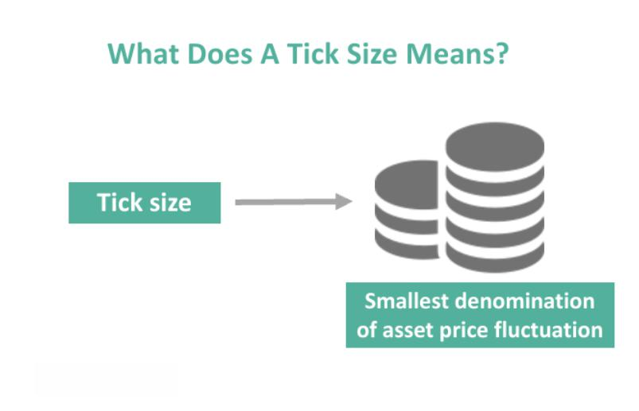

Understanding the complex world of financial markets is crucial for both novice and experienced investors alike. In the fast-paced environment of trading, a multitude of factors contribute to market dynamics, yet one of the cornerstone elements influencing how securities are traded is the idea of 'tick size'. A tick size denotes the smallest increment by which the price of a trading instrument can move. As an integral component, it contributes to determining the bid-ask spread and governs market liquidity. 

Traditional exchanges established tick sizes based on the type of asset, yet various advancements and regulatory changes have altered how tick sizes are perceived and implemented. Understanding tick size is of paramount importance for traders looking to optimize their strategies to enter and exit markets efficiently, impacting their overall trading outcomes.



Moreover, tick size affects the cost of trading and efficiency, influencing whether high-frequency trading is viable due to changed liquidity dynamics and trading costs. It has a profound impact on how markets are structured and how they behave, with potential ramifications for trading volume and volatility.

In addition to tick size's core influence, algorithmic trading has recast the perception and utilization of tick sizes within market strategies. As trading strategies increasingly rely on automation, adjustments to tick size can significantly alter the profitability and competitive edge of algorithmic models. 

This article aims to equip readers with a comprehensive understanding of tick size in financial markets, and its significance for modern trading strategies, also considering regulatory considerations and future trends shaping their development. With this knowledge, traders can better navigate and engage with the intricacies of today's markets.

## Table of Contents

## Understanding Tick Size

Tick size refers to the smallest increment by which the price of a trading instrument, such as a stock, bond, or commodity, can move. This fundamental component of financial markets is vital for determining the bid-ask spread, which is the difference between the prices quoted for an immediate sale (bid) and an immediate purchase (ask) of securities. Tick size affects liquidity, as a smaller tick size can reduce the bid-ask spread, attracting more buyers and sellers and thus enhancing market efficiency.

Exchanges historically set tick sizes depending on the asset class. For example, stocks traded on U.S. exchanges used to have a tick size of one-sixteenth of a dollar until 2001, when the introduction of decimalization reduced the tick size to $0.01. Such reductions can lead to tighter spreads and improved [liquidity](/wiki/liquidity-risk-premium), although they may diminish the profitability of market-making activities that rely on spread income.

Understanding tick size is crucial for traders to strategize their market entry and [exit](/wiki/exit-strategy) points. Consider a security with a large tick size; this translates to fewer price points and can lead to increased [volatility](/wiki/volatility-trading-strategies), challenging timely order execution. Conversely, a smaller tick size introduces more price increments, allowing for finer price precision and potentially less market volatility.

Recent years have witnessed regulatory adjustments and technological advancements that have reshaped tick size evolution. Regulatory bodies like the U.S. Securities and Exchange Commission (SEC) have experimented with pilot programs to assess the impact of tick size changes on market quality and trading behaviors. Technological advancements, especially in [algorithmic trading](/wiki/algorithmic-trading), have further influenced how tick sizes are perceived and utilized. For instance, the ability to process large volumes of trades at high speeds has increased the importance of minimal tick sizes to maximize trading efficiency.

Modern financial markets are thus tasked with finding an optimal tick size that balances the needs for liquidity, market maker profitability, and trading cost efficiency. Traders, equipped with an understanding of how tick sizes impact these factors, can make more informed decisions to optimize their trading strategies within this dynamic and complex landscape.

## Impact of Tick Size on Securities Trading

Tick size is a pivotal element in securities trading, directly influencing trading costs and market liquidity. It represents the smallest possible increment between two prices of a traded asset, such as a stock or commodity. The size of these increments can significantly impact various aspects of trading dynamics, particularly through its influence on the bid-ask spread and market activity. 

A larger tick size typically results in wider spreads, which can contribute to higher trading costs for market participants. This increase in trading costs often deters high-frequency trading ([HFT](/wiki/high-frequency-trading-strategies)) strategies, which thrive on executing numerous trades with minimal spread costs. The impact of larger tick sizes may also manifest in reduced market liquidity; with higher transaction costs, traders may be less willing to enter buy or sell orders, leading to a decrease in overall trading [volume](/wiki/volume-trading-strategy) and market activity.

Conversely, a smaller tick size can result in tighter spreads, thereby lowering the effective cost of trading. Reduced transaction costs often stimulate greater trading activity, as they attract more investors who can now operate with improved cost efficiency. This increase in activity can enhance market liquidity by facilitating a higher volume of buy and sell orders, enabling easier entry and exit for trades.

The relationship between tick size and market volatility plays a crucial role in shaping trading strategies. Smaller tick sizes can lead to more frequent price changes, as traders react quickly to smaller price movements. This can increase short-term volatility, which some traders may exploit to their advantage, while others might perceive it as a risk [factor](/wiki/factor-investing). Conversely, larger tick sizes can suppress short-term volatility, as price movements occur in larger, less frequent increments, potentially appealing to traders seeking reduced volatility exposure.

One illustrative case study involves the U.S. Securities and Exchange Commission's "Tick Size Pilot Program," which aimed to investigate the effects of larger tick sizes on small-cap stocks.[^1^] Implemented in 2016, the program grouped certain stocks into test groups with incrementally larger tick sizes compared to a control group. The findings indicated that larger tick sizes were associated with wider bid-ask spreads and elevated transaction costs, confirming theoretical expectations. However, the program also revealed nuanced impacts on market behavior and trading volumes, highlighting the complex interplay between tick size, liquidity, and trading strategies.

Understanding these dynamics is critical for traders and researchers alike as they seek to optimize trading strategies in response to varying market conditions. By comprehensively analyzing and anticipating the effects of tick size on trading costs and market behavior, traders can make more informed decisions and potentially enhance their market performance.

[^1^]: Securities and Exchange Commission, "Tick Size Pilot Program", https://www.sec.gov/tick-size-pilot-program-summary

## Algorithmic Trading and Tick Size

Algorithmic trading, often known as algo trading, utilizes computerized algorithms to automatically execute trading orders based on predefined criteria. These criteria can range from simple direct instructions to complex mathematical models integrating varied market signals and factors. The introduction and expansion of algorithmic trading have fundamentally altered the perspective and application of tick sizes within market strategies.

Tick size refers to the minimum price increment at which a trade can be executed in a financial instrument. In algorithmic trading, tick size modifications can have substantial implications for a trading model's profitability. Larger tick sizes might suppress order clustering near price points to avoid higher effective spreads, potentially decreasing the avenues for small [arbitrage](/wiki/arbitrage) gains typically exploited in high-frequency trading (HFT). Conversely, a smaller tick size can reduce spreads and increase the number of price levels, allowing algorithms to place more aggressive yet granular orders for optimizing entry and exit from positions.

Algorithmic traders must adapt their strategies to align with changes in tick size, impacting their competitive edge. A larger tick size can necessitate more significant price movement before a trade becomes profitable, challenging the speed-centric advantage of HFT techniques. Conversely, a reduced tick size expands liquidity but requires adjustments in algorithm calibrations to properly manage increased order flow and trading costs. For example, an algorithm designed to capitalize on minute price discrepancies must be reevaluated if tick size changes, necessitating a recalibration of parameters such as average trade duration, order pacing, and execution tactics.

Illustrating these adjustments, consider a scenario where a tick size reform changes the landscape of a specific market. Suppose a stock previously had a tick size of \$0.01 but is changed to \$0.05. An algorithm tuned to exploit profits from tiny spread fluctuations must now incorporate these broader spreads, potentially shifting towards strategies that emphasize deeper market analysis and longer holding times, rather than rapid, small-margin trades.

To adapt, algorithms might employ sophisticated techniques like [machine learning](/wiki/machine-learning) to dynamically predict and react to market conditions that newly adjusted tick sizes influence. An algorithm incorporating a [reinforcement learning](/wiki/reinforcement-learning) model could, by simulating various market scenarios, learn optimal strategies to execute trades profitably despite shifts in tick size.

Let’s consider a simplified Python logic snippet reflecting algorithm adaptation:

```python
def adjust_strategy(tick_size_old, tick_size_new, current_strategy):
    """Adjusts trading strategy parameters based on tick size change."""
    # Compute adjustment factor
    adjustment_factor = tick_size_new / tick_size_old

    # Modify strategy parameters
    adjusted_strategy = current_strategy.copy()
    adjusted_strategy['spread_tolerance'] *= adjustment_factor
    adjusted_strategy['order_size'] /= adjustment_factor
    adjusted_strategy['price_threshold'] *= adjustment_factor

    return adjusted_strategy

# Example of strategy adjustment
old_tick_size = 0.01
new_tick_size = 0.05
current_strategy = {'spread_tolerance': 0.02, 'order_size': 100, 'price_threshold': 0.1}

new_strategy = adjust_strategy(old_tick_size, new_tick_size, current_strategy)
print("Adjusted Trading Strategy:", new_strategy)
```

In conclusion, the interplay between algorithmic trading and tick size is dynamic, requiring continuous adaptation of strategies to maintain or achieve a competitive advantage. This alignment dictates the success of trading algorithms, as market conditions and regulatory environments evolve. Through continual innovation and recalibration, algo traders can optimize their systems to react to tick size adjustments and sustain their efficacy in financial markets.

## Regulatory Considerations and Future Trends

Regulatory bodies are crucial in establishing tick sizes, influencing market fairness and efficiency. The determination of tick size by authorities seeks to balance the needs of market participants while ensuring orderly market conditions. Recently, there has been a noticeable shift toward standardizing tick sizes across different asset classes to create a more cohesive trading environment. This move aims to enhance market transparency and reduce complexity for investors who trade across various markets.

The implications of tick size regulation on market transparency and investor protection are complex and continue to be debated. On one hand, standardized tick sizes can lead to narrower spreads, improved price discovery, and enhanced liquidity, making the market more attractive to a diverse range of investors. On the other hand, it may challenge high-frequency traders who exploit small price changes, potentially affecting market dynamics and liquidity provision.

Technological advancements, such as blockchain and machine learning, are anticipated to influence future strategies related to tick size and its regulation. Blockchain technology, with its potential for creating decentralized and transparent trading platforms, might drive changes in how tick sizes are set and regulated. Similarly, machine learning algorithms can analyze vast datasets to optimize tick size adjustments in real-time, ensuring regulatory frameworks are adaptive to evolving market conditions.

Looking ahead, it is expected that tick size paradigms will continue to evolve alongside financial market developments. The integration of emerging technologies into trading systems could lead to more tailored and data-driven regulatory approaches. Furthermore, as global markets become increasingly interconnected, international coordination of tick size regulations may become necessary to prevent regulatory arbitrage and ensure comprehensive market oversight.

This evolving landscape highlights the need for regulators and market participants to remain adaptable and informed. Through ongoing research and technological integration, the future of tick size regulation may bring about more efficient markets that benefit both investors and the broader financial ecosystem.

## Conclusion

Tick size serves as a critical element in trading, directly affecting market liquidity, shaping trading strategies, and influencing regulatory frameworks. As algorithmic trading becomes increasingly dominant, comprehending the intricacies of tick size is vital for market participants aiming to maintain a competitive edge. Traders and regulators alike must exhibit adaptability to accommodate the fluid nature of financial markets and the changes driven by technological advancements and evolving regulations. Staying well-informed about tick size dynamics allows traders to finetune their strategies, leading to optimized trading performance and better handling of transaction costs. Ultimately, by understanding and anticipating the diverse impacts of tick size, market participants can engage in more informed and effective trading, ensuring their active role in the future of financial markets.

## References & Further Reading

[1]: Securities and Exchange Commission, ["Tick Size Pilot Program"](https://www.sec.gov/ticksizepilot)

[2]: [“The Impact of Tick Size on Financial Markets”](https://www.investopedia.com/terms/t/tick-size.asp) by CFA Institute

[3]: ["Advances in Financial Machine Learning"](https://www.amazon.com/Advances-Financial-Machine-Learning-Marcos/dp/1119482089) by Marcos Lopez de Prado

[4]: [“The Economics of Stock Exchange Listing Fees and Listing Requirements”](https://www.sciencedirect.com/science/article/pii/S1042957302903438) by Howell E. Jackson

[5]: ["Quantitative Trading: How to Build Your Own Algorithmic Trading Business"](https://www.amazon.com/Quantitative-Trading-Build-Algorithmic-Business/dp/1119800064) by Ernest P. Chan