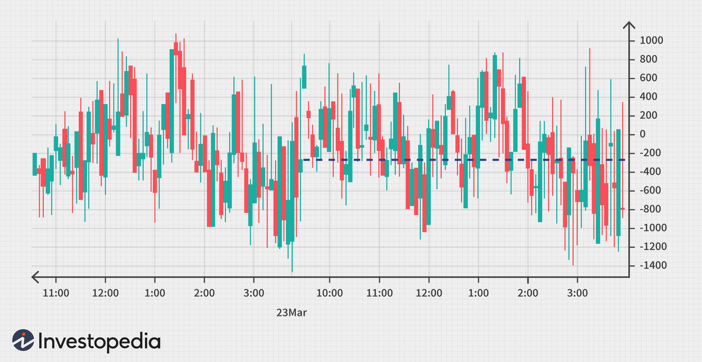

In today's fast-paced financial markets, choosing the right trading strategy can make all the difference. As traders increasingly embrace algorithmic solutions, the Tick Index has emerged as an essential tool for understanding market sentiments. This index measures the net number of stocks ticking up versus those ticking down on major exchanges like the New York Stock Exchange (NYSE). By providing real-time insights into market breadth and sentiment, the Tick Index helps traders identify potential turning points in stock prices.

This article examines the intersection of financial market trading strategies, the Tick Index, and algorithmic trading. These components collectively offer traders the means to better understand and respond to market movements. By leveraging algorithmic trading strategies that incorporate Tick Index data, traders can enhance both their decision-making speed and accuracy, thereby gaining a competitive edge. We will highlight the foundational aspects of these strategies and explore how they interconnect, offering traders, whether they are day traders or long-term investors, nuanced insights to refine their trading approaches. Understanding the dynamics of these elements is key to optimizing performance and achieving more effective market engagement.



## Table of Contents

## Understanding Financial Markets

Financial markets function as intricate ecosystems where traders, sellers, and brokers converge to exchange an array of financial assets. These markets encompass a broad spectrum of instruments, including stocks, bonds, derivatives, and cryptocurrencies, each offering distinct opportunities and challenges. 

Stocks represent ownership stakes in corporations. Investors purchase shares with the expectation of [earning](/wiki/earning-announcement) dividends and potential capital gains. Bonds are debt securities, essentially loans made by investors to borrowers such as corporations or governments. These instruments are typically used to achieve income through interest payments. Derivatives, including options and futures, derive their value from the performance of underlying assets and are often used for hedging risks or speculative purposes. Lastly, cryptocurrencies, a relatively recent entrant, operate on decentralized platforms and are known for their volatility and potential for high returns, albeit with significant risk.

For traders aiming for success, an in-depth understanding of these asset classes is crucial. Each category reacts distinctly to various economic factors. For instance, [interest rate](/wiki/interest-rate-trading-strategies) changes can influence bonds heavily, while economic growth expectations prominently impact stock prices. Cryptocurrencies may be affected by technological advancements or regulatory changes. Thus, understanding how these factors interplay with specific asset classes enables traders to make informed decisions.

A comprehensive trading strategy integrates various technical analysis tools that assist traders in evaluating market sentiments. One such tool is the Tick Index, which provides insights into the overall directional sentiment of stocks traded on major exchanges by measuring the difference between the number of stocks trading higher and those trading lower. By monitoring such markers, traders can gauge market conditions and time their transactions more effectively. This strategic integration of technical tools into trading practices is central to developing a robust strategy that responds adaptively to market fluctuations, thereby driving informed decision-making.

## The Role of the Tick Index in Trading

The Tick Index is a vital tool in financial trading, particularly for those active in short-term market analysis. It quantifies the net difference between stocks moving upwards and those moving downwards in price within major exchanges such as the New York Stock Exchange (NYSE). Functionally, the Tick Index is calculated by subtracting the number of stocks whose prices have ticked down from those that have ticked up within a specific timeframe. Mathematically, it can be represented as:

$$
\text{Tick Index} = \text{Number of Up Ticks} - \text{Number of Down Ticks}
$$

This real-time snapshot of market breadth offers valuable insights into immediate market sentiment, assisting traders in gauging the prevailing mood and potential future shifts. A Tick Index value greater than +1000 might indicate overbought market conditions, suggesting an impending reversal. Conversely, a value below -1000 could point to oversold conditions, possibly signaling a upward correction.

Utilizing the Tick Index as a component of trading strategies allows for improved timing when entering or exiting market positions. By interpreting extreme tick readings, traders can identify potential turning points and adjust their strategies to capitalize on presumed market corrections. For example, detecting a +1200 tick might lead a trader to anticipate a near-term sell-off, thereby prompting a decision to lock in gains.

Incorporating the Tick Index into [algorithmic trading](/wiki/algorithmic-trading) systems can offer a deeper quantitative edge. Algorithms can be programmed to react to tick thresholds, automating the process of executing trades when certain market conditions are met. This not only refines decision-making precision but also enhances reaction speed in highly competitive trading environments, where milliseconds can make a significant difference. By leveraging the Tick Index, traders can optimize entry and [exit](/wiki/exit-strategy) points, potentially increasing profitability and sustaining performance in dynamic market conditions.

## Algorithmic Trading Strategies

Algorithmic trading leverages technology to execute trades efficiently through automated processes. These processes utilize computer algorithms to adhere to specific, pre-defined criteria that guide trading decisions. The revolution brought by algorithmic trading can be attributed to its ability to enhance speed, accuracy, and data processing to a level far surpassing human capabilities.

Automating the trading process reduces the response time to market movements. For instance, executing trades in milliseconds captures fleeting pricing inefficiencies. This speed advantage is a cornerstone of high-frequency trading ([HFT](/wiki/high-frequency-trading-strategies)), where algorithms are used to trade large volumes at rapid rates, aiming for minimal profit margins per transaction but maximizing returns over numerous trades.

The integration of the Tick Index into these algorithms enhances their effectiveness. The Tick Index is a crucial indicator of market sentiment, providing real-time data on the breadth of market activity by measuring the net difference between advancing and declining stocks on major exchanges. This real-time sentiment analysis enables algorithms to dynamically adjust trading parameters and optimize strategies, catering to immediate market conditions.

Algorithmic trading strategies can be expressed through conditional programming constructs. For example, a Python function might be used to execute a trade based on tick readings as follows:

```python
def execute_trade_based_on_tick(tick_reading, buy_threshold=1000, sell_threshold=-1000):
    if tick_reading > buy_threshold:
        return "Enter a short position"  # Market potentially overbought
    elif tick_reading < sell_threshold:
        return "Enter a long position"  # Market potentially oversold
    else:
        return "Hold"  # No clear market sentiment

# Example usage:
tick_reading = 1200
decision = execute_trade_based_on_tick(tick_reading)
print(decision)  # Outputs: "Enter a short position"
```

This level of automation, underpinned by real-time data and dynamic adjustments, optimizes trade execution, allowing for improved strategy effectiveness and the potential for higher returns. It makes algorithmic trading a powerful tool for capital markets, driving significant transformations in the way trading is conducted globally.

## Combining Tick Index with Algorithmic Trading

Utilizing the Tick Index within an algorithmic trading framework involves setting specific conditions for executing trades based on tick readings, facilitating precise engagement with market [volatility](/wiki/volatility-trading-strategies). Algorithms can capitalize on extreme tick readings—such as those beyond +1000 or -1000—indicative of overbought or oversold conditions, respectively. By programming these conditions, traders can automate entry and exit points to harness short-term profit opportunities inherent in fluctuating markets.

For example, when the Tick Index reaches a critical threshold (over +1000 or under -1000), an algorithm might trigger a buy or sell order, respectively. This process can be implemented using Python with libraries like `pandas` for data handling and `numpy` for numerical operations. Here's a basic illustration of such an implementation:

```python
import numpy as np
import pandas as pd

# Sample tick data
tick_data = pd.DataFrame({
    'Tick_Index': [980, 1050, -1020, 950, -980, 1250, -1110]
})

# Define thresholds
upper_threshold = 1000
lower_threshold = -1000

# Signal generation
tick_data['Signal'] = np.where(tick_data['Tick_Index'] > upper_threshold, 'Sell',
                               np.where(tick_data['Tick_Index'] < lower_threshold, 'Buy', 'Hold'))

print(tick_data)
```

The synergy between algorithmic trading and the Tick Index enhances performance by seamlessly integrating real-time market sentiment into trading strategies. This approach allows traders to mitigate risks associated with human error and emotional trading, while potentially improving returns through rapid response to market shifts. By doing so, traders not only automate repetitive tasks but also optimize their strategies to align with market dynamics, achieving a competitive edge in high-frequency trading environments.

## Challenges and Considerations

While Tick Index-informed algorithmic trading brings forward numerous advantages, it comes with challenges that traders need to address carefully. The dynamic nature of financial markets necessitates vigilant monitoring to ensure that strategies remain effective and are not rendered obsolete due to market shifts. Here, we explore key considerations for utilizing the Tick Index within algorithmic trading frameworks.

Firstly, the importance of robust [backtesting](/wiki/backtesting) procedures cannot be overstated. Backtesting involves simulating a trading strategy using historical data to evaluate its potential effectiveness. It helps identify the strengths and weaknesses of a strategy before it is deployed in live trading. Traders should ensure that their backtesting processes are thorough and consider various market conditions to make the outcomes as reliable as possible. Continuously refining algorithms based on backtesting results is crucial to adapt to evolving market dynamics. For example, implementing a moving average crossover alongside the Tick Index can help in identifying trend reversals. Python can be used for backtesting, utilizing libraries such as pandas for data manipulation and matplotlib for plotting results:

```python
import pandas as pd
import matplotlib.pyplot as plt

# Mock data for the Tick Index strategy (replace with real market data)
data = {'Date': pd.date_range(start='1/1/2023', periods=100, freq='D'), 
        'Tick': [500 + x for x in range(100)], 
        'Price': [100 + 0.5*x for x in range(100)]}
df = pd.DataFrame(data)

# Calculate moving average
df['MA20'] = df['Price'].rolling(window=20).mean()

# Plot results
plt.figure(figsize=(12, 6))
plt.plot(df['Date'], df['Price'], label='Price')
plt.plot(df['Date'], df['MA20'], label='20 Day MA', linestyle='--')
plt.xlabel('Date')
plt.ylabel('Price')
plt.title('Backtesting with Moving Average Crossover')
plt.legend()
plt.show()
```

Secondly, understanding market depth and [liquidity](/wiki/liquidity-risk-premium) is crucial. Market depth refers to the market's ability to absorb large orders without significant price changes, while liquidity relates to how easily an asset can be bought or sold in the market. These factors influence how the Tick Index can be effectively integrated into trading strategies. High liquidity typically leads to more stable prices, which may provide cleaner signals for the Tick Index. Conversely, in markets with low liquidity, the Tick Index might produce erratic results, necessitating additional filtering methods.

Finally, external economic factors such as changes in interest rates, geopolitical events, and macroeconomic indicators also need careful consideration. These factors can significantly influence market sentiment, thereby impacting the Tick Index readings. Traders should incorporate mechanisms to account for these variables, ensuring that the Tick Index and related trading algorithms respond appropriately to such changes.

In summary, while the integration of the Tick Index into algorithmic trading strategies can offer substantial benefits, it is critical to maintain stringent model testing, possess a profound understanding of market conditions, and remain vigilant to external economic influences. These considerations will aid in refining trading strategies, ensuring they remain relevant and effective within an ever-adapting market landscape.

## Conclusion

Financial market strategies that integrate the Tick Index and algorithmic trading methods provide traders with real-time insights and enhanced precision. These tools are crucial in navigating today's rapidly changing trading environments, offering the ability to quickly respond to market shifts. The Tick Index, with its ability to gauge short-term market sentiment, combines seamlessly with algorithmic trading programs, creating potent strategies capable of optimizing trading decisions.

To maximize the effectiveness of these tools, it is essential to balance their use with thorough market analysis. By understanding broader economic indicators and factors influencing market movements, traders can develop strategies that are both comprehensive and adaptable. This requires a commitment to continual learning and strategy adjustment, as the markets are not static, and what works today may not be effective tomorrow.

As the capabilities of algorithmic trading expand with advancements in technology, traders must stay informed about new developments and innovations. This involves not only keeping up with the latest algorithmic trading platforms and techniques but also exploring how emerging technologies such as [machine learning](/wiki/machine-learning) and [artificial intelligence](/wiki/ai-artificial-intelligence) can further refine trading strategies. For instance, utilizing Python libraries like NumPy and pandas can aid in the processing and analysis of vast amounts of market data, enhancing decision-making processes. 

Ultimately, the key to success lies in innovation and adaptability, ensuring strategies remain robust in an ever-evolving financial landscape. As trading becomes increasingly technologically driven, those willing to embrace these changes and integrate advanced tools with solid market analysis will be best positioned to capitalize on upcoming opportunities.

## References & Further Reading

[1]: ["Understanding Market Processes: Discovering the Secrets of Financial Markets with Price-based Indicators"](https://www.researchgate.net/publication/378359439_Understanding_the_Dynamics_of_Financial_Markets_A_Comprehensive_Analysis) by Jack D. Schwager

[2]: Sweeney, R. J. (1988). ["Some New Filter Rule Tests: Methods and Results"](https://www.jstor.org/stable/pdf/2331068.pdf). Journal of Financial and Quantitative Analysis, 23(3), 285-296.

[3]: Chan, Ernest P. ["Algorithmic Trading: Winning Strategies and Their Rationale"](https://github.com/ftvision/quant_trading_echan_book)

[4]: ["Building an Automated Stock Trading System in Microsoft Excel"](https://www.spreadsheetml.com/automatedstocktradingsystem/) by Mark S. Joshi and Nicholas D. Beal

[5]: Taylor, M. P. & Allen, H. (1992). ["The Use of Technical Analysis in the Foreign Exchange Market"](https://www.sciencedirect.com/science/article/pii/0261560692900483). Journal of International Money and Finance, 11(3), 304-314.